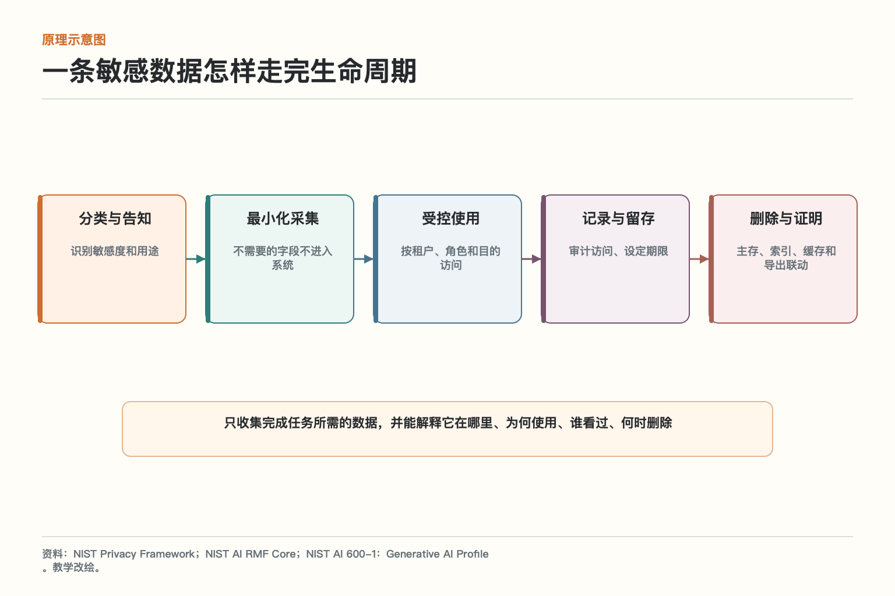
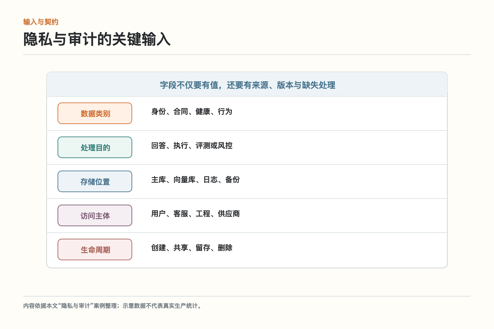
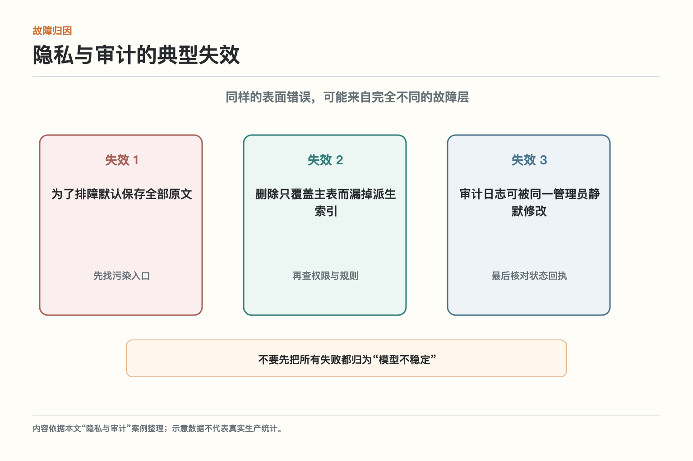
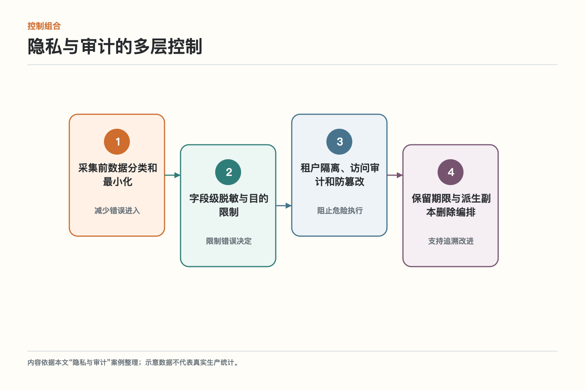
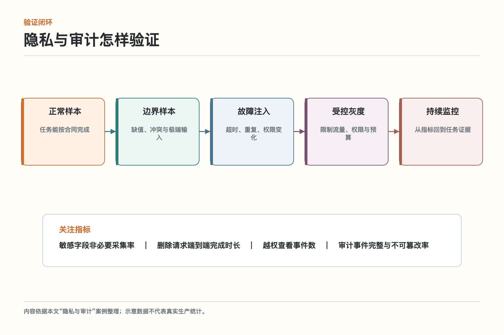

# 大话隐私审计：系统究竟留下什么

客户要求删除一段含身份证号的对话。主数据库里的聊天记录很快被清理，但向量索引、Trace、错误样本、缓存和人工导出的表格仍保留副本。系统对外说“已删除”，内部却没人能列清这条数据曾走过哪些路径。

只收集完成任务所需的数据，并能解释它在哪里、为何使用、谁看过、何时删除。这篇不把隐私与审计讲成一个孤立名词，而是沿着这项真实任务，看输入怎样被约束、决定怎样形成、动作怎样落地，以及出错时怎样停下来。

## 一、先说清它要解决什么

为输入、派生表示、模型上下文、工具参数、日志和导出建立可追踪的数据生命周期，在合法用途与最小化原则下采集、访问、保留和删除。这一定义里有三个关键点：对象要明确，边界要落到系统，结果要能够核对。只写一句提示词提醒模型“谨慎操作”，既无法阻止权限扩大，也不能证明外部世界有没有真的变化。

对初学者来说，可以先把任务写成一张合同：谁提出请求，要处理什么对象，允许做哪些动作，完成条件是什么，遇到哪些情况必须暂停。隐私与审计不是给模型增加一种抽象能力，而是让整个系统围绕这张合同工作。

## 二、原理：一次任务怎样穿过关键环节

*图依据NIST Privacy Framework、NIST AI RMF Core、NIST AI 600-1：Generative AI Profile的相关原则重新绘制，保留与本文案例直接相关的节点；箭头表示控制或数据流，不表示所有实现都必须采用同一产品。*

一条敏感数据怎样走完生命周期可以读成五步：1）分类与告知，识别敏感度和用途；2）最小化采集，不需要的字段不进入系统；3）受控使用，按租户、角色和目的访问；4）记录与留存，审计访问、设定期限；5）删除与证明，主存、索引、缓存和导出联动。前一步给后一步提供事实或约束，后一步必须返回状态和证据，不能只留下自然语言总结。

这条链最重要的地方是“边界靠近动作”。模型可以帮助理解文本、比较候选和生成草稿，但决定能否访问资源、能否写入系统、是否必须等待，以及外部动作是否成功，应由可验证的身份、策略、状态和回执共同判断。

## 三、系统到底要看哪些输入

*图把案例中的输入分为数据类别、处理目的、存储位置、访问主体、生命周期五类，目的是避免把所有信息混进一段提示。*

**数据类别**负责描述身份、合同、健康、行为；**处理目的**负责描述回答、执行、评测或风控；**存储位置**负责描述主库、向量库、日志、备份；**访问主体**负责描述用户、客服、工程、供应商；**生命周期**负责描述创建、共享、留存、删除。这些信息要尽量结构化，并标注来源与版本。结构化不是为了把界面做成表格，而是为了让授权、校验、重试和审计使用同一套事实。

若某项输入缺失，系统应明确选择追问、只生成草稿、转人工或停止，而不是用最常见值偷偷补齐。尤其是金额、身份、收件人、时间、资源所有权和执行状态，猜对九次也不能抵消一次高风险误写。

## 四、看似顺利的流程会在哪里失手

*图中的三类失效来自本文案例的威胁与故障分析，用于区分内容错误、控制缺失和状态不一致。*

第一类是为了排障默认保存全部原文。它常被误判为“模型理解不好”，其实系统已经把不可信内容或错误默认值送进了关键路径。第二类是删除只覆盖主表而漏掉派生索引，说明应用层没有把权限和业务不变量落实到真正执行的位置。第三类是审计日志可被同一管理员静默修改，表面上每一步都返回成功，组合起来却可能得到错误结果。

排查时不要从“换一个更强模型”开始。先画出事实从哪里进入、在哪一步变成决定、哪个组件产生外部副作用，再检查版本和回执。若错误发生在数据、授权或状态层，改提示只能暂时掩住现象。

## 五、哪些控制应该真正落进系统

*图将控制分为采集前数据分类和最小化、字段级脱敏与目的限制、租户隔离、访问审计和防篡改、保留期限与派生副本删除编排，这些控制相互补位，而不是由某一个万能护栏包办。*

第1道是**采集前数据分类和最小化**；第2道是**字段级脱敏与目的限制**；第3道是**租户隔离、访问审计和防篡改**；第4道是**保留期限与派生副本删除编排**。其中靠近输入的控制减少错误进入，靠近执行的控制阻止错误产生真实影响，事后的记录则用于归因、申诉和改进。任何一层都可能失效，因此高风险动作需要至少两种性质不同的控制。

控制还要有安全失败方式。依赖不可用、策略超时或证据不足时，是拒绝、降级、排队还是转人工，应提前写进状态机。临时绕过控制虽然能让一次演示继续，却会把最危险的路径变成默认习惯。

## 六、严格与好用之间怎样取舍

排障希望保留更多细节，隐私要求减少副本和期限。可以把结构化元数据与敏感原文分开，默认保存摘要，只有经授权的高风险事件进入受控存储。

可以把任务按四个维度分级：动作是否可逆，影响范围多大，数据是否敏感，结果能否独立核验。只读查询和内部草稿可以更自动；外部发送、删除、资金、权限变更和物理动作需要更强校验。这样做比所有任务共用一个“高、中、低风险”标签更容易落地。

取舍还要看失败成本。误拒绝会让用户多走一步，误允许可能泄露数据或造成资金损失，两者不应使用相同阈值。把成本写清，团队才能解释为什么某些步骤宁可慢一点。

## 七、怎样验证它真的有效

*图中的验证顺序为正常样本、边界样本、故障注入、真实灰度和持续监控，指标以本文案例为例。*

第一轮验证不追求大而全，先覆盖一条完整任务和三个失败场景。重点观察敏感字段非必要采集率、删除请求端到端完成时长、越权查看事件数、审计事件完整与不可篡改率。单个百分比不够，要能从异常结果回到具体输入、策略版本、工具回执和最终业务状态。

再做故障注入：让依赖超时、让同一请求重复到达、让权限在任务中途撤销、让数据版本发生变化。系统若只能在顺利路径上工作，就还没有进入生产条件。真实灰度阶段限制流量与权限，同时保留明确的停止和回滚门槛。

## 八、它与相邻模块怎样配合

治理不是在成品外面加一圈警告，而是从身份、权限、审批、凭据、护栏到审计连续回答：谁能让系统做什么，哪些动作必须停下来等人，以及事后能否还原责任和事实。

在这张大图里，隐私与审计负责的是“只收集完成任务所需的数据，并能解释它在哪里、为何使用、谁看过、何时删除”。它需要身份、策略、状态、工具回执和评测信号配合。相邻模块提供材料或执行能力，但不能绕过本模块边界。例如模型说“已经完成”，仍要以业务系统回执为准；监控发现异常，也要能定位到具体版本和任务。

设计接口时，至少保留任务标识、主体、资源、动作、版本、风险、状态和回执。名称可以因平台变化，语义不能丢。跨服务传递时只传必要信息，敏感原文放在受控存储，通过安全引用关联。

## 九、从一条窄链路开始落地

先为一种敏感字段画出真实数据流，逐个核对主库、向量索引、Trace、缓存和导出，再做一次删除演练而不是只跑数据库语句。

第一版要故意保持克制：固定输入范围，限制工具和数据，设置单任务预算，把高风险动作停在草稿或审批前。上线前请未参与开发的人按任务合同验收，看看他能否只凭界面和记录判断系统做了什么、为什么做、是否真的成功。

阶段完成后再扩大范围，每次只改变少数变量，并将新失败加入回归集。若一次同时换模型、改提示、扩权限和重做数据，线上变好或变坏都很难归因。

## 十、最后记住这件事

审计不是多写日志，隐私也不是展示端打码。关键是数据最小化、访问边界、证据完整和真正可验证的删除。

把这句话落成检查表，就是：输入有来源，决定有规则，动作有权限，外部变化有回执，异常有去路，版本能复现，关键过程可审计。做到这些，隐私与审计才不是架构图上的一个框，而是能经得住真实业务的系统能力。

实施时还要把“拒绝”当成正式结果。隐私与审计遇到信息不足、权限不符或依赖异常时，不应临时猜一个答案继续，而要返回清楚的原因、当前状态和下一步。这样既方便用户补充材料，也便于运行系统统计真正的失败类型。

版本信息同样不能省。数据类别、处理目的、存储位置、访问主体、生命周期中任何一项改变，都可能让相同输入得到不同结果。上线记录应能关联配置、规则、依赖和数据版本，出问题时才能复现，而不是只剩一句“模型偶尔不稳定”。

最后别忽略简单基线。把隐私与审计与人工流程、规则程序或单次模型调用放在同一批真实任务上比较，检查敏感字段非必要采集率、删除请求端到端完成时长、越权查看事件数、审计事件完整与不可篡改率。复杂方案只有在质量、风险或效率上带来稳定收益，才值得承担额外运行成本。

运维手册还要写明谁能处置。采集前数据分类和最小化、字段级脱敏与目的限制、租户隔离、访问审计和防篡改、保留期限与派生副本删除编排触发后，是值班工程师恢复依赖、业务负责人判断例外，还是安全人员冻结权限，不能等事故发生再临时拉群。责任人、升级条件、证据入口和恢复标准都应随版本发布。

一次成功演练不代表长期可靠。团队应按月抽取真实任务，复查敏感字段非必要采集率、删除请求端到端完成时长、越权查看事件数、审计事件完整与不可篡改率，并把新出现的失败加入固定回归集。若业务规则、组织权限或外部接口变化，旧结论也要重新验证，不能沿用半年前的通过记录。

## 参考资料

- [NIST Privacy Framework](https://www.nist.gov/privacy-framework)
- [NIST AI RMF Core](https://airc.nist.gov/airmf-resources/airmf/5-sec-core/)
- [NIST AI 600-1：Generative AI Profile](https://nvlpubs.nist.gov/nistpubs/ai/NIST.AI.600-1.pdf)

想看本文在 AI Agent 中的位置，可点击下方 [阅读原文](https://github.com/Jennifer123www/ai-agent-knowledge-map)，从“安全、权限与治理”的“隐私与审计”继续阅读。
