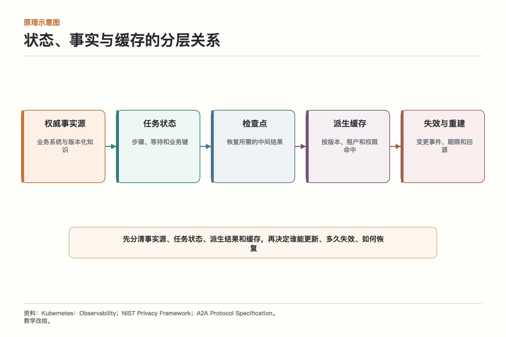
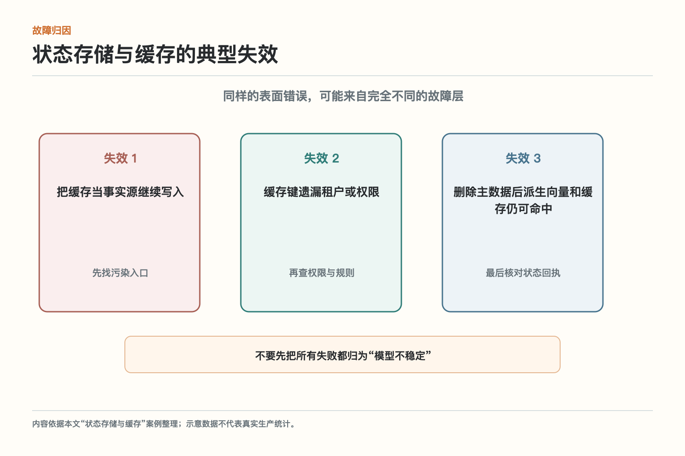
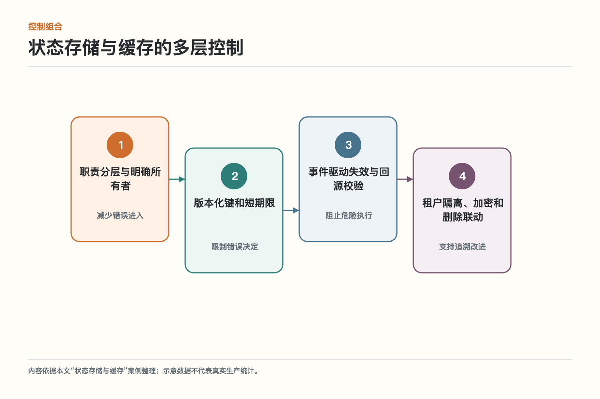
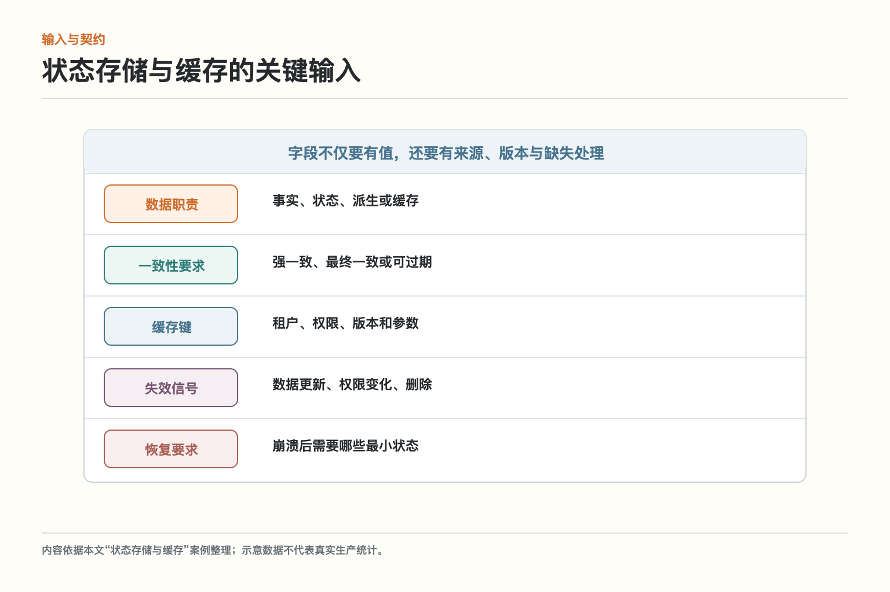
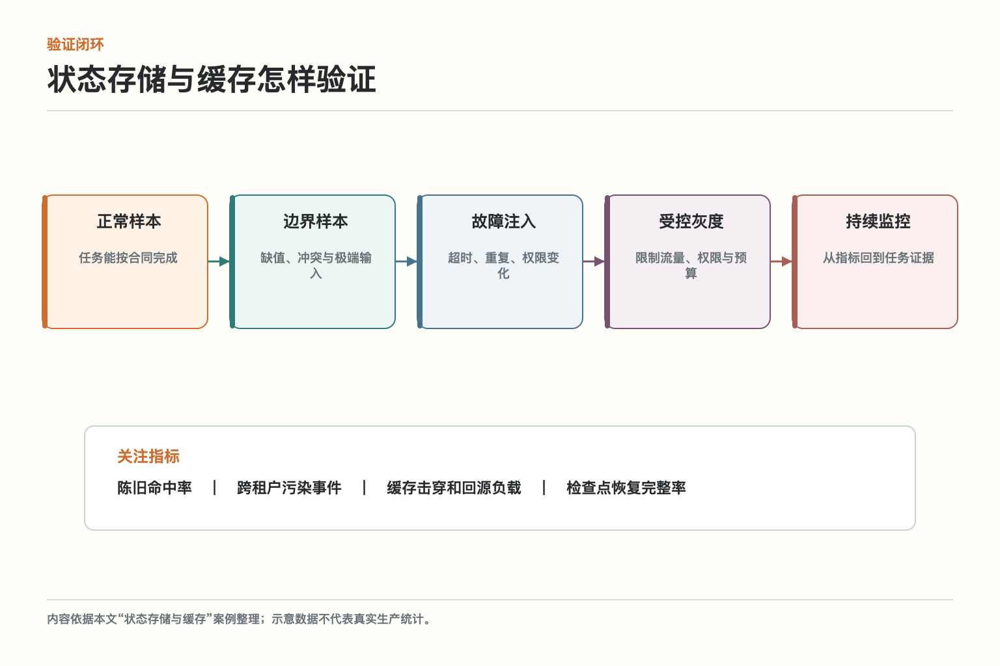

# 面试题：智能体状态与缓存怎么存

面试题沿用主文案例：退货政策已经从七天改成十五天，知识库完成更新，智能体却连续两小时回答旧规则。原因不是检索没刷新，而是答案缓存只用用户问题做键，没有包含政策版本和租户。另一个租户的命中结果甚至可能被复用。

回答状态存储与缓存，不要停在名词解释。更完整的结构是：先说它保护或交付什么，再画出控制流和状态，随后说明失败、取舍和验证。下面九道题围绕同一案例展开。

## 问题 1：状态存储与缓存如何定义目标与边界

**原理：**它的目标是把权威事实、运行状态、检查点和加速缓存分开管理，用版本化键与失效机制避免旧数据和跨租户污染。边界要落到真实对象、动作和完成条件，而不是只约束模型措辞。

**答题点：**先描述案例中的主体和对象，再说明允许、禁止与必须暂停的动作；列出数据职责、一致性要求、缓存键、失效信号、恢复要求；最后说明结果怎样由回执或业务状态验证。

**记忆点：**先定任务合同，再谈模型能力。

**常见追问：**为什么提示词写明规则仍不够？因为提示属于概率控制，真正权限和状态必须由执行层校验。

**失分点：**只说提高安全性、稳定性或效率，没有对象和验收口径。

## 问题 2：状态存储与缓存如何解释“状态、事实与缓存的分层关系”

**原理：**核心链路是权威事实源 → 任务状态 → 检查点 → 派生缓存 → 失效与重建。每一步都要接收结构化输入并返回状态。

**答题点：**权威事实源负责业务系统与版本化知识；任务状态负责步骤、等待和业务键；检查点负责恢复所需的中间结果；派生缓存负责按版本、租户和权限命中；失效与重建负责变更事件、期限和回源。说明同步与异步边界、任务标识、版本和失败去向。

**记忆点：**输入有来源，步骤有状态，动作有回执。

**常见追问：**某一步超时后能否直接重试？要看是否产生副作用、是否有幂等键和真实回执。

**失分点：**把五个框照着念一遍，却不说明数据、控制和状态怎样传递。

## 问题 3：状态存储与缓存如何设计输入与数据契约

**原理：**自然语言适合表达意图，不适合独自承担权限、状态和业务不变量。关键输入应结构化并带来源与版本。

**答题点：**逐项覆盖数据职责（事实、状态、派生或缓存）、一致性要求（强一致、最终一致或可过期）、缓存键（租户、权限、版本和参数）、失效信号（数据更新、权限变化、删除）、恢复要求（崩溃后需要哪些最小状态）；区分必填、可选、推导和禁止猜测字段；缺失时选择追问、草稿、拒绝或转人工；敏感值用安全引用。

**记忆点：**能校验的字段不要只藏在一段话里。

**常见追问：**结构化会不会降低灵活性？意图仍可由模型理解，但进入关键动作前要转成受约束参数。

**失分点：**把完整对话原样传给所有下游，既难校验又扩大隐私面。

## 问题 4：状态存储与缓存如何识别最危险的失效模式

**原理：**失效不能只按“模型答错”分类，还要区分输入污染、控制缺失、状态竞争和外部依赖。

**答题点：**案例至少包含把缓存当事实源继续写入、缓存键遗漏租户或权限、删除主数据后派生向量和缓存仍可命中。回答时为每项指出发生层、可观察证据、用户影响和阻断位置；再说明为什么换模型不能替代系统控制。

**记忆点：**先定位故障层，再选择修复手段。

**常见追问：**最应该先修哪一个？优先看严重度、暴露面、可检测性和是否产生不可逆副作用。

**失分点：**列一串风险名词，却没有映射到具体任务和失败证据。

## 问题 5：状态存储与缓存如何组合多层控制

**原理：**单层控制会误判或失效，高风险系统需要不同性质的控制互相兜底。

**答题点：**组合职责分层与明确所有者、版本化键和短期限、事件驱动失效与回源校验、租户隔离、加密和删除联动；说明哪些在输入前、哪些在决定时、哪些在执行前、哪些用于事后追溯；给出依赖失败时的安全降级。

**记忆点：**软控制帮助判断，硬控制守住动作。

**常见追问：**控制越多是否越安全？不一定，互相矛盾和不可观察的控制会增加盲点，需要统一状态与测试。

**失分点：**把所有责任交给内容过滤器或系统提示。

## 问题 6：状态存储与缓存如何处理严格性与体验的取舍

**原理：**风险控制要比较误允许和误拒绝的成本，并按可逆性、影响范围、敏感度和证据强度分级。

**答题点：**缓存能降低时延和成本，却会引入陈旧和授权风险。越接近资金、权限和最新政策，越应缩短缓存寿命或直接回源。 面试中还应给出一条分级规则和对应动作：自动、生成草稿、要求确认、强制审批或拒绝。

**记忆点：**不是所有任务都自动，也不是所有任务都弹窗。

**常见追问：**怎样避免人工审批成为瓶颈？缩小审批范围、提供结构化证据、设置明确 SLA，并用低风险样本抽检。

**失分点：**用一个固定阈值处理所有租户、数据和动作。

## 问题 7：状态存储与缓存如何制定上线与回滚方案

**原理：**上线目标不是功能可用，而是风险受控、收益可归因、异常可停止。

**答题点：**先梳理一条问答链路的事实源、索引和缓存，修改政策版本并观察失效，再切换租户与权限验证键空间隔离。 先固定基线和版本，限制流量、权限和预算；设置停止条件；在每次变更中只改变可归因的少量变量；保存旧版本和状态兼容方案。

**记忆点：**小范围、可观察、能停止、可回退。

**常见追问：**为什么离线通过仍要灰度？真实流量、依赖和用户行为无法完全在离线环境复现。

**失分点：**上线只准备扩容，没有准备降级、取消和在途任务处理。

## 问题 8：状态存储与缓存如何设计验证指标与故障演练

**原理：**指标要同时覆盖结果、过程、风险和资源，故障演练要证明系统在非理想条件下仍按边界行动。

**答题点：**核心指标包括陈旧命中率、跨租户污染事件、缓存击穿和回源负载、检查点恢复完整率。先测正常和边界样本，再注入超时、重复、权限变化和数据版本变化；从异常指标跳到具体任务、输入、版本和回执。

**记忆点：**不只问成功多少，还要问错在哪里、代价多大。

**常见追问：**没有标准答案的开放任务怎么评？结合结构化事实、过程约束、引用或工具结果、人工抽检和最终业务结果。

**失分点：**只看平均分或接口成功率，掩盖高风险切片。

## 问题 9：状态存储与缓存如何说明与相邻模块的关系

**原理：**系统设计、运行时与成本不是单点组件，必须与身份、知识、工具、运行时、观测和评测共享必要语义。

**答题点：**说明状态存储与缓存输入来自哪里、向下游交付什么、由谁验证；接口保留任务、主体、资源、动作、版本、风险、状态和回执；跨服务只传必要信息并保护敏感数据。

**记忆点：**模块可以分开建设，证据链不能断。

**常见追问：**哪些能力适合平台统一？身份、追踪、运行时和评测框架可复用，业务规则、完成条件和风险阈值应场景化。

**失分点：**把相邻模块画成连线，却不说明责任和失败边界。

## 综合案例：怎样把答案讲成一套可落地方案

面试官如果给出退货政策已经从七天改成十五天，知识库完成更新，智能体却连续两小时回答旧规则。原因不是检索没刷新，而是答案缓存只用用户问题做键，没有包含政策版本和租户。另一个租户的命中结果甚至可能被复用。，可以先用一句话界定目标：把权威事实、运行状态、检查点和加速缓存分开管理，用版本化键与失效机制避免旧数据和跨租户污染。随后画出权威事实源 → 任务状态 → 检查点 → 派生缓存 → 失效与重建，逐步说明输入、状态、控制和回执。这样回答不会散成概念清单。

接着指出三类真实故障：把缓存当事实源继续写入；缓存键遗漏租户或权限；删除主数据后派生向量和缓存仍可命中。每个故障都要落到阻断位置：输入前能过滤什么，执行前必须校验什么，动作之后怎样确认，状态不明时如何暂停。高风险场景至少用一项确定性控制兜底，不把成功寄托在模型每次都听话。

上线部分从先梳理一条问答链路的事实源、索引和缓存，修改政策版本并观察失效，再切换租户与权限验证键空间隔离。开始，并给出陈旧命中率、跨租户污染事件、缓存击穿和回源负载、检查点恢复完整率。离线用历史和对抗样本，线上限制流量、权限和预算；异常时能停止新任务、处理在途状态并切回稳定版本。若不能说明回滚对象和业务副作用，发布方案还不完整。

最后说清取舍：缓存能降低时延和成本，却会引入陈旧和授权风险。越接近资金、权限和最新政策，越应缩短缓存寿命或直接回源。。一个成熟答案既不宣称完全自动，也不把所有责任推给人工。模型负责最擅长的理解、生成与候选比较，确定性系统负责权限、状态、约束和真实动作，人负责高影响且证据不足的决定。

可以用这句话收尾：缓存命中只说明以前算过，不说明现在仍然正确。版本、权限和数据生命周期必须成为缓存设计的一部分。 设计的价值最终要由真实任务和证据证明，而不是由架构图的框数证明。

如果面试官继续追问落地，可以补充一条验收原则：不仅测顺利样本，也主动制造依赖超时、重复请求、权限变化和数据缺失。候选人应说明系统如何停下、恢复、回滚和留证，而不是只描述理想路径。

回答成本问题时，不要只报模型 token。状态存储与缓存的总成本还包括检索、工具、队列等待、人工复核、失败重试和运维。更有意义的分母是“每个成功且合规完成的任务”，不是每次接口调用。

## 参考资料

- [Kubernetes：Observability](https://kubernetes.io/docs/concepts/cluster-administration/observability/)
- [NIST Privacy Framework](https://www.nist.gov/privacy-framework)
- [A2A Protocol Specification](https://a2a-protocol.org/latest/specification/)

想看本文在 AI Agent 中的位置，可点击下方 [阅读原文](https://github.com/Jennifer123www/ai-agent-knowledge-map)，从“系统设计、运行时与成本”的“状态存储与缓存”继续阅读。
