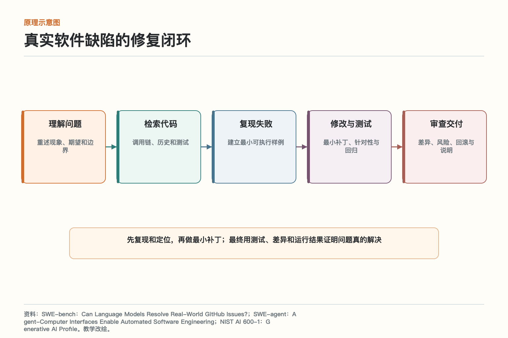
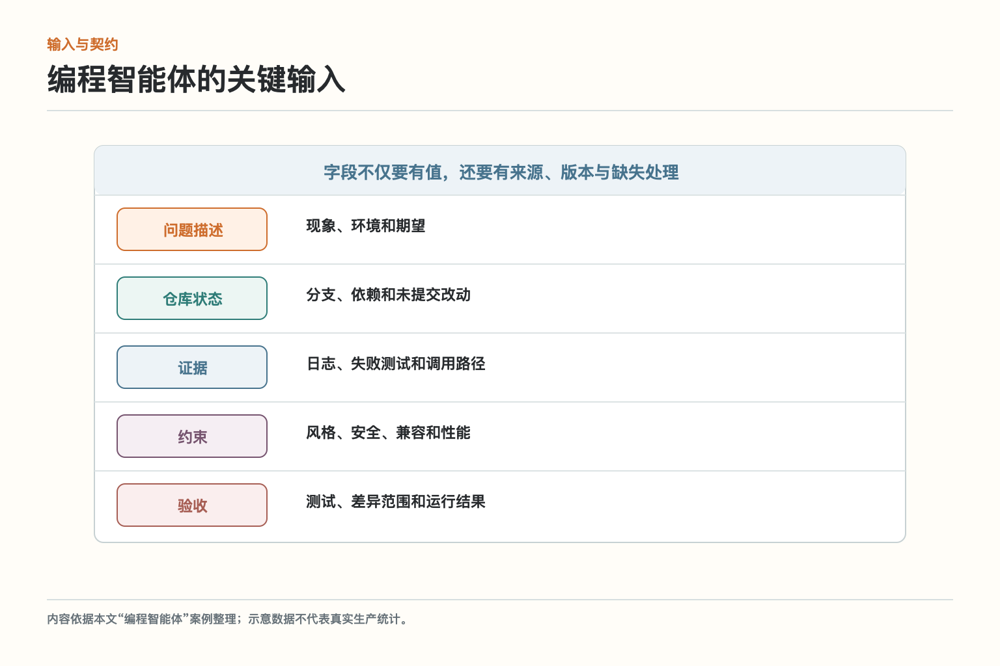
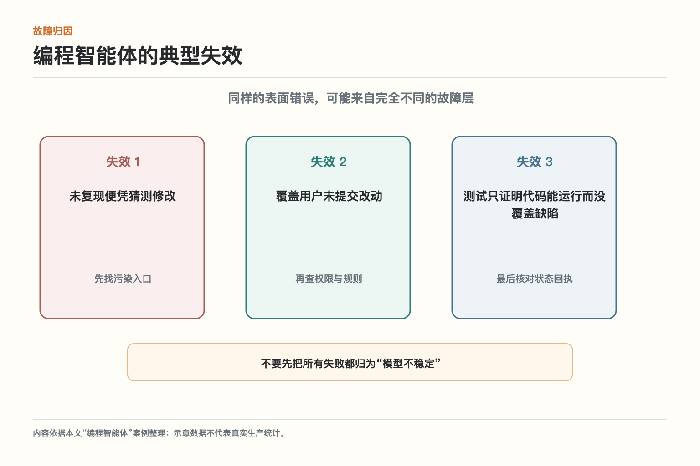
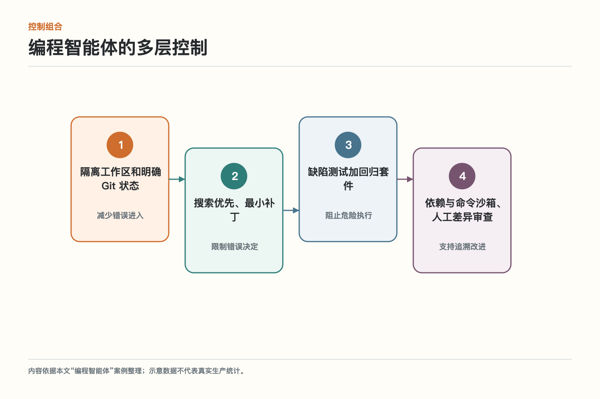
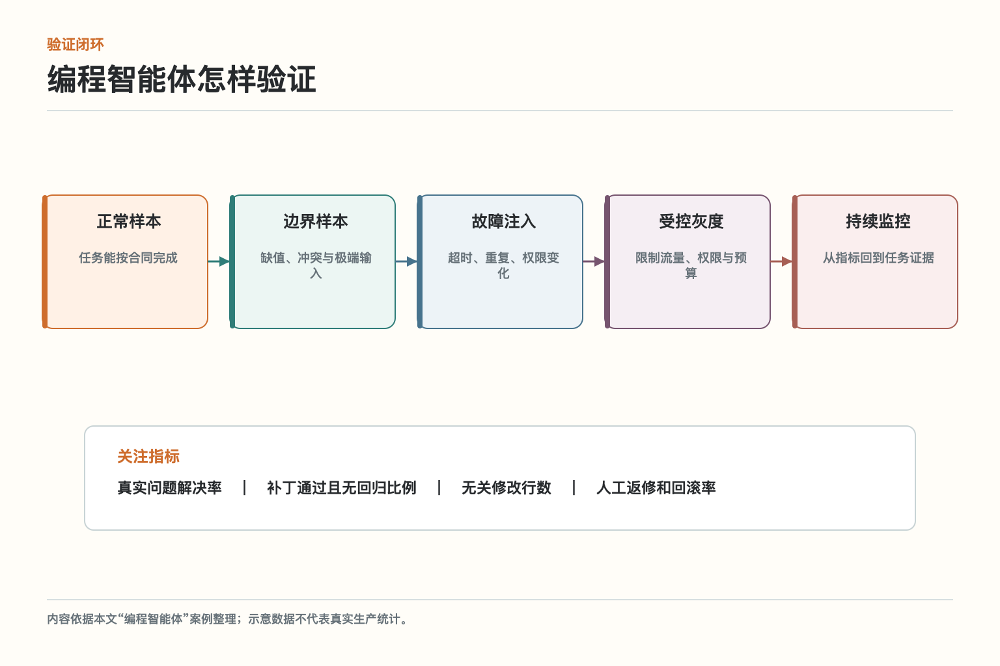

# 大话编程智能体：改代码前先读现场

用户报告导出 CSV 时包含逗号的字段会错列。编程智能体没有运行测试，直接把所有字符串都加上双引号，结果修好一个样本，却破坏了已有转义规则。代码能编译，问题仍然没有被严格定义。

先复现和定位，再做最小补丁；最终用测试、差异和运行结果证明问题真的解决。这篇不把编程智能体讲成一个孤立名词，而是沿着这项真实任务，看输入怎样被约束、决定怎样形成、动作怎样落地，以及出错时怎样停下来。

## 一、先说清它要解决什么

让智能体在受控仓库环境中理解问题、复现失败、定位相关代码、提交最小修改，并用针对性测试和回归测试验证。这一定义里有三个关键点：对象要明确，边界要落到系统，结果要能够核对。只写一句提示词提醒模型“谨慎操作”，既无法阻止权限扩大，也不能证明外部世界有没有真的变化。

对初学者来说，可以先把任务写成一张合同：谁提出请求，要处理什么对象，允许做哪些动作，完成条件是什么，遇到哪些情况必须暂停。编程智能体不是给模型增加一种抽象能力，而是让整个系统围绕这张合同工作。

## 二、原理：一次任务怎样穿过关键环节

*图依据SWE-bench：Can Language Models Resolve Real-World GitHub Issues?、SWE-agent：Agent-Computer Interfaces Enable Automated Software Engineering、NIST AI 600-1：Generative AI Profile的相关原则重新绘制，保留与本文案例直接相关的节点；箭头表示控制或数据流，不表示所有实现都必须采用同一产品。*

真实软件缺陷的修复闭环可以读成五步：1）理解问题，重述现象、期望和边界；2）检索代码，调用链、历史和测试；3）复现失败，建立最小可执行样例；4）修改与测试，最小补丁、针对性与回归；5）审查交付，差异、风险、回滚与说明。前一步给后一步提供事实或约束，后一步必须返回状态和证据，不能只留下自然语言总结。

这条链最重要的地方是“边界靠近动作”。模型可以帮助理解文本、比较候选和生成草稿，但决定能否访问资源、能否写入系统、是否必须等待，以及外部动作是否成功，应由可验证的身份、策略、状态和回执共同判断。

## 三、系统到底要看哪些输入

*图把案例中的输入分为问题描述、仓库状态、证据、约束、验收五类，目的是避免把所有信息混进一段提示。*

**问题描述**负责描述现象、环境和期望；**仓库状态**负责描述分支、依赖和未提交改动；**证据**负责描述日志、失败测试和调用路径；**约束**负责描述风格、安全、兼容和性能；**验收**负责描述测试、差异范围和运行结果。这些信息要尽量结构化，并标注来源与版本。结构化不是为了把界面做成表格，而是为了让授权、校验、重试和审计使用同一套事实。

若某项输入缺失，系统应明确选择追问、只生成草稿、转人工或停止，而不是用最常见值偷偷补齐。尤其是金额、身份、收件人、时间、资源所有权和执行状态，猜对九次也不能抵消一次高风险误写。

## 四、看似顺利的流程会在哪里失手

*图中的三类失效来自本文案例的威胁与故障分析，用于区分内容错误、控制缺失和状态不一致。*

第一类是未复现便凭猜测修改。它常被误判为“模型理解不好”，其实系统已经把不可信内容或错误默认值送进了关键路径。第二类是覆盖用户未提交改动，说明应用层没有把权限和业务不变量落实到真正执行的位置。第三类是测试只证明代码能运行而没覆盖缺陷，表面上每一步都返回成功，组合起来却可能得到错误结果。

排查时不要从“换一个更强模型”开始。先画出事实从哪里进入、在哪一步变成决定、哪个组件产生外部副作用，再检查版本和回执。若错误发生在数据、授权或状态层，改提示只能暂时掩住现象。

## 五、哪些控制应该真正落进系统

*图将控制分为隔离工作区和明确 Git 状态、搜索优先、最小补丁、缺陷测试加回归套件、依赖与命令沙箱、人工差异审查，这些控制相互补位，而不是由某一个万能护栏包办。*

第1道是**隔离工作区和明确 Git 状态**；第2道是**搜索优先、最小补丁**；第3道是**缺陷测试加回归套件**；第4道是**依赖与命令沙箱、人工差异审查**。其中靠近输入的控制减少错误进入，靠近执行的控制阻止错误产生真实影响，事后的记录则用于归因、申诉和改进。任何一层都可能失效，因此高风险动作需要至少两种性质不同的控制。

控制还要有安全失败方式。依赖不可用、策略超时或证据不足时，是拒绝、降级、排队还是转人工，应提前写进状态机。临时绕过控制虽然能让一次演示继续，却会把最危险的路径变成默认习惯。

## 六、严格与好用之间怎样取舍

更自主的智能体能连续完成检索、修改和测试，也可能更快扩大错误。写权限应与验证能力绑定，未通过测试和审查时不应自动合并。

可以把任务按四个维度分级：动作是否可逆，影响范围多大，数据是否敏感，结果能否独立核验。只读查询和内部草稿可以更自动；外部发送、删除、资金、权限变更和物理动作需要更强校验。这样做比所有任务共用一个“高、中、低风险”标签更容易落地。

取舍还要看失败成本。误拒绝会让用户多走一步，误允许可能泄露数据或造成资金损失，两者不应使用相同阈值。把成本写清，团队才能解释为什么某些步骤宁可慢一点。

## 七、怎样验证它真的有效

*图中的验证顺序为正常样本、边界样本、故障注入、真实灰度和持续监控，指标以本文案例为例。*

第一轮验证不追求大而全，先覆盖一条完整任务和三个失败场景。重点观察真实问题解决率、补丁通过且无回归比例、无关修改行数、人工返修和回滚率。单个百分比不够，要能从异常结果回到具体输入、策略版本、工具回执和最终业务状态。

再做故障注入：让依赖超时、让同一请求重复到达、让权限在任务中途撤销、让数据版本发生变化。系统若只能在顺利路径上工作，就还没有进入生产条件。真实灰度阶段限制流量与权限，同时保留明确的停止和回滚门槛。

## 八、它与相邻模块怎样配合

落地智能体不是先挑一个最强模型，再把业务塞进去；而是先找清任务、证据、动作和责任边界，再判断哪些环节适合语言模型，哪些必须交给检索、代码、工作流或人。

在这张大图里，编程智能体负责的是“先复现和定位，再做最小补丁；最终用测试、差异和运行结果证明问题真的解决”。它需要身份、策略、状态、工具回执和评测信号配合。相邻模块提供材料或执行能力，但不能绕过本模块边界。例如模型说“已经完成”，仍要以业务系统回执为准；监控发现异常，也要能定位到具体版本和任务。

设计接口时，至少保留任务标识、主体、资源、动作、版本、风险、状态和回执。名称可以因平台变化，语义不能丢。跨服务传递时只传必要信息，敏感原文放在受控存储，通过安全引用关联。

## 九、从一条窄链路开始落地

从有稳定测试、影响可逆的小缺陷开始，对比人工基线；记录失败原因是定位、修改还是验证，再决定是否扩大仓库和命令权限。

第一版要故意保持克制：固定输入范围，限制工具和数据，设置单任务预算，把高风险动作停在草稿或审批前。上线前请未参与开发的人按任务合同验收，看看他能否只凭界面和记录判断系统做了什么、为什么做、是否真的成功。

阶段完成后再扩大范围，每次只改变少数变量，并将新失败加入回归集。若一次同时换模型、改提示、扩权限和重做数据，线上变好或变坏都很难归因。

## 十、最后记住这件事

补丁不是答案，测试通过也不是绝对正确。编程智能体必须交付可审查差异、验证证据和剩余风险。

把这句话落成检查表，就是：输入有来源，决定有规则，动作有权限，外部变化有回执，异常有去路，版本能复现，关键过程可审计。做到这些，编程智能体才不是架构图上的一个框，而是能经得住真实业务的系统能力。

实施时还要把“拒绝”当成正式结果。编程智能体遇到信息不足、权限不符或依赖异常时，不应临时猜一个答案继续，而要返回清楚的原因、当前状态和下一步。这样既方便用户补充材料，也便于运行系统统计真正的失败类型。

版本信息同样不能省。问题描述、仓库状态、证据、约束、验收中任何一项改变，都可能让相同输入得到不同结果。上线记录应能关联配置、规则、依赖和数据版本，出问题时才能复现，而不是只剩一句“模型偶尔不稳定”。

最后别忽略简单基线。把编程智能体与人工流程、规则程序或单次模型调用放在同一批真实任务上比较，检查真实问题解决率、补丁通过且无回归比例、无关修改行数、人工返修和回滚率。复杂方案只有在质量、风险或效率上带来稳定收益，才值得承担额外运行成本。

运维手册还要写明谁能处置。隔离工作区和明确 Git 状态、搜索优先、最小补丁、缺陷测试加回归套件、依赖与命令沙箱、人工差异审查触发后，是值班工程师恢复依赖、业务负责人判断例外，还是安全人员冻结权限，不能等事故发生再临时拉群。责任人、升级条件、证据入口和恢复标准都应随版本发布。

一次成功演练不代表长期可靠。团队应按月抽取真实任务，复查真实问题解决率、补丁通过且无回归比例、无关修改行数、人工返修和回滚率，并把新出现的失败加入固定回归集。若业务规则、组织权限或外部接口变化，旧结论也要重新验证，不能沿用半年前的通过记录。

## 参考资料

- [SWE-bench：Can Language Models Resolve Real-World GitHub Issues?](https://arxiv.org/abs/2310.06770)
- [SWE-agent：Agent-Computer Interfaces Enable Automated Software Engineering](https://arxiv.org/abs/2405.15793)
- [NIST AI 600-1：Generative AI Profile](https://nvlpubs.nist.gov/nistpubs/ai/NIST.AI.600-1.pdf)

想看本文在 AI Agent 中的位置，可点击下方 [阅读原文](https://github.com/Jennifer123www/ai-agent-knowledge-map)，从“应用落地与项目实践”的“编程智能体”继续阅读。
