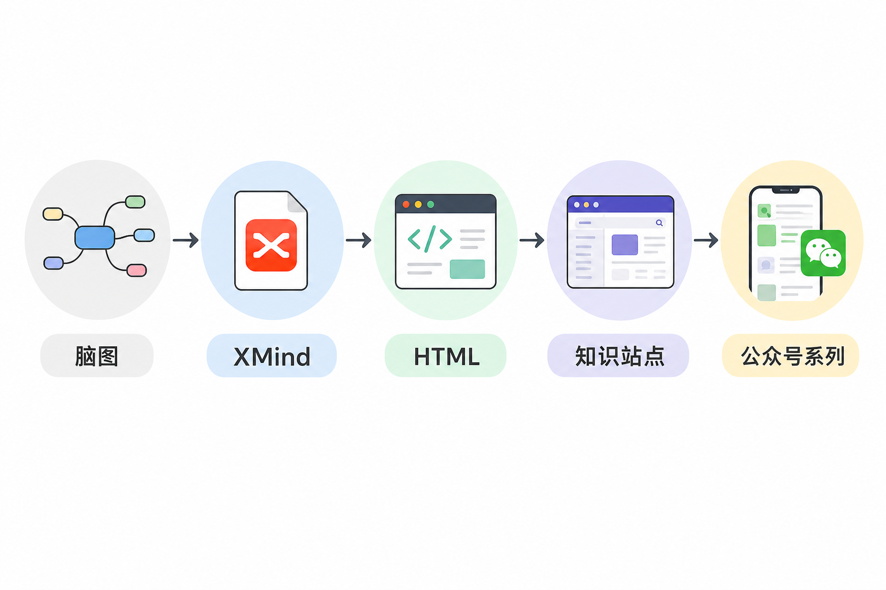
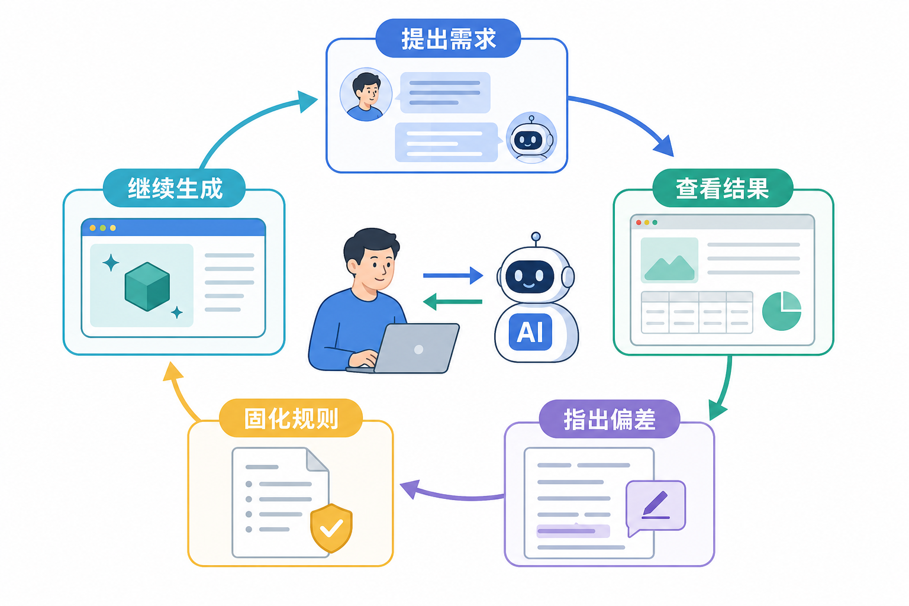

# 我是如何引导 AI 生成一份 AI Agent 知识图谱的

这件事最初没有宏大的计划。

我只是想弄清楚：现在常说的 AI Agent，到底由哪些部分组成？知识库、MCP、Skill、工具调用、工作流、多智能体、安全和评测，它们之间是什么关系？于是我让 AI 先画一张简单的知识图谱。

如果任务停在这里，几分钟就能结束。真正花时间的部分，是把“看起来完整的一张图”变成一套能学习、能面试、能持续扩展、还能直接做公众号内容的知识项目。

## 第一阶段：先让 AI 把范围铺开

最开始，我给出的要求很宽：“画一份 AI Agent 知识图谱，包括知识库、MCP、Skill，但不限于这些。”AI 很快列出了基础模型、Agent 核心、知识与上下文、能力扩展、多智能体、运行基础设施、安全治理、评测运营和应用形态。

这一版的价值不是精确，而是把讨论对象放到桌面上。我可以看到哪些模块缺了，哪些模块挤在一起，哪些名词只是英文缩写。相比从空白文档开始，一张粗略的全景图更适合用来挑错。

我没有急着逐字修改，而是先问：“和最初的图相比，缺少什么关键模块？”这一步让项目从一次生成变成了差异检查。后面补上的上下文工程、模型网关、沙箱、A2A、权限治理和可观测性，很多都来自这种对照。

## 第二阶段：交付格式不对，再好的内容也没用

最早我让 AI 输出 XMind。文件生成出来了，却打不开。于是我改成 HTML，希望不依赖特定软件，打开浏览器就能看。

这次经历让我意识到，内容项目有两个问题必须分开：写什么，以及用什么方式交付。XMind 适合个人编辑，HTML 更适合阅读、跳转、搜索和发布。后面项目迁移到 Git 仓库，HTML 也更容易部署成静态网站。

格式调整后又出现新问题：入口页面和知识图谱页面几乎一样，读者不知道两个文件有什么区别；“大话”页面与初学者页面视觉割裂，进入后也没有返回入口。于是我让 AI 删除冗余入口，统一顶栏，增加右侧子模块导航和右上角搜索。

页面变漂亮只是表面。更重要的是，每个页面开始有明确职责：首页看全景，初学者总览给阅读顺序，概念下钻讲结构和“大话”，面试图谱看主题，题目下钻练回答。

## 第三阶段：从做页面，转成做内容体系

一开始，“大话大语言模型”只是一个单独页面。它很容易懂，却和其他同级子模块不对称。我指出：既然大语言模型有“大话”，多模态、向量嵌入、重排序、模型适配也应该有。

接着又发现，“大话”和普通图解只是换了几句话，内容雷同。于是我重新定义两者：图解负责结构和关系，“大话”用短小的生活比喻帮助理解；讲公众号文章时，仍要回到贯穿全文的真实案例，不能每段换一个故事。网站的“机制加餐”则是独立栏目，补充工程细节、取舍和边界，不照搬成公众号的小标题。

后来我又要求初学者版和面试版一一对应。初学者回答“是什么、怎么协作”，面试版回答“为什么这样取舍、上线怎样验证”。每个一级模块至少三道面试题，必须包含原理、答题点、记忆点、追问和失分点。

这一步很关键。知识图谱不再是一棵名词树，而是同一套主题的两种阅读方式。学完概念，可以立即跳到对应面试题；面试题里遇到陌生术语，也能回到概念页。

## 第四阶段：不断指出“不是这个意思”

整个过程中，我说过很多次“不是这个意思”。这不是沟通失败，而是把模糊想法变成规则的必经过程。

比如我说文件名用中文，指的是 Finder 里的文件名，不是页面上显示中文标题；我说导航放到右侧，指的是子模块导航，不是把顶栏搬过去；我说删除泛化文字，指的是去掉“例子仅用于说明”这类没有知识增量的句子，而不是删掉必要的机制解释。

*依据本项目的对话记录、`series.json` 清单和文章校验流程整理。*

每次纠偏，我都会尽量指出具体对象：哪一个页面、哪一段话、哪种关系、哪张图。AI 根据反馈修改后，我再看结果。反复几轮后，临时意见被写进项目规范，后面的内容便不必重复提醒。

我逐渐发现，和 AI 协作最有效的方式不是一开始写一份几十页需求，而是先给方向，让它交付可见结果，再围绕真实结果校正。前提是反馈要具体，不能只说“不好看”“不够专业”。

具体反馈最好同时包含“看到什么、为什么不对、希望改成什么”。例如，不只说“大话内容重复”，而是指出“大话仍在复述图解里的职责定义，希望换成报销、后厨或门禁等具体场景，并补充机制取舍”。这样 AI 不必猜“不满意”背后的标准。

有时我也会要求它只重做一个模块后停下，让我先审阅。这比一次重写十个模块更稳。小范围修改容易看出方向是否正确，也能避免错误风格被批量复制。确认样板之后，再让它按同一规则扩展。

## 第五阶段：把一次作品变成可维护项目

页面和内容逐渐稳定后，我把项目迁移到个人工作目录，重构成常见的静态站点结构，并创建同名 GitHub 仓库。此后每完成一个可验证阶段就提交；通过检查、确认工作区没有混入无关改动后，再同步远程。**提交与推送是两件事**：本地出现新提交，不等于读者已经能在仓库看到它。

项目规范开始记录页面职责、目录、命名、主题映射、导航、搜索、内容组织、图片风格、校验命令和 Git 规则。它不是写给读者看的说明，而是下一轮生成内容时约束 AI 的工作合同。

这时，“不要偷懒”“不要写泛化说明”“中文术语要准确”“两个版本必须对应”不再只是聊天里的提醒，而是仓库中的持久规则。即使换一个任务继续工作，也能从文件里恢复上下文。

Git 在这里不只是备份。每个阶段只做一件事：重构目录、补文章、生成图片、增加微信校验，各自单独提交。效果不好时，可以准确看到是哪次修改引入问题，不用把整段对话重新演一遍。

后来一次推送更直观地说明了这件事。SSH 默认端口连续超时，换通道认证成功后，远程又提示主分支已经向前走了一步。我没有强推，而是先取回远程记录、查看提交的父子关系：另一个任务的提交接在本次规则修改之后，两份工作实际上已经按顺序进入远程。网络错误、认证失败、分支前进是三种问题，不能看到一句“推送失败”就用同一种办法处理。

规则文件还记录版本、阶段、Git 状态和修改时间。内容项目经常跨很多天，今天认为“已经完成”的部分，明天可能因为层级重新定义而需要调整。保留阶段信息，能避免把旧结论误当成当前事实。

## 第六阶段：知识站点继续长成公众号系列

我希望 HTML 保留全景和下钻，同时把每个技术模块转成配套的两篇公众号文章：主文面向初学者，副文用于面试训练。技术系列每篇要求 3000–5000 个中文字符、至少 5 张正文图；两篇还要各有封面。

最初拿“工具、技能与协议”做试点。AI 先生成提示词，再用图像模型制作中文信息图。图片经历了模型不可用、插件依赖不兼容、登录凭据和中文校对等问题，最后才得到可用成片。

文章原稿最终确定为 Markdown 加 YAML Front Matter。标题、作者、摘要、封面和评论设置都能被程序读取；本地图片先上传微信，再把 URL 写进 HTML；转换后检查标题、摘要、正文字符、体积和 JavaScript 限制。

交付方式也经历了一次回头看。早先准备过 Word 终版，后来实际试通了公众号 API，才把链路固定为 **Markdown → 带内联样式的 HTML → 上传封面与正文图 → 创建草稿**。Word 导出脚本和旧终版文件随之退出当前目录，Markdown 继续作为唯一可编辑原稿。草稿只是待审内容，不等于自动发布或群发。

主文和配套副文不再分别占一个草稿：同一组用 `--file` 与 `--side-file` 合成一份双图文。主文在上方用大封面，副文有自己的小缩略图；正文统一采用克制的橙色样式。封面是否被标题遮住、代码块与图注在手机端是否清楚、“阅读原文”是否指向项目入口，都要到公众号后台看，不能只盯本地 HTML。曾尝试几套额外排版样式，实际效果不如原先的橙色版，最后收回试验，保留可读、可维护的样式。

“大话大语言模型”这一组第一次把这些细节放进真实草稿。主文负责从会议改期通知讲清 `token`、上下文、注意力和采样，副文则把同一案例拆成可追问、可验证的面试题。两篇共用事实和少量核心原理图，但不共用整套图片：主文图解释生成过程，副文图补充成本、冲突、证据审计、结构化校验和评测。这样既能互相呼应，也不至于让读者在第二篇里再看一遍第一篇。

排版也在真实预览里继续收紧。副文的“记忆点”最初写在引用框里，栏目名与正文挤在一行；后来改成独立的橙色三级标题，下方只放浅橙引用框。图片中只重复文章标题的“大语言模型”首图被移出正文；采样图和证据审计图则按实际问题重画，去掉装饰性左竖线、过大的标题和高饱和色块。修改 Markdown 和转换器后，再重新创建双图文草稿。新草稿会得到新的 `media_id`，不会覆盖旧草稿，旧版本要在后台确认后人工清理。

后来我又发现层级理解错了。一个一级模块不是只有“主文 + 面试题”两篇，而是“1 个总概览 + n 个子模块”，共 n+1 组，每组两篇。工具、技能与协议有 6 个子模块，因此最后变成 7 组、14 篇文章。

这次调整不是简单多写十二篇。总概览已经讲过不少具体机制，若直接生成子模块，面试题会重复。于是先重写总览：只保留跨模块分层、端到端链路、总体选型和共同治理；Schema、沙箱、MCP 对象、限流等细题全部交回对应子模块。

后来写“基础模型与推理”和“知识检索与检索增强生成”时，我才真正把这条边界用起来：先把子模块机制与题目范围定好，再回头写总览。前者讲模型之间怎样分工，不替大语言模型一文讲完注意力和采样；后者讲知识从来源到回答的整条链，不替切片、检索和 RAG 各篇回答细题。总览和下钻可以沿用同一个案例，但不能沿用同一套答案。

每个子模块再建立独立目录，包含主文、面试副文、提示词和图片。模块根目录保存总概览，`submodules/` 保存下钻内容。层级一旦在文件结构中表达清楚，文章路径、阅读顺序和校验规则也更容易统一。

## 第七阶段：让规则替代反复提醒

批量生成 14 篇文章时，最浪费的环节是先写短稿，再根据校验补到 3000 字；以及每次检查都打印全部文章明细。于是我又加了三条规则。

第一，写作前在模块清单中为每篇文章固定 8–10 个段落，首稿直接瞄准 3200–3500 个中文字符。第二，校验器默认只输出失败项和总数，逐篇明细只在排障时打开。第三，用 `series.json` 统一记录文章路径、内容边界、提纲、题目范围和配图，不再反复解析大型页面。

到这一步，AI 不只是内容生成器，也在帮助我维护一个小型内容生产系统。Markdown 是内容源，图片有提示词和清单，脚本负责校验，Git 记录阶段，微信接口只创建草稿，不自动发布。

规则变更后还做了一次对照检查。原先写着“每篇副文至少三道面试题、每篇 3000–5000 个中文字符”，可这组项目复盘的副文是一篇踩坑指南，并不是面试卷。硬把它改成三道题，只会丢掉原本有用的返工记录。现在清单用 `seriesType: independent` 标明独立专题，副文记录自己的内容边界；超过 5000 个中文字符可以保留，但公众号正文仍须低于 20000 个 HTML 字符和 1 MB。例外只给独立专题，十个技术主题的面试题要求并没有被顺手放宽。

同一次检查还发现两种写法在打架：一处规定同组主副文合并检查，另一处却说“逐篇 dry-run”。最后统一为**每组运行一次双图文 dry-run**。草稿先后由两篇文件在命令中的位置决定，Front Matter 的 `order` 只是校验预期顺序。规则写得越多，越要问一句：这几处说的是不是同一件事？

后来又把“能够生成草稿”与“草稿可以交给读者”分开。推送前先检查同组元数据、内容边界、案例事实、主副文分工、封面、正文五图、原理图、橙色主题和 HTML 限额；脚本全部通过后，仍要在公众号后台和手机端看封面裁切、图片顺序、图注、代码块、记忆点样式和“阅读原文”。这些项目被整理成独立的双图文推送检查规范。自动检查负责发现确定性错误，人工预览负责判断图是否有用、排版是否舒服、两篇文章是否真的互补。

写得够长仍不等于写得清楚。我拿“大话大语言模型”与对应面试文做过一轮对照精修：用一个可核对的案例贯穿两篇，容易混的概念并排比较，失败按成因拆开，关键结论加粗，参数和字段用行内代码。旧稿保留在 Git 历史里；确认新稿更好后，直接替换正式文章，不再让“对照稿”和“正式稿”并排生长。之后重写总览，再逐篇精修基础模型的子模块，而不是一次性把所有文章套进同一模板。

## 第八阶段：让资料来源和自动化都有边界

知识图谱涉及大量术语，不能只靠模型记忆。MCP 查官方协议文档，Function Calling 查 OpenAI 官方说明，微信公众号限制查微信官方接口文档。面试题可以联网补充，但技术结论尽量回到一手资料。

参考链接被写进每篇文章末尾，校验器确认 HTML 中仍然保留可点击链接。这样读者可以继续核对，文章更新时也知道应该重新查看哪些来源。引用不是装饰，它是内容可维护性的一部分。

自动化也有边界。脚本能检查字数、图片、链接和文件是否存在，却不能判断一段比喻是否生动，也不能完全判断两道面试题是否只是换了说法。机器检查守住硬规则，人工审阅负责语气、层级和真实信息增量。

配图的判断也变了。框架和流程可以沿用节点、箭头的方式；原理图必须先回到原论文，看代表性架构或计算图。讲原始 Transformer 时，要分清编码器、带掩码的解码器和跨注意力；讲如今常见的仅解码器模型，又不能把跨注意力画成必备部件。画 RNN 与 Transformer 的差别，也要说明比较的是同一计算阶段，不能把“训练时可并行”误写成“生成时一次产出所有词”。这些不是美术细节，箭头画错，正文也会跟着错。

最近一轮检查把问题具体落实到了图上：基础模型和知识检索两组文章的原理图与辅助图逐张复核，发现概念关系含混的就改图注或重绘；需要精确文字与线条的图，改用确定性绘图脚本输出 PNG。文章、提示词记录和图片一起提交。机器继续查数量、路径和导入限制；论文与图片能否对上，仍要靠人逐项看。

再审视“基础模型与推理”时，我还发现一个很容易被数字掩盖的问题：十二篇文章里，十一篇把封面又插进了正文；五篇面试文看似“有五张图”，扣掉封面后其实只剩四张。修复时先把 Front Matter 中的封面与正文配图彻底分开。已经合格的大语言模型主文封面继续保留，其余文章改用各自主题的 900×383 封面；正文则补上长上下文冲突、字段溯源、距离度量、排序学习和适配诊断等真正解释内容的图。

封面同样要核对案例。多模态文章的新封面第一版出现了完整的 2024 年日期，与正文“只写 9/3、年份未知”相冲突；金额也没有严格对应 `680.00` 和 `38.49`。这类错误不影响画面漂亮，却会让读者拿到两套事实。重新生成时，我把三个字段逐项写死，再检查标题、数字和映射关系。LoRA 原理图中“`A·B`”与公式“`BA`”不一致的问题，也在这轮改成了统一顺序。

最后，校验器不再把封面算进正文五图。规则一改，全库检查立刻找出另外七篇旧面试文只有四张正文图。这里不能为了让当前模块变绿而降低标准，我把各组已经存在、且与问题直接相关的原理图补回文章，再跑全部七十篇检查。按当时的转换器复查，大语言模型面试文的 HTML 是 19342 个字符，低于 20000 的硬限制和 19500 的建议线。现在的终稿交付改走公众号 API：从 Markdown 转换，上传配图，把主文和面试副文写入同一份草稿，再到后台检查实际排版。

## 第九阶段：内容边界和发表状态也要进清单

后来逐篇审“基础模型与推理”，我发现主文和面试副文虽然标题不同，个别题目仍在考同一段推理。允许两篇共用案例、术语和必要背景，但不能把同一套机制解释、判断条件和验证办法换个标题再讲一遍。总览负责跨主题关系，子模块讲清一个机制；主文带读者理解，副文要增加新的考查角度，例如对照实验、指标计算、故障定位或工程约束。

为此增加了跨文章审计脚本，并配合人工对照标题、知识点和答题结构。脚本第一版把 `.DS_Store` 当成目录，也把参考文献的重复链接报成正文重叠；修正时既过滤非目录文件，也先去掉参考资料，再比较正文。自动相似度适合找线索，不能单独判定两篇文章是否重复，最后仍要读具体段落。

这轮还明确了文章的发表状态。用户说 1.1、1.2 已经发表后，它们就进入冻结状态；后续优化不能顺手改原稿或用 `--upsert` 覆盖线上草稿。确实要改时，另存新版本，或等作者明确授权。Markdown、Git 远程、公众号草稿和已发表文章是不同状态，检查其中一个不能替代检查其他几个。

## 我学会的，不是怎样写一个“万能提示词”

这次经历没有产出一条神奇 Prompt。真正有用的是一套节奏：先铺全景，再确定层级；先看可见结果，再具体纠偏；把重复意见写成规则；把规则变成自动校验；每个阶段留下可回滚的提交。

AI 会很快给出一个“像答案的东西”。我的工作不是不停催它生成，而是判断这个结果是否符合真实用途：读者是谁，页面职责是什么，层级有没有错，文章是否重复，图片能否阅读，文件能否打开，最终能不能持续维护。

我也重新划分了人和 AI 的分工。AI 擅长快速铺开结构、改写内容、生成草图、执行机械校验和维护大量文件；我负责决定读者、判断层级、挑出重复、确认术语、审阅图像和定义什么时候算完成。把判断全部交给 AI，项目会很快但容易跑偏；所有机械工作都自己做，又浪费了工具价值。

好的引导并不是把每一步都写死，而是把不可妥协的边界写清，把可以探索的部分留给 AI。例如标题和微信限制是硬约束，文章里的短比喻可以尝试，但主案例的事实不能漂移；模块关系必须一致，页面表现可以迭代。

截至这次修订，网站与公众号原稿都已覆盖十个对应技术主题，另有这一组独立复盘文章。公众号部分共有 70 组、140 篇 Markdown；每个技术主题都包含一级总览和全部子模块的主文、面试副文、封面与五张正文图。知识图谱已经长成网站、文章、图片、规则、脚本和 Git 历史。完成首轮覆盖不等于逐篇定稿，后续仍要按阅读反馈精修；每次发布前，还要以远程仓库的实际提交和公众号后台预览为准。

## 参考资料

- [OpenAI 官方文档：Tools](https://developers.openai.com/api/docs/guides/tools)
- [Model Context Protocol 官方文档](https://modelcontextprotocol.io/docs/learn/architecture)
- [微信公众号官方文档：新增草稿](https://developers.weixin.qq.com/doc/service/api/draftbox/draftmanage/api_draft_add)
- [Attention Is All You Need：原始 Transformer 论文](https://arxiv.org/abs/1706.03762)

想看这份复盘对应的网站与文章目录，可点击下方 [阅读原文](https://github.com/Jennifer123www/ai-agent-knowledge-map)。
