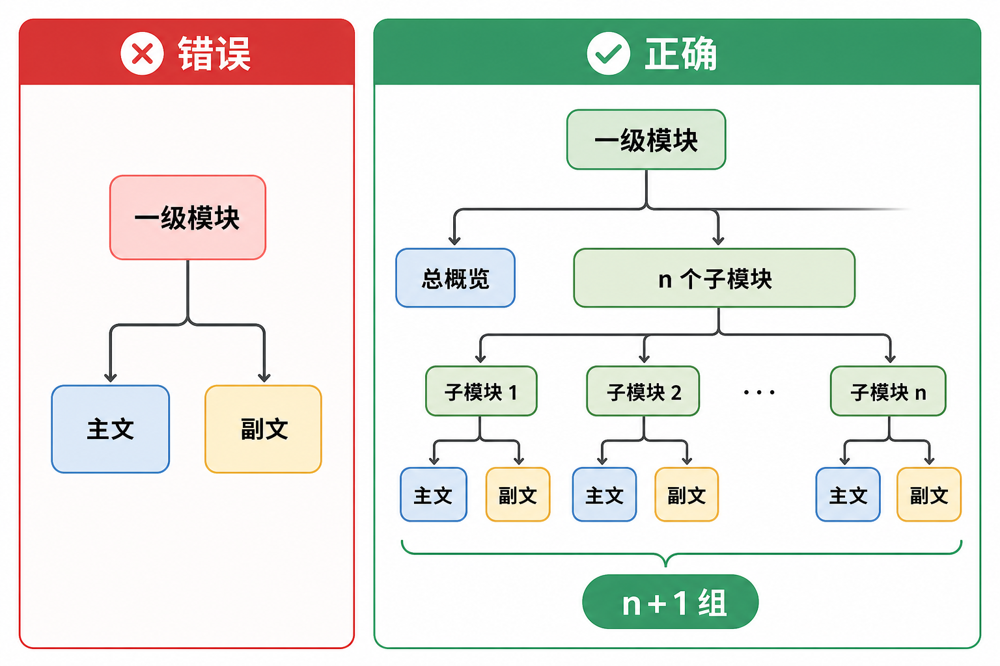
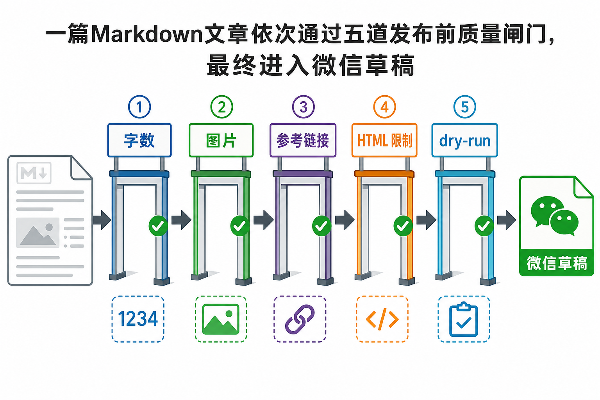

# 踩坑指南：让 AI 做知识项目，别只会催它继续

用 AI 做一个复杂内容项目，很容易得到一种错觉：第一版已经生成，后面只需要不断说“继续”。真正做下去才会发现，最难的不是生成速度，而是需求层级、内容边界、交付格式、质量标准和完成定义。

下面这份指南来自一次真实的 AI Agent 知识图谱项目。它不讨论怎样写一句更华丽的提示词，只讲哪些地方最容易返工，以及怎样把返工变成规则。

这里记录的是网站、初学者内容、面试题和公众号文章背后的返工，不是 AI Agent 技术面试题汇编。

## 坑一：只给名词，没有说明最终用途

“帮我画 AI Agent 知识图谱，包含知识库、MCP、Skill。”这句话足以生成一张脑图，却不足以生成一个可用项目。

AI 不知道读者是初学者、面试者还是架构师；不知道要一张静态图，还是能搜索和跳转的网站；不知道模块只需要定义，还是要机制、案例、面试题和参考资料。它只能根据常见模式补全，结果通常完整但不贴身。

规避办法是补齐四项：读者、用途、交付物和完成标准。比如“初学者版负责概念和关系，面试版负责原理与取舍；输出静态 HTML；每个子模块都能下钻；两个版本一一对应”。这比堆更多技术名词有效。

还要写清哪些事情暂时不做。若当前只做静态知识站，就不要让 AI 顺手加入登录、数据库和后台管理；若文章只创建草稿，就不要默认发布或群发。边界不写，AI 往往会把“完整产品”当成目标，增加无关复杂度。

## 坑二：先生成文件，再验证能不能用

项目最初生成了 XMind 文件，但打开失败。即使文件能打开，它也不一定适合后续搜索、导航、部署和 Git 管理。

复杂项目开始前，先验证最小交付链：目标格式能否打开，用户是否有对应软件，文件是否方便版本管理，后续是否要转换到网页或公众号。先用一个小样本走通，再批量生成。

本地源文件也要选对。公众号 API 接收 HTML 和文章字段，但长期原稿更适合 Markdown；图片用本地 PNG/JPG，创建草稿前再上传微信。把 API 产物当原稿，会让后续修改和跨平台复用都很痛苦。

目录结构同样应在批量生成前确定。总览放哪里，子模块放哪里，图片和提示词是否跟随文章，发布产物是否进入 Git，这些问题越晚决定，移动文件和修链接的成本越高。

## 坑三：总览、子模块和文章层级没先定

这是本次返工最大的一类。最初把一个一级模块理解成两篇文章：一篇初学者主文，一篇面试副文。后来才确认，一级模块还有 6 个子模块，因此应该是 1 个总概览加 6 个下钻，共 7 组、14 篇。

层级不清会产生连锁问题：总览把子模块讲完，子模块只能重复；总览面试题占用了细节题，下钻文章只好换标题复用答案；配图也无法判断应该画全景还是机制。

规避办法是先做模块清单。每个一级模块列出子模块 ID、阅读顺序、总览职责、子模块职责、文章路径、题目包含和排除范围。若有 n 个子模块，直接计算 n+1 组，不靠聊天记忆。

面试题还要单独维护边界。只检查标题不够，两道题可能换了标题却共用同一答题骨架。生成前应比较核心知识点、答题点和追问；总览负责跨层分工、端到端选型和共性治理，子模块负责计算机制、故障与专项评测。必须承接的知识点在总览里点到即可，不完整展开。

写“基础模型与推理”总览时，这个问题再次出现：模型分工与大语言模型内部机制被写到一处。后来改成先定子模块的题目边界，再重写总览。“知识检索与检索增强生成”也照此办理：总览回答整条链怎样接起来，切片、检索和 RAG 各自回答局部机制。**同一案例可以复用，回答的问题不能复用。**

## 坑四：文章看似完整，其实都是泛化句

AI 很擅长写“正确但没信息量”的句子，例如“该模块承接上游输入，并把结果交给后续环节”“实际项目应结合具体情况选择”。这些句子放在哪里都成立，也因此放在哪里都没用。

另一个问题是“大话”和普通图解雷同。图解说一遍结构，大话只是把同样内容换成口语，读者没有得到新的理解。

规避办法是给每层内容明确任务：网站图解说明组成和关系；“大话”用短比喻帮读者理解，但讲完回到主案例；网站的“机制加餐”独立解释输入输出、失败和取舍，不是公众号文章必设的栏目；面试题训练定义、方案和生产治理。删掉与知识无关的免责声明和万能过渡句。

语气也要检查。少写“本文将带你”“总的来说”“关键不是 A 而是 B”这类高频模板，多用短句、具体对象和真实判断。轻微幽默可以有，但不能让段子替代机制。

后来我把大语言模型主文和面试文并排改过一轮。旧稿看似字数合格，仍会把“模型读懂文字”“采样改变语气”写成省事但不准确的说法。新稿先说可观察现象，再讲原因和边界；把易混的概念并排解释，关键结论加粗，参数名用行内代码。确认有效后，直接替换正式文章，让 Git 历史保存旧稿，避免两套近似文章长期分叉。

## 坑五：图片很漂亮，文字却错了

生成式图片特别容易在中文文字上翻车：错别字、漏字、标签重复、箭头指错方向。画面越复杂，小字越多，出错概率越高。

规避办法是先写提示词清单，再生成图片。每张图只保留少量大标签，逐字放进 `Text (verbatim)`；同一系列统一背景、配色和构图；生成后逐张目视检查。发现错误就重渲染，不要因为“整体还挺好看”勉强使用。

但原理图还有更深一层的坑：**字全对，机制仍可能画错。**画 Transformer 不能把原论文的编码器—解码器结构与今天常见的仅解码器模型混成一张；画 RNN 与 Transformer 不能把训练并行误写成生成并行；画 RAG 也不能把普通“检索后拼进提示词”的流程直接标成原论文的完整模型。原理图先查论文的图号或章节，再核对节点、箭头、掩码、训练与推理阶段。框架图和业务流程图才适合直接沿用分层方框。

图片还要考虑发布限制。公众号正文图片需先上传并替换 URL，单张大小受限；封面和正文图用途不同。原图可以保留高质量版本，导入时再压缩，不要破坏源文件。

生成图不要一上来堆满文字。标签越多、字号越小，模型越容易写错，手机端也越难读。先确定这张图只表达一个关系，再保留三到六个关键词。复杂解释留给正文，不要把文章硬塞进图片。

最近一次配图返工还说明：辅助图也要复查，不能只盯“每篇至少一张原理图”。凡是带因果箭头、指标名称或术语对照的图，都可能让人误读。能用确定性绘图脚本准确排版的，就不必反复抽卡；修图时同步改正文图注和提示词记录，避免三处说法不一致。

还有一种更隐蔽的“凑够五张”：把 Front Matter 指定的封面再放进正文，然后把它算作正文配图。封面负责在消息列表里说明主题，正文图负责解释机制、证据或比较关系，两者不能靠重复引用冒充两个信息任务。这轮审计发现十二篇“基础模型与推理”文章中有十一篇重复插入封面，五篇面试文扣掉封面后只有四张有效图。后来统一删除正文标题图，并补上与具体问题对应的机制图。

封面也不能只对标题负责。多模态封面第一版写出了完整的 2024 年日期，而正文案例明明只有 `9/3`、年份未知；金额和税额也必须固定为 `680.00` 与 `38.49`。画面越像真的，字段漂移越容易被忽略。复核时要拿正文案例逐项对照标题、数字、状态和箭头，不能只看错别字。类似地，LoRA 图中矩阵标签写成 `A·B`、公式却写 `BA`，也是文字都认识、关系却没对上的错误。

## 坑六：工具已经装了，不代表马上能用

图像插件安装后，调用仍然失败。最后发现插件代码依赖 MCP 1.x，本地却安装了 2.x；修好依赖后，又遇到登录凭据问题。

这类阻塞很常见：插件进程没有重载、运行时依赖不兼容、环境变量缺失、账号权限不足、远程网关故障。不断重试只会重复同一个错误。

规避办法是分层排查：工具入口是否存在，进程能否启动，依赖版本是否匹配，凭据是否可读取，网络请求是否成功，最终文件是否落盘。每一层都要拿到证据，再进入下一层。修插件缓存或依赖属于环境变更，也应记录清楚。

用户说“已经登录”后，也要验证当前工具实际读取的是哪套凭据。不同宿主可能读取不同配置文件，登录一个客户端不代表另一个客户端自动获得令牌。看 HTTP 状态和明确错误，比继续猜测有效。

## 坑七：阶段完成被误当成任务完成

生成 10 张图片后，AI 停了下来，认为“配图阶段”已经完成。但真正任务还包括两篇正文。后面又出现一次类似问题：总览文章完成了，却还缺 6 个子模块组。

这类错误不是能力不足，而是完成定义被悄悄缩小。长任务拆阶段是必要的，但阶段终点不能替代总目标。

规避办法是维护可核验的交付清单。比如“工具、技能与协议”是 7 组、14 篇 Markdown；每篇 3000–5000 个中文字符、至少 5 张正文图、参考链接、Front Matter、每组一次双图文 dry-run 和阶段提交，都有各自的检查项。这里说的是十主题系列；独立专题可以超过 5000 个中文字符，但不能越过微信正文 HTML 的平台上限。每次报告完成前，对照本阶段目标逐项核查，而不是看当前阶段有没有绿色日志。

状态更新也要区分“已完成”“正在等待”和“被阻塞”。图片请求仍在运行时应等待同一个任务，而不是重新发起；一个阶段完成时应说明剩余范围，而不是给出整个项目已经结束的口吻。

## 坑八：先写短稿再补字，token 会被慢慢吃掉

批量文章最初多次只有 1500–2200 字。校验失败后，又读取全文、分析缺口、补几个章节、重新跑全量检查。单篇看不多，十几篇叠加后成本很高。

另一个浪费是校验器每次都输出 14 篇详细统计。日志重新进入上下文，AI 又要读一遍。图片生成也有类似问题：提示词不先统一，逐张试错会重复消耗。

规避办法是写作前固定 8–10 个内容块，给各块分配目标，技术主题的首稿直接写到 3200–3500 个中文字符。校验默认只输出失败项和总数，逐篇统计只在排障时打开。阶段内只查当前组，模块交付前再跑全量。

还要避免反复读取大型 HTML 来恢复模块结构。把子模块、文章路径、提纲、题目边界和图片名称写入一个结构化清单，生成和校验都读清单。结构化数据比在几千行页面脚本里搜索关键词更省上下文，也更不容易漏项。

## 坑九：规则写在聊天里，下一轮还会重犯

“两个版本要对应”“不要泛化文案”“参考资料必须有链接”“图片文字要中文”“阶段完成就提交”，如果只存在聊天记录里，新的任务很容易丢失。

规避办法是把稳定要求写进仓库规则，再尽量变成自动检查。`series.json` 记录模块结构、文章提纲、题目边界和图片；脚本检查标题、作者、摘要、字数、图片、参考链接、HTML 体积、文章配对和题目重复；Git 记录每个阶段。

规则文件解决“应该怎样做”，校验脚本解决“有没有做到”，版本历史解决“哪次改坏了”。三者结合，比在聊天里反复强调靠谱得多。

自动校验也不能无限膨胀。每条检查都应对应真实踩坑：字数检查来自短稿返工，层级配对来自 n+1 误解，参考链接检查来自文章可核验要求，简洁输出来自 token 浪费。没有实际风险的检查只会增加维护噪声。

规则变严格后，要跑全库，不能只看当前目录。封面改为独立计数后，当前模块通过了，检查器却同时找出另外七篇旧面试文只有四张正文图。正确处理不是给新模块开特例，也不是把规则改松，而是确认旧文章有没有可复用、且确实承担解释任务的原理图，再补齐并重跑全部文章。一次局部修复能不能安全落地，要看它对整个仓库造成了什么连锁反应。

检查命令也要按改动范围运行。每次提交前跑 `npm run check` 和 `git diff --check`；改公众号文章，就对每组主副文合并做一次草稿 dry-run；改服务端接入，再加 `npm test`；改页面，启动预览看实际交互。把所有命令一股脑塞进每次修改，既慢，也容易让人误以为“脚本全绿”已经完成了人工审图。

## 坑十：联网资料多，不等于研究质量高

AI 可以很快列出大量文章，但二手博客、搜索摘要和过时文档容易把错误带进知识图谱。尤其是 API 字段、协议版本和产品限制，几年内就可能变化。

规避办法是优先官方文档、规范和论文，先打开原文再写结论。无法从官方来源确认的内容，要说明不确定性。参考资料要与正文判断对应，而不是在文末堆一排看起来专业的链接。

资料还要分层使用：官方文档确认当前接口，论文解释原理，工程文章补实践经验。三类来源不能互相冒充。论文里的原始架构、后来的工程变体和作者自己的教学简化，也要在图注和正文里分清；一张来源不明的漂亮示意图，不能替代论文。一个供应商的示例代码，同样不能自动变成行业通用结论。

## 坑十一：长对话会积累“旧需求幽灵”

项目跨很多轮后，早期要求可能已经被后续要求替代。例如最初按一级模块写两篇文章，后来改成 n+1 组；若 AI 继续沿用旧目标，就会生成错误数量的内容。

规避办法是把当前结构写进仓库清单，并在关键转折后重新声明目标。开始新阶段前读取当前文件和 Git 状态，以工作区为准，不只依赖对话记忆。中途被打断后，也先检查哪些文件已经落盘，再继续下一步。

对人也一样。不要期待自己记住几十轮细节。让目录、元数据、清单、提交和测试替你保存事实，聊天只负责提出新判断。还有一个容易漏的状态：本地提交不等于远程已更新，远程更新也不等于公众号已经发布。核对时分别看 Git 提交、远程分支和公众号草稿箱，别拿一个仓库链接替三个状态作证。

发布产物也会形成“旧需求幽灵”。项目早先准备过 Word 终版，后来公众号 API 草稿链路跑通，规则却一度还在教人“先确认，再导 Word”。这会让同一篇文章有两套终稿。修正后只维护 Markdown：转换 HTML、上传两篇各自的封面和正文图，再把主文与副文放进同一份草稿。`--file` 和 `--side-file` 决定实际顺序，Front Matter 的 `order` 只是记录预期；创建草稿要有明确指令，更不等于群发。

推送 Git 时也别见错就强推。有一次默认 SSH 端口超时，改走备用通道后又收到“远程分支已前进”的拒绝。取回远程记录一看，另一个任务的提交正好接在本次提交后面，内容已经在远程。网络、凭据和提交先后各有各的查法；不先看提交关系，强推就像为了开门把门框拆了。

## 坑十二：规则写得多，自己也会打架

把经验写进规范是好事，但规则越长，越容易留下两句互相绊脚的话。这次就查到：一处说“每组主副文合并 dry-run”，另一处还写着“逐篇运行”；规范要求所有副文回答至少三道面试题，可这篇副文明明是踩坑指南。若只为了让检查通过把指南改成三道题，就丢了原本要保存的开发教训。

处理办法不是把所有约束一笔勾销，而是说明**哪条规则管哪类文章**。十个技术主题继续按 n+1 组、面试副文至少三题、正文 3000–5000 个中文字符执行；独立专题在 `series.json` 标明类型，非面试副文记录 `contentBoundary`，允许超过 5000 个中文字符，但仍不少于 3000，正文 HTML 仍须少于 20000 个字符且小于 1 MB。主副文不论是什么文体，依然要核对封面、正文五图、参考链接和手机端预览。

写规则时还应把“原则”和“操作”分开放：项目规范说明内容边界和验收标准，接入说明给出命令，不在两处各维护一份系列篇数。每次改完，沿着一篇真实文章走一遍，看看清单、脚本和后台草稿是否还在说同一件事。规则不是越厚越可靠；能在下次返工前拦住错误，才算有用。

## 坑十三：脚本全绿，不代表草稿已经能发

“大话大语言模型”双图文通过字数、图片数量、链接和 HTML 限额检查后，后台预览仍暴露了问题：正文第一张图只是把文章标题重新写了一遍；另一张图用了通用盾牌和流程图标，却没有解释会议通知里的证据怎样核对；面试副文的图片标题过大、颜色过饱和，还出现贯穿左侧的装饰竖线。它们不一定让脚本报错，却会让读者觉得空、吵或不知该看什么。

格式也会在局部修改中退化。副文原本统一使用橙色主题，改写原理和答题点时却可能丢掉标题层级；“记忆点”如果只是加粗标签，扫读时又会和普通段落混在一起。最后确定的格式是：题目用二级标题，“原理、答题点、记忆点”用三级标题；“记忆点”下接浅橙引用框，框里不再重复栏目名。样式调整后还要重新跑渲染测试，不能凭 Markdown 源文档猜公众号会怎样显示。

更稳的做法是把推送拆成四道闸门。第一道看内容：两篇事实一致、职责互补、没有成段复述。第二道看图片：封面与正文图分开计数，每图都回答一个具体问题，主文至少有原理图，副文重点展示对比、诊断和验证。第三道看格式和平台限制：橙色主题、标题层级、代码块、图注、链接和 HTML 体积都通过。第四道看公众号后台与手机端：大图和小缩略图是否裁切正常，图片是否清楚，引用框和代码有没有被平台清理，“阅读原文”能否跳转。

还有一个容易误判的状态：重新创建草稿不是覆盖更新。每次 `draft/add` 都会返回新的 `media_id`，旧草稿仍留在草稿箱。修改源文、重新 dry-run、再次创建后，要记录本地提交、检查结果、新 `media_id` 和预览状态，再人工决定是否删除旧稿。否则后台同时放着几个同名版本，很快就分不清哪个才是最后审过的。

## 坑十四：重复不是换个题面就消失

最近审查“基础模型与推理”系列时，发现有些主文和副文虽然标题不同，仍然复用了同一套解释和结论。只改题干、配图或措辞，读者得到的信息并没有增加。

共用一个案例没问题，重复的是完整答案才需要处理。先给总览和子模块划边界，再分别列出主文讲解、面试副文考查的知识点。副文要往前多走一步，可以考机制条件、对照实验、指标计算、故障定位、数据泄漏或上线约束。审稿时同时看标题、知识点和答案骨架；发现重叠，就改成另一种有价值的考查角度，或把内容放回更合适的总览，别靠换名字掩盖。

审计脚本能筛出可疑段落，但不能代替阅读。第一版脚本曾把 `.DS_Store` 误当成文章目录，还把参考资料中重复的论文链接当成正文相似。修复时补上目录过滤和参考资料剔除；以后改比较范围，也要拿实际文章验证误报与漏报。相似度指标只是提示，不是“内容独立”的证明。

## 坑十五：已发表文章仍按草稿覆盖

作者明确说文章已经发表后，原稿就进入冻结状态。近期确认 1.1 和 1.2 已发表，后续审稿到相邻模块时，就不能顺手改这两篇 Markdown，也不能把它们交给 `--upsert` 覆盖草稿。即使只想润色几句话，也先保留已发布版本；需要修订时另建新版本，或取得明确授权。

每次同步前先核实文章状态和目标草稿身份。未发布的稿件通过内容、图片、格式和平台预览检查后，才按既定规则覆盖或新建草稿；找不到唯一对应项时先停下来核对。Git 里的原稿、远程仓库、公众号草稿和已经发布的版本要分别记录。发布状态不能从文件名、最近修改时间或 `media_id` 猜出来。

## 一套更省事的共创流程

第一步，用小样本确认交付格式。第二步，列出内容层级和模块清单，先划子模块边界再写总览。第三步，为每篇文章写 8–10 段提纲、主案例和副文边界。第四步，首稿直接达到目标字数。第五步，原理图先查论文，其他图片先写提示词，再生成并逐张校对。第六步，按改动范围运行检查，每组主副文合并做一次 dry-run，并做主副文与总览/子模块的内容去重审查。第七步，修改或同步前先核实文章是否已发表；已发表稿默认冻结。未发布稿再按内容、图片、格式和平台预览四道闸门验收；创建草稿后记录 `media_id`，不要把新旧草稿混在一起。第八步，阶段通过后提交 Git；远程若已前进，先查看提交关系再同步。创建草稿不等于发布或群发。

这套流程不会让 AI 永远不犯错。它能做的是让错误尽早暴露、影响范围更小、修复后不再重复。人与 AI 共创的质量，最终不取决于谁一次就猜对，而取决于能否把偏差变成下一轮可执行的规则。

如果想照着这条路径试做，可以先挑一个子模块做完整样稿：主文讲清机制，副文检查能否把原理和取舍说出来。阅读项目成果时，以远程实际提交为准；公众号是否有新稿，还要另外看草稿箱。

## 参考资料

- [OpenAI 官方文档：Tools](https://developers.openai.com/api/docs/guides/tools)
- [Model Context Protocol 官方文档](https://modelcontextprotocol.io/docs/learn/architecture)
- [微信公众号官方文档：新增草稿](https://developers.weixin.qq.com/doc/service/api/draftbox/draftmanage/api_draft_add)
- [Attention Is All You Need：原始 Transformer 论文](https://arxiv.org/abs/1706.03762)
- [Retrieval-Augmented Generation for Knowledge-Intensive NLP Tasks：原始 RAG 论文](https://arxiv.org/abs/2005.11401)

想看这份指南对应的网站与文章目录，可点击下方 [阅读原文](https://github.com/Jennifer123www/ai-agent-knowledge-map)。
