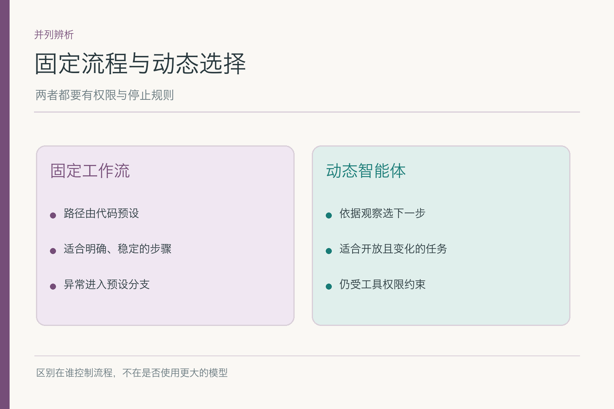
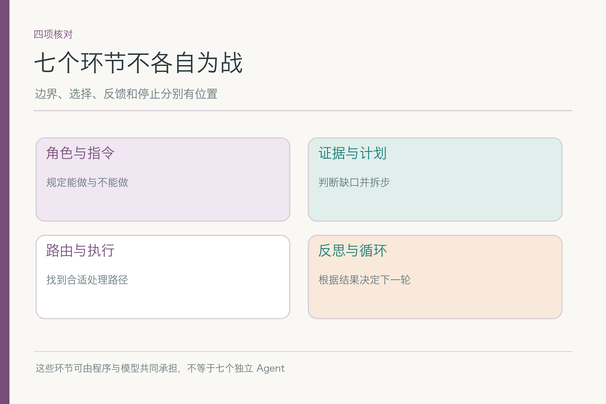
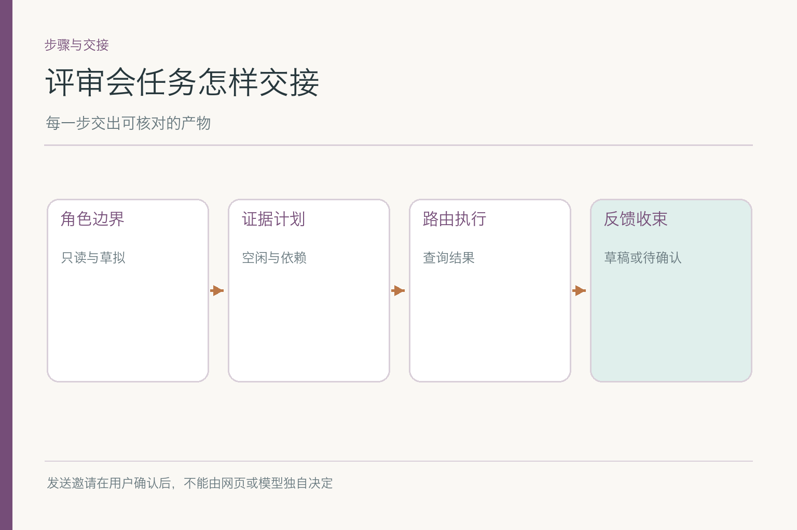
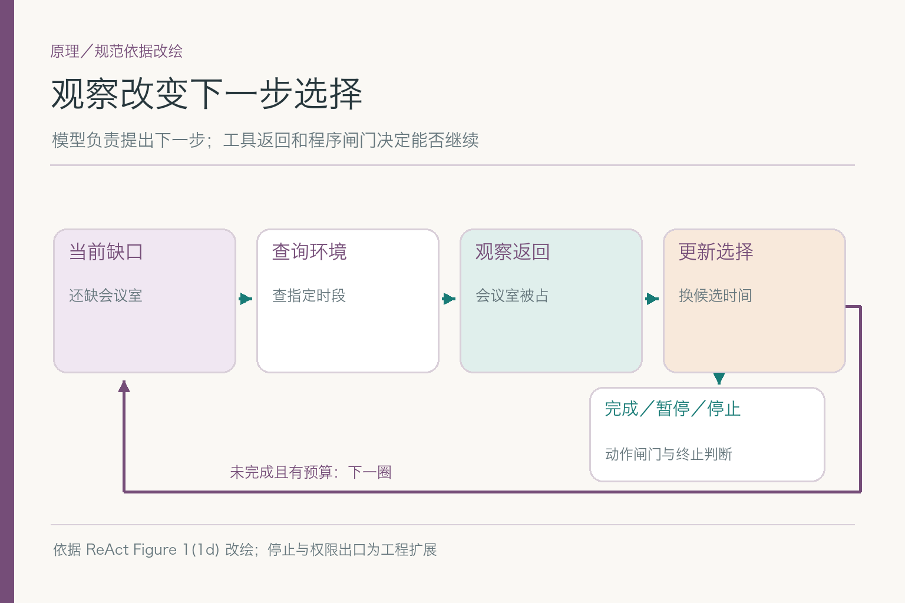

# 面试题：智能体与工作流怎么分工

项目入口：[AI Agent 知识图谱仓库](https://github.com/Jennifer123www/ai-agent-knowledge-map)。这一组考**系统层的取舍与交接**。角色字段、提示词模板、计划搜索、路由阈值、反思文本和循环状态机的细节分别在七个下钻组，不用在总览重复答一遍。

共用案例：小林要安排下周的跨团队产品评审，研发、设计、运营都能参加；要查可用会议室，先给候选时间和邀请草稿，**未经确认不能发送**。周四三组人员空闲但房间被占，周五房间可用而运营尚未回复。以下每道题都落回这两个互有缺口的候选，不临时换成无关的购物 Agent。

## 问题 1：什么情况下选固定工作流，什么情况下选智能体？

### 原理

一种常用工程划分是：工作流路径由程序预设，智能体可依据环境反馈动态决定部分路径。两者都可调用模型与工具。选择由任务变化程度、错误代价和验证难度决定，不按“有没有大模型”划线。

### 答题点

1. 若会议安排规则稳定，固定收约束、查日历、查房间、给草稿更易测试；
2. 若小林目标模糊、资料来源变化大，可让模型选择先补哪项信息；
3. 发送邀请、权限和截止预算仍走程序控制；
4. 用相同任务集比较成功、延迟、成本与越权，而不是只看演示流畅度。

回答可以先画出周四和周五这两条失败分支：固定流程能覆盖它们时不必增加自主循环；若还有大量未知变化，才考虑把某些下一步交给模型。**混合方案通常比“全固定”或“全放手”更具体。**

### 记忆点

> 流程路径谁决定，才是区别；安全边界都要有。

### 常见追问

“用了模型判断分支就一定是 Agent 吗？”不必争标签。说明动态范围、可调用动作和停止条件，比套名词更有价值。

### 失分点

用模型规模或界面是否有聊天框定义 Agent。

## 问题 2：七个子模块在同一任务里怎样交接？

### 原理

七环节不是七个必须单独部署的进程，而是七类职责。小林的目标进入后，角色与指令划边界，证据支撑时间判断，计划排依赖，路由选处理路径，反思利用失败反馈，循环更新状态直到结束。

### 答题点

1. 先给出交付物：候选时间、依据、通知草稿和待确认项；
2. 标明人员空闲、会议室状态和用户授权分别来自哪里；
3. 描述房间冲突后反馈如何影响下一步，而不是重查同一对象；
4. 指出发送邀请被挡在用户确认之后。

面试官若问“这些都要调用七次模型吗”，答不需要。身份、权限、预算与某些转移条件可由程序完成；模型用于需要解释模糊目标或比较方案的地方。七环节是分析框架，运行实现可以合并，也可以拆分。

### 记忆点

> 边界、依据、路径、反馈、停止，一路有交付。

### 常见追问

“计划与路由是不是一回事？”计划管任务依赖和顺序；路由管具体步骤交由哪个模型、工具或人。

### 失分点

把七个词并列背诵，没有说明周四房间被占后谁改变了什么。

## 问题 3：怎样设计固定规则与动态选择的混合边界？

### 原理

动态选择有价值的地方，是决定还缺什么、在合法候选里先查哪一个；确定性规则适合管动作许可、参数范围、次数上限和终态。边界若模糊，模型会把自己生成的“已安排”误当真实工具结果。

### 答题点

1. 程序固化身份与日历权限、发送确认、时区格式、最大查询次数；
2. 模型可建议周五候选或向运营追问，但不能创造授权；
3. 工具返回写成状态里的事实字段，与模型建议分开存；
4. 故障时按风险降级：交部分候选可以，虚称已预订不行。

对这笔任务，可把“读到三组空闲”“房间可用”“小林已批准发送”做三道硬门。模型在门内灵活比较时间；门外只能提出追问或停止。这样说比“关键操作人工审核”更可落地，因为明确了审核前后的状态。

### 记忆点

> 让模型挑路，让程序守门。

### 常见追问

“模型说用户已经确认，能放行吗？”不能，确认状态须来自可核对的用户操作或授权记录。

### 失分点

只在提示词写“不要发送”，却给它不受控的发送工具。

## 问题 4：怎样防止把证据、建议和动作结果混为一谈？

### 原理

“周五 10 点可能合适”是候选建议；“三组人员均空闲”需要逐项证据；“会议室已预订”“邀请已发”需要真实工具返回。三个层次不能由同一句模型输出兼任。否则最终文本很顺，业务状态却从未改变。

### 答题点

1. 记录候选时间对应的日历与房间结果 ID；
2. 对未返回的运营团队明确标未知，不用预测填补；
3. 对订房和发送保留工具调用 ID、状态与幂等标识；
4. 让最终回复只陈述实际完成的动作。

周四人员都空闲，不足以说“场地已安排”；周五房间可用，不足以说“运营可参加”。一个会安排会议的助手，应该能准确说“我目前确认了什么，仍缺什么”，而不是一口气把候选、计划和结果都写成完成时。

### 记忆点

> 建议不是证据，证据不是已执行。

### 常见追问

“模型能直接给出可信置信度吗？”可作为线索，但不能替代证据与状态核验；要说明置信度依据和校准方式。

### 失分点

把自然语言“已经发送”当成发送成功的证明。

## 问题 5：最终候选时间错了，应怎样做端到端归因？

### 原理

同一错误可能出现在不同层：一组日历查询没返回、时间单位或时区解释错、计划先后颠倒、路由选错服务、房间观察未写回状态。修复点由轨迹证据决定，不能统一归因于“模型不够聪明”。

### 答题点

1. 沿一次任务 ID 查看原请求、每次工具调用、返回及其版本；
2. 对照选出的候选与实际三组日历和房间状态；
3. 定位错误首次出现的位置，再判断是证据、选择还是执行问题；
4. 用同一失败样本做回归，确认不引入新越权。

例如工具已经返回“周四房间已占”，最终仍选周四，就查结果是否被送入决策、状态是否覆盖旧值；如果工具根本没被调用，则看计划或路由。**同一个错字般的最终结果，背后可能是完全不同的系统故障。**

### 记忆点

> 沿轨迹找错误第一次出现的地方。

### 常见追问

“日志记录越全越好吗？”不是。记录必要的动作、状态、来源与版本，个人日历详情要按权限脱敏和保留。

### 失分点

只拿最终回复让另一个模型打分，忽略中间动作。

## 问题 6：人工确认应放在系统哪一层？

### 原理

人工确认是明确的状态转移，不是回复末尾一句“请确认”。小林的要求是先看候选与草稿，所以系统必须停在等待批准；若日历发生变化，批准后的发送还需复核关键事实。确认按钮、身份和被批准的具体内容应能关联。

### 答题点

1. 明确待批准对象：时间、参会人、会议室、通知正文；
2. 保存当前状态版本，小林确认的是这一个版本；
3. 发送前检查身份、权限与时效，变化则重新请确认；
4. 拒绝或超时后保持未发送状态，不暗自重试。

若小林只回复“可以”，却没有指向周四还是周五，不能从上下文里赌一个。先把候选与批准对象绑定，能避免“人确实点了确认，但确认的是另一版”的事故。这种问题很现实，尤其在多人反复修改时间后。

### 记忆点

> 人批准的是具体版本，不是一句模糊的放心去做。

### 常见追问

“高风险动作只靠提示词请求确认可以吗？”不行，程序执行闸门要看到可核的确认状态。

### 失分点

把弹窗显示过当成用户已经批准。

## 问题 7：怎样设置整套系统的预算与停止条件？

### 原理

开放任务可能没有理想答案。会议室连续不可用、运营迟迟不回复时，系统不能无限查到天亮。总体预算包含工具次数、模型调用、耗时与外部动作风险；终态要区分完成草稿、等待确认、信息不足和技术失败。

### 答题点

1. 定义目标达到的条件：候选有证据、草稿已交、未发送；
2. 设查询次数、总耗时与无进展判断；
3. 缺关键资料时追问或交现有候选，不编造完成状态；
4. 记录停止原因，让用户知道下一步是谁来做。

周四房间被占可以探索周五；周五运营未知则应停下来追问，而不是连续查十间房。停止不是承认系统失败，它有时正是遵守用户与现实约束的最好动作。

### 记忆点

> 有预算、有终态，才能说是受控自主。

### 常见追问

“有没有统一的最多三轮？”没有。轮数随任务风险、工具延迟与收益变化，要基于评测设定。

### 失分点

只设置 token 上限，没有无进展和外部动作边界。

## 问题 8：端到端评测应覆盖哪些变化？

### 原理

系统验收不能只看一条顺利会议。要覆盖正常、冲突、缺值、新信息和越界文本，并同时看过程与结果。单篇子模块会测各自机制；总览要测连接处有没有丢状态、换错路径或越权动作。

### 答题点

1. 正常：三组和会议室都可用，交候选与草稿；
2. 冲突：人空闲但房间占用，能否调整或说明缺口；
3. 缺值与新增：运营超时或小林改日程，能否重新选证据；
4. 越界：日历备注诱导发送，确认闸门是否挡住。

报告应分开列候选成立率、错误工具调用、缺值识别、成本与违规动作。若把“写得礼貌”并入总分，系统可能靠一封漂亮却日期错误的邮件拿到高分。测试还要检查周四旧结果是否在周五更新后被误用。

### 记忆点

> 结果与轨迹都要验，尤其验连接处。

### 常见追问

“评测全通过就可以直接给真实用户发送吗？”还需权限、灰度、回退与真实环境限制；离线样本不能覆盖所有人和日程变动。

### 失分点

只测自然语言答案，不测是否调用了发送工具。

## 问题 9：上线后出了新型冲突，怎样回退？

### 原理

智能体行为由模型、提示、路由、工具接口、状态逻辑和权限规则共同决定。只记模型版本，很难解释周五为何突然被选错。发布应记录组合版本，出现越权或错误动作时可关闭高风险路径，回到已验证的固定草稿流程。

*依据 [ReAct](https://arxiv.org/abs/2210.03629) Figure 1(1d) 改绘；工程停止出口用于说明系统边界。*

### 答题点

1. 给一次任务关联模型、提示、工具模式、路由与策略版本；
2. 监控候选错误、重复查询、用户取消与越权尝试；
3. 高风险动作异常时关闭发送路径，保留只读和草稿能力；
4. 复盘样本归因后再修对应层，并用同案例回归。

即使新模型比旧模型更会写邀请，也不能用语言质量抵消一次擅发。回退范围应按风险切：发送可先停，查询与草拟仍可保留，用户不必因为一个动作链路故障而失去全部服务。

### 记忆点

> 回退一条危险路径，不必把整个助手一刀切掉。

### 常见追问

“为什么新模型上线后变慢？”可能是模型、循环次数、错误路由或工具重试增加，按轨迹分段量时延。

### 失分点

把所有回归归咎于模型版本，忽略工具与策略变更。

项目总览、配套主文和七个子模块见 [AI Agent 知识图谱仓库](https://github.com/Jennifer123www/ai-agent-knowledge-map)。

## 参考资料

- [ReAct: Synergizing Reasoning and Acting in Language Models](https://arxiv.org/abs/2210.03629)
- [Anthropic: Building effective agents](https://www.anthropic.com/engineering/building-effective-agents)
