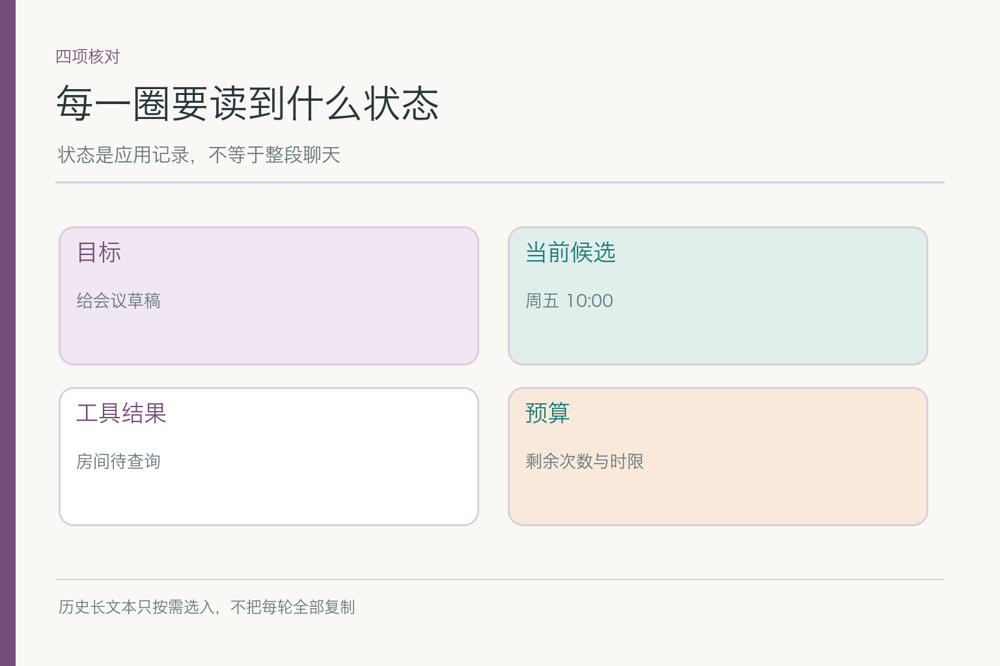
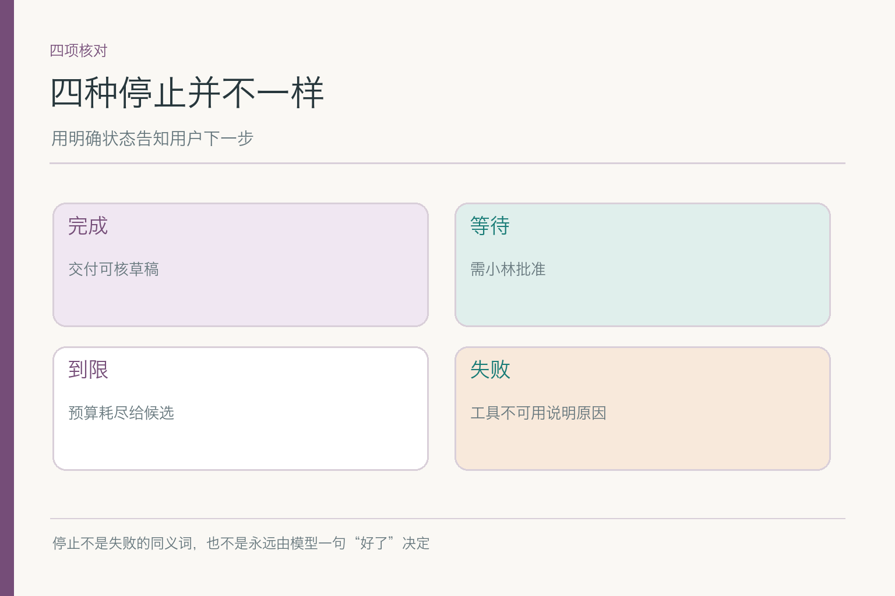
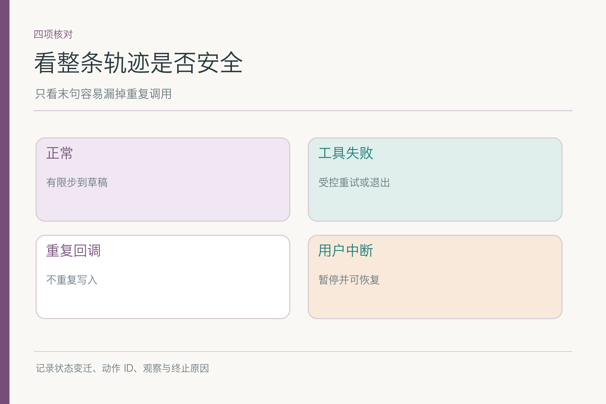

# 智能体执行循环：查完之后怎样知道该停了

项目入口：[AI Agent 知识图谱仓库](https://github.com/Jennifer123www/ai-agent-knowledge-map)。这篇谈**运行时怎样把一圈圈选择落实为状态变化与明确退出**。计划决定哪些步骤有依赖，路由决定某步交给谁，反思决定失败后怎样修正；执行循环负责读取、执行、观察、回写并停止。

小林要下周跨研发、设计、运营的评审会候选时间、可用房间和邀请草稿，不允许直接发送。助手查到周四 15:00 三组人空闲，房间被占；又发现周五 10:00 房间可用，但运营日历超时。若系统只写一句“我会继续为你安排”，我们不知道它下一圈会查什么、查过的结果存哪里、最多查几次、何时向小林说明缺口。**循环不是让模型忙起来，而是让每一圈都有可检验的状态变化。**

## 一、一圈到底包含哪几步

可以把运行拆成六个动作：读取当前状态，决定下一步，执行获准动作，接收工具或用户观察，写回新状态，判断继续还是退出。小林的任务里，一圈可能是“读到周四人可行但房间未知 → 查房间 A → 返回已占 → 写入冲突 → 决定换房间”。下一圈才会根据新状态查 B 房间，而非从头读小林那句原始请求。

*依据 [ReAct](https://arxiv.org/abs/2210.03629) Figure 1(1d) 的行动—观察交替改绘；状态寄存、预算与暂停是工程扩展。*

模型可以提出下一动作，但应用要先判断权限与参数，工具执行后再把真实返回写入状态。若模型决定“发送邀请”，当前任务没有小林批准，执行层不能因为循环到了“行动”一步就放行。这里的“行动”可以是读取、追问或给草稿，不默认是高风险写操作。

ReAct 图里的语言判断与环境行动交错，提示我们观察应影响下一步；生产系统还需要事件 ID、状态版本、失败出口与预算。论文展示的是原理方向，不等于画一个回环箭头就有了可恢复、不会重复发邀请的服务。

## 二、状态该存什么，不能把聊天全文当状态

会议任务的状态可以有：小林的目标和禁发约束、候选时段、三组空闲状态、房间结果、来源与查询时间、当前等待谁、剩余次数、已经执行过的动作 ID。长日历文本或邀请附件可留在受控存储，状态里保留引用；不必每圈把全部聊天历史复制到模型窗口。

“周四 15:00 房间 A 已占”是一个来自工具的观察；“周五也许更好”是模型建议；“周五运营确认”需要新的证据。状态字段应能区分这三种东西。若全部塞进一段自然语言摘要，下轮读取时可能把建议误当已核事实，把“尚未发送”误读成“已发”。

状态还要有版本，特别是用户随时可能改目标。小林从手机端说“改到下周三”，后台旧查询也许随后返回周四房间结果。写回时若不看任务版本，旧结果会把新计划污染成周四。版本检查不需要模型理解分布式系统，却要由应用保证“旧任务的回包不改写新目标”。

## 三、观察返回后，状态转移怎样写清楚

对房间查询，可以定义几类结果：可用、明确占用、超时、权限拒绝。可用进入候选核验；占用换房间或时间；超时按预算有限重试；权限拒绝停止该路径并请求有权主体处理。同一个“没拿到房间”会导致四种不同转移，不能都归成“再试一次”。

工具返回还要和请求匹配。若查询的是周四 A 房间，结果不能写到周五 B 房间的状态字段；若回包迟到，先比请求 ID 与任务版本。记录“请求—观察—状态变更”的对应关系，后续才能解释助手为什么放弃周四，或为什么仍在等待运营回复。

有时观察来自用户，而非工具。小林批准周五某版草稿，是一条新事件；它让任务从“等待批准”转为“可评估发送”，但不意味着房间与三团队事实自动仍有效。转移条件可以再次要求核时效。用户一句“可以”若没有绑定具体候选版本，系统应追问，不做模糊状态跳跃。

## 四、下一圈不能机械重放上一圈

周四 A 房间明确被占，同参数查询第二次不会凭空腾出房间。循环应根据新状态选择 B 房间或转周五；这一步可能由模型提出，也可以由固定规则决定。反思篇讲修正内容，循环篇关心的是**修正后的动作是否真的带着新参数执行，旧状态是否被正确替换**。

相反，工具超时不代表房间已占。可在次数与延迟预算内重试同一只读查询，但要记录重试次数与间隔。若模型连续两圈都选择相同无效动作，运行时应检测无进展，触发停止或交接。把“最多十圈”写进提示词而不在程序里计数，只能靠模型自觉。

新一圈的输入也不必包括所有过去的推理文本。提供当前任务目标、可用证据、最近失败原因和可用工具，通常比长篇重复历史更清楚。状态持久化与模型上下文选择是两层：前者存真实进度，后者只给这轮决策所需的信息。

## 五、工具失败与重复回调怎样不产生副作用

只读查询可以按错误类型有限重试；写操作必须另加幂等保护。若小林后来批准发送邀请，调用发送接口时网络超时，系统不能直接再发一封。它应先查动作 ID 对应的发送状态，或用幂等键确保重复请求只算同一动作。否则循环“多试几次”会变成同事邮箱里的多封重复邀请。

工具回调也可能重复到达。系统记录已处理的事件 ID，第二次回调不重复扣减预算、不重复更新房间状态、更不触发新的发送。若一个查询结果在小林改期后迟到，版本检查阻止它覆盖新任务。**重试是运行机制，不是模型喊一句‘再来’就能安全执行。**

当服务不可用，循环应有失败状态与退路。可交出“周四人可行但房间冲突；周五房间可用但运营待核”的部分结果，等待小林选择；不能让后台永远处于“处理中”，把用户晾在没有下一步的界面上。

## 六、人工确认怎样让循环暂停、再恢复

小林明确要求先看草稿。交付候选和邀请文字后，当前循环应进入“等待批准”状态，停止任何发送动作。状态里记录等待谁、批准的具体候选和版本、何时过期。小林可以修改、否定或批准；每种输入都触发不同下一步。

若小林两天后批准周五 10:00，房间可能早已被占，运营也可能有新安排。恢复执行不应直接拿两天前的房间查询结果发送邀请；先复核关键证据，再提示小林变化。暂停保存的不是“未来已授权的一切”，而是一个待处理问题。

等待期间也不必让模型不断自我对话。任务状态可以安静地停在存储里，收到用户事件或定时检查才恢复。这里的“循环”是逻辑上的状态推进，不是一个进程从早到晚不间断占着算力。若用户永不回复，按产品规则到期关闭或归档，别让任务永远开着。

## 七、完成、等待、到限和失败，四个出口怎样区分

本轮成功可以是“给出有依据的候选与草稿，尚未发送”。等待可能是“缺小林批准”或“缺运营确认”。到限意味着工具次数或时间预算用尽，可以交现有半成品；失败则是关键服务不可用，连可靠候选也给不出。四种结果的用户说明、后续责任和可恢复性不同。

不要让模型一句“任务完成”直接设置完成标记。程序应对照交付物与动作记录：草稿是否存在，候选是否有证据，发送是否真的未发生。若模型写了“邀请已发送”却无发送工具记录，状态应纠正为“未发送”，并把错误完成声明记入评测样本。

停止还包括安全停止：模型不断提出无权限工具调用，或连续尝试同一个不可能的周四 A 房间，程序可中止并交出当前状态。一个能承认“现在无法继续”的 Agent，比永远在转、永远声称即将完成的循环更可靠。

## 八、怎样用轨迹验收循环，而非只读最后一句话

给同一会议任务准备正常、工具失败、重复回调和用户中断四类轨迹。记录每圈的状态版本、候选动作、权限决策、工具调用 ID、观察、写回和终止原因。正常轨迹应在有限步内给草稿；异常轨迹应有受控重试或清楚退出，绝不出现未经确认发送。

一条可检查的轨迹可以像流水账一样朴素：版本 3 读到周四人员空闲，发起房间查询 `room-17`；回包说已占，版本 4 把周四标为场地冲突；下一圈改查其他候选。若回包只被写进一段聊天文字，却没更新结构化状态，后面仍可能把周四当作可用。评测要在**状态写回**这一格验收，而不只听助手口头承认“刚才看错了”。

重复回调时，系统可能两次收到同一个查询结果。读操作的重复通常浪费时间；若它推动下游两次创建预约或发送邀请，后果就不同。轨迹里需要动作 ID、回包 ID 和已处理标记，让第二次相同回包只能被识别，不能再触发一次外部动作。用户在等待时改了会议日期，则旧版本的回包可以留档，却不能覆盖新目标。

最后还要核对出口是否写得准确。周五有房间但运营没回，是“等待确认”，不是“完成”；房间服务连续超时又达到预算，是“到限”，不是“已占”；未经小林批准的邀请草稿，即使字句齐全，也不能把状态写成“已发送”。把这些出口分开，才能让页面、提醒和恢复逻辑做对下一件事。

要特别查“状态看起来对、实际动作却多做一次”的情况：房间查询重复没有太大损失，邀请发送重复就很严重。分开统计循环轮数、无进展重复、工具重试、旧回包覆盖和错误终止；一个总体成功率会掩盖不同风险。评测还要在用户改时间后继续观察，确保旧周四结果不会在下一圈复活。

小林应收到一份准确说明“已核什么、缺什么、是否发送”的交付物。执行循环把计划与反馈落地，但它不靠“转很多圈”证明聪明。每圈读对状态、做对动作、收对观察、该停就停，才让这个会议助手真的可靠。

项目总览、图解和配套面试题见 [AI Agent 知识图谱仓库](https://github.com/Jennifer123www/ai-agent-knowledge-map)。

## 参考资料

- [ReAct: Synergizing Reasoning and Acting in Language Models](https://arxiv.org/abs/2210.03629)
- [Anthropic: Building effective agents](https://www.anthropic.com/engineering/building-effective-agents)
