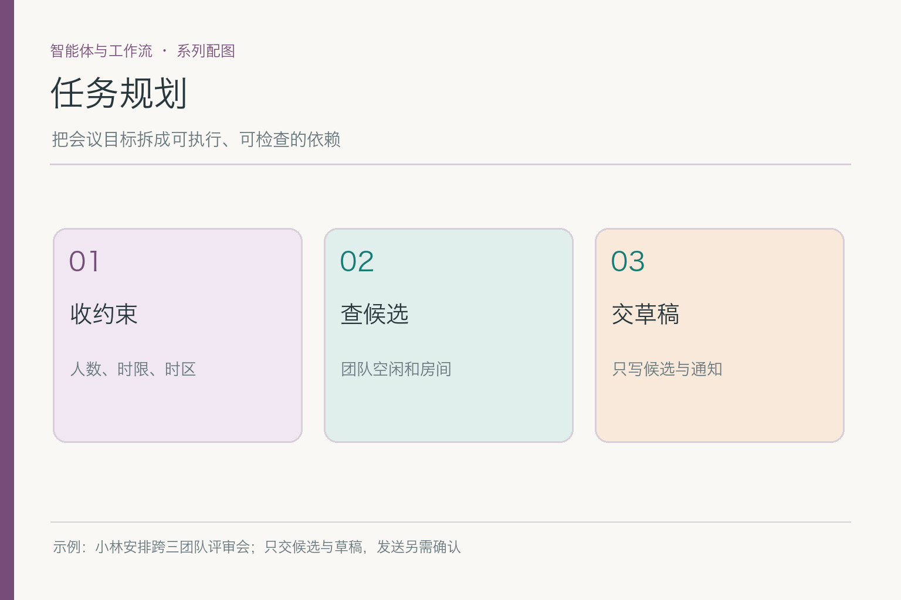
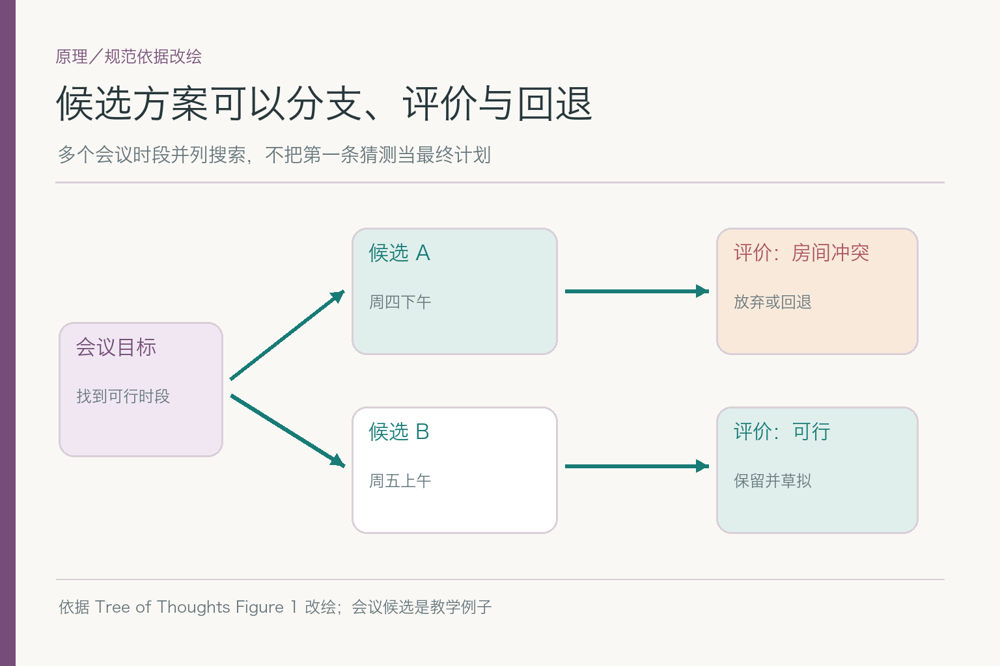
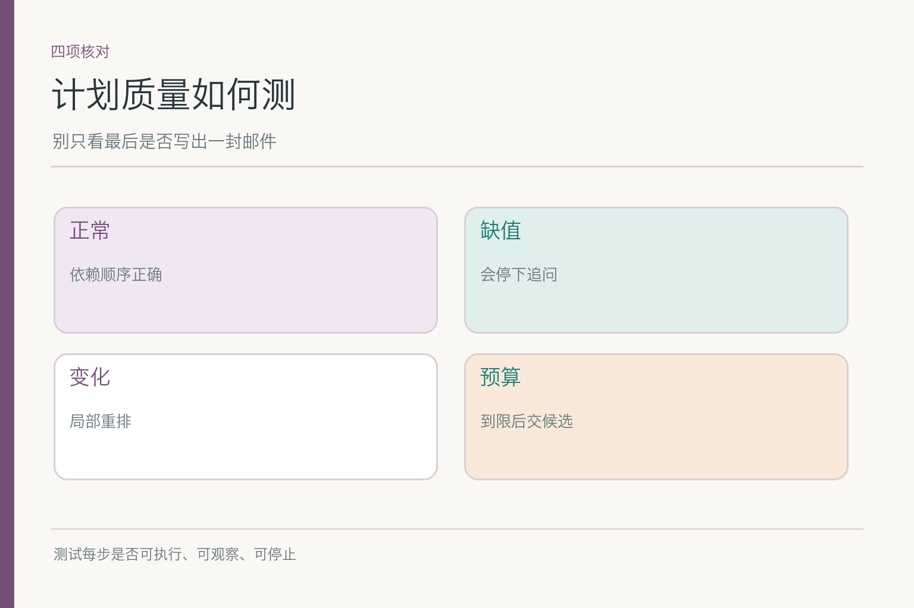

# 任务规划：一张会议待办清单为何还不够

项目入口：[AI Agent 知识图谱仓库](https://github.com/Jennifer123www/ai-agent-knowledge-map)。这一篇聚焦**目标如何拆成可执行、可检查的步骤与候选方案**。日历证据怎么判断已在前一篇讲过；模型或工具由谁接手是路由篇；每一圈状态如何转移则属于执行循环。

小林要下周跨研发、设计、运营开产品评审，找可用会议室，先看候选时间和邀请草稿，不发送。一个助手列出“查日历、查房间、写邀请”三项待办，看着像计划，却没说会议时长从哪来、房间要按哪个候选查、三组日历能否并行、周四房间被占后要改哪一步。**计划的价值在依赖与应变，不在待办条目的数量。**

## 一、从目标往回推，哪些结果必须成立

交付物是候选时间和邀请草稿。要让候选可行，至少需时间范围、时长、时区、三组空闲与同一时段的房间状态；要让草稿可用，需明确参会对象、议题和哪些信息仍待确认。小林尚未批准发送，所以“发送邀请”不能列入本轮自动执行步骤。

把每步写成可验收的子任务：收约束后应得到日期范围、时长和时区；查日历后应得到三组可用窗口及来源；查房间后应得到候选时段的房间状态；比较后应有成立与未成立条件；草拟后应有文字和待确认项。这样一来，任何一步返回空值都能被识别，而不是让模型继续写一个看似完成的结果。

拆得太细也有代价。把“读研发日历”拆成十几条小指令，会让控制开销超过任务本身；把“三组空闲并查房间”合成一步，又使失败时分不清哪项出错。合适的粒度是每步有明确输入、可观察输出和可独立处理的失败，既不靠长篇内心戏，也不把不同事实捆在一团。

## 二、依赖图比平铺清单多说了什么

会议时长与时间范围应先确认，因为它们影响空闲窗口的筛选；三组日历可并行查询；拿到少量候选后再查房间，避免把下周所有时段的房间都扫一遍；最后才能草拟一个不夸大进度的邀请。箭头表示“后一步需要前一步的结果”，不是每一步都要等上一句模型回复。

假设研发日历已经返回，设计日历还在查询，助手可以等两项并行结果，而不必让研发查询阻塞设计查询。若会议时长尚未明确，可以先拿粗略空闲交集，但不能执行“已确认房间可用”的判断。这些都是依赖约束，与你使用哪款模型无关。

依赖还包含业务边界。小林只要草稿，所以“发送”是一个需要以后单独授权的可选后续节点，不是当前任务图的最后一步。把它画在自动步骤里，即使实际暂未执行，也会让后续系统误以为只差一个技术按钮。计划的终点必须与用户指定的交付物一致。

## 三、候选时段为什么会形成搜索分支

周四 15:00 三组人员空闲，却没有房间；周五 10:00 有房间，运营组未回复。两条候选都有部分证据，不能因为周四首先被发现就一路推进。计划可以保留多个候选并评估：周四换房间的成本如何，周五补运营确认是否更快；两条都不成立时再探索第三条。

*依据 [Tree of Thoughts](https://arxiv.org/abs/2305.10601) Figure 1 的分支搜索思想改绘；论文中的 thought 是语言中间步骤，这里将搜索思想用于会议方案，并非复刻论文的具体实验。*

图里的“候选 A、B”不是模型脑中不可见的念头，而是业务上可核的时间方案。ToT 提醒我们，复杂问题可探索多个中间路径、评价后保留或回退；但不意味着任何会议都要跑昂贵的树搜索。若三个团队只有一个共同空档，一条确定性查询链就够；候选多、限制多时，分支比较才值回成本。

评价也不要用“模型觉得 B 更好”收场。可比较缺口数、要补的证据、时间是否接近小林偏好、房间容量、最晚确认时间。它们不是同一权重，优先级应由任务要求或用户选择决定；一个模型自行捏的综合分，不应盖住“运营未确认”这种硬缺口。

## 四、房间被占之后，应重排哪一段

周四房间被占，说明该房间在该时段不可用，并不抹掉三组人员空闲的事实。可以局部重排：查另一间满足人数要求的房间；若都不可用，再比较周五候选或向小林问是否能改地点。把前面所有日历查询从头重做，可能增加费用和延迟；但如果日历结果已经过期，也不能为了省钱固守旧证据。

重排之前先定位失败原因。房间服务返回“已占用”是业务冲突，改房间或改时间；返回超时是服务问题，有限重试或暂停；参数缺人数是计划输入不足，补人数后再查。这三种故障若都用“换个候选时段”处理，可能重复落入同一错误。计划不是只会另列一条清单，还要知道**什么结果使哪条依赖失效**。

当小林后来把会议改到下周三，日期范围变了，旧空闲和房间结果也许全部失效；这时局部重排不够，需要重新查。可复用的是目标和角色边界，不是所有事实。重排的范围要与变化影响的范围相配。

## 五、计划可执行，还要能停下和等人

有些步骤存在明确的人为依赖。周五运营还没回复，计划可以列“向运营确认空闲”并停在等待；不能让模型代替运营答“应该有空”。若小林没有授权读运营日历，计划也不能写“想办法换工具读取”，而应改为让有权限的人补信息。

高风险动作要放在计划外或设成显式关卡。此轮只交邀请草稿，因此“发送”不会因为前面子任务全部打勾就自动触发。若小林以后批准某版邀请，系统才创建新的发送步骤，并在执行前复核房间和人员状态。业务计划与执行许可是两件事：**可规划某动作，不等于此刻被允许执行。**

每个步骤还应有失败出口。日历不可用时，给小林已有候选和缺口；会议室全部占用时，询问可否线上开会或调整日期；预算耗尽时，交出当前最有希望的备选，而非一句“处理中”。让计划有终止和交接条件，才能避免它越写越长、任务却迟迟没进展。

## 六、预算为什么会影响搜索策略

假设下周有几十个空闲窗口，逐个查询房间会很慢。可以先用小林的日期偏好、三团队交集和会议时长筛出少量候选，再查房间；若最优候选缺一个易补信息，可暂时保留，不必立刻穷举所有时间。预算包括工具次数、模型调用、用户等待和过时风险，不只是 token 数。

搜索停止条件也要具体：找到一个满足硬约束、可供小林确认的候选就可以交付；若只找到半成立方案，就明确缺口；若连续查询没有扩大可行集合，改为追问。停止不等于“再也找不到更好时间”，而是当前成本与收益下已达到交付要求。

拿周四和周五比较：若周四还有两间可查的房间，可以再试一两次；若本楼会议室全满，就该尽快转向周五。若运营确认要等两天，而小林急需草稿，可给带“待运营确认”的周五草稿。**预算让计划知道什么时候探索，什么时候把决定交回人。**

## 七、固定流程与动态计划怎么共存

多数公司会议有稳定步骤：收时长、查空闲、核房间、给草稿。这些可以是固定骨架。模型只在骨架内部决定先比较哪几个时段、冲突后补哪项资料。这样既保留处理变化的弹性，又让关键关口容易测试。

如果所有会议都有严格的房间审批顺序，就不该让模型自己发明替代流程；如果小林的会议完全远程，骨架里的“查会议室”可以跳过，但要有可解释的条件。固定骨架不意味着每个任务都机械跑满，动态计划也不意味着无视业务流程。判断变化范围，才知道哪块适合谁控制。

计划还应避免与路由混淆。“先确认时长，再查空闲”是依赖；“查空闲用日历服务还是向负责人提问”是路由。后面若切换了日历供应商，不必重写任务依赖；若用户增加一支团队，计划要增补核对对象。分清问题，改动才能落在正确的位置。

## 八、怎样验收计划本身，而不只看最后邮件

构造四种样本：正常三团队和房间可用；缺会议时长或运营空闲；周四房间在计划执行途中被占；工具预算用尽。每一例检查子任务是否有正确依赖、是否调用了不必要的工具、变化后重排了哪些节点、最后是草稿、追问还是安全停止。

评测时可以把计划拆成一张小表：步骤、所需输入、预期产物、失败出口。比如“查周四房间”必须先有候选时段和人数；若返回占用，产物不是“已找到房间”，而是一条明确冲突及可继续尝试的备选。这样审查者能指出哪个节点设计错了，不必等整封邀请草稿写完才发现房间根本不存在。

再看并行是否用在合适的地方。三组日历在权限允许时可以同时查，但“根据三组结果确定交集”必须等必要返回；房间查询可以对少数候选并行，不能不设上限扫完整栋楼。计划的好坏不仅看有没有箭头，也看箭头是否把真正的依赖和可并行的部分区分开。全部串行会慢，全部并行又可能浪费调用。

房间占用后的测试尤其要留意**局部重排**：如果周四三组人员仍空闲，只需重新找周四其他房间或换候选时段；不应把已核对的人员日历当成从未查过。当然，若日历结果已经过期，还要重新确认。能说清哪些资料继续有效、哪些节点必须重做，比每次从第一步重来更像一个会工作的计划。

只看“最后有没有一封邮件”会把无效计划藏起来：系统可能查了几十次房间才碰巧找到一间，或者在没有运营空闲证据时写出漂亮草稿。应统计计划可执行率、无效依赖、冗余查询、局部重排成功率和用户等待时间，并标明样本数。对一次失败，还要看错误首次出现在拆分、依赖、搜索还是资料更新。

最终，小林收到的是一两条有明确缺口的候选，而不是一张永远写不完的待办清单。好的计划让每步能做、做完能验、失败能改、达到目标能停。它不要求模型预知所有突发情况，却要求变化来了以后别再机械走旧路线。

项目总览、图解和配套面试题见 [AI Agent 知识图谱仓库](https://github.com/Jennifer123www/ai-agent-knowledge-map)。

## 参考资料

- [Tree of Thoughts: Deliberate Problem Solving with Large Language Models](https://arxiv.org/abs/2305.10601)
- [Anthropic: Building effective agents](https://www.anthropic.com/engineering/building-effective-agents)
