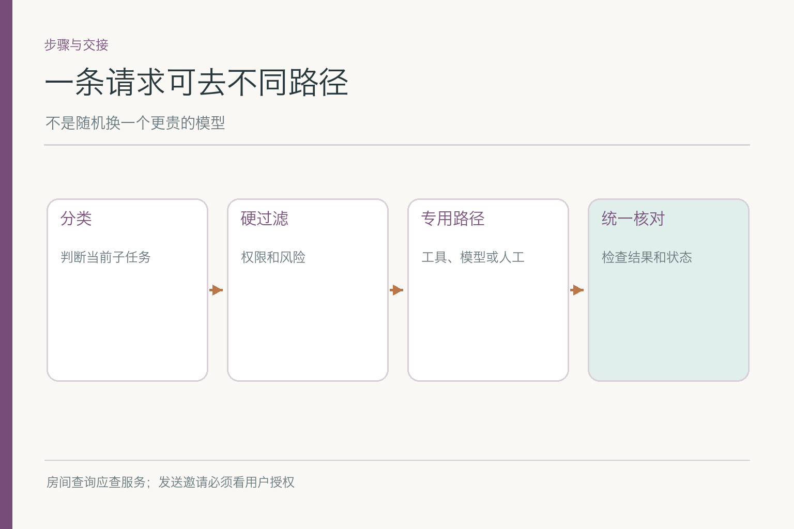

# 面试题：这一步该交给模型、工具还是人

项目入口：[AI Agent 知识图谱仓库](https://github.com/Jennifer123www/ai-agent-knowledge-map)。本篇只讨论**当前子任务走哪条处理路径**。计划图的先后依赖和执行循环的状态重试由相邻文章回答，避免把同一组题换个名字再讲一遍。

共用案例：小林要跨研发、设计、运营的下周评审会候选时间、可用房间和邀请草稿，暂不发送。周四三组人空闲但房间被占，周五房间可用但运营未回。系统能访问日历服务、会议室服务、不同成本的语言模型，以及小林的人工确认入口。

## 问题 1：路由器应从当前请求提取哪些特征？

### 原理

路由面对的是“这一步需要什么能力”，而不是给整场会议永久贴“复杂任务”标签。查询实时空闲、比较候选、写邀请、批准发送，输入与风险各不同。至少要看任务类型、时效、权限、风险、时限和可用服务。

### 答题点

1. 查询事实还是生成文字，决定是否必须访问外部服务；
2. 参会日历与房间的权限范围先于候选评分；
3. 外部发送风险高于草稿，必须考虑确认状态；
4. 当前时限与服务健康度影响是否等待或降级。

例如“运营周五有空吗”指向获准的日历或负责人，不是语言模型；“把邀请写得更简洁”可交给模型，不必重跑全部会议室查询。特征若只剩文本关键词，就很难分辨同一个“安排”下的不同动作。

### 记忆点

> 先识别这一步缺的是事实、文字还是授权。

### 常见追问

“要让模型自己提取特征吗？”可用于模糊意图，但权限、确认和风险等级由程序可核信息约束。

### 失分点

只按用户一句话的长度决定用哪个模型。

## 问题 2：硬规则与模型分类该怎样分工？

### 原理

权限和不可越过的动作限制应先硬过滤；模糊语义、任务类别可用规则或模型分类。若模型把“请给草稿”误分为“可以发送”，硬约束仍应挡住动作。分类器选候选处理路径，不负责创造许可。

*依据 [Anthropic: Building effective agents](https://www.anthropic.com/engineering/building-effective-agents) 的 Routing 工作流改绘，加入本例的硬过滤与回退。*

### 答题点

1. 未获准日历与未批准发送，直接排除对应路径；
2. “查空闲”与“写草稿”可由分类器分到专用处理；
3. 保留选路原因与可解释回退，便于查误分流；
4. 低置信或混合意图可拆步或追问，不强制只选一条路。

### 记忆点

> 硬门先关，软选择再排队。

### 常见追问

“所有路由都用 if-else 不更稳吗？”对稳定且少量类别可以；开放语言意图多时可能需要分类，但不因此把硬权限也交给模型。

### 失分点

让分类分数高的路径覆盖权限拒绝。

## 问题 3：日历、房间、模型、人工路径怎样选？

### 原理

不同路径产生不同类型的结果。日历回答人员忙闲，房间服务回答场地状态，模型起草并比较，人工给授权或补无法读取的信息。模型可以帮助决定下一步，但不能替这些来源生成它们本该提供的事实。

### 答题点

1. 周四三组是否空闲：查获准日历；
2. 周四房间是否可用：查房间服务；
3. 两个候选怎么向小林解释：模型或规则加模板；
4. 最终发邀请：小林具体批准后才走发送路径。

回答时顺带说明路径是按步骤选的。一次会议任务会多次经过不同处理者，不能因为最初识别为“会议安排”就让一个模型包办所有事实与动作。

### 记忆点

> 事实问来源，文字问模型，许可问人。

### 常见追问

“运营日历没权限怎么办？”请有权限的人确认或标未知，不能换一个未经授权的数据源继续读。

### 失分点

把强模型当成实时日历和批准人的替代品。

## 问题 4：质量、成本和时延如何一起比较？

### 原理

单次模型价格不是端到端成本。错误路由可能造成重试、误导用户或人工返工；最贵模型也未必能解决没有工具证据的问题。先满足硬约束与任务质量，再在可行路径中比较时延和费用。

### 答题点

1. 对简单文案可试低成本路径，对复杂冲突可能需要更强理解；
2. 对实时事实必须访问来源，不拿模型预测抵消工具缺失；
3. 比较全任务调用次数、用户等待和人工接手成本；
4. 分风险级别设目标，高风险误路由不能用平均成本收益抵消。

举例：轻量模型写“周五候选，运营待确认”已足够，换强模型未必增加价值；日历服务 500 毫秒返回真实空闲，比任何模型即刻猜出一个错误空闲更划算。质量并非文风一个维度，还包括事实和动作边界。

### 记忆点

> 先可用、再可靠，最后比快慢与费用。

### 常见追问

“贵模型一定更准吗？”要用本场景分组评测；即便生成更好，也不替代实时工具。

### 失分点

只报每次请求的 token 费用，不看错路后的返工。

## 问题 5：误路由怎样定位，如何区分下游错误？

### 原理

查房间任务若被送给纯文本模型，是路由错误；若正确去了房间服务，返回占用后却仍写“已预订”，故障出在证据利用或状态更新。两类错误最终看起来相似，修复点不同。

### 答题点

1. 查看当前步骤的特征与分类结果；
2. 记录被选路径、被排除路径及原因；
3. 对照真实工具调用与返回；
4. 找错误首次出现层，再决定修分类、工具或后续判断。

不要把“周四仍被推荐”直接归咎于路由。也许路由正确，只是房间返回丢在了上下文外；也许工具查询用错了时区。沿轨迹分段排查，比笼统换模型更节省试错时间。

### 记忆点

> 看这步去了哪里，再看回来之后谁用错。

### 常见追问

“路由器分类准确率高就够吗？”不够，少量高风险误分流也可能造成擅发或越权；按类别、风险与后果报告。

### 失分点

把最终答案错误全算到路由器头上。

## 问题 6：日历服务不可用时，合理回退是什么？

### 原理

回退要保留事实边界。服务超时意味着空闲未知，不意味着“按历史日程通常有空”。可以把已有候选标为待核、稍后重查或转人工补信息；不能为维持一个漂亮的推荐结果而编造数据。

### 答题点

1. 识别超时、权限拒绝和明确占用三种不同结果；
2. 超时可有限重试，权限拒绝不可绕道读取；
3. 给小林现有证据与缺口，草稿保持未发送；
4. 服务恢复后重新核时间和版本，再继续。

若房间服务不可用，也能给“人员可行、房间未核”的草稿。任务降级后交付范围变窄，产品界面要跟着说清楚；不能让用户看见“推荐周四会议室 A”，而后端实际从未查到 A。

### 记忆点

> 退路可以少做，不能假做。

### 常见追问

“备用 API 可用就直接切吗？”只有当权限、数据语义和来源可靠性都相符；不能因备用接口没校验就钻空子。

### 失分点

工具失败后让模型凭经验生成一个确定空闲时间。

## 问题 7：人工节点该在什么时候被路由到？

### 原理

人工不是所有异常的垃圾桶，而是承接用户授权、责任判断和系统无法核实的事实。周四换房间可由助手继续；运营空闲无权读取时可找负责人；发送邀请则需小林批准具体版本。

### 答题点

1. 明确人工要回答的问题，不发一个笼统的“请处理”；
2. 交接已核信息、缺口、候选版本和截止时间；
3. 授权对象与动作对应，批准换时间不等于批准发送；
4. 人工未回复前进入等待状态，不暗自采取外部动作。

如果小林在手机上看到周五草稿并点击批准，系统还得核对这是否是当前最新候选。房间可能刚被占，旧批准不能自动覆盖新事实。人工节点提供责任和授权，不会让其他条件自动变真。

### 记忆点

> 把具体问题交给具体的人，别把流程全甩过去。

### 常见追问

“人工越多越安全吗？”未必。无谓审批会拖慢低风险草稿，真正高风险动作仍可能因流程含糊而漏审。

### 失分点

把“交人工”当万能降级，没人知道要批准哪一版。

## 问题 8：路由专项评测应按什么维度分组？

### 原理

总体命中率容易掩盖高风险类别。要按查询、草拟、复杂冲突、发送、权限不足和服务失败分组，分别看选路、回退、成本和结果。固定相同任务输入与服务状态，才好比较不同路由策略。

### 答题点

1. 正常查询是否进入真实日历与房间工具；
2. 简单改文风是否免去不必要的重复查询；
3. 发送与越权请求是否被硬规则挡住；
4. 超时后是否安全退回并准确告知状态。

统计误分流率之外，还要看过度转人工、延迟和额外费用。假设某路由策略把 99 个草稿都处理得很快，却在 1 个发送请求上越权，平均分可能仍漂亮；按风险拆开，问题立刻显现。

面试时可设置一对近似请求：“请润色邀请草稿”和“请把邀请发出去”。关键词都包含邀请，但前者只需文字生成，后者必须先核用户确认与发送权限。若路由器把两条都交给同一自动发送路径，风险不是分类准确率低几个百分点，而是动作边界错了。应单列高风险请求的错误路由次数。

再制造两种不同故障：日历服务不可用，模型生成服务不可用。前者没有实时空闲事实，不能用语言模型猜出运营是否有空；后者可以保留已经查到的空闲和房间结果，稍后补草稿。正确退路应因缺失能力而不同。把故障一股脑写成“转人工”也能避免部分错误，却可能让系统失去本来可以完成的低风险工作。

路由评测还要看路径交接的状态是否完整。分类器选对了房间服务，但没有带会议时长，服务可能返回看似可用的短空档；人工确认节点被选中，却没有展示周五运营未知，用户也无法作出知情判断。路由正确只是第一步，输入、输出和未决条件在路径切换处完整，才有端到端收益。

### 记忆点

> 先分任务和风险，再看分流成绩。

### 常见追问

“路线准确率高，但端到端不升反降？”查工具时延、重复调用和路径之间的状态交接；路由正确不代表整链路最优。

### 失分点

用一个平均准确率宣称路由安全可靠。

项目总览、图解和配套主文见 [AI Agent 知识图谱仓库](https://github.com/Jennifer123www/ai-agent-knowledge-map)。

## 参考资料

- [Anthropic: Building effective agents](https://www.anthropic.com/engineering/building-effective-agents)
- [Anthropic: Writing effective tools for agents](https://www.anthropic.com/engineering/writing-tools-for-agents)
