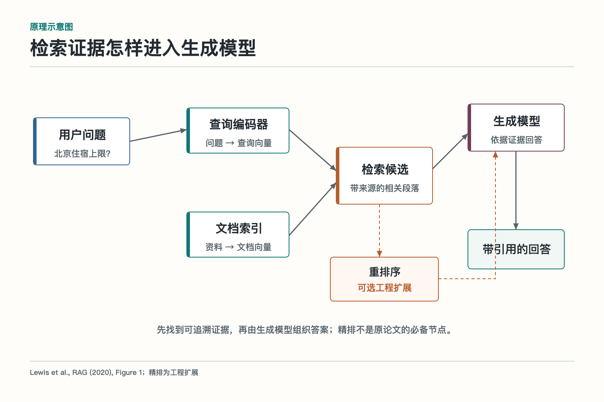

# 基础模型与推理：Agent 的五人技术小队

假设公司要做一个报销 Agent。员工拍一张发票，问：“这笔住宿费能不能报？如果能，帮我填进系统。”看起来只是一句话，背后却至少有五件事：读懂图片，理解问题，从制度库找到相关条款，挑出真正适用的证据，最后组织成清楚的答复。若公司还想让它长期稳定运行，就得再考虑模型如何适应固定格式、专业术语和成本要求。

把所有任务都塞给一个大语言模型，就像让一位文案同时负责验票、查档、审计和系统运维。偶尔能撑住，忙起来就容易把“写得像”误当成“做得对”。基础模型层更像一支分工明确的小队：大语言模型负责理解和生成，多模态模型负责看图听声，向量嵌入模型负责广泛召回，重排序模型负责细致筛选，模型适配负责把通用能力调到合适的工作状态。

## 基础模型层到底放在哪里

AI Agent 不是一个单独模型，而是一套能围绕目标持续获取信息、作出判断、调用工具并检查结果的系统。基础模型位于这套系统的认知底座：它把文本、图片、声音等输入转换成可计算的表示，再产出文字、向量、相关性分数或结构化参数。

它上面还有提示词、规划、记忆、工具调用、权限和工作流。它下面则依赖算力、模型服务、缓存与运行环境。基础模型回答的是“当前输入大概意味着什么、接下来可能生成什么、哪些资料更相近”；至于“能不能退款”“是否有权看这份合同”“写入数据库是否成功”，必须由业务规则、权限系统和真实工具确认。

这层最容易出现两种误会。第一种是把模型能力等同于整个 Agent 能力，模型答得漂亮就以为任务完成了。第二种是把模型当成实时数据库，仿佛参数里装着永远正确、永远最新的事实。前者忽略执行和验证，后者忽略知识更新和证据来源。

## 五类模型不是五个尺寸，而是五种工种

大语言模型，Large Language Model，简称 LLM，核心工作是根据已有 token（模型处理文本的小单位）预测下一个 token。它擅长理解指令、归纳材料、生成文本、代码和结构化调用意图。它是队里的“起草员”，表达能力强，但不会自动知道最新库存或刚更新的制度。

多模态模型能处理图像、文字、音频等多种信号。它通常先用专用编码器提取视觉或声音特征，再把这些特征接入语言模型。它像“观察员”，能从发票、截图、图表和语音里取信息，但小字、遮挡、复杂表格和精确坐标仍会让它犯难。

向量嵌入模型把文本或图片编码成一串数字，使语义相近的对象在向量空间里更接近。它是“资料员”，适合从海量内容中广泛找候选。它能发现“差旅住宿标准”和“出差住店限额”意思相近，却不能保证候选里的条款当前有效。

重排序模型接收一个查询和若干候选，逐条判断谁更相关，再重新排列。它是“复核员”，通常比向量相似度看得细，也更耗计算。它解决的是“候选里谁更值得读”，不负责替业务规则判断权限、生效日期和法律效力。

模型适配不是一种单独模型，而是一组让通用模型更符合任务的办法，包括提示词、检索增强、输出约束、监督微调、LoRA、量化训练和蒸馏。它像“教练和器材师”，先判断问题到底出在知识、行为、格式还是成本，再决定该换说明书、补资料、练专项，还是换一名更轻便的队员。

## 一次任务怎样穿过这支小队

*依据 Lewis 等人的 RAG 论文 Figure 1 改绘；“重排序”是常见工程扩展，不是原论文 Figure 1 的必备部件。*

仍以住宿报销为例。第一步，多模态模型读取发票上的酒店名、日期、金额和城市。第二步，大语言模型结合用户问题，把任务整理成“判断住宿标准并准备报销字段”。第三步，向量嵌入模型用“城市、职级、住宿限额”等语义去制度库广泛召回。第四步，重排序模型把当前问题和候选条款一起阅读，把真正回答“某职级在某城市限额”的条款排在前面。

第五步，大语言模型依据证据生成结论和待填字段。第六步并不属于基础模型：程序校验金额格式、制度生效时间、员工权限和必填项；若用户确认，再由报销工具写入系统。最后还要读取系统回执，确认单据真的创建成功，而不是模型礼貌地说一句“已经为您提交”。

这条链路不一定每次都要集齐五种能力。纯文本改写可能只需一个小型语言模型；关键词明确的短文档检索可能不必重排序；稳定的分类任务可以用专门小模型。架构不是集邮册，没必要为了“全栈”把每一枚邮票都贴上去。

## 推理不等于把答案想得很长

“推理”常被说得像模型脑内有一位小人在开会。工程上更实用的理解是：系统根据目标、当前状态、已有证据和工具结果，选择下一步，并产生可验证的中间产物。一次判断若缺少事实，就去检索；若缺少实时状态，就调用工具；若条件含糊，就追问；若风险过高，就停下来交给人。

长篇推理文字不天然更可靠。没有新证据时，模型反复自言自语只会把同一个猜测说得更像真的。生产系统更看重证据引用、结构化字段、工具回执、规则校验和停止条件。可观察、可复核的外部过程，比要求模型展示一大段无法核实的内部思路更有价值。

因此，基础模型提供判断能力，Agent 运行时负责组织循环，工具提供外部事实和动作，规则负责硬约束，评测负责检验结果。几者若混成一团，出错后只剩一句含糊的“模型不稳定”，工程师连该查哪一层都不知道。

## 选模型时看三角，不看排行榜单

模型选型至少要同时看质量、时延和成本，还要在三角中间放进任务风险。合同审查、医疗建议、资金操作容错低，可以接受更慢的模型、更严格的证据链和人工确认；邮件分类、标题生成、候选召回则更适合轻量模型和批处理。

质量也不能只用一个平均分表示。语言模型要看事实性、指令遵循、格式合规和工具参数；多模态模型要看小字、表格、遮挡和多页一致性；嵌入模型看相关资料能否进入前 K 个候选；重排序模型看真正相关的资料能否排到前面；适配版本还要检查旧能力是否退化。

时延要拆成首字延迟、完整生成时间、检索时间和外部工具等待。成本也不只是输入输出 token，还包括图片处理、向量索引、重排序计算、缓存、训练、评测和运维。一个单价便宜却经常重试的模型，最后可能既慢又贵，像打折买了双磨脚的鞋。

## 模型边界要靠系统接住

基础模型都有概率性。语言模型可能编造，多模态模型可能看错，嵌入模型可能召回“意思像但不适用”的资料，重排序模型可能被措辞吸引，适配模型可能在新任务上进步、在旧任务上退步。解决办法不是在提示词最后加一句“请务必正确”。

可靠系统会按风险设置多层接力：知识问题要求引用原文；数值和状态从权威工具读取；结构化字段使用模式校验；高风险动作需要权限和审批；低置信或输入不完整时允许追问和拒绝；外部服务失败时有超时、重试、缓存或安全停止。

模型输出最好带上来源、版本、置信信号和任务标识。这样线上出现“同一问题昨天能答、今天答错”时，能追到模型版本、检索索引、提示词、候选证据和工具结果，而不是靠大家围着截图猜谜。

## 从演示走到生产，需要一条发布闭环

第一步是建立代表性评测集，既有常见问题，也有边界、对抗、缺失信息和高风险样本。第二步固定基线，把模型、提示、索引、重排序策略和规则版本一起记录。第三步离线比较候选方案，不只看正确率，也看延迟、成本、拒答和失败类型。

通过离线门槛后，再做影子流量或小比例灰度。新模型可以先观察真实输入而不执行真实动作，再逐步扩大范围。线上监控要按任务类型、客户、语言和模型版本分组；只看总平均值，局部故障很容易被健康流量淹没。

回退也要提前设计。生成模型不可用时可切换较小模型并限制任务；重排序服务失败时可退回召回顺序，但应降低置信并减少自动决策；实时状态无法确认时，高风险写操作应停止。降级不是“反正给个答案”，而是在能力变弱时缩小承诺。

## 接下来怎样下钻

理解这张总图后，可以按任务链继续读。先看大语言模型，弄清 token 预测、注意力、上下文和采样；再看多模态模型，理解图片和声音怎样进入语言推理；接着看向量嵌入和重排序，分别掌握“广泛找”和“认真挑”；最后看模型适配，学习什么时候该改提示、补检索、做微调或蒸馏。

记住一条朴素的判断：生成模型负责把话说出来，感知模型负责把非文本看明白，嵌入模型负责找候选，重排序模型负责挑证据，适配方法负责让整套能力更贴合任务。真正的 Agent 还要把这些结果交给规则、工具和人去验证。模型可以聪明，系统必须清醒。

## 机制加餐：同一任务不必永远走同一条模型链

生产流量里，问题难度差异很大。员工只问“报销入口在哪”，关键词搜索或小模型就能处理；上传模糊发票并询问跨地区标准，才需要多模态、检索、重排序和更强语言模型。可以先用规则识别输入模态、任务风险和精确编号，再由轻量分类器判断复杂度，最后选择合适链路。

动态链路必须可观察。系统要记录跳过了哪一层、为什么升级强模型、哪个阈值触发人工复核。否则成本下降了，团队却不知道哪些问题被悄悄简化。还要防止路由器成为新的单点错误：它若把高风险问题错分为普通问答，后面的模型再优秀也无济于事。

因此路由本身需要评测，既看分类准确，也看最终质量、升级率和节省成本。对临界任务可采用保守策略，让小模型只负责初步识别，不直接作出不可逆决定。整套基础模型层不是固定流水线，而是一组有门槛、有回退、有记录的能力组合。

还有一条容易忽略：同一个业务目标可以有多条合格路径。选型时应保留简单基线，用真实数据证明复杂链路确实值得，而不是把架构图画满后才去寻找理由。

## 参考资料

- [Attention Is All You Need](https://arxiv.org/abs/1706.03762)
- [Stanford Center for Research on Foundation Models：Foundation Model Report](https://crfm.stanford.edu/report.html)
- [Retrieval-Augmented Generation for Knowledge-Intensive NLP Tasks](https://arxiv.org/abs/2005.11401)
- [MTEB：Massive Text Embedding Benchmark](https://arxiv.org/abs/2210.07316)
