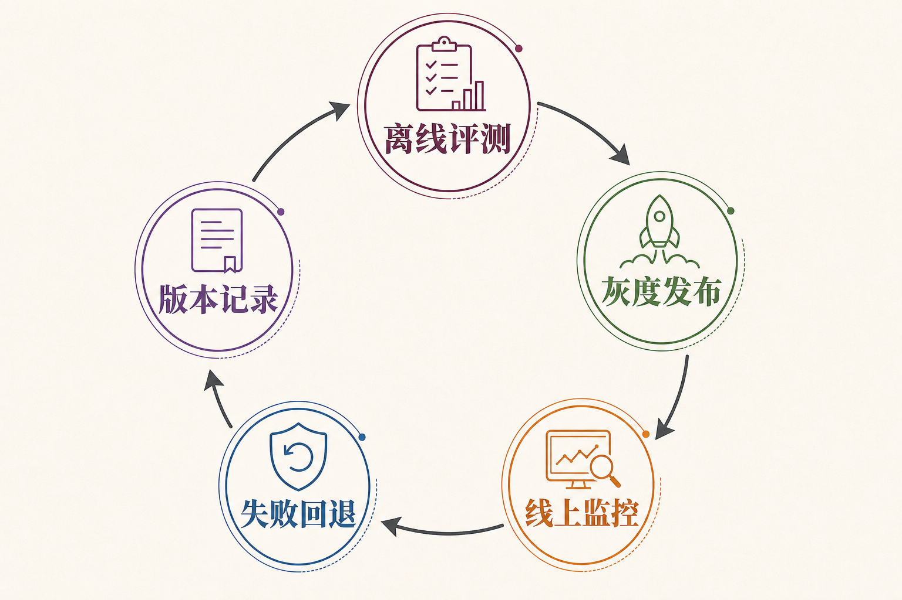

# 面试题：基础模型组合怎样支撑 Agent

这一组题不要求在总览里推导注意力公式，也不抢先展开 LoRA、近邻索引或交叉编码器。面试官更想确认：你能否把不同模型放到正确位置，能否从用户输入一直讲到可验证结果，能否说明质量、时延、成本和风险怎样共同影响方案。

## 问题 1：为什么 AI Agent 往往需要多种模型，而不是只用一个大语言模型？

### 原理

不同模型的训练目标和计算方式不同。生成模型擅长理解与表达，多模态模型负责非文本感知，嵌入模型高效召回候选，重排序模型精细比较，适配方法则让通用能力更符合具体任务。一个模型可以兼顾若干能力，但不代表它在精度、吞吐和成本上都合算。

### 答题点

1. 先按任务拆出生成、感知、检索、排序和适配，不按厂商产品名拆架构；
2. 把批量、可预计算的工作交给嵌入等轻量模型，把细致判断留给更贵的模型；
3. 让规则和工具承接实时事实、权限和副作用，模型不包办全部责任；
4. 每种模型分别评测，再用端到端任务完成率检查组合效果。

### 记忆点

> 按工作分模型，按风险分责任。

### 追问

模型越多是否越好？不是。多一层就多一段延迟、依赖和版本组合。只有当专用模型能带来可测量的质量、成本或治理收益时才值得引入。

### 失分点

只说“术业有专攻”，却说不出各模型的输入、输出和替代关系；或者把模型拆分误答成“多智能体协作”。

## 问题 2：生成、召回和重排序在一条链路里怎样分工？

### 原理

召回追求不漏掉可能相关的资料，重排序追求把真正相关的证据放到前面，生成负责根据问题和证据组织答案。三者优化目标不同：召回看覆盖，排序看顺序，生成看答案质量与引用一致性。

### 答题点

1. 查询先经过必要的改写和权限过滤，再进入关键词或向量召回；
2. 对候选做去重、版本和生效范围过滤，然后由重排序精排；
3. 只把少量高质量证据交给生成模型，要求引用来源并遵守输出格式；
4. 分别记录候选、排序分数和最终引用，才能定位答案错误发生在哪一段。

### 记忆点

> 召回怕漏，排序怕乱，生成怕编。

### 追问

为什么不能直接把全部资料塞给长上下文模型？资料过多会增加成本和延迟，噪声会稀释关键信息，权限与版本问题也不会因窗口变长而消失。

### 失分点

把嵌入模型说成答案生成器，或把重排序分数说成事实可信度。

## 问题 3：怎样设计一个从图片输入到业务动作的模型链路？

### 原理

模型链路必须把感知、理解、证据、决策和执行拆开。图片内容先被识别成结构化字段，文本模型结合目标判断需要什么证据，检索模型寻找依据，最后由确定性程序验证参数并调用业务工具。

### 答题点

1. 原始图片、OCR 文字、版面坐标和文件标识分别保存，避免只留一段摘要；
2. 关键字段附上来源区域和置信信息，低置信字段进入复核；
3. 检索证据按用户身份、时间和业务范围过滤，生成结论必须引用；
4. 写操作由工具层重新做权限、格式、幂等和状态校验，并读取权威回执。

### 记忆点

> 先看清，再找证据，最后才动手。

### 追问

识别金额与系统金额不一致怎么办？冻结写入，展示原图区域、识别值和系统值，请用户或审核人确认，不能让语言模型自行“取一个看起来合理的数”。

### 失分点

从“模型识别图片”直接跳到“自动提交”，缺少字段来源、业务规则、授权和结果确认。

## 问题 4：基础模型组合怎样做统一评测？

### 原理

统一评测既要看每个组件的局部能力，也要看最终任务是否完成。局部指标帮助定位问题，端到端指标帮助避免“每段都不错，合起来却不好用”。评测集还要覆盖常见、边界、对抗和高风险任务。

### 答题点

1. 语言模型评测事实性、指令遵循、格式和工具参数；
2. 多模态评测字段、区域、小字、表格和多页一致性；
3. 检索链路分别看 Recall@K、MRR、NDCG、引用正确率和证据覆盖；
4. 端到端看任务完成、人工接管、错误副作用、时延和单任务成本。

### 记忆点

> 局部指标找病灶，端到端指标看病人。

### 追问

线上点赞率能否作为主要指标？不能单独使用。它容易受表达风格影响，还可能鼓励迎合。应与事实依据、任务结果、安全事件和业务指标共同观察。

### 失分点

只报一个“准确率”，不说明样本、评分标准、分层维度和失败类型。

## 问题 5：模型选型怎样权衡质量、时延和成本？

### 原理

没有脱离任务风险的最优模型。高风险、低频任务可接受更强模型和更长验证链；高频、低风险任务更看重吞吐和单位成本。选型要用真实任务分布测量，而不是只看公开排行榜。

### 答题点

1. 先定义最低质量与安全门槛，再在达标方案中比较成本和延迟；
2. 拆分首字延迟、完整时延、检索时延和工具等待，找真正瓶颈；
3. 按输入长度、图片数量、输出长度、重试率计算单任务总成本；
4. 对不同任务、语言和风险等级分别选型，避免一个模型包打天下。

### 记忆点

> 先过门槛，再算账；成本按任务算，不按单价猜。

### 追问

小模型质量略低还能用吗？若它在明确低风险任务上通过门槛，并有校验、回退和监控，就可以；若错误会产生不可逆副作用，不能只因便宜就上线。

### 失分点

只比较每百万词元价格，忽略重试、长上下文、图片、检索和人工复核成本。

## 问题 6：怎样做模型路由和降级？

### 原理

路由根据任务类型、风险、输入模态、上下文长度和服务状态选择能力；降级是在能力受限时缩小任务承诺。两者都应由可解释策略控制，不能完全交给模型自由决定。

### 答题点

1. 先用规则识别硬条件，如图片输入、超长上下文、敏感领域和写操作；
2. 再根据历史质量、成本、延迟和当前健康状态选择模型；
3. 降级时明确哪些能力关闭、哪些结果只供参考、哪些任务必须停止；
4. 记录路由原因、候选模型、实际版本和回退结果，便于复盘。

### 记忆点

> 路由选合适能力，降级缩小承诺。

### 追问

强模型超时后直接切小模型可以吗？低风险生成可以；高风险判断要确认小模型是否通过同类任务门槛，否则应返回暂不可用或转人工。

### 失分点

把降级理解成“换一个模型继续答”，不区分读任务、写任务和不可逆动作。

## 问题 7：模型和检索组件怎样做版本发布与回滚？

### 原理

一次答案由模型、提示词、检索索引、重排序、规则和工具共同产生。只记录模型名称无法复现结果。发布需要完整版本清单、离线回归、灰度观察和明确回滚条件。

### 答题点

1. 为模型、提示、嵌入版本、索引快照、排序器和规则建立组合版本；
2. 在固定评测集上与当前基线对比，并保留失败样本；
3. 先影子运行或小流量灰度，按任务类型观察质量、延迟和安全；
4. 提前准备旧模型、旧索引和旧契约的可用回退路径。

### 记忆点

> 发布的是一套组合，不是一串模型名。

### 追问

嵌入模型升级为什么常要重建索引？新旧向量空间通常不可直接比较，查询用新模型、文档仍是旧向量会造成不可预测的召回退化。

### 失分点

只说“做 A/B 测试”，没有流量隔离、版本绑定、指标和回滚阈值。

## 问题 8：线上答案变差时，怎样定位是哪种模型出了问题？

### 原理

需要用统一任务标识串起输入、模型版本、候选证据、排序结果、生成输出、工具调用和最终结果。排障顺序应从权威事实向上游回查，先确认真实结果，再判断感知、召回、排序或生成哪一段偏离。

### 答题点

1. 先确认输入是否完整、权限和业务数据是否变化；
2. 检查多模态提取字段与原图，检查召回是否包含正确证据；
3. 若正确证据已召回，检查排序位置、上下文拼装和生成引用；
4. 对比最近的模型、索引、提示和规则发布，按相同样本复现并回滚验证。

### 记忆点

> 沿证据链逐段查，不要一上来怪大模型。

### 追问

同一问题偶发错误怎么办？固定随机设置只能部分复现，还要保存当次候选、参数、版本和外部状态；概率输出需用多次运行和失败率衡量。

### 失分点

把所有异常统称为幻觉，既不看输入，也不看检索、规则和工具回执。

## 问题 9：什么时候应该删除一个模型组件，而不是继续优化它？

### 原理

模型组件会增加延迟、成本、依赖、版本组合和排障难度。若某一层在真实任务上没有稳定增益，或其收益能被更简单的规则、索引或小模型替代，就应考虑移除。架构质量不以框的数量计算。

### 答题点

1. 用消融实验比较有无该组件时的端到端质量、成本和失败率；
2. 检查它是否只在极少数样本有效，能否改为按需路由；
3. 评估维护负担，包括版本、监控、容量和故障恢复；
4. 删除前保留回退开关和基线，灰度验证没有隐藏依赖。

### 记忆点

> 每多一层都要交维护费，增益不够就别续租。

### 追问

重排序只提升少量指标，要不要保留？要看提升是否落在高价值或高风险任务，以及增加多少延迟。可只对复杂查询启用，而不是全量调用。

### 失分点

把“用了更多模型”当作先进性证据，不做消融与端到端验证。

## 问题 10：怎样向业务方解释模型能力边界？

### 原理

边界说明不能停在“模型可能出错”。应把任务按信息来源、风险和动作类型拆开，明确哪些可自动完成，哪些需要证据，哪些必须人工确认，并给出失败时系统会怎样表现。

### 答题点

1. 用具体任务和错误后果说明，而不是罗列技术免责声明；
2. 区分建议、草稿、只读查询和真实写操作；
3. 展示引用、置信信号、审批和回退路径；
4. 用评测数据说明适用范围，并定期更新边界。

### 记忆点

> 边界不是一句“仅供参考”，而是一套可执行的承诺范围。

### 追问

业务方坚持全自动怎么办？给出误操作成本、评测缺口与分阶段方案；先自动处理低风险高置信任务，再用数据决定是否扩大范围。

### 失分点

只强调模型很强或模型不可靠，没有把风险转成流程与指标。

回答到这里，应能让听者知道系统在哪些条件下会继续、停止或交给人，而不是只记住一句笼统风险提示。

## 参考资料

- [Attention Is All You Need](https://arxiv.org/abs/1706.03762)
- [Stanford Center for Research on Foundation Models：Foundation Model Report](https://crfm.stanford.edu/report.html)
- [MTEB：Massive Text Embedding Benchmark](https://arxiv.org/abs/2210.07316)
- [BERT Passage Re-ranking](https://arxiv.org/abs/1901.04085)
