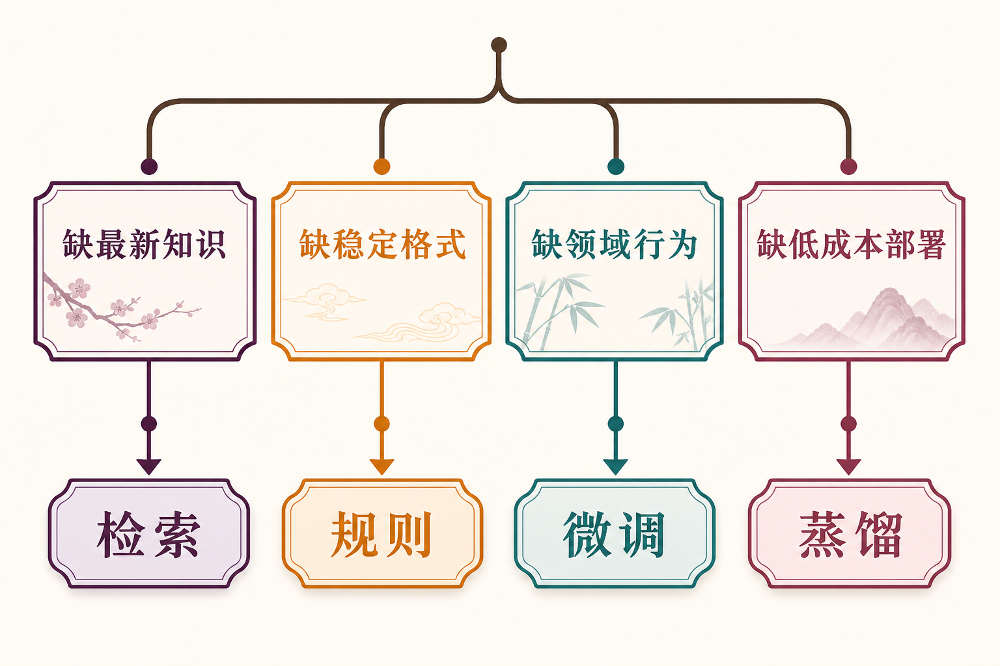
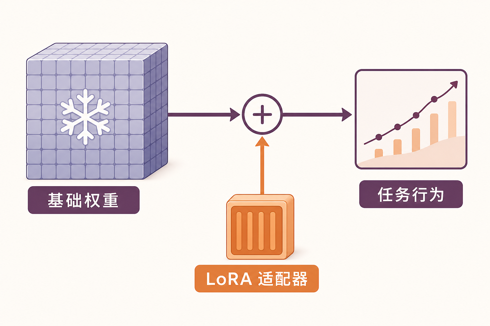
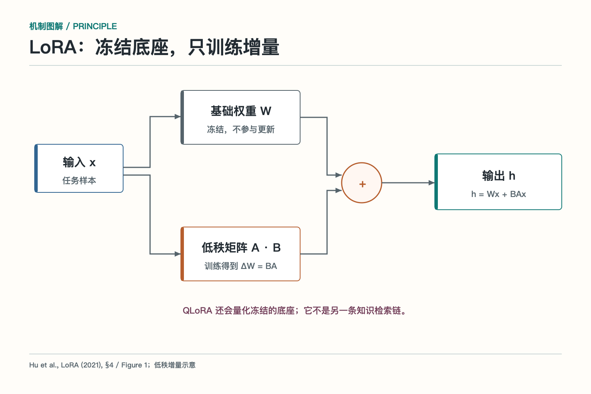
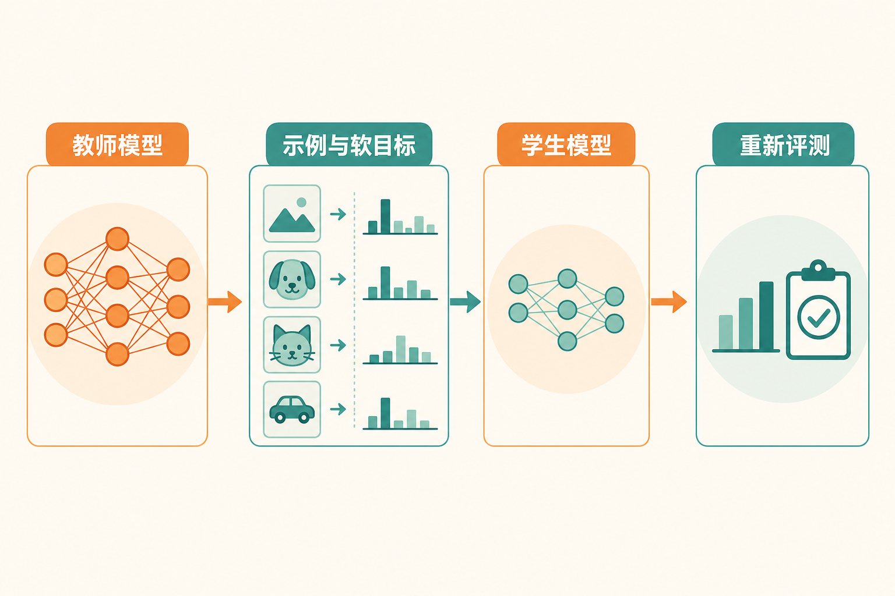
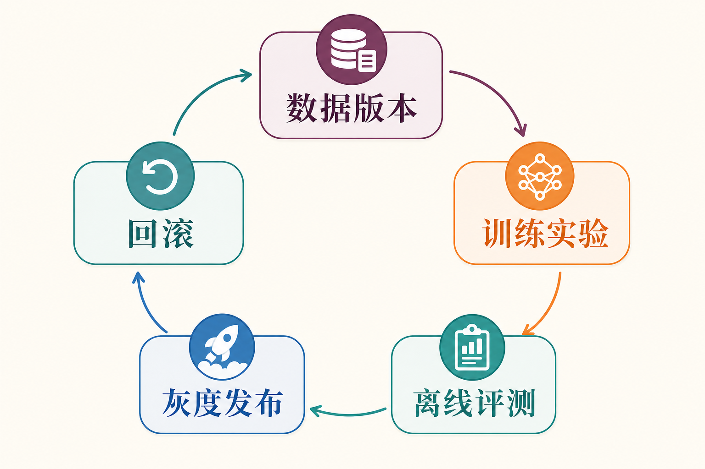

# 大话模型适配：先找病因，再决定怎么改

一个客服模型总把退款政策答错，团队第一反应常是：“要不微调一下？”这像看到电脑卡顿就重装系统，动作很大，病因未必对。政策每周更新，问题可能是知识没检索到；输出字段不稳定，可能是结构约束不足；语气不统一，才更像行为模式需要训练。

模型适配，Model Adaptation，是让通用模型更符合具体任务的一组方法。它从轻到重包括提示词、少量示例、检索增强、规则与结构化输出、监督微调、参数高效微调、量化训练和知识蒸馏。选择方法之前，先问一句：模型到底缺什么？

## 先区分缺知识、缺行为、缺格式还是缺预算

缺最新知识时，优先用检索或工具。公司政策、库存、价格和订单状态不断变化，把它们训练进参数既慢又难更新，也无法自然给出来源。缺明确格式时，先用 Schema、规则和示例；让模型学习“金额必须大于零”不如程序直接校验。

缺稳定行为时，微调更有价值，例如固定分类体系、领域表达、特定风格或重复决策模式。缺低成本部署时，可以考虑蒸馏、量化或更小专用模型。一个问题可能同时包含几种缺口，应分层解决，而不是让微调背下全部制度、格式和权限。

判断病因需要失败样本。把错误按知识缺失、理解错误、格式错误、拒答错误、工具选择和执行错误分类，再看哪类占比最高。没有失败分类就直接训练，往往得到一个更自信地重复旧错误的新模型。

## 提示、检索和规则是三种轻量适配

提示词适合明确任务、角色、约束、步骤和输出格式。少量示例能展示边界与风格，尤其适合分类和转换任务。提示调整快、易回滚，但上下文过长会增加成本，复杂规则也容易互相冲突。

检索增强把外部资料按需放进上下文，适合变化快、需要引用的知识。它的挑战在文档解析、召回、排序和证据使用，不能把检索质量问题归咎于基础模型。规则适合金额范围、字段类型、权限和业务状态等确定条件，优点是可解释、可测试。

三者经常配合：提示说明任务，检索提供事实，规则兜住硬边界。若这套组合已达到质量门槛，就没有必要为了显得“模型味更浓”而引入训练流水线。工程价值来自稳定交付，不来自训练日志有多热闹。

## 监督微调改变的是行为分布

监督微调，Supervised Fine-Tuning，简称 SFT，使用“输入—理想输出”样本继续训练模型，让它更倾向于产生目标行为。它可用于领域分类、专业格式、固定语气、特定工具选择方式和任务步骤。

训练样本必须代表真实任务，包含正常、边界、拒答和容易混淆的情况。若数据全是完美短问题，模型上线面对含糊输入就没有学过如何追问。若理想输出本身有错误或风格混乱，模型会认真继承这些毛病。

微调不是给模型装一个可靠数据库。模型可能记住训练事实，却不保证精确提取、及时更新或说明来源。需要频繁变化的知识仍应外置，训练更适合塑造稳定行为。两者边界分清，模型更新和知识更新才能各走各的发布节奏。

## LoRA 与 QLoRA 为什么更省资源

*依据 Hu 等人的 LoRA 论文第 4 节与 Figure 1 改绘。*

全量微调会更新大量模型参数，训练和存储成本高。LoRA，Low-Rank Adaptation，中文常译作低秩适配，会冻结基础权重，只在指定层训练较小的低秩矩阵，形成一个增量适配器。部署时可加载适配器，也可在某些场景合并到基础模型。

QLoRA 进一步以低比特量化形式保存冻结的基础模型，同时训练 LoRA 适配器，降低显存门槛。它解决的是“怎样用较少资源训练”，并不自动解决数据质量、目标定义和评测。显存省下来，错误标签仍会原封不动地教给模型。

秩、目标层、学习率和训练轮次都会影响结果。适配器太小可能学不够，训练过度可能破坏通用能力。多任务、多租户使用多个适配器时，还要管理基础模型兼容、加载时延、显存占用和版本路由。

## 蒸馏是把能力搬给更小的学生

知识蒸馏让较强的教师模型为较小的学生模型提供训练信号。信号可以是标签、答案、概率分布、偏好或经过筛选的过程示例。目标是让学生在特定任务上保留足够能力，同时降低推理成本和延迟。

蒸馏不是把教师完整复制一份。学生容量有限，通常会丢失长尾知识、复杂推理或跨领域泛化。若教师输出带偏差，学生还可能把偏差浓缩得更稳定。因此训练数据要混合真实标注、教师生成和难例，并对学生独立评测。

适合蒸馏的任务往往边界清楚、调用量大、输出可验证，例如分类、路由、信息抽取和短格式生成。对于需求频繁变化、样本稀少的复杂任务，维护学生模型的成本可能超过节省的调用费。

## 训练数据决定适配上限

数据首先要合法可用，明确授权、隐私和保留范围。接着要去重、纠错、统一格式，并保留数据来源和版本。重复样本会让模型过度偏向某些表达，错误答案会被当作标准，敏感信息可能被模型记忆或在日志中泄露。

数据分布要贴近线上。除了成功案例，还应包含拒答、追问、工具失败和冲突证据。分类任务要关注长尾类别，生成任务要关注事实与格式，工具任务要包含参数不完整和权限不足。只收集“模型最会做的题”，评测看起来很好，上线像带着答案参加错考场。

训练集、验证集和测试集需要按来源与时间合理切分，避免近重复泄漏。若同一客户模板只是换了姓名就分别进入训练和测试，分数会虚高。高风险样本应有人复核，自动生成数据要标明教师模型和提示版本。

## 适配也会带来遗忘与过拟合

模型在新任务上变好，可能在旧能力上退化，这常被称为灾难性遗忘。数据太窄、训练过久或学习率不合适，都可能让模型过度贴合新样本。一个学会公司口吻的模型，若突然不会处理普通指令，这份“企业文化”代价有点大。

缓解方法包括混入通用或旧任务数据、使用参数高效微调、控制训练强度，并建立覆盖原能力的回归集。对多个适配器，还要测试它们与基础模型版本、量化配置和推理框架的组合。

过拟合不只表现为测试分数下降。模型可能机械复述训练模板，对稍换措辞的问题失败；可能记住训练中的敏感片段；也可能在未知问题上过度自信。评测要加入改写、对抗、长尾和分布外样本。

## 从训练完成到生产发布

每个适配版本应绑定基础模型、数据集、训练代码、超参数、适配器文件、提示词和评测报告。没有这张清单，线上发现问题时很难判断是数据、训练、部署还是上下文变化。

发布前先做离线回归，包括目标任务、旧能力、安全、拒答、格式和成本。然后影子运行或小流量灰度，观察真实分布中的质量、延迟和资源。达到阈值再逐步放量，异常时可以切回旧适配器和旧基础模型。

模型适配的重点不是“我们也训练过模型”，而是用最小必要改动解决明确问题。缺知识就补证据，缺格式就加约束，缺稳定行为再训练，缺成本再压缩。先找病因，才不会拿着微调这把锤子，看见每个问题都像钉子。

## 机制加餐：不只有 LoRA，一张适配方法地图

全量微调会更新全部或大部分模型参数，容量最大，资源和版本成本也最高。参数高效微调除了 LoRA，还有 Adapter、Prefix Tuning、Prompt Tuning 等路线。Adapter 在网络层间加入小型可训练模块；Prefix Tuning 学习可插入注意力计算的连续前缀；Prompt Tuning 则学习一组连续提示向量。它们都试图少改底座、多保存任务差异。

这些方法没有脱离任务的统一冠军。数据量、模型规模、是否需要多任务切换、部署框架支持和质量门槛都会影响选择。若推理平台不支持动态加载适配器，再漂亮的训练结果也可能难以上线。若一个服务同时加载几十个租户适配器，还要考虑显存驻留、切换抖动和请求路由。

偏好对齐也属于行为适配的一部分。团队可以收集成对偏好，训练奖励或直接优化模型更倾向于某类回答。但“用户更喜欢”不等于“答案更正确”，偏好数据可能奖励礼貌、长度或迎合。事实、安全和任务完成指标必须独立保留，不能让点赞率成为唯一老师。

持续训练还会遇到数据闭环。线上失败样本可以回流，但要先分清模型错误、检索错误和工具错误。若把因旧制度召回导致的错误答案直接拿去微调，模型可能学会在没有证据时背诵一个暂时正确的结论，知识一更新又失效。先修上游，再决定哪些行为值得训练。

适配项目的成本也要算全。除了 GPU 时间，还有数据清洗、标注、实验追踪、评测、部署兼容和长期回归。若一个提示模板半天就能达到门槛，维护一条训练流水线未必划算；若每天调用数百万次，蒸馏和专用小模型的长期收益才可能覆盖前期投入。

实验管理要让每次变化可归因。一次只改变数据、超参数或基础模型中的少数因素，并保留基线；否则分数涨了，也不知道是哪项改动起作用。训练日志、随机种子、代码版本和硬件环境应随产物保存，至少能重建关键实验。

安全评测不能等到最后补。训练数据可能教会模型回答原本应拒绝的问题，也可能让它过度拒绝正常业务。需要同时准备越权、敏感信息、提示注入、危险动作和正常边界样本。某个适配版本若目标任务提高，却让安全边界显著退化，就不能靠平均分掩盖。

模型退役也属于生命周期。业务结束、数据许可到期、基础模型停止维护或新版本全面替代时，要下线适配器、清理缓存与副本、保存必要审计记录，并更新路由。训练产物不是放进对象存储就永远不管的纪念品。

团队还应维护模型卡或等价说明，记录用途、非适用场景、数据概况、评测结果与已知限制。它不是装饰文档，而是发布审批、调用方选型和事故排查的共同依据。

每次发布都要更新。

这样，适配就从一次训练实验变成一项可追踪的工程资产。

## 参考资料

- [LoRA：Low-Rank Adaptation of Large Language Models](https://arxiv.org/abs/2106.09685)
- [QLoRA：Efficient Finetuning of Quantized LLMs](https://arxiv.org/abs/2305.14314)
- [DistilBERT](https://arxiv.org/abs/1910.01108)
- [Hugging Face PEFT Documentation](https://huggingface.co/docs/peft/index)
