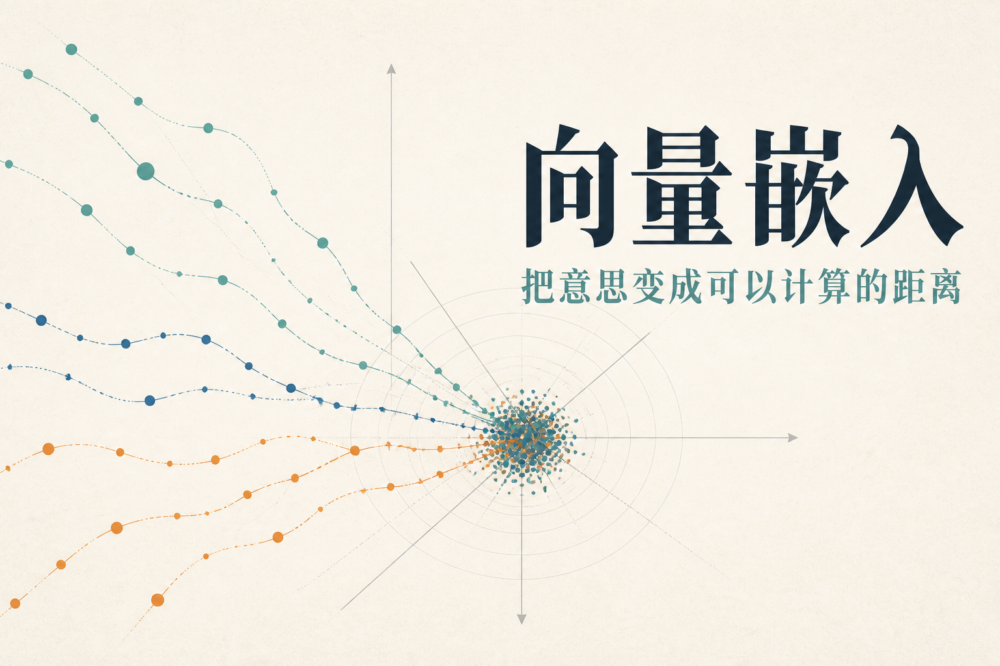
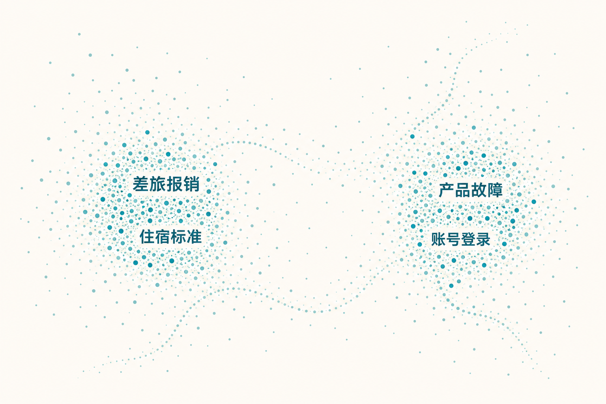
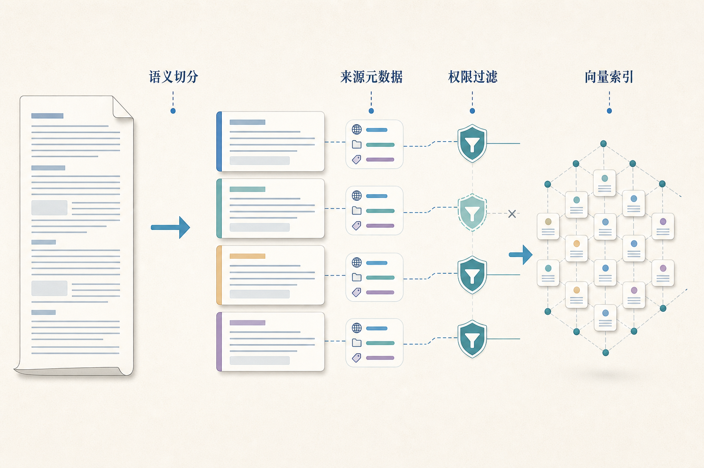

# 大话向量嵌入：让机器按意思找资料

员工搜索“出差住酒店最多能报多少”，制度标题却叫“差旅住宿费限额”。如果系统只按字面匹配，“酒店”碰不到“住宿”，“最多能报多少”也碰不到“限额”。向量嵌入要解决的，就是让机器发现不同说法背后的相近意思。

Embedding Model，中文通常叫向量嵌入模型。它把一句话、一段文档或一张图片编码成一串数字。数字本身没人会拿来晨读，它们的价值在于形成一个可比较的空间：意思相近的内容距离较近，主题不同的内容距离较远。

## 向量像语义世界里的坐标

现实地图用经纬度表示位置，向量空间用几十、几百甚至更多维数字表示对象特征。我们无法像看二维地图那样直接看懂每个维度，但可以计算两个向量的相似程度。“住宿报销上限”和“酒店费用标准”可能靠得很近，“账号无法登录”则会落到另一个主题区域。

模型通过对比学习等训练方法，让相关文本靠近、不相关文本远离。训练样本可能是问题与答案、标题与正文、相似句子或带相关性标注的文本。不同模型的训练语言、领域、最大输入长度和目标不同，因此没有一个嵌入模型在所有业务里都最好。

向量表达的是训练目标下的相似性，不是客观真理。两段制度都谈住宿，语义会很近，但一份可能已废止，另一份只适用于海外员工。时间、权限和适用范围需要元数据与规则处理，不能指望几何距离顺手包办。

## 查询和文档怎样在同一空间相遇

常见检索采用双塔结构：查询由一个编码路径变成查询向量，文档由相同或配套编码路径提前变成文档向量。线上收到问题后，只需计算一次查询向量，再到索引中寻找最近的文档向量。文档向量可以预先计算，所以面对百万级资料也有较好吞吐。

有些模型要求查询和文档使用不同前缀或输入格式，例如明确标记“查询”和“段落”。忽略这些约定，模型虽然还能输出数字，检索质量却可能悄悄下降。接入时应遵守模型说明，并把预处理、归一化和版本记录下来。

双塔高效的原因，也是它的局限：查询和文档各自独立编码，无法在每个 token 层面共同阅读。它适合广泛召回，不一定能分清细微条件。于是检索系统常采用“两阶段”：向量先从海量资料找几十个候选，再由重排序模型认真比较。

## 相似度究竟怎么算

余弦相似度比较两个向量方向，点积同时受方向和长度影响，欧氏距离衡量直线距离。若向量已经归一化，余弦与点积排序可能等价；若没有归一化，直接替换度量会改变结果。使用哪种方式应遵循模型训练和索引配置，不能看名字顺眼就切换。

分数也没有跨模型的统一含义。0.82 在一个模型里可能很好，在另一个模型里只是普通候选。阈值应在自己的标注集上选择，并按任务类型观察。搜索“退款规则”和搜索“订单 12345 状态”的分数分布完全可能不同。

更重要的是，相似度不等于答案置信度。一个问题与某段话很像，只表示值得继续阅读；这段话可能错误、过期或没有真正回答条件。检索结果还要经过元数据过滤、重排序和生成引用检查。

## 文档切分决定模型能找到什么

长文档不能总作为一个向量存入。整本制度只生成一个向量，会把多个主题平均在一起；切得太碎，又可能把定义、条件和例外拆开。更合适的做法是优先按标题、段落、条款、问答和表格结构切分，超长单元再按自然边界拆开。

每个片段应带上文档名、章节、页码、生效日期、部门、权限和版本等元数据。查询时先按用户身份和业务范围过滤，再做向量搜索，避免无权内容进入候选。片段还可保留父标题与少量相邻上下文，让模型知道这句话属于哪一章。

重叠并非越多越安全。少量重叠能避免句子被边界切断，过多重叠会产生重复候选、增加存储和上下文噪声。切分策略应通过召回评测调整，而不是固定“每 500 字切一次”就宣布毕业。

## 近邻索引怎样让搜索跑得动

逐个比较百万向量很准确，却太慢。向量数据库通常使用近似最近邻索引，在少量精度损失下快速找到接近候选。HNSW 通过图结构在邻居间跳转，倒排文件类方法会先把向量分到若干区域，再搜索相关区域。具体参数影响召回、内存、构建时间和查询速度。

索引不是“建一次永久用”。文档新增、删除、权限变化和模型升级都要同步处理。删除内容若只从业务库移除、向量仍在索引里，系统可能继续召回。索引健康需要监控数据量、更新时间、构建失败和查询分布。

向量数据库也不是知识库的同义词。知识库包含原文、版本、权限和治理；向量索引只是其中一种检索结构。把唯一原文塞进向量库又丢掉来源，会让后续引用、删除和审计都变得麻烦。

## 为什么还要保留关键词检索

语义检索擅长同义表达，关键词检索擅长精确标识。产品型号、订单号、法规条款号、人名和错误码，往往按字面匹配更可靠。混合检索把两者的候选或分数融合，可以同时兼顾“意思像”和“字面准”。

融合前要做字段与权限过滤，融合后还要去重和重排序。若一个段落同时被两种检索命中，不应简单复制两份占满上下文。不同来源的分数范围也不一致，直接相加可能让某一边长期占优势，需要归一化、排名融合或用标注数据学习组合。

查询改写也要谨慎。把口语问题扩展成多个检索表达可以提高召回，但不能偷偷改变限定条件。用户问“北京四级员工住宿标准”，改写时丢掉“四级员工”，召回再丰富也走偏了。

## 嵌入模型升级为何会牵动整个索引

不同嵌入模型通常产生不同维度和不同语义空间。文档用旧模型编码、查询换成新模型，向量不再处于同一坐标系，距离失去稳定意义。因此升级通常需要重新计算文档向量，并建立新索引。

稳妥做法是双索引并行：旧索引继续服务，新索引用同一批评测问题回放，比较召回质量、时延和成本；通过门槛后逐步切流。回滚期间保留旧模型和旧索引，查询不能随机跨两个空间。

迁移还要考虑缓存。查询向量缓存、检索结果缓存和片段 ID 都应包含模型与索引版本。否则切换后命中旧缓存，看起来像新模型表现异常，实际上是旧结果还没下班。

## 怎样知道召回做得好不好

先建立“问题—相关资料”标注集。Recall@K 表示前 K 个候选是否覆盖了相关资料，是召回阶段最常用的指标之一。若一个问题有多份必要证据，还要看覆盖比例，而不是找到其中一份就算完成。也可观察精确率、平均排名和不同主题的失败分布。

评测集要包含同义表达、缩写、错别字、精确编号、否定条件、时间条件和容易混淆的难负样本。难负样本指主题很像却不能回答当前问题的资料，它们最能暴露模型是否只看表面语义。

线上还要看空结果率、点击或引用、后续重排序变化、权限过滤比例和索引新鲜度。召回高不代表最终答案好，但召回漏掉正确证据，后面再强的生成模型也只能对着错误材料认真发挥。

向量嵌入的价值不在于把文字变成神秘数字，而在于让系统能大规模按语义找候选。把切分、元数据、关键词、索引版本和评测一起做好，它才是一位靠谱的资料员，而不是一个只会说“这两段挺像”的数字罗盘。

## 机制加餐：难负样本决定模型会不会分辨“很像但不对”

训练嵌入模型时，正样本告诉它哪些查询和资料应该靠近，负样本告诉它哪些应该远离。随机抽取的负样本往往太简单：询问住宿制度时拿“打印机维修手册”作反例，模型不用认真学习也能分开。真正有价值的是难负样本，它们主题相似，却在地区、角色、时间或条件上不适用。

例如查询是“北京四级员工住宿标准”，难负样本可以是“北京三级员工标准”“上海四级员工标准”或“去年北京四级标准”。这些样本逼模型关注限定条件，而不是只看到“北京、员工、住宿”几个词就给高分。难负样本可以从现有检索误召回、人工纠正和相邻版本文档中挖掘。

多语言场景还要注意语言空间是否真正对齐。一个模型声称支持中文和英文，不等于中英文检索质量相同。应准备跨语言查询、混合语言专有名词和本地业务缩写，分别评测。必要时对查询进行语言识别和规范化，但不能翻译掉产品型号与条款编号。

查询与文档的写法也不对称。查询通常短、口语化，文档通常长、正式。有些模型使用专门查询前缀或为两侧采用不同训练目标。接入时忽略这些说明，会让向量可以生成、质量却不达标。对话式问题还应把必要指代补全，例如把“那它能报多少”改写成带实体的检索查询，同时保留原始限定。

最后要避免把用户反馈直接当真值。点击第一条可能只是因为它排在第一，未点击不代表不相关。日志可用于发现候选难例，但高价值训练样本仍需去位置偏差、去重复并由人核验。嵌入模型学到的是样本里的相似规则，样本若只奖励热门结果，它也会越来越偏爱热门结果。

图像与文本也可以进入共同向量空间，用文字搜索图片或用图片找相似商品。这类跨模态嵌入仍要评测颜色、文字、物体和风格分别占多大影响。用户搜“带红色警示标识的设备图”时，主题相似却没有红色标识的图片就是难负样本。

向量还常用于聚类、去重和推荐，但指标要随任务变化。去重更关心近似内容是否被正确合并，聚类关心主题结构，推荐还会受到流行度和反馈闭环影响。不要因为都叫“算相似度”，就把同一个阈值复制到所有用途。

每一种用途都应保留独立评测集和阈值配置。

否则一个场景的“相似”结论，很容易误伤另一个场景的判断。

## 参考资料

- [Sentence-BERT](https://arxiv.org/abs/1908.10084)
- [MTEB：Massive Text Embedding Benchmark](https://arxiv.org/abs/2210.07316)
- [FAISS：A Library for Efficient Similarity Search](https://arxiv.org/abs/1702.08734)
- [OpenAI Embeddings Guide](https://platform.openai.com/docs/guides/embeddings)
