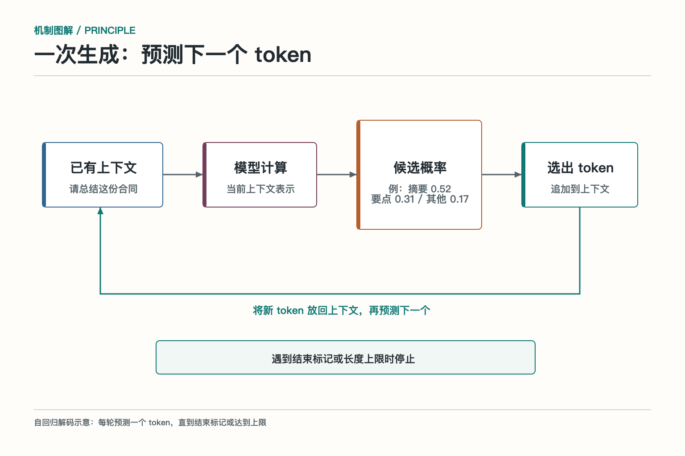
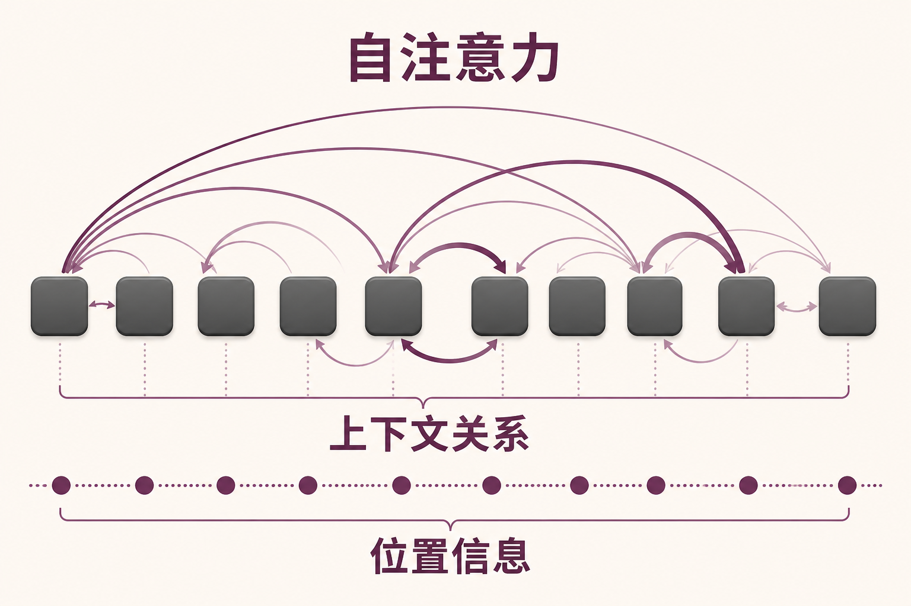
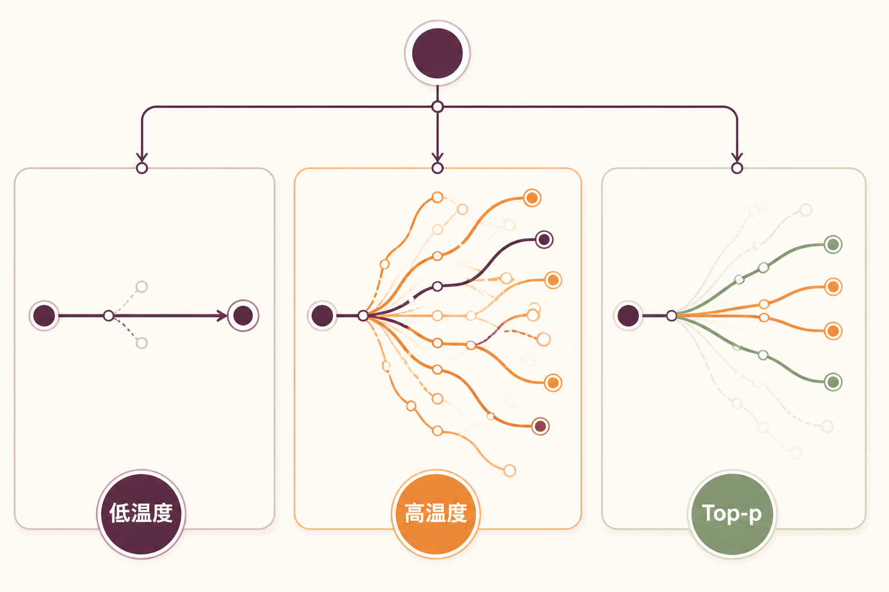
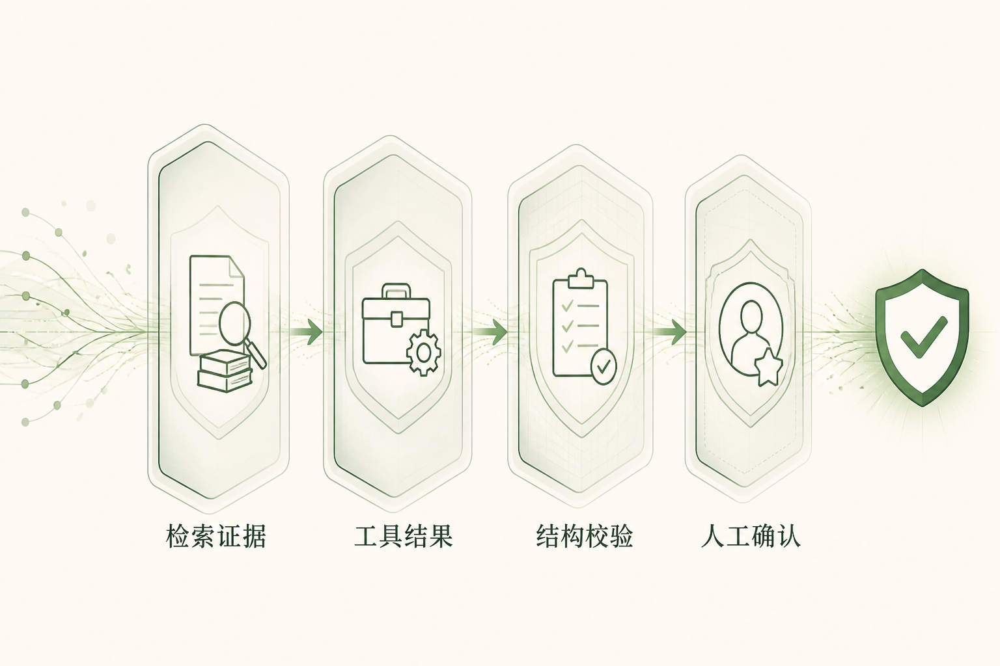

# 大话大语言模型：它为什么能一句接一句

想象一场规模离谱的接龙比赛。主持人说：“出门前记得带……”参赛者会根据见过的大量句子，猜后面可能是“伞”“钥匙”或“手机”。大语言模型做的事与此相似，只不过它读过更多材料、参数更多、计算更复杂，而且每生成一个小单位，就把它接回前文继续猜。

这个“小单位”叫 `token`，是模型处理文本时使用的单位。**一个 `token` 不一定等于一个汉字或一个英文单词**，也可能是常见词、标点或更小的片段。模型并不是先在脑中写好整篇文章再一次吐出来，而是在每一步计算下一个 `token` 的概率，再按规则选一个，循环往复。会写故事、会改代码、会列计划，都从这个看似朴素的目标长出来。

## 先把文字切成模型能处理的积木

人看到一句话，通常会按词和句子去理解；模型则要先把文字拆成自己能计算的片段。这个过程叫**分词**，拆出来的片段叫 `token`。一个 `token` 可能是一个字、一个常见词，也可能只是词的一部分或一个标点。分词器再把每个 `token` 换成编号，模型据此查找对应的向量表示。可以把 `token` 理解成模型读写文本时用的“积木”，但不同模型使用的积木尺寸并不一样。

**分词方式会直接影响上下文长度和费用。**同一句话，中文、英文、代码或表格的切法可能不同；产品写“支持一万字”，并不等于模型真的能稳定处理一万字，实际还要看分出来多少 `token`。连续数字、网址、代码和少见的专有名词，往往会被拆成更多片段，因此更容易占用上下文，也更容易在精确任务上出错。

这也解释了模型的一些“怪脾气”：它可以大致理解一句话，却未必擅长逐字数数、倒着拼写，或比较很长的数字。模型看到的是一串片段和它们之间的统计关系，不是人眼看到的整齐字符。**金额计算交给计算器，字符校验交给程序，日期转换交给确定性函数**，通常比让模型凭感觉完成更可靠。

## 它怎样一步一步生成

模型读入当前上下文，输出一个概率分布：哪些 `token` 更可能排在下一位。系统从这个分布中选择一个 `token`，把它加入上下文，然后再次计算。遇到序列结束标记、长度上限或程序设定的停止条件，生成结束。

以**自回归语言模型**为例，训练时不断根据前文预测下一个 `token`，预测错了就调整参数。海量文本让它学到语法、风格、常见事实、代码结构和问题解法的统计模式。后来经过指令微调和偏好优化，它更会遵循问题、保持对话格式、拒绝部分危险请求。

这里有个重要边界：**预测“像正确答案的文本”与查询“权威数据库里的事实”不是一回事。**模型能把会议纪要写得很像，却不知道会议是否真的召开；能生成订单编号的格式，却不能确认某个编号是否存在。实时事实必须来自检索或工具。

## Transformer 为什么能看见上下文关系

现代大语言模型大多建立在 `Transformer` 架构上。它的重要机制叫**自注意力**（`self-attention`）。简单说，每个 `token` 在更新自己的表示时，会根据当前任务参考上下文中的其他 `token`。处理“苹果发布了新系统，它增加了隐私功能”时，“它”需要更多参考“新系统”，而不是水果苹果。

查询、键和值常被用来描述这套计算：当前 `token` 产生查询（`Query`），其他 `token` 提供用于匹配的键（`Key`）和用于汇总的信息值（`Value`）。匹配分数经过归一化后，决定不同位置的信息占多大权重。**多头注意力让模型同时计算多组关系**，有的捕捉语法，有的捕捉指代，有的捕捉局部结构。

注意力计算本身不包含词序，因此还要加入**位置信息**。网络经过许多层变换后，得到结合上下文的表示，再用于预测下一个 `token`。标准注意力的计算量和显存占用会随序列变长快速增长，这也是长上下文成本较高、需要优化注意力实现和缓存的重要原因。

## 上下文窗口大，不代表每一段都被认真读到

**上下文窗口**是一次推理能够容纳的 `token` 范围，通常包括系统指令、用户消息、历史对话、检索证据、工具结果和待生成内容。窗口变大，让模型能接收更长文档和更多历史，但**“放得下”不等于“用得好”**。

关键信息可能被大量重复材料淹没，位于长上下文中部的细节可能利用不足，不同证据还可能互相矛盾。若把十份过期制度和一份现行制度一起塞进去，模型不会因为窗口宽敞就自动成为档案管理员。上下文仍需要筛选、排序、去重、标注来源和生效时间。

良好的上下文像一张整理过的办公桌：任务、硬约束和输出格式放在醒目位置，相关证据附上清楚标签，无关材料不来占座。长对话还需要摘要和状态管理，但**摘要不能丢掉数字、例外条款和未完成动作**。

## 模型怎样从候选 token 中选出下一个

模型预测下一个 `token` 时，会先为所有候选计算分数，再把这些分数转换成概率。接下来究竟选哪一个，由**解码策略**决定。直接选择概率最高的候选，通常称为**贪心解码**（`greedy decoding`）；按照概率随机抽取，则属于**采样**（`sampling`）。前者更稳定，后者能带来更多变化，但两者都不能单独保证答案正确。

**温度**（`temperature`）会重新调整候选之间的概率差距。温度较低时，概率分布更集中，模型更容易选择原本就排在前面的候选；温度较高时，分布更平缓，原本概率较低的候选也更有机会被选中。**温度影响的是输出的稳定程度和多样性，不是“准确率”旋钮。**

`Top-k` 和 `Top-p` 则负责缩小候选范围。`Top-k` 只保留概率最高的 `k` 个 `token`；`Top-p` 会从概率最高的候选开始累加，保留累计概率达到阈值的最小集合，因此候选数量会随当前分布变化。不同模型服务对这些参数的支持和组合方式并不完全相同，使用时要以接口说明和实际评测为准。

信息抽取、工具参数和代码补丁通常更看重稳定性，但仍要配合结构校验和业务规则；创意写作或头脑风暴可以适当保留更多候选。即使温度设得很低，模型仍可能依据错误信息选出“最有可能”的错误答案。**采样参数控制的是怎样选，不负责判断候选背后的事实是否可靠。**

## 为什么它能流畅地答错

语言模型根据训练模式和当前上下文生成连贯内容，并不自带“这句话已经由权威来源核实”的开关。问题包含错误前提、证据不足、知识过期、长上下文冲突或工具失败时，它仍可能继续生成。这类**看似合理、实际缺少事实支持的内容**常被称为幻觉。

**幻觉不是靠一句“不要编造”就能清零。**系统要先区分任务：创意写作允许虚构，事实问答需要检索和引用，实时状态必须调用工具，高风险决策需要规则与人工。模型还应有承认不知道、请求补充和停止执行的路径。

评测时不能只看答案读起来顺不顺。要检查陈述是否由证据支持，引用是否真的包含对应结论，数字是否来自权威结果，工具参数是否有效。许多“模型错误”其实发生在上游：召回了旧文档、上下文拼错用户、工具返回被截断，最后由语言模型背了锅。

## 让输出能被程序接住

`Agent` 经常需要模型输出结构化数据，例如工具名称、参数、分类标签和下一步状态。仅在提示词里写“请返回 `JSON`”并不稳，模型可能多写解释、漏字段或使用错误枚举。更可靠的方式是使用服务提供的结构化输出或工具调用能力，并在执行前用**格式约束与业务规则双重校验**。

格式校验保证字段类型和必填项，业务校验保证数值范围、资源归属和当前状态。例如退款金额是数字并不代表允许退款；订单编号格式正确也不代表订单属于当前用户。**模型负责提出候选参数，程序负责决定是否执行。**

工具结果返回后，模型还要根据明确的成功、失败或部分完成状态继续处理。若只返回一段“操作完成”的自然语言，模型容易误判。结构化错误码、重试建议和权威结果，能让下一步判断更稳。

## 把大模型用好，靠的是系统闭环

**选模型时要用自己的任务评测。**测试问题应覆盖普通问答、长上下文、格式约束、拒答、工具选择、数字和边界条件。除了质量，还要记录首个 `token` 延迟、完整时延、输入输出 `token`、缓存命中、失败重试和并发吞吐。

工程上可以把简单任务交给小模型，把复杂或高风险任务升级到强模型；对重复的长前缀使用提示缓存；对固定分类使用批处理；对事实问题缩短生成，让模型把时间花在证据而不是铺陈上。优化之前先看 `Trace`，别一听“慢”就急着换模型，真正拖时间的可能是外部搜索。

大语言模型最像一位反应很快的起草员：读得多、写得快、能迁移，但也会在资料不全时硬着头皮写下去。给它清楚任务、精选上下文、可信工具、结构校验和停止条件，它才能从聊天高手变成 `Agent` 里可靠的一员。

## 机制加餐：KV Cache 为什么能让续写更快

生成第一个 `token` 时，模型要处理整段输入；生成第二个 `token` 时，前面的内容大多没有变化。如果每一步都从头计算所有注意力，会做大量重复工作。推理服务通常保存各层已经算出的 `Key` 和 `Value`，这份缓存叫 **`KV Cache`**。后续步骤只需为新 `token` 计算增量，再与缓存中的历史表示交互。

`KV Cache` 减少重复计算，却会占用显存，而且占用随上下文长度、批量和模型层数增长。长对话与高并发同时出现时，缓存可能成为容量瓶颈。服务端会采用分页管理、淘汰、量化或前缀共享等办法提高利用率，但这些优化要与模型实现匹配。

提示缓存与 `KV Cache` 相关却不完全相同。**提示缓存强调跨请求复用相同前缀**，例如稳定的系统指令和大段公共背景；是否命中、如何计费由服务实现决定。缓存键必须考虑模型版本和完整前缀，不能把带用户私有数据的缓存随意共享。

流式输出也常被误解。它让用户更早看到首个 `token`，改善等待感，却不会自动减少模型生成全部内容的工作量。若下游必须拿到完整 `JSON` 才能执行，流式展示带来的主要是体验收益，而不是端到端任务时延归零。

缓存还要面对失效。系统指令、工具列表或权限变化后，旧前缀不能继续复用；模型版本升级后，旧计算状态也不能跨版本搬运。多租户服务必须把身份与数据边界放进缓存策略，宁可少命中，也不能把别人的上下文省给你。

容量规划时应同时观察输入长度分布、输出长度分布和并发峰值。平均值很温柔，长尾请求却最会占显存。对超长输入可先检索或摘要，对超长输出设置任务级上限，并让用户分段获取结果。

还要区分**复用计算结果**与**复用最终答案**。事实会更新、权限会变化，直接缓存最终回答风险更高；复用模型计算也必须绑定相同输入和隔离范围。优化不能把旧答案包装成新推理。

缓存命中率上升，只有在质量和隔离不退化时才算真正的收益。

## 参考资料

- [Attention Is All You Need](https://arxiv.org/abs/1706.03762)
- [Language Models are Few-Shot Learners](https://arxiv.org/abs/2005.14165)
- [Lost in the Middle：How Language Models Use Long Contexts](https://arxiv.org/abs/2307.03172)
- [OpenAI Cookbook：How to count tokens with tiktoken](https://cookbook.openai.com/examples/how_to_count_tokens_with_tiktoken)
