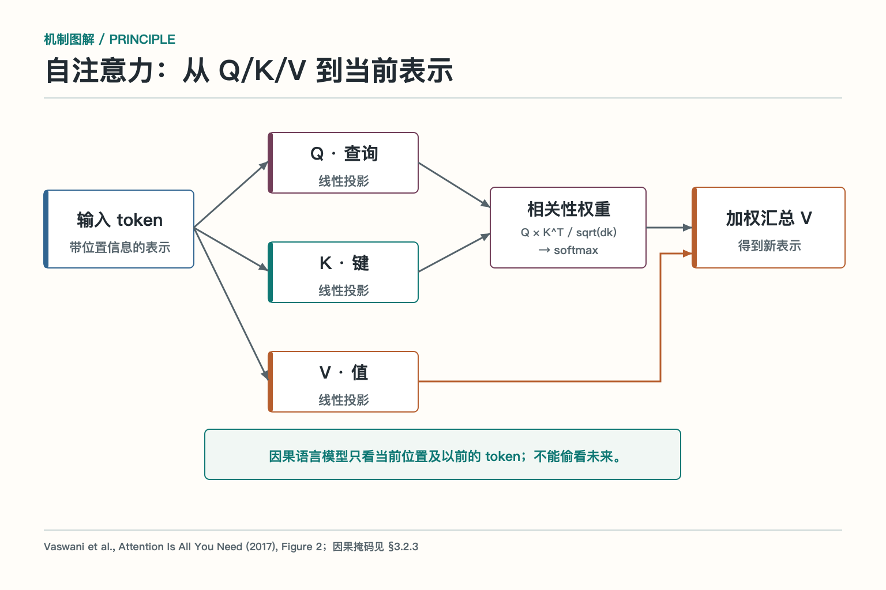
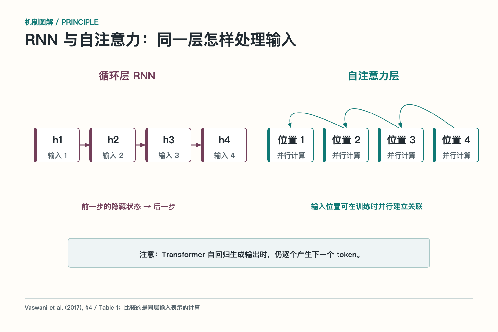

# 大话大语言模型—它为什么能一句接一句

同事让你写一条会议改期通知。旧日程写着：**2026 年 10 月 14 日 14:00—15:00，A302 会议室**。刚收到的新要求是：**改为当天 16:00—17:00，改成线上；会议链接还没生成；先写草稿，不发送，也不改日历**。

人读完大概会写：“项目复盘会议改至 10 月 14 日 16:00—17:00，改为线上举行。会议链接稍后补充。”大语言模型也能写得很顺。但它是怎样从输入走到这句话的？如果把旧地点 A302 混进通知，或写成“会议已改好”，问题又出在哪儿？下面一直用这条通知作例子。

## 一、它读到的文字，先被拆成什么

输入会先经过**分词器**，拆成模型使用的 `token`，再转换成编号与向量。`token` 是处理文本的单位，不等于一个汉字，也不等于一个英文单词。“A302”“16:00”和中文句子会怎样拆，取决于具体模型的分词器。要算上下文占用，得用对应分词器实测，不能拿“多少字”直接换算。


这件事与我们的通知有什么关系？如果系统要严格核对 `16:00—17:00`，就别让模型用肉眼数一遍字符后拍板。它可以从材料中抽取候选时间；程序再检查时间格式、开始早于结束，并与最新指令逐字段比对。时间、金额、订单号这类精确字段，尤其值得这样做。模型写一句通顺通知很在行，担任字符校对员则不一定合适。

分词还影响费用和可容纳的材料。旧邮件、聊天记录、会议纪要一起贴进去，看着只是几页纸，实际占用由 `token` 数决定。删掉重复转发的邮件，比盲目缩短最终通知更可能省下输入空间。

## 二、它为什么能把一句话接着写下去

以常见的**自回归语言模型**为例：读入当前内容，计算下一个 `token` 的候选概率；选出一个后放回输入，再算下一个。它不是在第一步就把整段通知藏在某个抽屉里。训练时反复做预测，并调整参数；后续的指令训练让它更善于按照“写通知、不要发送”这样的要求作答。

在我们的例子里，模型可能顺着“会议链接”续出“稍后补充”，也可能续出一个格式很像真的网址。两种后续在语言上都通顺，**语言上顺得下去，不等于事实已经成立**。链接尚未生成，是输入给出的事实边界；模型只能写“待补”，不能凭续写能力把链接变出来。

一个便于自测的小问题是：把“链接尚未生成”删掉，再问模型“请附上会议链接”。如果它给出具体地址，那是需要拦截的编造；如果它追问或标注待确认，才符合这项任务的要求。这个测试不依赖模型说得是否客气，只看有没有凭空增加事实。

## 三、它怎样把旧日程与新要求联系起来

`Transformer` 是许多现代大语言模型使用的架构。它的**自注意力**机制会让一个位置的表示结合前文其他位置的信息。用查询（`Query`）与键（`Key`）计算匹配程度，再按权重汇总值（`Value`）；位置信息帮助模型区分先后。在用于逐步生成的模型里，因果掩码使当前位置不能读取未来尚未生成的内容。



*依据 Vaswani 等人的《Attention Is All You Need》Figure 2 与第 3.2.3 节改绘。*

写“改为线上”时，模型需要把“改为”与较新的要求联系起来，而不是机械沿用旧日程里的“A302”。**注意力提供关联计算，不提供版本裁决书**：如果输入没写清哪条消息更新，模型仍可能挑错。工程上要把来源和时间标明，例如“旧日程”和“最新确认”，并在生成后核对关键字段。



*依据原论文第 4 节与 Table 1 改绘。图中比较的是同一层输入的计算；模型逐步生成通知时，仍是一次接一个 `token`。*

与按相邻状态逐步传递信息的循环网络相比，自注意力层可以同时计算输入各位置之间的关系。但不要把“输入位置可并行处理”误读成“整条通知一瞬间同时写完”。**理解输入**与**逐步生成输出**是两个不同阶段。

## 四、材料都放进上下文，为什么还会看漏

**上下文窗口**规定一次请求能容纳多少 `token`。它可能装下旧邮件、会议纪要、聊天记录、系统指令和模型将要写出的文字，却不保证每条材料都得到正确使用。研究发现，在某些长上下文任务中，答案证据放在中间时更容易被漏掉；具体效果还要看模型与任务。

把会议例子变难一点：同一串聊天里，先有“A302”，中间才说“改线上”，后面又引用了一遍旧日程。如果只靠多塞材料，模型可能写回“A302”。更稳妥的输入是把已确认字段单独列出来：日期、最新时间、会议方式、链接状态、允许动作。旧记录只作为背景，不与最新指令并排争夺权威。

如果必须处理长对话，可以保留简短摘要，但不能把数字和未完成动作摘要成“会议已调整”。至少要留下 `16:00—17:00`、`线上`、`链接待补`、`仅草稿` 四个字段。这里既能检验模型读到了什么，也能检查整理上下文的程序有没有先丢信息。

## 五、候选文字如何变成最后的措辞

模型对下一位给出概率后，还要决定从哪些候选中选。**温度**（`temperature`）调节概率分布的平陡；`Top-k` 保留概率最高的固定个数；`Top-p` 保留累计概率达到阈值的动态候选集合。它们控制输出的稳定性和多样性，不是“事实正确率”开关。


例如“会议链接……”之后可能接“稍后补充”“待确认”或别的说法。调低温度，通知的措辞也许更稳定；但如果输入只给了旧地点，模型会更稳定地写错地点。正式通知更关心时间、方式、动作状态是否正确，文风变化反而是次要指标。可以先固定测试材料，多次生成，比较字段一致率；不要凭一条写得漂亮的结果调参数。

一个轻量对照实验：同一输入运行多次，分别记录“时间正确”“方式正确”“未编链接”“未声称已发送”四项。参数调整若只让句子好看，却让这四项更不稳定，就没有帮上忙。不同服务对参数的支持和组合方式可能不同，最终还得按实际接口与评测结果定值。

## 六、为什么一句流畅的话仍可能是错的

假设模型输出：“会议已改至 16:00，地点仍为 A302，邀请已发出。”这句话语法没毛病，事实却错了三处：地点沿用旧记录，动作状态由“仅草稿”变成“已发出”，还暗示日历已经更新。通常把这种看似可信、却缺少输入或外部证据支持的内容称为**幻觉**。


*把生成结果拆成一条条事实陈述：有最新依据的保留，来自旧记录或没有执行证据的删除。*

处理办法要按输出中的错误分开。**旧地点**说明模型没用对新旧记录；**虚构链接**说明缺失信息被补成了具体事实；**声称已发送**则是把“先写草稿”误写成完成状态。给模型的材料应明确标出最新确认和未知字段；检查时逐句追问：“这句话能在输入里找到依据吗？”没有发送结果作为输入，就不能让通知声称已经发出。

评测也不要只让人打“通顺度”。对于这条通知，列出可核验的预期：时间必须是 `16:00—17:00`；方式必须为线上；不得出现 A302 或虚构链接；文案不能声称已经发送。逐项标记是漏读新要求、沿用旧值，还是自行补出事实，才知道要改输入组织、输出约束，还是模型选择。

## 七、怎样把草稿交给程序，而不让程序猜

如果要复用这条通知，先让模型给出结构化的**候选结果**，而不是让程序从一整段漂亮话里猜时间、方式和链接。下面是示意数据，不代表会议已经被修改：

```json
{
  "time": "16:00-17:00",
  "mode": "线上",
  "link": null,
  "status": "draft_only"
}
```

格式约束能检查字段、类型和枚举；语义核对则要确认时间来自最新要求，`link: null` 对应“链接尚未生成”，`draft_only` 对应“先写草稿”。**格式合法只说明“长得对”，不说明内容有依据。**即使四个字段都正确，通知文字也不该额外加一句“邀请已发出”。

- **格式检查**：`time` 漏填，或者 `link` 填成数字而非链接或空值；
- **来源核对**：把旧时间 `14:00` 写进通知，而不是最新的 `16:00`；
- **措辞核对**：没有任何发送结果，却写“邀请已发送”。

三层检查回答不同问题。一个合法的 `JSON` 仍可能完整、工整地写错时间；一条时间正确的通知，也可能在末尾加上“已发送”。因此保存草稿前既要解析字段，也要核对字段与原始材料的对应关系。这样发现错误时，能知道是格式不稳、读错旧新记录，还是措辞越过了事实。

如果两条消息都标为“最新”，却给了不同的时间，模型应标明冲突并请求确认，而不是自选一个更顺口的答案。可以约定 `needs_clarification` 表示“还不能起草确定版”；这是输出状态，不是对日历或消息系统发出的操作命令。

## 八、它为什么有时快，有时慢

推理可以粗分为读入提示的**预填充**，以及逐步写出的**解码**。旧邮件贴得越多，前一段的工作通常越重；通知写得越长，后一段的串行步骤越多。流式输出能让人更早看到开头，不等于完整通知已经生成完，更不保证后面的时间字段不会写错。

服务通常用 `KV Cache` 保存一次生成中已计算的键和值，避免每写一个新 `token` 就把全部前文重算；代价是显存占用。跨请求复用相同前缀的**提示缓存**是另一件事。假如每次请求都有相同的写作规范，这段稳定前缀或许值得复用；会议内容和用户身份各不相同，不能为了命中缓存把私有内容混在一起。

排查“写得慢”时，先记录输入 `token`、输出 `token`、首个 `token` 延迟和完整生成耗时。可以做一组小对照：一边给模型贴三十封转发邮件，另一边只给经核对的四个字段，比较时间、地点和链接的正确率与生成耗时。若精简输入带来提速，却把“仅草稿”这样的关键约束删了，那是拿质量换速度，不算优化。

## 九、怎样知道这条通知真的写对了

可以给这项生成任务做一组小测试，而不是凭一条成功示例宣布完成。至少覆盖四类输入：只有新要求；旧日程与新要求冲突；新要求缺少会议链接；后来又补来了真实链接。每类都要写出**预期字段和禁止编造的内容**，再检查模型生成的字段与通知文字。

具体说，没有任何输入能支持“已发送”；缺链接时不能编造网址，有链接时不能擅自改写其中的字符；地点冲突时以明确标记的最新确认为准。分别统计时间正确率、方式正确率、无依据陈述次数与格式通过率。把旧值误用和凭空补值分开计数，才能看清调整上下文或解码参数后，究竟改善了哪一种错误。同一批材料、同一套判据，才适合比较两个语言模型或两版提示。

大语言模型能把一句接成下一句，是因为它会把文字转成 `token`，结合上下文算出候选，再逐步生成。要让这条通知写对，就把“哪条消息更新、哪些字段未知、哪些动作没做”交代清楚，并核对每个关键陈述。**会写是一种能力；写出的事实有据可查，是另一道要求。**

## 参考资料

- [Attention Is All You Need](https://arxiv.org/abs/1706.03762)
- [Lost in the Middle：How Language Models Use Long Contexts](https://arxiv.org/abs/2307.03172)
- [The Curious Case of Neural Text Degeneration](https://arxiv.org/abs/1904.09751)
- [Efficient Memory Management for Large Language Model Serving with PagedAttention](https://arxiv.org/abs/2309.06180)

想看本文在 AI Agent 中的位置，可点击下方 [阅读原文](https://github.com/Jennifer123www/ai-agent-knowledge-map)，从“基础模型与推理”继续阅读。
