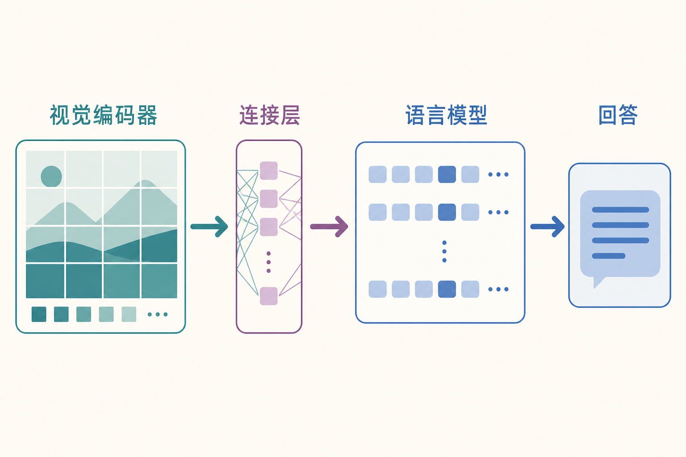
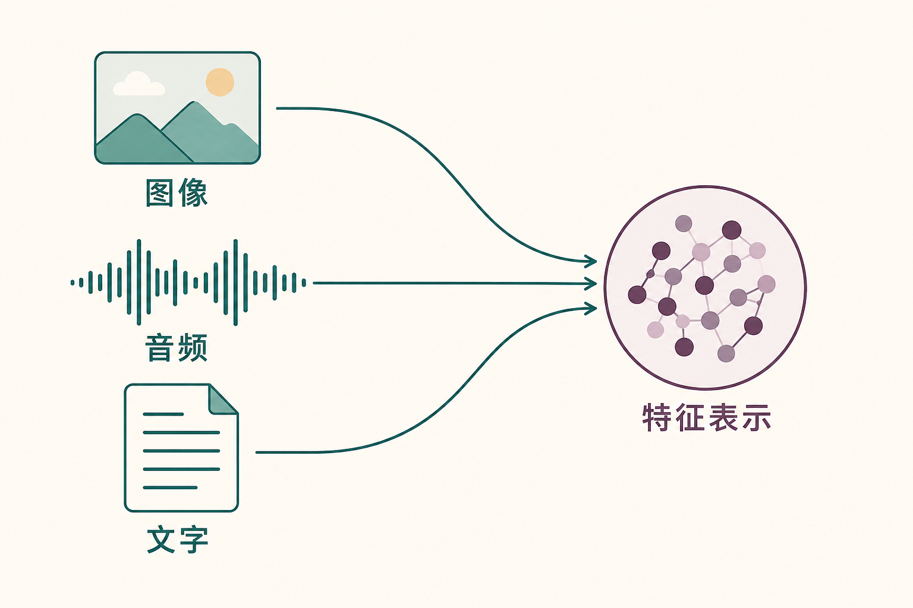
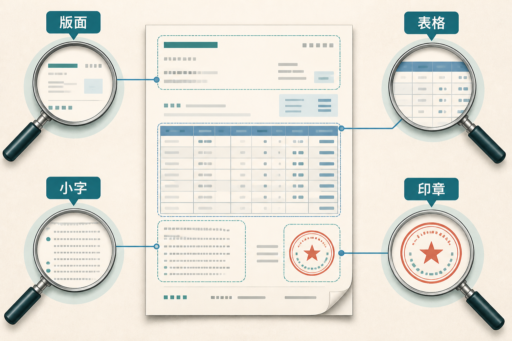
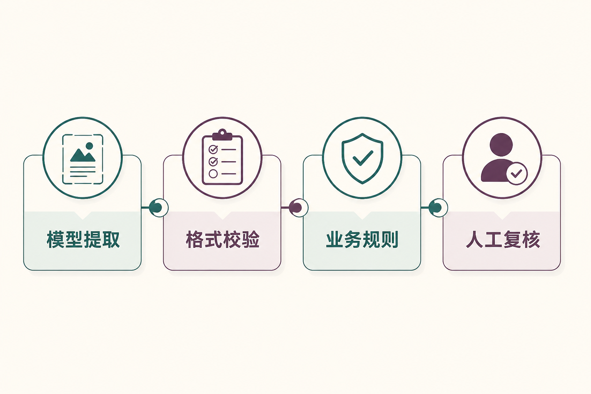

# 面试题：发票读对字为何还会填错字段

题目共用主文的发票：照片右上角反光，`680.00` 是含税金额，`38.49` 是税额，日期只写 `9/3`，年份未知。目标是生成**带来源位置、保留缺项的字段草稿**，不替员工提交。面试时别只说“模型能看图”，要追问它从哪块图读到了哪个值，以及读不清时有没有老实停下。主文与全系列入口在[AI Agent 知识图谱仓库](https://github.com/Jennifer123www/ai-agent-knowledge-map)。

## 问题 1：视觉信息怎样接入语言模型？

### 原理

发票像素先经视觉编码器变成特征，再通过投影层、重采样器或交叉注意力等连接机制，送进语言模型可使用的表示空间。模型把这些特征与“请提取含税金额”的文字指令一起处理。不同架构在视觉 `token` 数量、融合位置和训练方式上有差异；无论哪种，缩图过度都会使反光处的小字先丢失。

### 答题点

1. 原始像素先切块、缩放或分层编码，不能直接当文字 token；
2. 连接层负责对齐维度和语义，让语言模型读取视觉特征；
3. 训练数据通过图文描述、视觉问答和指令样本建立跨模态关联；
4. 分辨率、视觉 token 数量和连接结构共同影响细节、成本和时延。

### 记忆点

> 编码器负责看，连接层负责翻译，语言模型负责回答。

### 常见追问

视觉特征越多越好吗？不是。更多特征可能保留细节，也增加上下文和计算，并带来噪声。应按任务选择分辨率、切片和区域复查策略。

### 失分点

说“把图片转成文字再给大模型”作为所有多模态模型的统一原理，忽略视觉特征的直接融合。

## 问题 2：OCR 与视觉语言模型怎样选？

### 原理

`OCR`（光学字符识别）可读出 `680.00`、`38.49` 及文字框坐标；视觉语言模型（`VLM`）还可尝试判断它们分别属于“含税金额”还是“税额”。固定版式、大批量抽取可以先用 OCR；版面变化大或需要关系判断时再用 VLM。两者一致也不自动补出 `9/3` 所缺的年份。

### 答题点

1. 固定字段、字符级准确和批量吞吐优先考虑 OCR 与规则；
2. 开放问答、图文关系和复杂版面可使用视觉语言模型；
3. 生产中可组合：OCR 提供文字坐标，VLM 做语义理解；
4. 关键结果都要保留原图证据，并用业务规则验证。

### 记忆点

> OCR 擅长抄清楚，VLM 擅长看明白。

### 常见追问

OCR-free 文档模型是否意味着不再需要 OCR？不意味着。它提供另一条端到端路线，具体选择仍取决于字符精度、版式、审计、成本和语言覆盖。

### 失分点

简单判断“VLM 更先进所以替代 OCR”，没有任务门槛和组合方案。

## 问题 3：长文档和多图输入应该怎样组织？

### 原理

多页、多图任务需要显式保存页面顺序、图片身份、区域坐标和来源。可先做页级检索与版面分析，再对相关区域提高分辨率，避免一次输入全部高清页面造成成本高、顺序乱和信息稀释。

### 答题点

1. 为每页添加文档 ID、页码、时间和内容类型；
2. 先用目录、OCR 或轻量模型定位相关页，再做细粒度视觉理解；
3. 表格保留行列标题，跨页条款保留前后关联；
4. 输出引用到页码与区域，便于人工核对和错误回放。

### 记忆点

> 多图先编号，长文先定位，结论要能回到原处。

### 常见追问

切图会不会破坏上下文？会。可以保留少量重叠、页面摘要和父区域标识，并对跨区域问题回取更大范围复核。

### 失分点

只说“扩大上下文窗口”，没有页面路由、区域裁剪和证据定位。

## 问题 4：表格、图表和小字为什么容易出错？

### 原理

这类任务要求同时理解像素细节、二维布局和语义约定。缩放可能抹掉小字；表格单元格离开行列标题就失去含义；图表数值还受坐标轴、图例和单位影响。任何一层错误都会传到答案。

### 答题点

1. 保证原图质量，对模糊、倾斜和反光做前置检测；
2. 先识别版面结构，再抽取字符与关系，不把整页压成一段文字；
3. 对金额、日期、比例和单位做确定性校验与交叉计算；
4. 关键区域可以裁剪放大后二次识别，并与第一次结果比较。

### 记忆点

> 小字怕缩放，表格怕丢标题，图表怕丢坐标。

### 常见追问

两次识别结果不一致怎么办？保留两个结果及其证据区域，按字段风险、图像质量和规则决定重试、换模型或人工复核，不能悄悄取平均。

### 失分点

只讨论模型大小，不讨论输入质量、版面和后处理验证。

## 问题 5：视觉 Agent 的点击坐标怎样做得可靠？

### 原理

视觉定位给出的坐标会受分辨率、缩放、滚动、弹窗和页面变化影响。可靠执行需要动作前确认目标，动作后重新观察，并优先使用可访问性树或 DOM 等结构化信息作为锚点。

### 答题点

1. 统一截图坐标与实际设备坐标，记录缩放和视口；
2. 根据文字、控件类型和邻近元素共同定位，不只认颜色；
3. 点击后等待明确状态变化，检查成功提示或后端权威状态；
4. 高风险动作在最终提交前展示目标和影响范围，请人确认。

### 记忆点

> 动作前定位，动作后复看，成功看状态不看手感。

### 常见追问

为什么不全部使用 DOM？原生应用、画布、远程桌面或受限网页未必提供稳定 DOM；结构信息可用时优先，不可用时视觉方案要加强确认和恢复。

### 失分点

把一次坐标预测当成完整自动化，没有滚动、页面变化、结果确认和误操作恢复。

## 问题 6：多模态输入中的提示注入怎样防？

### 原理

图片、PDF 和网页里可能包含诱导模型改变任务或泄露数据的文字。它们属于不可信内容，不应覆盖系统指令或直接触发工具。防护必须落在上下文分层、工具权限和执行审批上。

### 答题点

1. 明确标记用户指令与被观察内容，外部文字只作数据；
2. 对可疑指令、二维码、隐藏层和外链做检测与隔离；
3. 工具调用始终经过允许列表、参数、身份和业务规则校验；
4. 敏感读取和不可逆动作要求审批，并记录原始证据与调用链。

### 记忆点

> 图片里的命令是证据，不是领导批示。

### 常见追问

把图片转成 OCR 文本后再过滤是否足够？不够。注入也可能通过图形、二维码或布局表达，且过滤可能漏检；真正的硬边界仍在权限和执行层。

### 失分点

只说“在系统提示中要求忽略恶意文字”，没有工具侧限制。

## 问题 7：怎样建立多模态模型的评测集？

### 原理

评测必须覆盖真实输入变化和任务风险。除了最终答案，还应标注字符、字段、区域、页码、动作和证据，让错误能分解为识别、关系理解、生成或执行问题。

### 答题点

1. 按设备、清晰度、角度、语言、版式和文档类型分层采样；
2. 对关键字段测字符准确、字段归属、坐标交并比和业务一致性；
3. 对问答测证据页定位与答案支持度，对操作测任务成功和误点击；
4. 加入模糊、遮挡、冲突、多页和注入等边界样本。

### 记忆点

> 不只评答案，还要评它看了哪里、动了什么。

### 常见追问

人工评分怎样保持一致？制定字段和证据标注规范，双人复核高风险样本，记录分歧并更新评分指南。

### 失分点

拿通用图片问答榜单代替自己的票据、界面或文档任务。

## 问题 8：多模态服务成本高或不可用时怎样降级？

### 原理

降级应保持任务安全。可以先用 OCR、版面分析或轻量视觉模型完成定位，只把疑难区域交给强模型；服务不可用时，低风险任务可等待或人工录入，高风险任务不能假装已经看懂。

### 答题点

1. 用图片质量检测拦截无效输入，避免浪费调用；
2. 先低分辨率定位，再高分辨率复查关键区域；
3. 固定版式优先 OCR 与规则，开放问题再调用 VLM；
4. 超时后保存任务和原图，允许恢复、换模型或人工处理。

### 记忆点

> 先便宜地找位置，再认真地看细节。

### 常见追问

能否缓存图片理解结果？可以，但缓存键要包含文件内容哈希、模型版本、处理配置和权限范围；图片更新或权限变化后必须失效。

### 失分点

降级成“让语言模型根据文件名猜内容”，或忽略隐私数据在第三方视觉服务中的传输边界。

## 问题 9：怎样让多模态回答可定位、可复核？

### 原理

视觉定位把答案与图片区域、页面或视频时间段绑定。系统可以要求模型返回边界框、页码和字段值，再用 OCR、裁剪复查或规则验证。它把自然语言结论变成可检查的证据对象。

### 答题点

1. 保存原始文件、页面尺寸和坐标系，防止缩放后位置失真；
2. 字段输出同时包含值、页码、区域和来源方法；
3. 对关键区域进行二次裁剪识别或交叉模型复核；
4. 人工界面高亮证据，纠正结果回流评测集。

### 记忆点

> 不只问看到了什么，还要问在画面的哪里。

### 常见追问

边界框准确但字段错说明什么？可能是字符识别或语义归属错误；定位和识别应分别评测，不能用一个最终答案分数掩盖。

### 失分点

只保存模型描述，无法回到原图定位和重放。

## 问题 10：多模态数据的隐私与合规怎样设计？

### 原理

图片和音频往往携带超出当前任务的敏感信息，如人脸、地址、屏幕通知和背景对话。治理原则是最小化采集、最小化传输、明确保留和严格访问，而不是把整个文件交给模型后再补一句“请保密”。

### 答题点

1. 上传前裁剪、遮盖或脱敏，只保留必要区域；
2. 核对模型服务的数据保留、训练使用和区域合规条款；
3. 原图、派生特征和日志分别设置权限与保留期；
4. 支持删除、审计和租户隔离，敏感任务优先使用受控环境。

### 记忆点

> 多模态多看一眼，系统就多背一份数据责任。

### 常见追问

只保存向量不保存原图是否安全？向量仍可能携带敏感特征，也影响删除和访问控制，不能自动视为匿名数据。

### 失分点

只讨论传输加密，不讨论采集范围、服务商留存和派生数据。

## 面试收束：把“看懂”拆成四个可测环节

这张发票的错误至少分四类：反光导致小数点不可见；字符读错；两个金额读对却归错字段；`9/3` 的年份被编造。前三类分别检查图像质量、字符框和字段定位，第四类检查是否保留“未知”。如果把它们都算作“识别不准”，就不知道该重拍、换视觉处理方法，还是修正输出约束。

回答方案题时，先说任务需要哪些视觉信息，再选择 OCR、VLM 或组合；然后说明坐标、页码、时间戳怎样保存；最后补上规则复核、权限和人工关口。比起一句“用多模态大模型端到端解决”，这套答法更接近真实生产系统。

最后说明视觉模型的交接边界：模糊输入请求重拍，关键字段冲突交人工；审核与提交属于后续流程，不由视觉模型的置信表述决定。这样答题重点仍落在**视觉信息如何变成可核对字段**，不会滑回总览的端到端 Agent 设计。

主文、总览与其他子模块的面试题见[AI Agent 知识图谱仓库](https://github.com/Jennifer123www/ai-agent-knowledge-map)。

## 参考资料

- [Flamingo：a Visual Language Model for Few-Shot Learning](https://arxiv.org/abs/2204.14198)
- [LLaVA：Visual Instruction Tuning](https://arxiv.org/abs/2304.08485)
- [GPT-4V System Card](https://cdn.openai.com/papers/GPTV_System_Card.pdf)
- [Donut：OCR-free Document Understanding Transformer](https://arxiv.org/abs/2111.15664)
