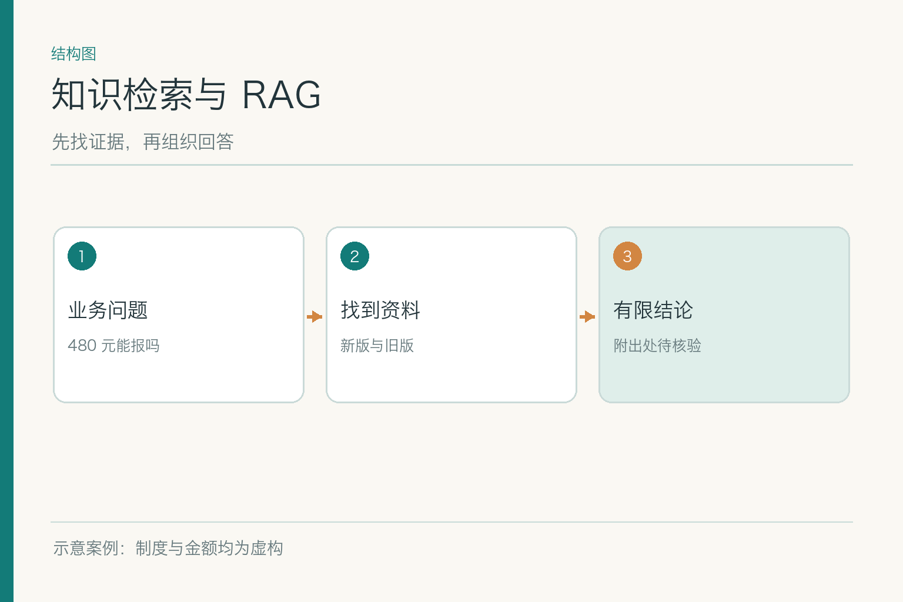
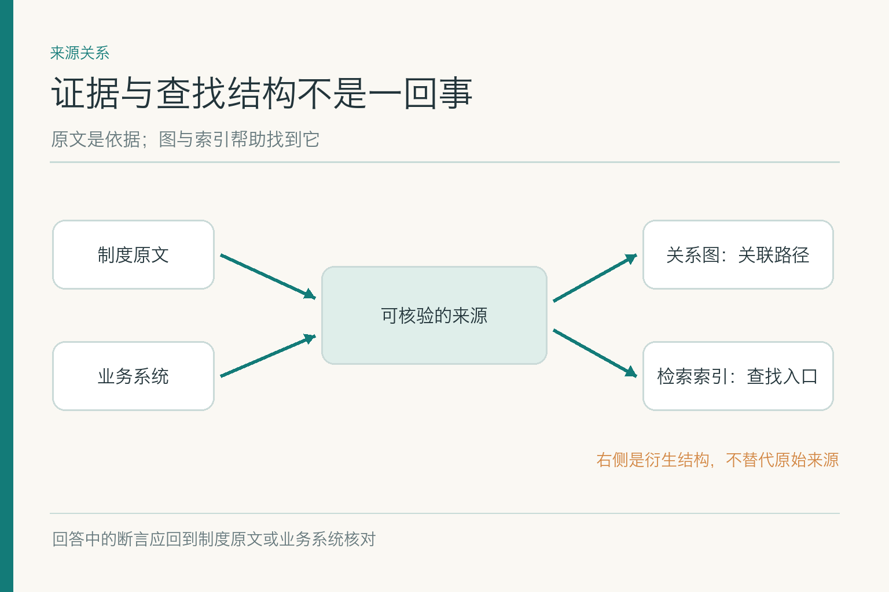
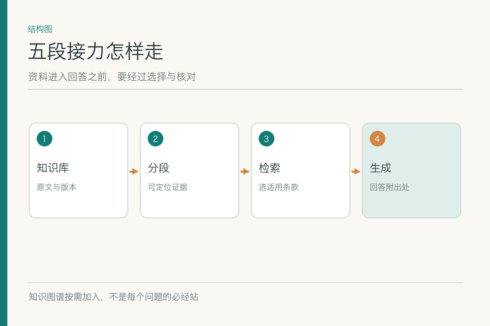
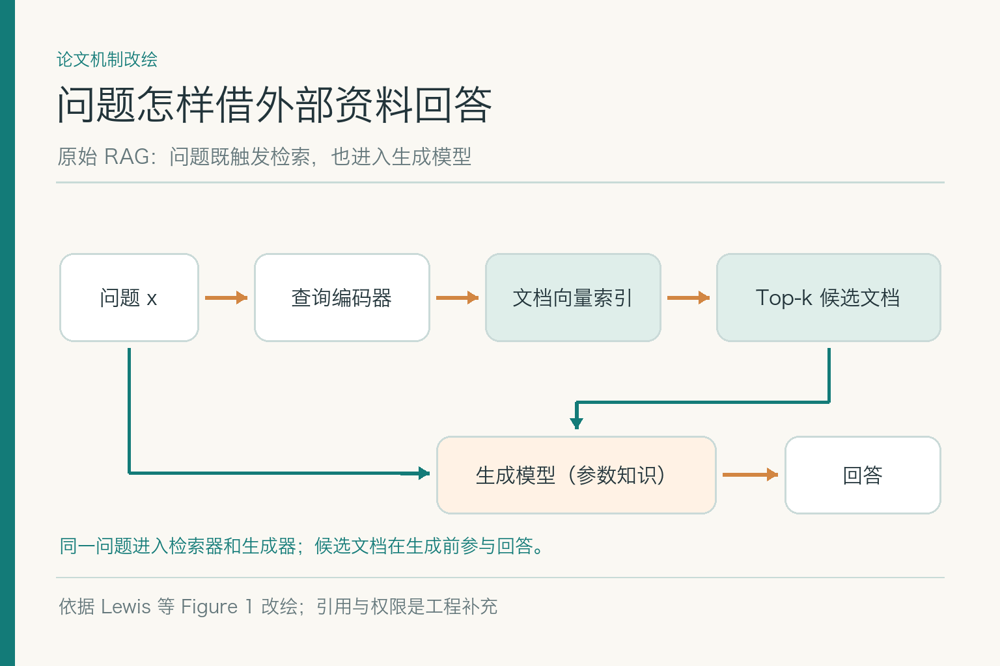
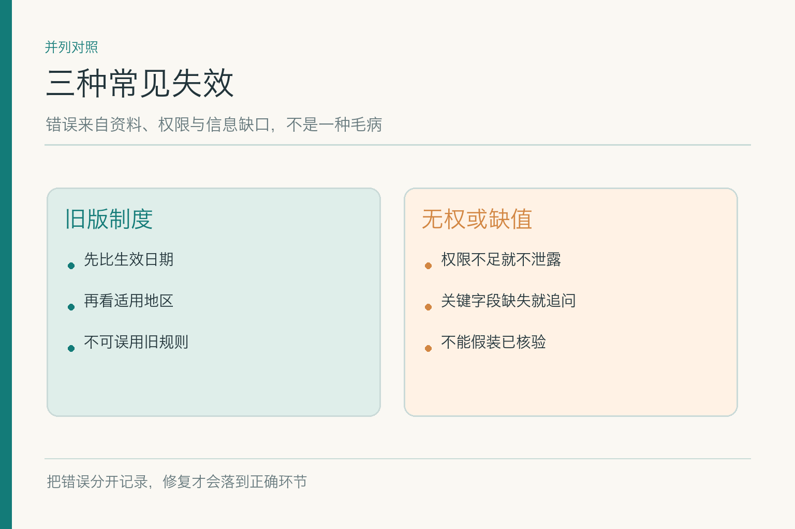
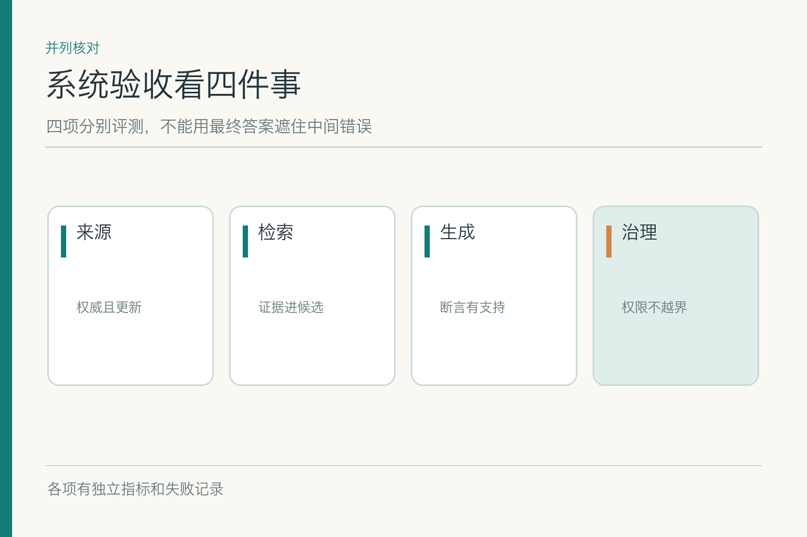

# 知识检索与 RAG：一条制度怎样走到回答里

项目入口：[AI Agent 知识图谱仓库](https://github.com/Jennifer123www/ai-agent-knowledge-map)，可看主题总览、初学者图解和对应面试题。这一篇先画清资料通向回答的路，具体算法留给五篇子模块文章。

小林问助手：“我 2026 年 9 月 15 日在北京住酒店花了 480 元，是 A 职级，能报吗？”练习资料里旧制度写上限 450 元，新制度从 9 月 1 日起写 500 元；员工身份尚未由系统确认，票据真伪与审批状态也未知。**这些数字和规则都是虚构示例**。一个负责任的系统不能只见 480 小于 500 就答“报销成功”，它得先弄清哪份制度有效、适用于谁、还有哪些事实没核。

## 一、这类问题为什么不能只靠模型记忆

模型训练完成后，企业制度仍会更新；答案还要受用户权限、业务发生日期和实时状态影响。把所有制度塞进一条长提示也不稳：资料多，关键例外可能被淹没；用户还可能根本无权看其中几份。外部知识层的任务是**在当前问题需要时取出有限、适用、可回溯的资料**，而不是替模型装一个无限大的脑袋。

图中的“知识”不只有 PDF。正式制度解释规则，业务数据库保存小林当前身份或报销状态，知识图谱可辅助走“员工—部门—适用制度”的关系，检索索引帮助从大量文本中迅速找到候选。它们的证据效力不同，不能被一把写成“知识库说”。

资料进入回答前会多次加工。每次加工都可能丢东西：解析丢表头，分段丢例外，检索取旧版，生成把有限结论写满。系统要能反查哪一段出了错。

这和“让模型多读几篇文档”有个关键区别：系统不仅送文字，还要送文字的身份。小林若在 10 月才提问 9 月的住宿，查询日期与业务日期不同；如果只记录“现在最新”，可能误判。文档的版本、权限和原文位置在整个处理链里都要跟着走，像快递单号一样，不能到最后一站才临时补写。

## 二、五个子模块各管哪一段

**知识库**管资料的来路、版本、授权、更新与撤回，让原文可管理。**知识源、知识图谱与 GraphRAG**管跨来源关系：文档、数据库和关系图分别承担什么，什么时候值得沿实体关系查，什么时候只要看原文。**分段与元数据**把长文变成可找、可定位而条件完整的证据单元。**召回、重排序与引用**从这些单元里找候选、排除不适用内容、选出可用证据，并保留回原文的位置。**RAG**把有限证据交给生成模型，组织带出处、有边界的回答。

五项不是一条永远固定的流水线。图谱可以按需加入；一个数据库字段可以直接查，不必先切段；已知制度编号时关键词可能比向量召回更直接。整体仍有一条不变的原则：**出处和适用条件沿途不能掉**。不管绕几站，最后都要能说清“这句话凭什么”。

还有一道常被忽略的交界线：外部资料告诉系统“制度写了什么”，并不授权系统去执行报销动作。即使答案已能说明 480 元低于示例额度，也不能据此填写不可修改的财务记录、发起付款或宣称审批完成。知识层交出证据，业务规则层再核验，执行层还要单独检查权限和用户意图。

这些子模块的细节不在总览里抢讲。下钻文章会分别讨论解析与版本、图谱边与社区摘要、父子分段、双编码器与重排、证据包与生成校验。

## 三、新制度从发布到可用，走过哪些站

新制度正式发布后，资料层先保存原件、批准状态、生效时间和可见范围；解析层还原章节、表格、脚注和条款位置；分段层把可理解的部分形成证据单元，保留版本与权限；索引层才把它做成可查候选。如果正式文件写的是“仅 A 职级”，解析或分段却丢了这句，检索再快也只是更快地找到半条规则。

发布还要有一次“可用性”验收：用小林这类带日期、地点和职级的问题，确认新版能被查到，旧版不会越过有效期进入当前回答。源文件上传成功，不等于检索索引已同步；索引同步，也不等于用户能打开引用。每站都应有自己的完成证据。

撤回是同一条路的反方向。若新版被发现有误，原件撤回后，相关片段、索引、摘要或关系边也要停止参与新查询。技术索引可回退到上一稳定构建，但业务上已失效的旧规则不能借机复活。

## 四、小林的问题又怎样走回来

问题先确定可核事实与缺口：住宿日期和票面金额来自发票，职级须从有权系统确认，政策要按北京与日期检索。系统以当前用户身份筛选可读资料，再找相关条款；旧版与新版即使文字很像，也要按正式有效期处理。若条件不足，检索可以给出候选，但生成不该替业务系统断言“已经通过”。

被选中的证据需带原文链接、版本、时间与适用范围。生成模型读到的应该是“这条款在什么条件下有效”，而不是只看见“500 元”三个字。回答可写：“按示例新版北京 A 职级标准，480 元低于上限；身份、票据和其他审批条件尚待核实。”若身份核实失败，结论范围还要缩小。

最后再把答案中的每个关键断言与来源相对照。金额、职级、政策、生效日与审批状态各有不同来源；一个制度链接不能证明所有事实。这一步做完，才叫把资料用于回答，而不是把资料贴在答案后面。

## 五、原理图里的“检索增强”到底增强了什么

*依据 Lewis 等 RAG 论文 Figure 1 改绘；图中问题同时进入检索器与生成模型。引用与权限是本项目另加的工程环节。*

原始 RAG 研究把外部文档索引接到生成模型旁边：问题被编码后从索引取回候选，生成模型再结合问题与候选形成输出。相较只依靠训练时写进参数的知识，这让当前资料有机会参与回答。论文讨论的是具体的神经检索与生成方案；现在工程上还常加入规则过滤、关键词检索、重排序和引用，不能把这些都冒称为原论文 Figure 1 的固有部件。

这张图有一个重要边界：索引里的候选是**可供阅读的资料**，不是已判定适用的业务事实。找到了旧版也能“增强”回答，只不过增强的是错误。是否当前生效、是否允许当前用户查看、是否足够支撑某句话，都需要另行核验。

若把同一问题交给两个系统，一个只靠模型记忆，一个查询有效制度，后者的优势并非“模型突然更懂财务”，而是它有机会使用本次可更新的外部依据。不过外部依据也可能缺失、过期或解析错误，RAG 只能把风险从“模型记忆里找不到”转移成一条可检查的资料链；不会把风险凭空消灭。

所以 RAG 不等于让模型“联网”，更不等于免于验证。真正的收益来自证据可更新、可选择、可追溯，而不是架构图多画了几根箭头。

## 六、共性失败为何不能都叫“幻觉”

若系统用旧版 450 元回答 9 月 15 日的问题，应看版本元数据、过滤条件和索引更新。若它把财务专用细则发给小林，应看权限继承、检索暴露与缓存。若制度找对了却说“已审批”，则生成超出了证据；还要查有没有把业务状态作为输入。三类错误的修法互不相同。

还有一种是资料冲突：两份正式文件都声称适用，却没有明确优先级。此时模型不能以“较新”“写得更完整”自行裁决；应展示冲突并交责任人核对。把不确定性写清楚，不会让系统显得笨，反而让人知道下一步该问谁。

面试或评测时，最好把“找错来源、漏条件、越权、引用错位、生成过度断言”分桶记录。只报一个“准确率”会掩盖真正需要修的链路。

## 七、什么时候不该使用一整套 RAG

某个精确订单状态在业务数据库里，直接查询并校验权限最合适；已知正式文件编号时，关键词检索可能就够；只有几段固定、可读、无权限差异的资料时，可以直接放进当前请求。关系问题多且跨资料时，图谱可能有价值；大规模长文问全局主题时，才考虑更复杂的 GraphRAG。**选型从问题出发，不从技术名词出发。**

长上下文也不是检索的自动替代。窗口再长，也要支付输入成本、处理版本与权限，且模型未必均匀利用每一处资料。反过来，如果资料很少、变化缓慢，建立复杂索引也可能只是增加维护点。

这条报销题的起点很普通，所以很适合检验系统克制：能直接查的就直接查，必须检索的才检索，证据不足就停在有限回答。

## 八、系统级验收应怎么做

同一批问题要覆盖普通输入、旧新冲突、身份缺失、新制度刚发布、越权访问与原文不可达。资料层验版本和解析，检索层验候选与排序，生成层验断言与引用，系统层验最终决策是否受权限与业务规则约束。每项写出样本量、分母和版本，不能用一条漂亮的答复做发布证据。

上线时，原文、分段、索引、排序策略和生成提示的版本要能配对。若新制度发布但旧索引还在服务，应阻止相关肯定回答；若某一技术版本出错，可回退构建，却不能回退已经正式生效的业务制度。监测记录问题、候选、过滤原因、最终证据和答案，让错误可归因。

时延和成本也要看，但不能通过取消权限过滤或引用校验换速度。最便宜的错答，事后往往最贵。

上线后可从用户纠错里收集具体失败样本：哪道题、当时的业务日期和权限、系统看过哪些候选、最终引用指向哪一版。将新样本归入同一题集，回归时既测修复是否有效，也测是否误伤旧题。若只把这次错答的标准答案硬编码进提示词，下次制度变更仍会跌进同一个坑。

## 九、五篇下钻文章从哪里读起

如果想知道“资料为什么旧”，读知识库；若疑惑“员工与制度如何连”，读知识图谱；若看到了半条规则，读分段与元数据；若正确条款总排不上来，读召回与重排序；若证据已经正确却仍写错结论，读 RAG。它们分别追踪不同失效点，不需要把同一道面试题在五篇里换标题重答。

主线始终是小林那句“能报吗”。有权限、时间、适用条件和真实来源，回答才能向前走一步；缺哪项就停在哪项。资料不是给模型添谈资，而是给人留一条可以回去核对的路。

项目总览、初学者图解和对应面试题见 [AI Agent 知识图谱仓库](https://github.com/Jennifer123www/ai-agent-knowledge-map)。

## 参考资料

- [Lewis 等：Retrieval-Augmented Generation for Knowledge-Intensive NLP Tasks](https://arxiv.org/abs/2005.11401)
- [Liu 等：Lost in the Middle](https://arxiv.org/abs/2307.03172)
- [Edge 等：From Local to Global: A Graph RAG Approach to Query-Focused Summarization](https://arxiv.org/abs/2404.16130)
