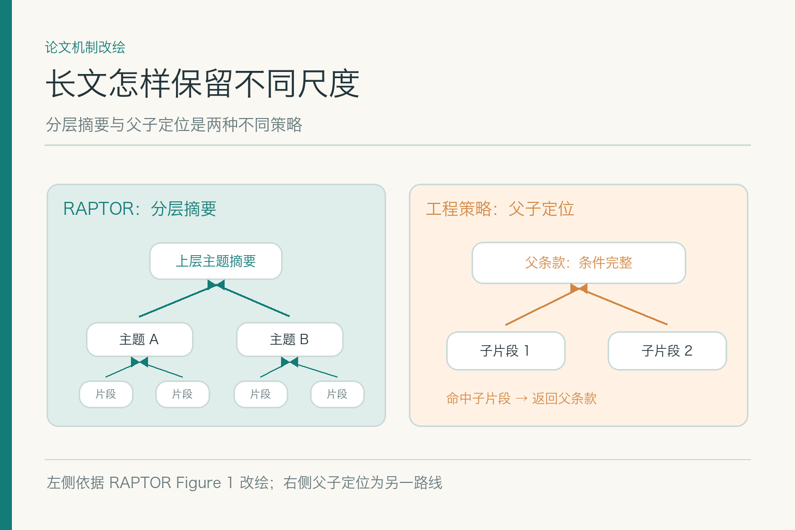

# 分段与元数据：别把制度的例外切丢

项目入口：[AI Agent 知识图谱仓库](https://github.com/Jennifer123www/ai-agent-knowledge-map)，有总览、初学者图解和面试题。这里专讲资料被切成检索单元时会失去什么，以及怎样把它留住。

虚构案例仍是一份差旅制度：北京住宿上限 500 元，自 2026 年 9 月 1 日起对 A 职级生效；旧版上限 450 元。小林 9 月 15 日住宿，发票 480 元。假如程序按固定字数切文档，第一块刚好停在“上限 500 元”，下一块才出现“仅适用于 A 职级”，检索器找到第一块后，回答很可能把 500 元推广给所有员工。问题从切分那一刻就埋下了。

## 一、为什么要分段，却不能任性切

整本制度直接送进检索索引，搜索结果往往只能定位到“这份文件”；生成模型仍要在几十页里找条款，成本高，也容易漏读。分段（`chunking`）把资料变成较小、可搜索、可引用的单元，让系统能找到“哪一条”而不只是“哪本”。但切得太细，条件和例外会散开；切得太粗，命中一块也不等于找到了答案。

好的单元不以字数为唯一目标，而以**读懂后不会改变原意**为目标。一个金额往往需要连着职级、地区、生效日期和例外一起看。切分策略还得考虑后续查询：员工会问“北京 A 职级上限”，也会问“480 元能不能报”。两类问法应能定位到同一条有效规则。

分段只是资料加工的一步，不负责判断最终答案。它的交付物是能被找到、能回原文、上下文足够的证据单元。

换个更生活化的说法：分段像剪报。只剪下“北京 500 元”，贴在墙上确实醒目，却把旁边的“仅限 A 职级”和“自 9 月起”留在报纸上。过几天再看剪报，人会误以为这是一条通用规定。机器的错误也是这样发生的，而且它会把被剪坏的片段再复制到索引、缓存和回答里。

## 二、先读懂版面，再谈片段边界

一份 PDF 可能有目录、页眉、章节标题、表格、脚注和附录。解析器若先按页面拿到一长串字符，表格行列已经乱了，后面用“智能分段”也修不回来。应先得到合理的阅读顺序，保留标题层级、表格结构、列表和脚注关联，再决定边界。

小林的北京住宿标准可能在表格第三行；“A 职级”放在表头，“仅限经批准的国内差旅”写在脚注。若只按行拆，第三行看起来像一条完整规则，其实缺了两项条件。跨页表格尤其容易丢标题：第二页只有金额列，机器不知道它对应哪个城市档位。

图片资料可先做文字识别或视觉理解，但候选结果必须能回到原页核对。解析不确定时给片段标低质量，而不是用流畅的自动补写掩盖空白。

一份资料可能同时有正文和附录，附录重新定义“住宿费”包含哪些项目。解析时若把附录当噪声扔掉，后面的片段都可能用错定义。分段前先列出文档的骨架：章节之间有没有引用，表格有没有跨页，脚注到底限定哪一行。这个工作有点像整理书页顺序，没整理好就开始做摘要，速度再快也会把故事讲反。

## 三、怎样沿语义与条款结构切

最自然的基本单元可能是一个有完整条件的条款、一个包含表头的表格行组，或一个问答对。标题不是装饰：把“国内出差—住宿—北京”沿层级附到片段上，搜索“北京酒店标准”时才更容易定位。例外若直接限制主条款，应放在同一证据单元，或有明确的父级链接。

所谓“按语义切”也不等于让模型自由决定任何边界。要保留稳定的原文偏移、页码、章节与片段 ID；否则重跑一次解析，所有旧引用就漂了。能用确定性章节和列表规则处理的，先用规则；文档格式混乱时再用模型辅助，并做抽样复核。

策略要随着资料类型变。合同定义条款、价格表、FAQ、代码文档，合适的单元不一样。拿一套固定 500 字模板切所有资料，就像用同一把剪刀给所有人裁西装，省了量尺寸的时间，后面修衣服更贵。

在制度里，“条款”也不是万能边界。一条主条款可能引用前文定义，或在附录中列出地区例外；完整证据单元可以保留链接而非复制整篇，但查询时要能沿链接补足条件。若把相关内容都复制进每一块，索引会膨胀且更新难以一致；若只留一个空链接，回答时又可能读不到。最小可用上下文需要通过实际问题验证。

## 四、短片段与长背景怎样一起留

*左侧依据 Sarthi 等 RAPTOR Figure 1 改绘；右侧父子定位是另一种工程策略，二者不应混称。*

一个常见做法是让短片段负责检索命中，找到后再取回所在的完整条款或章节，也叫父子定位。这样“500 元”这句容易被查到，回答时又能看到父条款里写着的 A 职级条件。父节点不能只是一个模糊标题；它应能指回明确的原文范围，避免把相邻但互不适用的条款拼在一起。

RAPTOR 论文提出另一条路径：先切短文本，再对语义相近片段做聚类与摘要，递归形成不同抽象尺度的树，查询时从不同层级取信息。它适合长文的跨段概括，但摘要可能丢掉精确数字或例外。针对报销标准，若需要一句确切金额，仍应落回原文叶子；不能让上层摘要替代业务条款。

两种方法都在解决“短片段好找，却未必够理解”的问题，但机制不同。采用哪一种，要看问题集是否真的包含跨章节主题问法，以及额外索引和维护是否值得。

分层摘要尤其要留意数字与否定词。“不得报销”被概括成“报销限制”，用来回答制度总体变化也许尚可，但用来判定某张票据就太模糊。父子定位则要防止父级过大：命中一个短句后取回十页章节，模型仍可能在长文里漏读例外。两种策略都不能省掉带原文标注的题集。

## 五、元数据要跟着每一块走

片段正文之外，至少要保留原文件 ID、版本、章节、页码或原文位置、业务生效区间和访问范围。地区、职级等标签也可作为可过滤条件，但必须来自可靠来源，不能把模型猜的标签当正式政策。**元数据是检索和引用的判断材料**，不是只供后台展示的附注。

例如一块文字写“北京住宿上限 500 元”，若没带“2026 年 9 月 1 日起”“仅 A 职级”，系统可能把它给 8 月的住宿或 B 职级员工。若权限元数据没有从母文档继承，某个被切出来的小段可能意外公开。问题并不在相似度算法，而在片段失去了自己的身份。

更新制度后，旧片段也不能只保留同一个 ID、悄悄改正文。应能区分文档版本与片段版本，旧引用回看时知道当年指向什么，新问题又不会误用已失效内容。

元数据的继承需要有规则。来源文件限制“仅财务可见”，子片段至少同样受限；但片段抽取出的“北京”标签若来自模型推断，不能自动当成正式地区字段参与硬过滤。哪些字段可作为准入条件、哪些只是检索提示，应在记录里分开。否则一条猜错的标签就能让正确片段永远找不到。

## 六、块长和重叠如何取舍

块长过短，证据碎；过长，检索与模型阅读成本上升。相邻块加重叠内容有时能保护跨边界句子，但重叠太多会把同一条制度放进好几个候选，挤掉其他关键证据。没有一个通用的“最佳字数”，要从具体问法、文档类型和模型约束中试出来。

测试时固定资料集和问题集，比较不同策略下目标条款是否被召回、条件是否完整、引用是否能精确定位，以及索引体积与时延。若一个策略在普通题上更快，却在“旧新冲突”题上频繁漏生效日期，就不能简单宣称它更优。

对小林的题，最小片段至少应让人看出 500 元、北京、A 职级和生效时间之间的关系；若篇幅太大，可以用父级补全，不必把整本制度塞进一个块。

可先做三组对照：固定长度、按标题条款、短片段命中后回父级。题集不只问“标准是多少”，还问“哪类员工不适用”“8 月住宿用哪版”。若父子方案在例外题上明显更稳，才有理由承担额外映射维护；若三组差不多，简单策略更容易解释和更新。这里没有一个脱离资料和问法的神奇数值。

## 七、表格、图片、脚注和附件如何处理

表格单元格单独成段常常没法读。可以把表头、行标题和金额拼成可理解的一条记录，同时保留原表格坐标。脚注若限定了主表格，也应随相应记录进入检索单元，或有可追的关联。附件可能单独规定地区例外，不能因为位于文件末尾就忽略。

图片中的制度文字要保存 OCR 或视觉解析的置信信息和原图区域；无法确认的小数字应标记待核。最危险的是解析器凭上下文“补全”一个金额，后续每层都把它当原文。数据加工可以便于查找，不能无痕改写证据。

## 八、文档更新后，片段怎样保持可追溯

旧制度改了两行，不一定要让所有片段 ID 全部重排。可以用文档版本、章节路径和内容指纹等信息关联新旧片段；确实变化的片段生成新版本，未变化部分保持稳定映射。这样旧文章里的引用不会毫无解释地跳到另一段，而新查询也能找到新条款。

撤回原文时，关联的片段和派生摘要都要失效。若系统只是隐藏 PDF，索引里的短片段仍能返回，撤回就不算完成。父子结构还要检查父节点是否引用了已失效子节点；层级越复杂，更新验证越重要。

## 九、怎样验收切出来的证据单元

用有原文位置标注的问题测试：检索是否命中目标片段，片段或其父级是否包含判断所需条件，引用能否回到正确条款。样本包括普通问法、金额与职级分离、跨页表格、旧新冲突、新附件和缺值问题。不要只问“切出了多少块”；块数多不是质量。

错误也要分开：解析读错、边界切断、元数据丢失、父子映射错误、版本更新后引用漂移。分别修复，才不会把文档问题归咎于模型。最终目标并不玄：**读者打开引用，应看到足以复核回答的那段原文。**

抽检报告可以附上失败片段与原文的并排截图，以及对应问题。这样资料负责人一眼能看出是版面解析、切点还是标签问题，开发者也能拿相同样本回归。比起“本次产生 20 万个 chunk”，一页能解释三个具体错误的报告更接近真正的质量保证。

项目总览、初学者图解和对应面试题见 [AI Agent 知识图谱仓库](https://github.com/Jennifer123www/ai-agent-knowledge-map)。

## 参考资料

- [Sarthi 等：RAPTOR: Recursive Abstractive Processing for Tree-Organized Retrieval](https://arxiv.org/abs/2401.18059)
- [Lewis 等：Retrieval-Augmented Generation for Knowledge-Intensive NLP Tasks](https://arxiv.org/abs/2005.11401)
- [Liu 等：Lost in the Middle](https://arxiv.org/abs/2307.03172)
