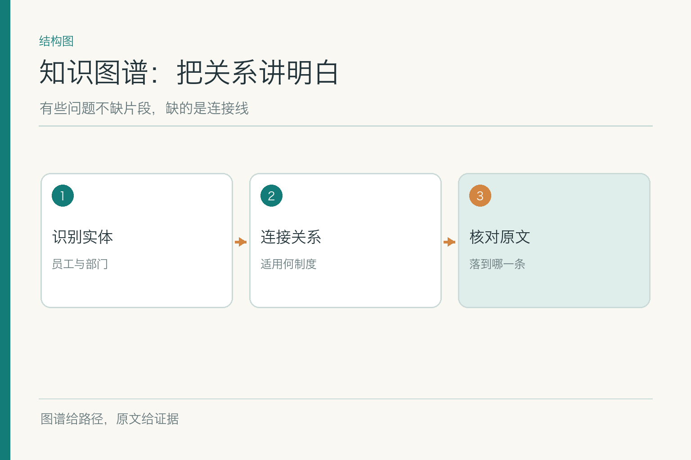
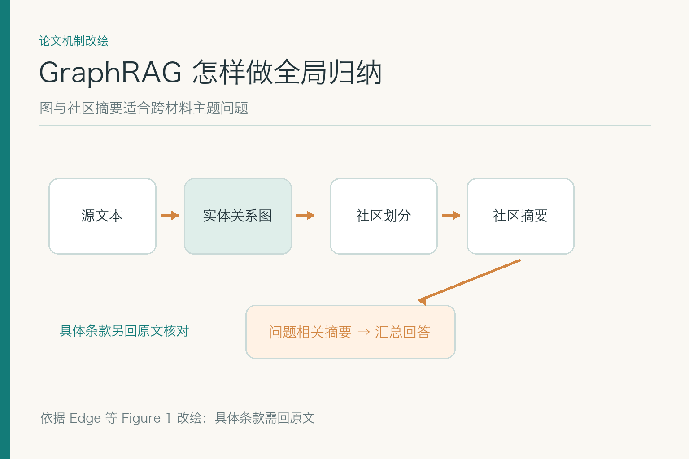
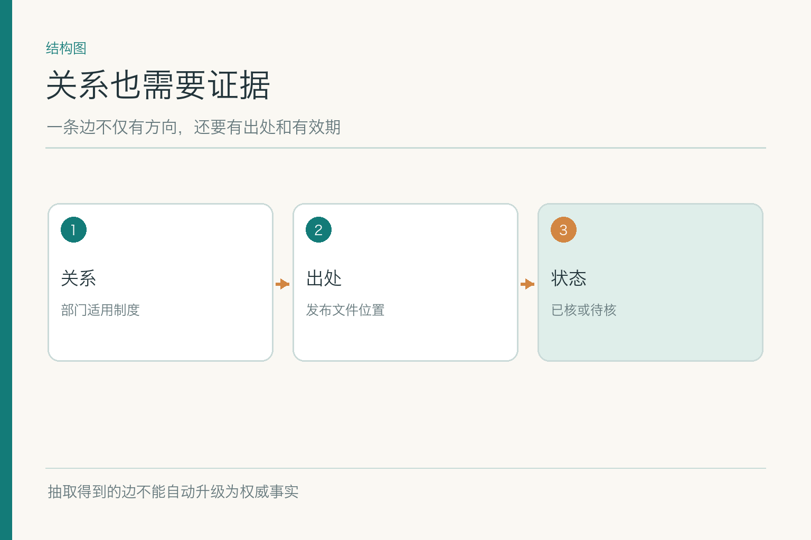

# 面试题：知识图谱与 GraphRAG 何时值得用

项目入口：[AI Agent 知识图谱仓库](https://github.com/Jennifer123www/ai-agent-knowledge-map)，可看总览、初学者图解及题目下钻。以下沿用虚构案例：小林是研发部 A 职级员工，9 月 15 日北京住宿 480 元；旧规上限 450，新规 9 月 1 日起上限 500。面试不应一听“图谱”就画圆圈，先判断是否真的需要关系。

## 问题 1：知识图谱与向量索引究竟差在哪里？

**原理：** 向量索引主要按表示空间中的近似程度找文本；图谱显式保存实体、关系及属性，适合沿关系回答多跳问题。二者不是同一种数据的两种皮肤，也都不能单独证明业务规则的效力。

**答题点：** ① “北京住宿标准”这类模糊问法可用向量找候选原文；② “小林属于哪个部门、适用哪版制度”需要明确的关系与时间；③ 图节点和边需回指来源；④ 问题简单时优先原文检索或数据库，勿为图而图。示例中“480 与 500”比较容易，确认小林适用哪条才是关系难点。

**记忆点：** 相似度找像的，图谱说明怎样相连。**常见追问：** 向量结果能否直接生成边？只能作为候选，须消歧并核对原文。**失分点：** 宣称图谱“比向量检索更准确”，却不说明准确在哪类问题上。

如果面试官让你举反例，问“差旅制度第七条原文是什么”，优先文本或编号检索；问“哪些员工受第七条修订影响”，才要连接员工、部门、职级和制度范围。前一个问题用图谱可能增加不必要的抽取误差，后一个问题只用相似片段则难以完整枚举。以问法区分工具，比背两个技术名词更有说服力。

## 问题 2：怎样设计实体、关系和出处？

**原理：** “员工—属于—部门”只是起点。若没有实体 ID、关系定义、有效期与出处，图中看似严谨的路径也无法审计。

**答题点：** ① 给员工、部门、政策、条款稳定 ID 和类型；② 关系用明确动词及方向，区分“发布”“适用”“修订”；③ 记录来源文件、表格行、页码或业务记录；④ 对会变化的关系保留有效时间和审核状态。小林“属于研发部”若来自上年组织表，不能自动用于今年报销。

**记忆点：** 节点有身份，边有语义，结论有出处。**常见追问：** 关系是模型抽取的怎么办？保留候选状态与证据，高风险边人工或规则审核后再参与判断。**失分点：** 只有三元组，没有来源、版本与时间。

进一步可说明关系属性如何建模：同一“适用”关系要带地区、职级和有效区间，或者把这些条件拆为可核的中间节点。选择取决于查询需求，但不能把条件丢掉。若“研发部适用政策”本来只对 A 职级成立，建成一条无条件的边，就等于在数据层提前替所有员工做了错误裁决。

## 问题 3：同名实体如何消歧？

**原理：** 文本里的名称不是全局唯一标识。“华东区”可能指销售组织，也可能是政策地区分组；强行合并会把不相干的关系接成一条路径。

**答题点：** ① 用实体类型、来源系统和稳定键做初筛；② 参考上下文、上级组织和时间；③ 候选不确定时保留多个 ID 与待核状态；④ 建立冲突样本，测错误合并率及漏合并率。示例里“研发部”也可能在多家公司出现，必须带组织域。

**记忆点：** 名字像，不代表是同一个。**常见追问：** 是否可以只靠嵌入相似度？可以辅助候选匹配，但业务身份仍要由可靠键或审查确认。**失分点：** 不设实体 ID，只以展示名称连边。

可以给一个双向错误例子：把“华东销售区”与“差旅华东档位”合并，会产生本不该存在的路径；把同一部门在新旧系统里的两个名称完全分开，又会漏掉真实关联。评测不能只看“合并成功率”，还要同时看错合并与漏合并，并在组织变更时重跑样本。

## 问题 4：多跳问题怎样走图又不丢证据？

**原理：** 多跳查询从已知实体出发，逐步沿允许的关系到目标。每一步的条件与有效期都必须成立；最终路径仍需回到原文条款或业务记录核验。

**答题点：** ① 明确起点身份与目标，如“适用住宿上限”；② 限制关系类型和跳数，避免任意游走；③ 边逐条核对来源、日期和权限；④ 对缺边、冲突边给出“不足以判定”及缺口。若“小林—属于—研发部”未经确认，后面即使找对 500 元条款也不能直接给肯定结论。

**记忆点：** 路径每一步都要站得住。**常见追问：** 路径太多怎么办？按规则过滤候选，再比较证据质量；不要仅以最短路径判真。**失分点：** 认为图搜索返回路径就是事实证明。

路径中最好保存每一步的有效时间，而不是只在终点查一次“当前政策”。小林 9 月 15 日的部门归属、职级、地区标准都要与那次住宿对应。若身份系统只能提供今天状态，系统不能自动推断上月他也在同一部门；应查历史记录或缩小结论。这类时间穿越，比图搜索算法本身更容易让业务答错。

## 问题 5：什么时候用 GraphRAG，什么时候不用？

*依据 Edge 等《From Local to Global》Figure 1 改绘；具体条款仍需原文核对。*

**原理：** 代表性的 GraphRAG 研究先从文本抽实体与关系，形成图与社区摘要，再支持跨大量材料的全局主题归纳。它解决的不是“所有检索都应该变成图”，而是片段搜索难以覆盖跨材料关系与总体主题的场景。

**答题点：** ① 先统计真实问题中多跳、全局问题占比；② 估算抽取、社区构建、更新和评测成本；③ 把普通检索作为基线；④ 区分局部路径问答与全局主题摘要的评价方式。小林的单条报销判断大概不需要社区摘要，若问“近三年各地区政策变化主线”，才可能有收益。

**记忆点：** 图谱为关系服务，GraphRAG 为合适的问法服务。**常见追问：** 社区摘要能直接作政策证据吗？不能，摘要可能省略例外，结论要回源文。**失分点：** 把论文架构照搬到很小的资料库。

比较方案时要明确基线：普通全文检索能否回答局部制度题？现有业务表能否直接提供部门关系？若两者已解决大多数问题，GraphRAG 的建设成本只有在跨材料主题覆盖、关系导航或用户研究任务上有明显收益时才说得通。面试不是比谁架构图复杂，而是比谁能给复杂度找到证据。

## 问题 6：关系过期时如何更新？

**原理：** 图的边会随着部门调整、制度修订和地区划分变化。只追加新边、不失效旧边，会让“当前适用”同时指向两套相互冲突的规则。

**答题点：** ① 记录生效与失效时间；② 建立来源变更到图边的映射；③ 更新时检查旧边是否应关闭或保留历史；④ 用含业务日期的回归问题验证。小林 9 月 15 日应按示意新规查询，8 月的历史问题则按当时规则回答，前提是制度没有追溯条款。

**记忆点：** 图会变，历史不能被新边擦掉。**常见追问：** 已撤回制度关联的边怎么办？从线上路径中失效并审计，不能因技术回滚恢复成有效政策。**失分点：** 用建图时间替代关系有效期。

更新任务需要知道“哪份来源产生了哪几条边”。新制度只修改北京额度时，未必需要重建整张图，但相关条款、城市档位和社区摘要可能都要更新。若只增加新边而不关闭旧边，路径搜索会同时返回 450 和 500；若直接覆盖旧边，又失去历史问题的解释能力。时间化版本是维护的核心。

## 问题 7：图上得出的结论怎样回到原文？

**原理：** 图谱是一种派生表示。即便路径存在，回答仍需指向可打开的原始文件、表格记录或正式发布页；否则读者只能相信一张机器画出的地图。

**答题点：** ① 边记录来源 ID 与位置；② 对关键断言逐条找来源，不把整条路径合成一个笼统引用；③ 核查原文是否仍有效且在用户权限内；④ 来源断裂时降级为待核，而非自动补一条边。W3C PROV 提供描述实体与派生来源的参考模型，落地不一定要引入整套本体，但关联必须能查。

**记忆点：** 图给路线，原文给凭据。**常见追问：** 受限来源能否显示完整引用？不能，须按权限呈现可分享的证据或交有权者复核。**失分点：** 只列出图节点名称，称之为“可溯源”。

回溯时还应防止“来源循环”：某条图边的依据是一个自动摘要，而摘要又引用这条图边，最后看似两处相互佐证，实际都源自同一个未经核验的抽取。应一路追到独立原文或业务记录，并标明哪些结论只是模型推断。只给内部节点 ID，不足以让读者核查。

## 问题 8：如何评测一张图有没有帮上忙？

**原理：** 图谱评测不只看最终答题准确率，还要拆开实体抽取、消歧、关系正确性、时间一致性、路径完整性与出处可用性。图可能偶然答对问题，却埋着大量错边。

**答题点：** ① 准备人工核准的实体关系和多跳问题；② 分层统计漏边、错边、错合并和旧边未失效；③ 比较图谱方案与原文检索基线在同一题集上的质量、延迟及成本；④ 将新政策、缺边、冲突与无权访问作为必测变化。样本量、分母和题目分布要写出来，不能只展示一条漂亮路径。

**记忆点：** 先验边，再验路径，最后验回答。**常见追问：** 图谱性能提升但维护成本翻倍怎么办？看多跳问题的真实占比和业务收益；若基线足够好，不建图也是合格方案。**失分点：** 把图上节点数量当质量指标。

报结果时可以分三组：实体层有没有把同名对象认错，关系层有没有把旧边当当前有效，任务层有没有把真实多跳题答对。每组写出样本、分母和来源版本，再与不用图谱的检索基线比较。若总体答对率不变，却多了一套抽取和更新流程，图谱未必值得成为默认路径；也许只在少量复杂问法启用。

面试官若问“如何最小化试点”，可以挑一类有明确关系而原文检索经常漏答的问题，例如“哪些部门受新差旅条款影响”。只接入正式组织关系和政策适用表，保留每条边的原始记录，用十几道多跳题与原有检索方案比较。若这一步都没有可测收益，就不急着做社区摘要或把所有文档建成大图。

反过来，若试点显示图谱能找全受影响对象，还要再查“边是否真实、出处能否打开、组织变更能否及时同步”。业务方要的是可依赖的名单，不是一张看似复杂的网络海报。把收益和维护义务同时说出来，答案才完整。

项目总览、初学者图解与对应面试题见 [AI Agent 知识图谱仓库](https://github.com/Jennifer123www/ai-agent-knowledge-map)。

## 参考资料

- [Edge 等：From Local to Global: A Graph RAG Approach to Query-Focused Summarization](https://arxiv.org/abs/2404.16130)
- [Microsoft GraphRAG：索引数据流](https://microsoft.github.io/graphrag/index/default_dataflow/)
- [W3C：PROV-O](https://www.w3.org/TR/prov-o/)
