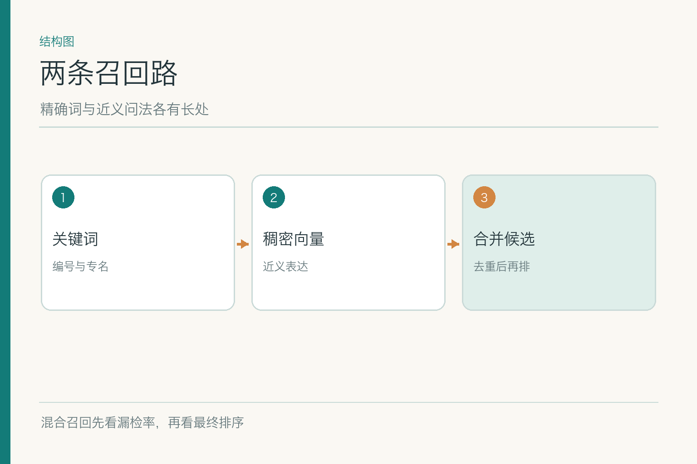
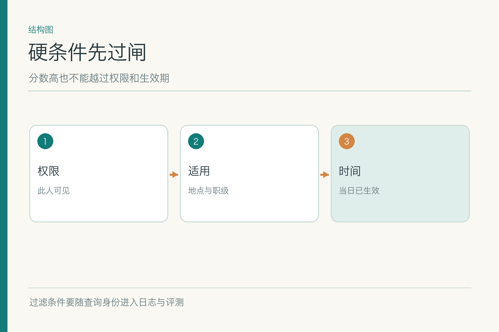
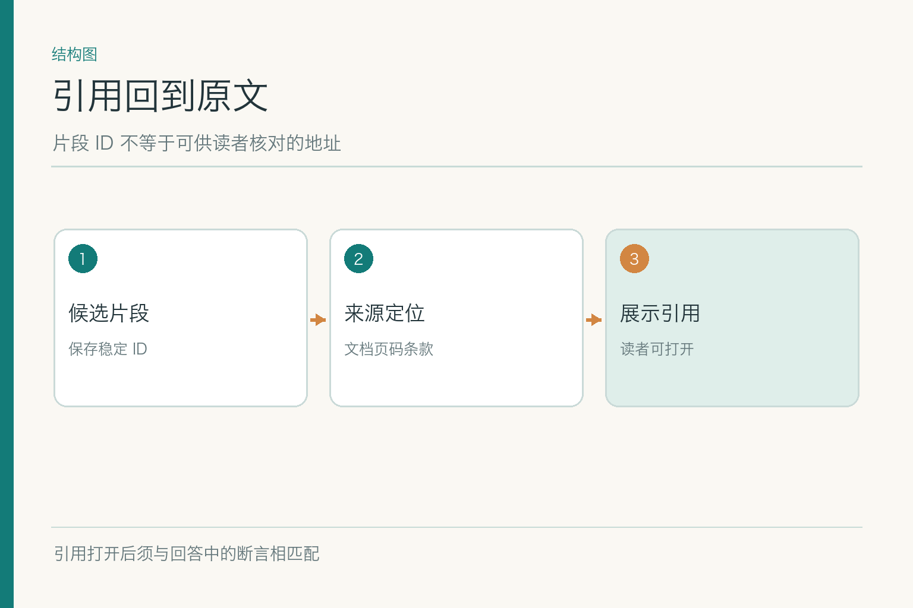
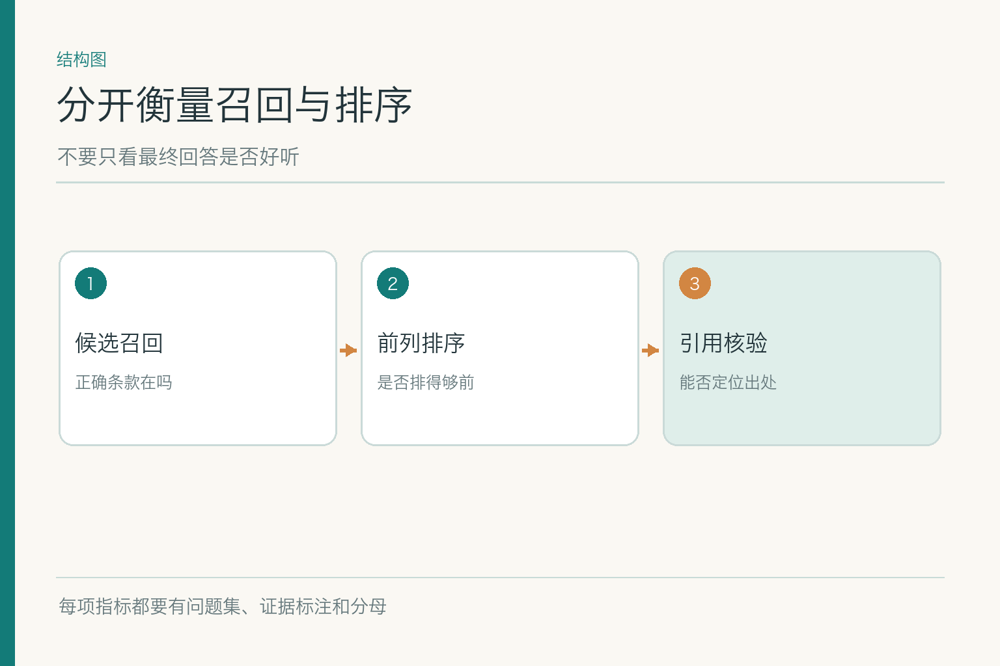

# 面试题：检索为什么找到了还会选错

项目入口：[AI Agent 知识图谱仓库](https://github.com/Jennifer123www/ai-agent-knowledge-map)，有总览、图解与题目。虚构案例里，小林 9 月 15 日北京住宿 480 元，旧规上限 450，新规 9 月 1 日起上限 500。两版文字都像问题，检索题的核心不是背一个 `Top-k`，而是说清**候选怎样来、哪些不能用、哪些应排前面**。

## 问题 1：关键词检索和稠密检索怎样选择？

**原理：** 关键词检索依赖词项匹配和统计权重，适合编号、专有名词、精确短语；稠密检索把问题与文档分别编码成向量，擅长近义改写，但语义相近不等于业务适用。

**答题点：** ① 先分析真实问题是否含编号或同义改写；② 关键词路径关注分词、字段权重与精确匹配；③ 稠密路径关注编码模型、索引与近邻召回；④ 用同一标注题集比较漏检率、时延与成本。示例中“酒店住宿费”可能靠向量找到“住宿补助”；制度编号则宜让关键词直接命中。

**记忆点：** 专名靠字面，改写靠语义，最终由题集说话。**常见追问：** 能否只做向量？可以作为基线，但数字、版本号和短代码往往需要额外检查。**失分点：** 认为向量已经淘汰关键词。

现场可以问考官要两类示例：一类用户知道制度编号，一类只会说“住店费”。前者用关键词或字段查询有明显优势；后者需要处理资料与口语的表达差异。方案先跑两条基线，再看同一证据标注集上的漏检分布。若两个方法错在不同题上，混合才有意义；若错在同一批过期资料上，应先修资料治理。

## 问题 2：混合召回的结果怎样合并？

**原理：** 关键词和向量分数的尺度不同，不能把两个原始分数随意相加。合并可先按稳定片段 ID 去重，再用排序位置融合或学习式打分，并保留两路来源用于诊断。

**答题点：** ① 明确两条路径各取多少候选；② 分数不在同一尺度时避免直接相加；③ 以文档 ID、版本、条款位置信息去重；④ 比较融合前后正确证据进入候选的比例。小林的旧新制度文本相似，但版本不同，不能被“相似去重”合成一条。

**记忆点：** 合并候选，不合并制度版本。**常见追问：** `RRF` 何时可用？它用排序名次融合多个列表，可作基线，但仍需实测与硬过滤。**失分点：** 只说“关键词加向量更稳”，不解释怎样合并。

合并时不妨保留候选来源标签：这条由关键词找到，那条由向量找到，二者都找到的也单独记录。这样新版制度没进入候选时，能知道是哪一路漏了；旧版挤占前列时，能看出是融合策略还是索引数据。不要只保留一个融合后分数，把所有诊断线索都丢掉。

## 问题 3：权限和生效日期过滤应放在哪？

**原理：** 权限、地区、职级、生效时间是约束，不是相关性偏好。索引允许时尽量在查询中限制；至少要在候选进入生成模型或返回用户前由受控层排除不适用资料。

**答题点：** ① 先核验查询者身份与资料权限域；② 用业务发生日比较政策有效期，而非只看今天；③ 缺职级时不默认 A 职级；④ 记录过滤前后候选与原因，测误杀和漏放。示例中旧规可能在字面上排名更高，也不能越过“9 月 15 日适用新版”的正式条件。

**记忆点：** 硬条件过闸，软分数再排序。**常见追问：** 后过滤会否导致候选不足？会，可能需要扩大召回或支持索引预过滤，但绝不能为凑数量泄露无权资料。**失分点：** 用大模型提示词执行权限。

还要说明缺值如何处理。用户说“我是 A 职级”与身份系统验证的结果不同；如果身份未核，不能把 A 当成硬过滤条件去给出肯定结论。可先返回公开制度并说明“若经核实属于 A 职级”，或追问身份信息。权限字段缺失则应默认不放行受限资料，而不是把空值解释为全员可见。

## 问题 4：重排序模型为什么有用，又救不了什么？

*依据 DPR §2.1 与 Nogueira、Cho 的重排序研究 §2 改绘。*

**原理：** 双编码器使大库候选搜索可行；联合编码重排把问题与少量候选一起读，可比较更细的词句关系，但计算更贵。它只处理被召回的候选，不会从库里找出漏掉的条款。

**答题点：** ① 先确保正确证据在较大候选集里；② 用重排提升前几条相关性；③ 同时衡量延迟和计算成本；④ 把权限与生效条件留给硬校验。小林的新版制度若从未被召回，再强的重排也无米下锅。

**记忆点：** 召回负责“在场”，重排负责“坐前排”。**常见追问：** 旧版比新版更像提问时怎么办？用正式有效期过滤，别期待模型凭语气裁定。**失分点：** 说重排能修复所有错答。

实验设计上，把候选集合固定，再分别比较“无重排”和“有重排”的前列命中、延迟和费用；这样才知道收益来自模型而非上游召回变化。若正确条款根本不在候选里，应回去改召回或索引，不能只调重排阈值。将权限和业务时间放到排序分数里软性加权，也不能替代硬约束。

## 问题 5：候选去重为什么不能只看语义相似？

**原理：** 新旧条款可能只差一个数字或日期，语义高度相近，却对应不同有效期。若按向量相似度删“重复”，可能删掉最关键的新版本。

**答题点：** ① 区分同一版本的重复片段与不同版本的相似条款；② 以来源 ID、版本、条款位置作去重依据；③ 统计候选多样性，避免全被某一旧文档占满；④ 对保留的冲突版本分别标适用条件。小林的 450 和 500 不能被平均成 475，更不能随机删一条。

**记忆点：** 看起来重复，不等于业务上等价。**常见追问：** 重叠分段产生的重复怎么办？可在同版本同条款内去重或聚合，保留定位。**失分点：** 一句“按相似度阈值去重”就结束。

可以举一个最小差异：旧条款写“450”，新条款写“500”，其他五十个字完全相同。向量表示大概率非常接近，但这两个数字正是业务问题的中心。去重时应以版本和原文位置为边界；合并展示时可说明“此处有旧新差异”，绝不能做文本平均或任意选一条作为代表。

## 问题 6：引用链接由检索层怎样提供？

**原理：** 检索片段需能回指版本化原文，而不是只返回一串机器抽出的文字。引用至少需要来源 ID、页码或条款、稳定链接和用户访问条件。

**答题点：** ① 索引写入时保存原文定位；② 片段与文档版本关联；③ OCR、摘要等派生内容引用原始位置；④ 点击时再核权限与页面可达性。若链接只打开旧版 PDF 首页，“出处”对核对新规帮助很小。

**记忆点：** 找到的是片段，交出去的是可核对的位置。**常见追问：** 用户无权打开来源怎么办？不能泄露原文；标明受限并交有权流程核对。**失分点：** 把候选的数据库内部 ID 当可读引用。

引用测试不能只检查 HTTP 状态码。链接打开到正确文档首页，但条款在第 37 页，用户仍难以核对；链接打开到新版本第七条，但回答依据其实是旧版第七条，更是隐蔽错位。应验证版本、页码或条款锚点以及正文片段内容，再以当前用户身份验证访问权限。

## 问题 7：如何分开评测召回与重排序？

**原理：** 召回层要看目标证据是否进入足够大的候选集合；重排序层看目标是否来到生成可见的前列。最终答案正确与否还受生成影响，不能替代这两项。

**答题点：** ① 给问题标目标条款及版本；② 报 `Recall@k` 等候选覆盖指标；③ 报前列命中或排序质量；④ 按普通、编号、同义、冲突、无权限题分桶，并写样本与分母。一个总平均值可能掩盖新版政策题全部失败。

**记忆点：** 先看进没进候选，再看排到第几。**常见追问：** 标注可以有多个正确片段吗？可以，答案可能需要主条款与例外，评测规则应事先写清。**失分点：** 只用生成答案打分反推检索好坏。

给指标时要写 `k` 的大小和问题数。例如“50 道旧新冲突题，正确新版条款进入前 20 候选的有多少，进入最终前 5 的又有多少”。如果只报一项 `Recall@100`，大多数题可能看似成功，生成模型实际只收到前五条时却依然答错。缺值和越权题还要统计不该返回的内容是否出现。

## 问题 8：时延预算紧时如何降级？

**原理：** 混合召回与联合重排增加计算和时延。降级应有明确条件和可用范围，不能把“不方便算”变成“随便找个旧版回答”。

**答题点：** ① 量出各阶段的延迟分布和错误收益；② 只对复杂问法启用昂贵重排，简单编号走直查；③ 重排不可用时保留权限与时间过滤，可用受控关键词或数据库查询；④ 无法获得适用证据则停答并说明缺口。质量、95 分位时延和成本应一起看，而不是只比平均响应时间。

**记忆点：** 可以省精排，不能省硬规则。**常见追问：** 重排服务超时时是否直接用召回第一名？只有经过适用性校验且风险允许时才可有限回答。**失分点：** 降级方案绕开权限过滤。

降级策略最好与风险匹配。普通公开 FAQ 可先用关键词直查；制度适用、财务金额等问题若缺少可信证据，应停止肯定判断或交人工。上线前模拟向量索引超时、重排服务失败和权限服务不可用，检查每种情况下系统到底读到了什么、输出了什么。低延迟不应靠把错误风险转给用户获得。

面试收束时可以把一次检索请求讲成可观察的记录：问题和身份进入系统，关键词与向量路径各产出一组候选，权限与业务日期过滤标出排除原因，重排序给剩余候选排序，最终证据带原文位置交给生成层。若答案用了旧制度，先看新版有没有进入候选；若进了候选却被挡掉，查过滤；若留在后排，查排序；若前排正确还答错，再交给生成层排查。

不要用“检索准确率 90%”结束这个故事。应说清标注了多少题、正确证据定义是什么、`k` 是多少、哪类题失败、是否出现越权候选，以及增加重排后多花了多少时间。特别是旧新版本只差一两个字的题，应单独列出；这类题对报销判断的影响，往往比一般同义词漏检更大。

若权限服务或制度元数据本身不可用，检索层应明确返回无法安全选择的状态，而不是退化成全库相似度排序。一个诚实的失败信号，让上游有机会追问或停答；一个看似完整却含无权资料的候选列表，会让后面的每一层都更难补救。

项目总览、初学者图解和面试题见 [AI Agent 知识图谱仓库](https://github.com/Jennifer123www/ai-agent-knowledge-map)。

## 参考资料

- [Karpukhin 等：Dense Passage Retrieval](https://arxiv.org/abs/2004.04906)
- [Nogueira 与 Cho：Passage Re-ranking with BERT](https://arxiv.org/abs/1901.04085)
- [Cormack 等：Reciprocal Rank Fusion](https://dl.acm.org/doi/10.1145/1571941.1572114)
