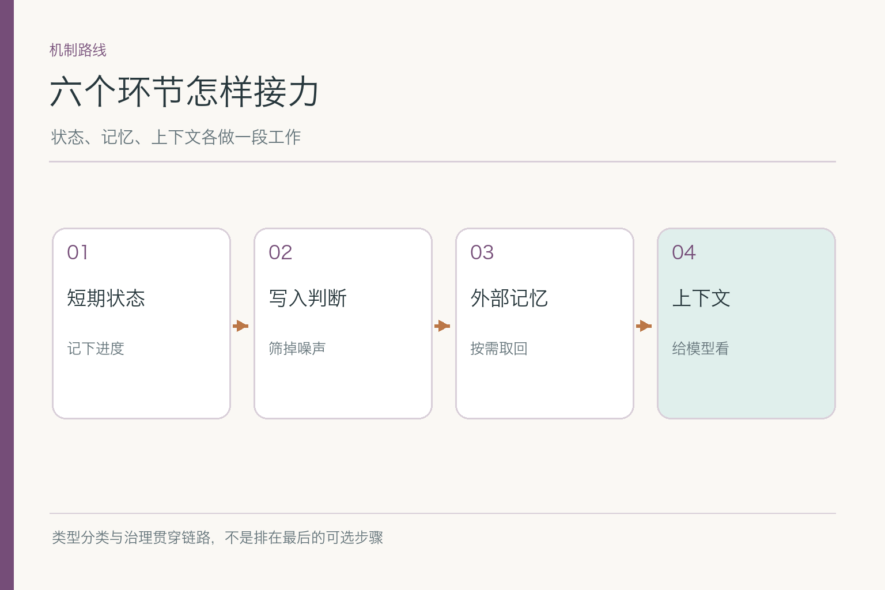
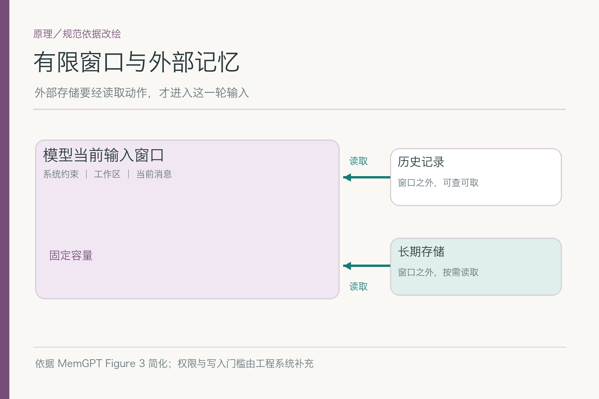

# 记忆与上下文工程：该记什么，该看什么

项目入口：[AI Agent 知识图谱仓库](https://github.com/Jennifer123www/ai-agent-knowledge-map)。网站里有同主题的初学者图解和面试题；这组推文先讲六个子模块如何接力，具体机制分别留给下钻文章。

小林上传一张住宿票据，请助手准备报销草稿。系统已经识别出票面金额和日期，正等着核对当天适用的制度；这时页面关闭了。第二天小林回来问：“到哪一步了？请用中文，先给结论。”与此同时，报销制度也刚更新。**票据是否真实、员工身份、制度适用性和是否完成提交都尚未核实**；这里的报销情境是教学示例，不代表任何真实公司的制度。

如果助手把昨天的聊天全文贴给模型，信息可能很多，却仍答不出“做到哪步”。如果它拿旧制度下结论，或把“准备草稿”说成“已提交”，就算语气再自然也不可靠。要解决的其实是两个不同问题：**未来要留下哪些信息？当前这一轮又该让模型看到哪些信息？**

## 一、中断后需要恢复的是任务，不是聊天气氛

报销流程此刻最重要的不是“小林昨天怎么措辞”，而是任务状态：票据识别是否完成，识别字段是否校验，下一步该查哪版制度，有没有调用过提交接口。短期状态保存的是**当前任务进度与可恢复结果**。它可以随任务结束归档或过期，不能因为它被存进数据库，就自动变成长期用户偏好。

另一类信息跨过这次任务还可能有用：小林明确要求常用中文、回答简洁、先给结论。这是长期记忆的候选；是否保存，还要看用户意图、产品规则、用途与权限。票面金额是本次报销的数据，不该因为模型看见过，就写进“小林的长期画像”。二者常一起出现在同一轮对话中，寿命却完全不同。

恢复任务时，系统先读短期状态，再核对外部业务系统的真实动作状态。假如提交接口昨晚已经成功，仅凭对话里“还没等到确认”就再提交一次，可能生成重复单据。相反，如果只有草稿，助手也不能说“已经审批”。**状态说明过程到哪儿；真实业务结果还得去业务系统查。**

## 二、写入前，先给候选信息找去处

系统可能从这段交互中抽到四条信息：“票据识别完成”“小林喜欢中文答复”“旧制度上限是多少”“小林昨天曾被退单”。它们不能进同一个叫“记忆”的大抽屉。第一条是本次任务状态；第二条可能成为受控偏好；第三条应回到制度原文和生效版本核对；第四条如果将来确有诊断价值，可作为有时间与来源的经历，而不是当成“小林总会被退单”的人物标签。

“记忆类型与用户画像”负责说清信息的用途，“记忆写入与更新”负责决定一条候选能否成为有效记录。它们有先后依赖，却不是两台自动盖章机器。用户随口说“这次先用英文”可能只是本轮例外；用户明确说“以后都请用英文”，才构成更新长期偏好的有力依据。旧值是否退出、变更如何留痕，要由写入规则处理。

这里还有一个容易踩的坑：模型从几次对话推断出“小林一定喜欢短回答”，不能直接当作用户已确认的事实。越是长期使用的记录，错误越会被反复带回；谨慎保存常常比“聪明地记住一切”更省事。

## 三、外部库里有，不等于模型这轮已经看见

长期信息通常放在模型输入窗口之外。模型这轮能处理的，是本次请求实际送入的 `token`：指令、问题、选中的状态、资料和记忆等。`token` 是模型处理文本的单位，不等于一个汉字。把用户所有历史和公司所有制度都塞进去，既占窗口，也会让旧资料与新资料争夺注意。

*依据 [MemGPT](https://arxiv.org/abs/2310.08560) Figure 3 简化：有限窗口和窗口外存储之间需要读取动作；权限与写入门槛是工程补充。*

这幅图要表达的不是“记忆库越大，模型越聪明”，而是**存储、检索和本轮输入是三个动作**。MemGPT 用操作系统的内存层级作类比，让固定窗口的模型通过函数调用管理外部信息；本文并不把它的具体实现当成所有 Agent 的标配。小林的中文偏好即使已保存，也需要按身份和任务取回，才可能影响这一轮答案。

反过来，能取回也未必该取回。另一个用户的偏好、已经删除的记录、与报销无关的旧经历，都不该因为文本相似就进入输入。读者可以把这想成办公桌：仓库里有很多档案，桌上只摆这次要用且有权查看的几份。比喻到此为止；真正的权限过滤必须由系统执行，不能靠模型自觉。

## 四、这一轮材料怎样排，决定它会怎样答

回到小林的报销。当前输入至少需要任务目标、已确认的票据字段、昨天的处理节点、今天适用的制度证据，以及“只准备草稿，不代表已提交”的动作边界。上下文构造负责**筛选、排序、压缩和标明来源**。这与写一个漂亮提示词有关，却不只等于提示词修辞。

若制度从旧版换成新版，系统应先按身份、地点、生效日和权限过滤。得分高的旧条款不能越过这些硬条件。假如票据日期不明，就不能仅凭新版上限给出确定结论；先追问日期，或给出条件式说明。这里的细检索策略属于“知识检索与 RAG”主题；本篇关注的是检索结果**能否、应否、以什么标记进入当前输入**。

长输入还有位置问题。研究者在特定长上下文问答任务里发现，相关证据放在开头或结尾时，模型有时比放在中间更容易使用；这不是每个模型的固定规律。工程上不能只说“窗口够大就全贴”，而要保住最新确认的金额、日期、动作状态和引用地址，并用普通、冲突、缺值样本测试真实效果。

## 五、治理不是完工后的最后一道门

小林若要求删除“中文、简洁”的保存偏好，系统需要定位这条记录，还要让检索索引和缓存不再把它带回来。只把设置页面的开关关掉，下一次回答仍按旧偏好来，删除就没有闭环。长期记忆因此必须从写入时就记录身份、来源、用途、保留与删除范围；短期任务状态也要防止跨用户混用。

治理还约束读取。员工 A 的报销进度不能被员工 B 问出来；一个负责生成通知的 Agent，也不该因此获得查看全部报销数据的权限。**记忆可被存储，是技术事实；某个任务有权读取，是另一项判断。**日志应能追到是哪条记录影响了回答，但日志本身也不该成为新的敏感信息仓库。

这里说的是通用工程控制，不是某个地区法律的统一条文。具体保留期限、删除义务和备份处理，要按部署场景、组织政策与适用要求确定。把“永不忘记”当产品卖点很容易；让它在该忘时确实忘掉，才是可用系统的功课。

## 六、六个子模块在同一条链上怎样分工

顺着小林的任务走，短期状态告诉系统昨天做到哪一步；记忆类型区分进度、经历、事实和偏好；写入与更新决定哪些候选值得长期保存；长期记忆只在未来任务需要时供检索；上下文构造为这一轮选材料；治理约束整个过程的身份、权限、保留与退出。六块可以采用不同存储和框架，但这六个问题不会因为装了一个“记忆插件”就自动消失。

有些信息会经过不止一块。例如中文偏好先由类型判断是否属于画像，再过写入门槛，后来从长期库取回，最终由上下文构造决定是否放进本轮。任何一步读到“今天请用英文”，就不能让旧偏好盖过明确的新要求。**信息要跨环节流动，事实与约束不能在交接中变形。**

还有两条边界要记住：外部知识库里的制度不是用户记忆；模型参数里曾学过的常识也不是公司当天的有效制度。前者查资料，后者只是模型已有能力；本轮是否可信，仍取决于当前可核对的来源。

## 七、验收时，把“答对了”拆开看

做一组小测试：小林中断前、识别后、制度查询后、提交接口调用后分别关闭页面，再回来询问进度。要看能否正确恢复，是否重复提交，能否识别新版制度，以及在缺票据日期时是否停下追问。这比只看最后一句“可以报”更能发现问题。

长期记忆另测：同一用户跨会话的明确偏好能否生效；本轮临时例外会不会覆盖它；用户更正后旧值是否退场；删除后索引、缓存会不会回流。上下文另测：旧新资料冲突、关键证据放中间、不可信网页夹带指令、`token` 预算吃紧时，是否还能坚持来源与权限。每一类失败要记到对应环节，不能统统归为“模型幻觉”。

## 八、上线前还要给整条链留退路

假如新版本开始把“曾经要求中文”错当成每轮都必须中文，先别急着重训模型。要保留一份可比较的基线：关闭长期记忆时答案怎样，开启后哪些任务受益，哪些任务受到旧偏好干扰。按用户范围逐步放量，记录本轮实际取回的记忆 ID、来源版本和上下文构造版本；发生错误时，才有办法分清是旧值没退出、检索捞错记录，还是本轮规则被放错位置。

回退也应分层。短期状态恢复不稳，可以暂时要求用户重新确认关键字段，避免重复提交；长期偏好误用，可以暂时关闭这类记忆的读取，不必删掉全部任务进度；制度证据冲突，就停在“待核”而不是用旧制度凑一个确定答案。**降级的目标是少做未经证实的事，不是把错误隐藏在一句更顺口的话里。**

每次版本发布都应固定一批小林这样的变化样本：中断、偏好更正、制度更新、权限变化和删除请求。记录分母、版本及失败类型，再比较新旧链路。若只展示“成功恢复的一例”，读者无法判断这套记忆到底可靠，还是碰巧没有遇上冲突。
不同环节的错误还应分别反馈给负责状态、记忆、检索和权限的人，而不是只给模型团队一张模糊的差评单。

这组文章的后六篇，会分别把这些环节展开。读完总览只需要带走一个判断：**该记的是经过筛选、可管理的信息；该给模型看的是当前任务必要且可信的信息。**两者相互配合，却不是同一个开关。

项目的模块总览、初学者图解和面试题见 [AI Agent 知识图谱仓库](https://github.com/Jennifer123www/ai-agent-knowledge-map)。

## 参考资料

- [MemGPT: Towards LLMs as Operating Systems](https://arxiv.org/abs/2310.08560)
- [Generative Agents: Interactive Simulacra of Human Behavior](https://arxiv.org/abs/2304.03442)
- [Lost in the Middle: How Language Models Use Long Contexts](https://arxiv.org/abs/2307.03172)
- [LangGraph：Thinking in LangGraph](https://docs.langchain.com/oss/javascript/langgraph/thinking-in-langgraph)
- [Anthropic：Effective Context Engineering for AI Agents](https://www.anthropic.com/engineering/effective-context-engineering-for-ai-agents)
- [NIST Privacy Framework](https://www.nist.gov/privacy-framework)
