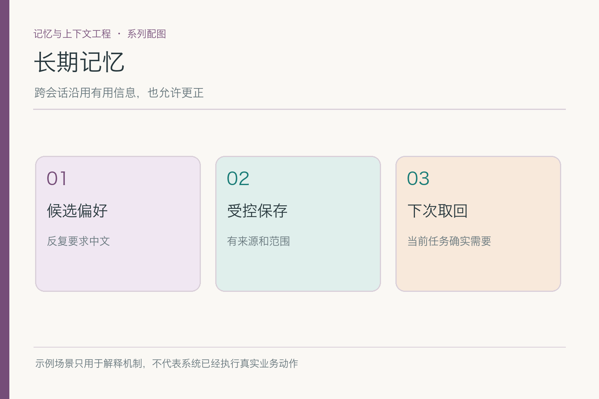
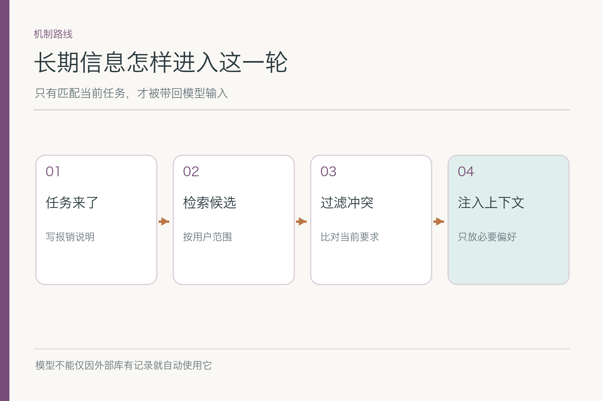
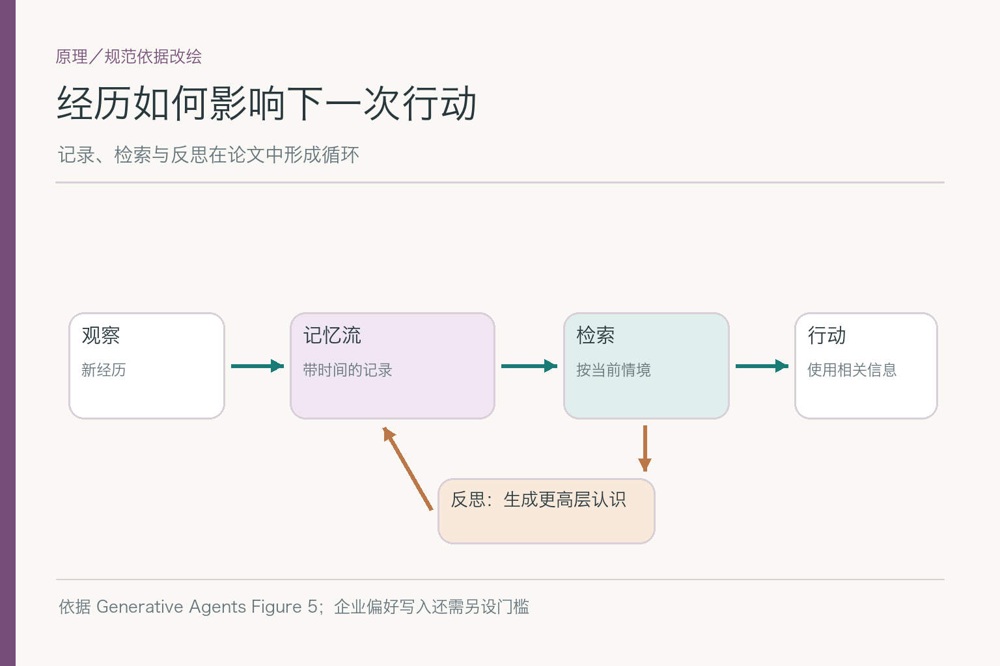
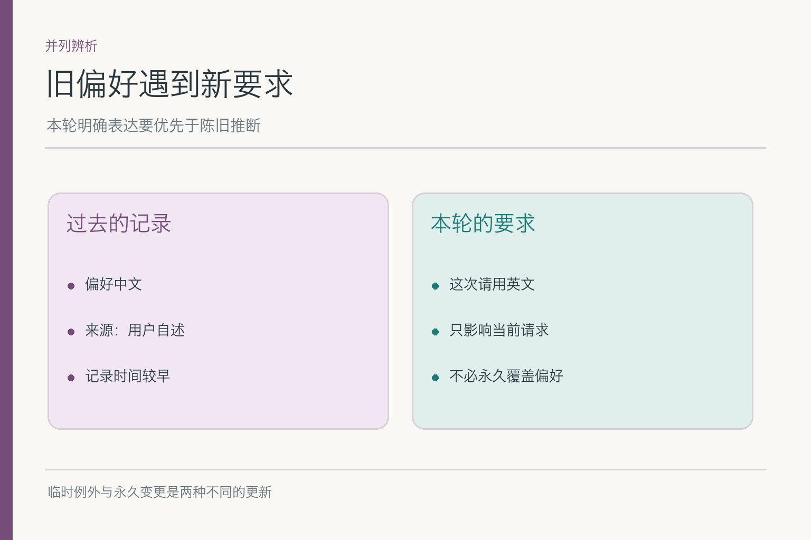
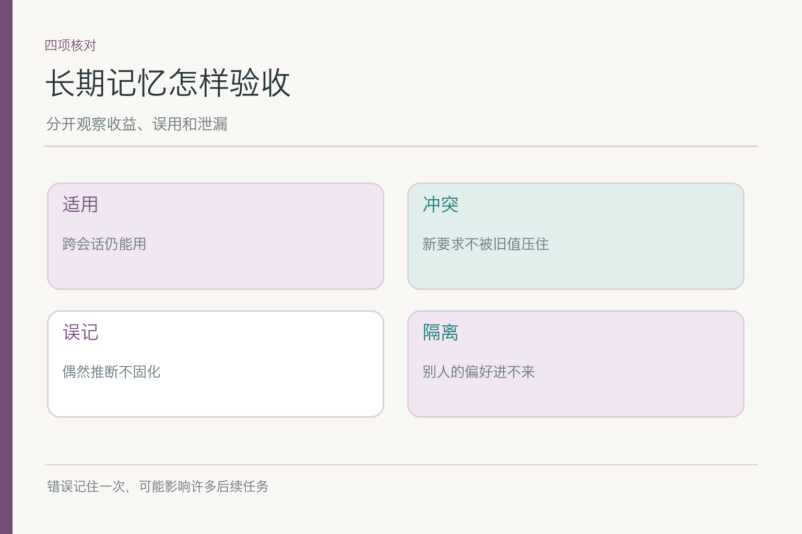

# 面试题：长期记忆如何留下有用的过去

项目入口：[AI Agent 知识图谱仓库](https://github.com/Jennifer123www/ai-agent-knowledge-map)。本篇练**跨会话持久信息**；怎样把一条候选安全写入、如何处理数据库并发更新，另见“记忆写入与更新”。

共用案例：小林多次明确要求，给他的写作草稿默认中文、简洁、先给结论。几天后他请助手写一封报销进度邮件，本轮没有重述该偏好；又在另一轮临时要求“这次请写英文”。旧偏好有来源，但不能压过眼前的明确例外。面试时始终用这两个请求解释取舍，不要临时换成一个无关的购物故事。

## 问题 1：什么情况下值得引入长期记忆？

### 原理

长期记忆服务跨会话重复出现的任务需要，而不是 Agent 的必备装饰。保存前应比较未来收益与误记、隐私、检索和维护成本。小林明确的写作偏好可能减少反复交代；本次报销金额只属于当前任务，长期保存既无必要也容易误用。

### 答题点

1. 先说明具体收益：隔几天起草邮件时少问一次表达要求；
2. 设置基线：不保存时用户要重复说什么，保存后改善多少；
3. 检查来源、稳定性、用途与用户控制，再谈存储方案；
4. 保留无需长期记忆也能完成报销的路径。

现场回答可以明确说：本题的受益对象是小林未来起草邮件的体验，不是报销审批正确率。若开启记忆后邮件更顺手，却让助手根据旧记忆错判金额，说明收益与风险跑到了不同任务，不能拿一个总分相互抵消。

### 记忆点

> 有明确复用价值，才值得长期保留。

### 常见追问

“记录越多，检索总会更准吗？”不会。候选增多可能带来过期、相似误匹配和更高治理成本；要用任务样本比较净收益。

### 失分点

把“助手显得很懂我”当唯一目标，却不定义用户何时能查看、更正和删除。

## 问题 2：长期记忆与原始聊天记录如何区分？

### 原理

聊天历史证明某句话当时被说过，长期记忆则是为了未来任务保留的受控摘要或字段。历史里可能有草稿、玩笑、已被否定的说法；记忆应注明原始来源、适用范围、时间和有效状态。二者可以关联，但不能把整段原文直接当成可信偏好。

### 答题点

1. 让记录能回到小林确认“以后默认中文”的原话；
2. 区分用户明确陈述与模型从一次对话推断；
3. 原始历史供核查，当前有效偏好供后续调用；
4. 定期检查旧记录是否仍适用，避免历史变成永久命令。

### 记忆点

> 历史保存证据，记忆保存经过筛选的用途。

### 常见追问

“只留摘要不留原话可以吗？”取决于产品和风险。若无法回溯来源，发生争议很难核对；也不能因此无限期保留全部敏感原文。

### 失分点

把“聊天已存数据库”直接等同“有了长期记忆”。

## 问题 3：偏好字段该按键读取，还是做相似度搜索？

### 原理

已知、结构稳定的字段，如默认语言，可以按用户和字段键直接读取；大量非结构化经历才更适合检索候选。相似度是相关性线索，不是权限、有效性或事实真实性判断。技术选择要匹配查询任务，而非一律向量化。

### 答题点

1. 对“默认语言”给出结构化记录和明确作用域；
2. 对历史经验说明检索可能更灵活，但还需来源和时效过滤；
3. 所有读取先限制用户或租户范围，再判断任务相关；
4. 记录实际命中的记忆 ID，便于解释邮件风格从何而来。

若数据库里只有几十条明确偏好，按键查已足够；为了显得“AI 化”而给每句话做向量检索，会使类似“这次不要中文”的临时句子与长期默认值竞争。检索技术可以复杂，答案仍要回到字段用途与查询模式。

### 记忆点

> 已知字段直接取，开放经历再搜索。

### 常见追问

“向量得分最高就是最该用的？”不一定；别人的记录、已撤销记录即使最相似，也要被硬过滤挡住。

### 失分点

把向量数据库说成长期记忆的唯一定义，忽略命名空间与字段级读取。

## 问题 4：论文里的“记忆流”怎样影响实际检索设计？

### 原理

《Generative Agents》把观察加入带时间的记忆流，检索时结合当下情境；反思还可能形成更高层认识再回写。论文的模拟智能体以新近程度、重要性和相关性评分，但该配方不是企业画像的现成授权方案。

*依据 [Generative Agents](https://arxiv.org/abs/2304.03442) Figure 5 改绘；企业用户偏好仍需另设写入和权限门槛。*

### 答题点

1. 按观察、记录、检索、行动解释机制，不把记忆说成模型参数；
2. 用小林案例说明“相关”必须相对于这次邮件任务；
3. 新近和重要性可帮助排序，但权限、撤销是先行硬条件；
4. 反思或摘要须注明是系统归纳，不能自动升格为用户承认的事实。

### 记忆点

> 情境触发取回；研究评分不是产品放行证。

### 常见追问

“论文能证明个人偏好越多越好吗？”不能。它研究的是模拟智能体的记忆与行为，企业用户画像还需独立评估价值和风险。

### 失分点

照搬论文公式，却不说明适用场景和权限边界。

## 问题 5：旧中文偏好与本轮英文要求冲突，谁优先？

### 原理

长期偏好是默认值，本轮用户明确要求是当前任务约束。小林说“这次英文”，只改变这封邮件；说“以后都英文”，才可能触发持久更新。读取时需要保留偏好的来源、时间和范围，避免旧记录压过眼前输入。

### 答题点

1. 先识别新要求的作用域：仅本次，还是后续默认；
2. 本轮英文请求优先，旧中文记录仍可保留供以后使用；
3. 若明确永久变更，交由受控写入流程处理，旧值退出活动读取；
4. 测试“本轮例外”后下一次邮件是否恢复原默认。

一个容易区分作用域的测试顺序是：第一封中文，第二封用户明确说“这次英文”，第三封未提语言。合理结果可为中文、英文、中文；若第三封也变英文，说明本轮例外被错误保存成长期变更。

### 记忆点

> 本轮例外不乱改长期，永久变更不被旧值盖住。

### 常见追问

“模型该自行推断用户永久改变主意吗？”不应仅凭一次例外。作用域不清时，可只满足本轮，不自动修改长期记录。

### 失分点

把“当前指令更高优先级”背成口号，却没解释偏好记录下一轮怎样处理。

## 问题 6：长期记忆与权威事实冲突怎么办？

### 原理

用户过去谈过某项报销制度，只证明他曾听到或说过这件事；有效制度必须查今天适用的权威来源。长期记忆可影响回答语言，也可提供查询线索，不能替代票据、制度、审批回执。

### 答题点

1. 区分“用户喜欢怎样听”和“公司的规则是什么”；
2. 旧记忆里有额度，不代表额度今天仍有效；
3. 从有版本与生效日的来源取最新适用条款；
4. 如果身份或日期缺失，答条件性结论或追问，不硬给通过判定。

### 记忆点

> 偏好可复用，制度要复核。

### 常见追问

“旧记忆是否完全没用？”可以提醒系统去查曾涉及的制度主题，但最终结论仍由本轮有效证据支持。

### 失分点

因为模型“记得”一个额度，就让它作为报销判断的唯一依据。

## 问题 7：长期记忆怎样做专项评测？

### 原理

评测需区分“应记未记”和“不应记却用了”。只用同一用户的一条顺利跨会话对话，无法测旧值冲突、推断污染与跨用户误读。应固定任务、用户身份、偏好变更与预期输出，用相同条件比较开启和关闭长期记忆。

### 答题点

1. 建立明确偏好、一次性信息、临时例外、永久更正四类样本；
2. 加入同名不同用户与已删除偏好的反例；
3. 分别统计命中率、旧值误用、误写入与跨用户泄漏；
4. 写清样本量、分母、模型和记忆版本，再比对净收益。

可把“该取回却没取回”“取回了旧版本”“不该取回却取回”“取回正确但模型没用”分开标注。四类错误都可能表现为邮件风格不对，但修复点分别落在写入、检索、过滤和生成，合成一个准确率会遮住责任环节。

### 记忆点

> 既测记得住，也测忘得掉、用得对。

### 常见追问

“用户更满意是否就够？”不够。体验提升不能抵消错误偏好或越权泄漏；指标应随任务风险设门槛。

### 失分点

只报告个性化满意度，不报告误用与污染。

## 问题 8：没用上小林的偏好，怎样定位是哪一步丢了？

### 原理

“没记住”可能发生在保存、检索、过滤、上下文注入或生成阶段。先检查记录是否存在且有效，再看本轮检索范围、候选与过滤理由，最后看模型实际收到什么。不同故障要用不同修法。

### 答题点

1. 查来源与有效状态：记录根本没有，还是已过期或被撤销；
2. 查身份范围和任务匹配：是不是误用了另一用户的键；
3. 查最终输入：检索到了却没注入，还是注入后被当前要求覆盖；
4. 修复后将该请求加入回归样本，并验证没有扩大越权范围。

### 记忆点

> 记录、检索、过滤、使用，逐站核对。

### 常见追问

“直接加一句系统提示‘记住用户偏好’行吗？”不能补回数据库里不存在的记录，也不能修复错误的用户范围。

### 失分点

一见邮件不够简洁就调模型参数，不看实际取回的偏好。

## 问题 9：出现记忆污染时，怎样限制影响？

### 原理

长期记录可能影响许多后续会话，错误比一次短期回答更容易反复出现。发现“小林总是不看附件”这样的未经确认推断后，先让该条记录退出读取，再找写入来源和已受影响的任务；必要时回退对应规则，而不是仅改一句输出文案。

### 答题点

1. 标记受污染记录 ID、来源时间、作用域和读取次数；
2. 使其失效并清理相关索引、缓存的可读副本；
3. 查哪些任务用过该记录，评估是否需要提醒用户或补救；
4. 增加“未经确认推断不得作长期事实”的写入与回归检查。

污染排查还要看记录是否进入过自动生成的摘要。若原记录失效，摘要里却仍写“小林不看附件”，下一轮可能从摘要回流。修复应覆盖活动记录与可检索衍生物，不能只让主表里的那一行消失。

### 记忆点

> 先停读，后溯源，再修门槛。

### 常见追问

“删掉原始记录就够吗？”未必。索引和缓存可能仍可返回；删除传播的具体实现属于记忆治理那组。

### 失分点

只把记忆文本改得更委婉，仍让同一错误推断持续影响回答。

这组题的主线很短：长期记忆要服务**未来确有价值的任务**，不是给模型一份无限长的旧聊天。回答任何一个细题，都回到小林的两封邮件：哪条偏好有来源，本轮要不要读，新要求是否冲突，错了能不能定位。

项目总览、初学者图解和同题下钻见 [AI Agent 知识图谱仓库](https://github.com/Jennifer123www/ai-agent-knowledge-map)。

## 参考资料

- [Generative Agents: Interactive Simulacra of Human Behavior](https://arxiv.org/abs/2304.03442)
- [MemGPT: Towards LLMs as Operating Systems](https://arxiv.org/abs/2310.08560)
- [LangMem：Core Concepts](https://langchain-ai.github.io/langmem/concepts/conceptual_guide/)
- [Anthropic：Effective Context Engineering for AI Agents](https://www.anthropic.com/engineering/effective-context-engineering-for-ai-agents)
