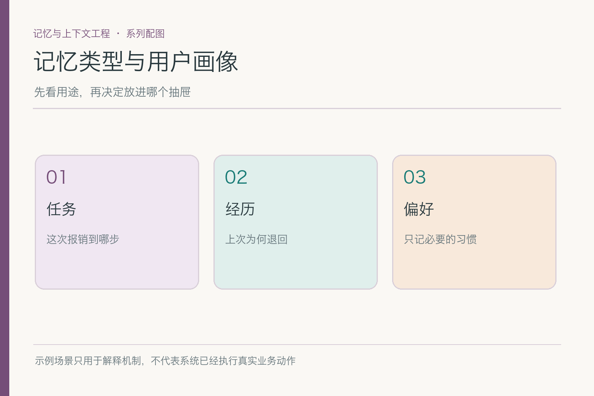
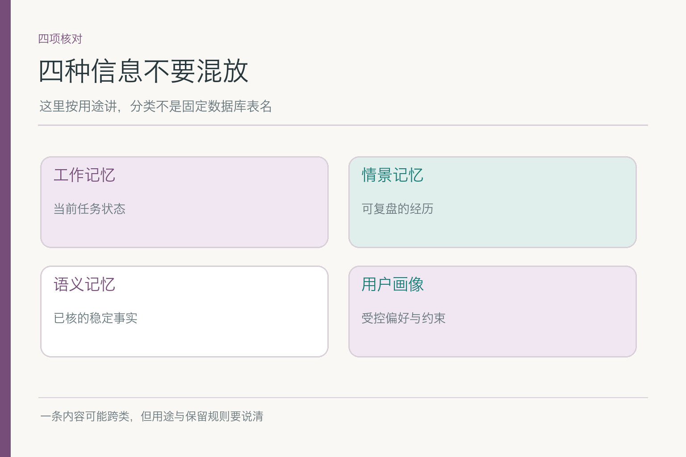
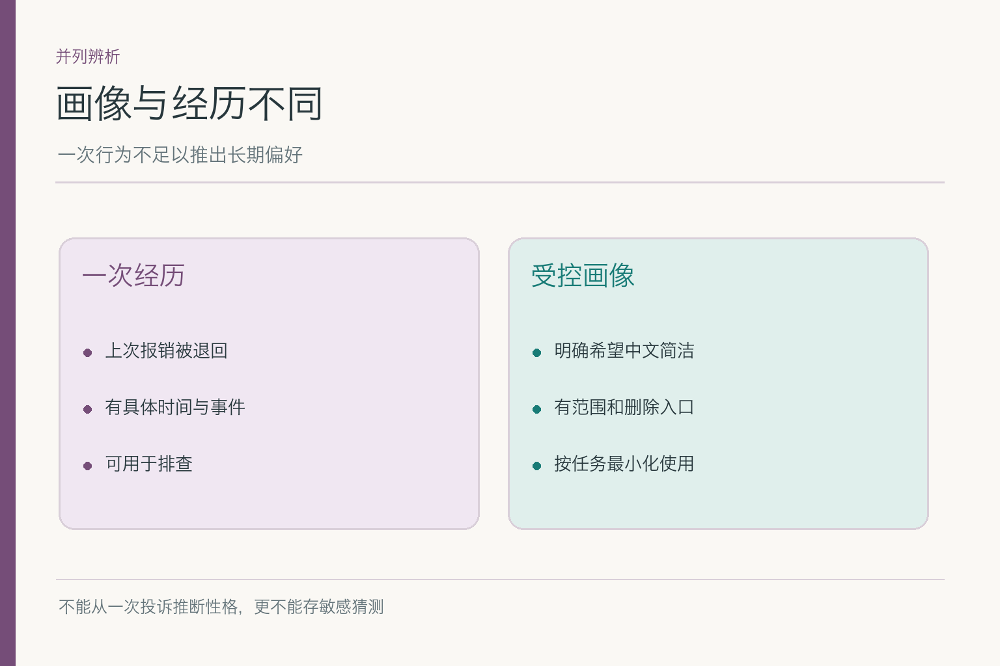
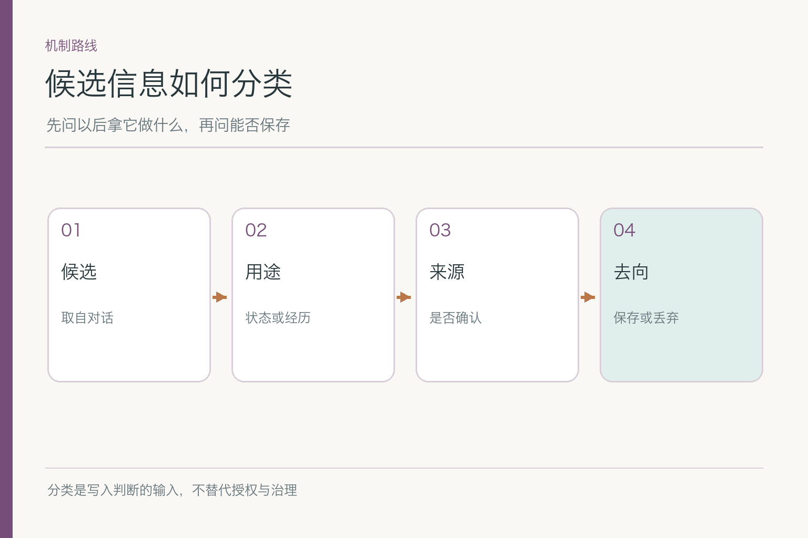
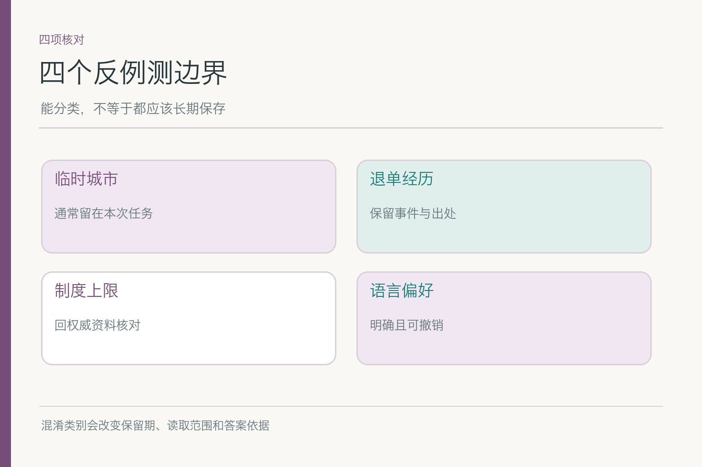
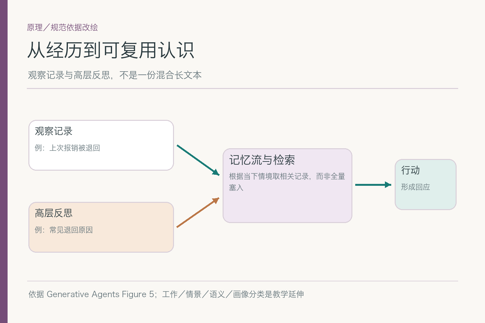

# 面试题：四类记忆怎样分才不误用

项目入口：[AI Agent 知识图谱仓库](https://github.com/Jennifer123www/ai-agent-knowledge-map)。本篇只练**信息用途与类别**，不把单条记录的版本事务或删除作业讲成分类题。

共用案例：小林的报销任务里有四条候选信息——票据已识别、上次因缺附件退单、今天制度上限发生变化、小林明确希望写作默认中文简洁。面试官要你说清哪些是当前任务、哪些是经历、哪些应回权威来源、哪些才可能形成受控画像。**“都和小林有关”不是分类理由。**

## 问题 1：工作、情景、语义记忆与画像是什么关系？

### 原理

工作记忆偏向当前任务状态；情景记忆保留有时间与情境的经历；语义记忆保存经验证、可跨情境使用的事实。用户画像是产品对某些用户相关偏好和约束的受控表示，不是人脑分类里与前三者完全排斥的第四格。一条偏好可同时是语义信息和画像字段。

### 答题点

1. 先按用途、时间范围和来源解释三类信息；
2. 说明画像是应用层表示，要有用途、授权与退出；
3. 用小林的四条候选逐条举例，明确制度更新不是个人画像；
4. 分类结果不能替代“是否允许保存”的判断。

若被追问“画像字段属于语义记忆还是独立类别”，可回答：从信息内容看，明确偏好是一条用户相关事实；从产品管理看，画像给它限定了用途、权限和更正方式。两个视角不冲突，混淆它们才会让“保存事实”被误听成“可以任意画像”。

### 记忆点

> 分用途，不分花哨的表名；画像是受控应用形态。

### 常见追问

“为什么画像不是另一种完全独立的记忆？”因为语言偏好本身也是关于用户的稳定事实；画像更多规定其字段、权限与使用范围。

### 失分点

把四个词画成互斥数据库表，遇到重叠信息就无法解释。

## 问题 2：“票据已识别”为什么归入工作记忆？

### 原理

它描述当前报销任务的执行位置与已确认输出，目的是中断后继续，不是未来所有报销都成立的用户属性。工作记忆可能跨天保留，但任务结束或票据替换后，其有效性会变化；时长不是唯一分类依据。

### 答题点

1. 指出它绑定特定 `task_id`、票据引用和步骤；
2. 说明“识别成功”与“制度合规”“已提交”是不同判断；
3. 票据被替换时，旧识别结果必须退出当前任务；
4. 完成后按业务规则归档，不写进用户画像。

面试时可画两笔任务：第一笔票据识别完成，第二笔才刚上传。若系统只按用户 ID 取最近一条“已识别”，就会把第一笔的进度套到第二笔。任务标识与作用域比“昨天还是今天”更能防住这种误用。

### 记忆点

> 服务这笔事，任务结束就换身份。

### 常见追问

“跨过两天还算短期吗？”算。它的作用域仍是这笔活动任务；不是按 24 小时钟表切类别。

### 失分点

把短期误解为只存在模型窗口里，或把两天前的进度自动套到新任务。

## 问题 3：“上次被退单”是情景，还是小林的稳定特征？

### 原理

退单是一次有时间、原因和任务编号的经历，属于情景信息的候选。它不自动证明小林“总漏附件”，更不能证明这次票据有问题。把事件提炼为稳定结论，需要额外证据和适用范围，不能凭一次观察跳级。

### 答题点

1. 保存事件应带时间、退单原因和可回看的来源；
2. 当前任务若要提醒，可说“上次曾缺附件”，不要给人贴标签；
3. 只有本次附件检查仍相关时才取回；
4. 推断出的性格或习惯不应自动进入长期画像。

上次退单记录也可能被后来的证据纠正：原来不是缺附件，而是系统误判文件格式。若历史事件保留了任务号和处理结果，就能更正原因；若只存“小林漏附件”，就很难把误解收回来。经历要有上下文，不能只留一句结论。

### 记忆点

> 事件可追溯，性格不靠一次退单推断。

### 常见追问

“连续三次都缺附件呢？”仍要看制度、流程和样本条件；可以提出检查建议，但不能无证据把责任归因于人。

### 失分点

把一次业务结果写成永久个人标签，后续回答带着偏见。

## 问题 4：制度上限是“语义记忆”吗？

### 原理

语义记忆可保存已核事实与概念，但“今天制度上限多少”有明确发布方、生效日期和业务适用条件，应从权威知识库查。它即使像一个稳定事实，也不宜作为小林个人记忆的永久副本。分类要先问**谁负责维护事实**，再问是否存到 Agent 外部记忆。

### 答题点

1. 区分经核实的术语事实与会随制度变化的业务事实；
2. 把制度原文、版本和生效范围留在资料系统；
3. 个人记忆最多保留“曾查询过”这段经历或来源线索；
4. 回答“能否报销”时重新核对身份、票据和当天规则。

如果候选记忆里出现“上限 500 元”，可把它当作**待查线索**，提示去找制度原文；但在查到发布方、生效日期、适用职级之前，不得将其放进给小林的确定结论。分类与来源校验要连在一起回答。

### 记忆点

> 有权威源的事实，别复制一份旧答案当个人记忆。

### 常见追问

“那 Agent 一条语义事实都不能存？”不是。关键看来源、稳定性、用途和维护责任；经确认的团队术语与实时额度不是同类问题。

### 失分点

只要是陈述句就归语义记忆，不看更新和权威性。

## 问题 5：用户画像为什么要强调“最少且可控”？

### 原理

画像用于相关任务的个性化，不是长期收集个人细节的许可证。小林明确要求中文、简洁，可能有使用价值；一次出差城市、一次抱怨、模型推断的性格则不应自动写入。画像字段应有目的、来源、适用范围、查看与退出方式。

### 答题点

1. 让每个画像字段能回答“哪种任务需要它”；
2. 说明明确陈述比模型从语气推断更可靠；
3. 区分“这次用英文”与“以后都用英文”的作用域；
4. 权限按用户与租户隔离，不能用同名匹配。

画像字段是否“有用”，可以用真实任务验证：起草邮件时确实减少重复说明；报销金额核验时不应影响事实；用户要求删除后，下一次邮件不再沿用。三种任务分别检查适用、越界和退出，而不是只展示一次个性化惊喜。

### 记忆点

> 字段少一点，来源明一点，退出近一点。

### 常见追问

“产品经理说多记一点才能更懂用户？”请给出任务收益与误用成本的对照数据；无明确用途的信息不应仅为可能有用而保存。

### 失分点

把画像理解为越完整越好，忽略用户更正和删除。

## 问题 6：一条内容同时像经历和事实，怎么标注？

### 原理

类别可以交叉，但读取用途要明确。“上次报销因缺附件退回”本身是事件；“这个报销流程通常要求附件”若另有制度佐证，可成为流程事实。前者与小林的某次任务绑定，后者应由制度来源负责。不要通过复制同一句话到多个库来解决分类争议。

### 答题点

1. 先保留原事件与出处，不急着生成稳定规则；
2. 若要形成概括，单独记录推导依据与确认人；
3. 不同用途可用多标签，但保持一个可追溯来源；
4. 后续删除或更正时能找到所有衍生引用。

### 记忆点

> 可多标签，不可多份失联的副本。

### 常见追问

“分类器拿不准怎么办？”可标待确认或不写入；强迫选一个永久标签可能比少记一条更糟。

### 失分点

把“可能属于两个类”说成系统设计失败，或无证据地自动升级为语义事实。

## 问题 7：分类错误会怎样在后续任务中表现出来？

### 原理

类别改变保留期、读取范围和回答依据。任务状态误入画像，新报销会带旧进度；经历误入画像，系统会给人贴标签；制度误入个人记忆，会引用过期额度；明确偏好只留在一次聊天，用户又要重复交代。

### 答题点

1. 四类错分别给出可观察的输出，不统称“记忆不好”；
2. 追查错误发生在提取、分类、写入还是读取；
3. 对已错误保存的内容使其退出活动读取并追溯影响；
4. 回归样本加入“临时城市”“一次退单”“制度变化”“长期偏好”。

### 记忆点

> 分类错，未来的读取规则也会跟着错。

### 常见追问

“最终答对了，还要查分类吗？”要。错误保存未必当场暴露，可能在下个月另一任务里才影响结果。

### 失分点

只评最终一句话，忽略后台已经存下的错误画像。

## 问题 8：怎样评测分类与画像边界？

### 原理

评测需标注**预期类别、预期去向和禁止动作**。单次提取准确率不够，还要跨会话看旧状态是否误用、临时例外是否误升长期偏好、删除后是否仍被取回。人工标注要说明有歧义的样本如何处理，而非强行给唯一正确类别。

### 答题点

1. 准备纯工作、纯经历、权威事实、明确偏好和混合句样本；
2. 以“该不该存、存哪里、何时读取”联合判定；
3. 分开统计误写入、漏写入、错保留和跨用户混用；
4. 写清样本数、类别分布与人工争议处理规则。

混合句样本尤其关键：“以后默认中文，这次请写英文”同时含长期设置与本轮例外。若系统只能给整句一个标签，至少应把作用域拆成两个字段；做不到时先不自动写入永久画像，避免后续任务持续受影响。

### 记忆点

> 分类要测去向，画像要测边界。

### 常见追问

“一句话前半是长期偏好，后半是本次例外？”拆成两个作用域，不能让后半句悄悄覆盖长期记录。

### 失分点

只用干净的单句例子测分类，真实混合对话一来就乱。

## 问题 9：原论文的记忆流能直接当分类标准吗？

### 原理

《Generative Agents》关注观察、反思、记忆流与行动；它没有定义本文的四种产品分类，也没有给企业用户画像一套授权政策。可以借它理解事件记录与高层反思如何被取回，不能把论文图改名为“工作、情景、语义、画像四层”后宣称原作者这么画。

*依据 [Generative Agents](https://arxiv.org/abs/2304.03442) Figure 5 改绘；四类记忆是结合工程需求的教学延伸。*

### 答题点

1. 先准确复述论文的观察、检索、反思关系；
2. 再单独说明产品为什么按用途增加分类；
3. 对画像的授权、删除和隔离引用治理规则，不向论文借不存在的结论；
4. 图注写清原机制和自己的扩展。

### 记忆点

> 论文讲机制，产品分类讲用途；别偷换来源。

### 常见追问

“反思能直接做稳定事实吗？”不能。反思是推导结果，仍需来源、验证与适用边界。

### 失分点

用一张看起来像论文的图证明所有画像规则都有论文支持。

分类题最好最后回到小林那四条信息：任务进度、退单经历、制度事实和语言偏好。分别说去向，再补一句谁能维护、何时过期。能答清楚这些，比把记忆类型念成一串英文更有用。

项目总览、初学者图解和面试题见 [AI Agent 知识图谱仓库](https://github.com/Jennifer123www/ai-agent-knowledge-map)。

## 参考资料

- [Generative Agents: Interactive Simulacra of Human Behavior](https://arxiv.org/abs/2304.03442)
- [LangMem：Core Concepts](https://langchain-ai.github.io/langmem/concepts/conceptual_guide/)
- [LangChain：How to Build Memory into AI Agents](https://www.langchain.com/blog/how-to-give-your-agent-memory)
- [NIST Privacy Framework](https://www.nist.gov/privacy-framework)
