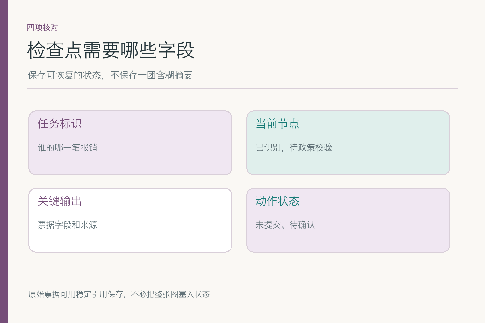
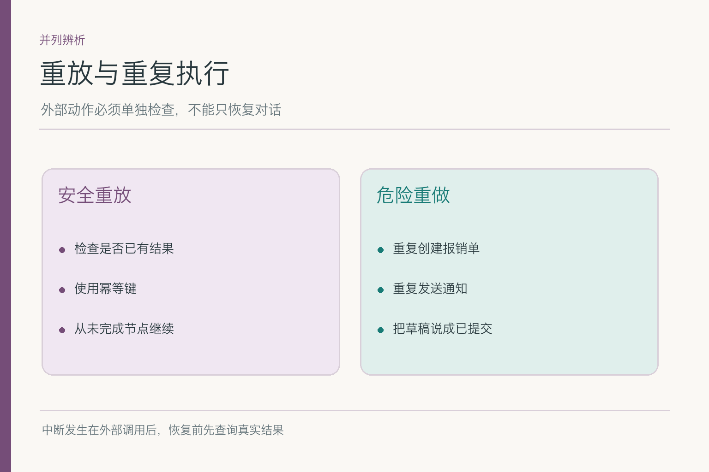

# 短期状态：任务停一半，怎样接着做


项目入口：[AI Agent 知识图谱仓库](https://github.com/Jennifer123www/ai-agent-knowledge-map)，可看记忆与上下文工程总览、初学者图解和面试题。本篇只讲**当前任务的短期状态**；跨会话偏好为何值得长期保存，是下一篇的问题。

小林上传住宿票据，让助手准备一份报销草稿。票面日期和金额已经识别，但还没核对制度，也没提交。就在此时浏览器关闭。第二天小林重开任务：“到哪一步了？”如果系统只保留一段“我在帮你处理”的聊天记录，它仍不知道字段是否真的抽取完成，更不知道提交接口是否曾被调用。真正需要恢复的，是**任务事实与执行位置**，不是昨天的语气。

## 一、状态该记哪些，不该记哪些

一份可恢复的状态，至少要回答：这是哪个用户的哪一笔任务、目前停在哪个节点、哪些字段已通过校验、哪些事实还缺、外部动作处于什么状态。小林这笔报销可用这样的示意记录表达：

```json
{
  "task_id": "expense-demo-01",
  "step": "policy_check_pending",
  "receipt_fields_verified": true,
  "submission_status": "not_started"
}
```



这只是教学字段，不表示票据真实或公司制度已验证。实际系统还要保存票据的稳定引用、字段来源、状态版本与更新时间；敏感原件不必重复塞进每个节点。相比一段“报销处理中”的摘要，结构化状态更容易判断下一步是否可以执行，也更容易发现“页面写着已提交，但业务系统查不到单据”这种矛盾。

状态并非长期用户画像。小林今天住了哪家酒店、票据金额多少，属于这笔任务；任务完成后按业务需要归档或删除。把它悄悄变成“以后都住这家”的偏好，既没有依据，也会影响后续任务。

保存状态时还要把**值**和**判断**分开。识别器读到票面金额 `480` 是候选值；“金额已与原图核对”是另一项判断；“符合制度”要再等制度查询。若只存一个 `amount_ok: true`，后来查出字段读错，很难知道错在票面识别还是制度判断。字段级来源看似啰嗦，排错时却能少猜很多轮。

## 二、为什么要在关键节点留下检查点

系统可以在每个重要步骤结束后，把已确认的状态保存成**检查点**。例如票据识别完成、字段校验通过之后，保存 `step=policy_check_pending`。浏览器再次打开时，读取该状态，从制度校验继续，而不是重新识别整张票据。LangGraph 等工作流系统也把检查点用于线程状态的持久化与恢复；具体落盘时机可由执行框架和可靠性要求决定。


检查点太稀，故障后重做成本高；太密，写入成本和版本管理也会增加。判断标准不是“每条聊天都存”，而是哪个步骤之后已有**昂贵或不可重做的结果**。票据识别若便宜且无副作用，重新做一次可能还能接受；真正创建单据或发送通知，必须另外记录调用标识和结果，因为它们已改变外部世界。

模型输入窗口里的“工作区”和持久化检查点也别混为一谈。前者是这次调用送给模型看的内容；后者是执行系统保存的可恢复状态。它们可以有关联，却不是同一块物理内存。

检查点也不等于把整个运行环境拍成一张照片。外部接口的网络连接、第三方系统里的单据、用户稍后补来的新票据，都不会因为本地状态保存而自动固定。恢复时应从检查点拿任务位置，再逐项确认这些外部依赖是否仍有效。若把一份旧的检索结果直接当成“昨天已核实制度”，第二天制度更新后就会犯错。


*依据 [MemGPT](https://arxiv.org/abs/2310.08560) Figure 3 改绘：系统指令、工作区和近期消息都占用有限窗口。报销任务检查点是另加的工程持久化机制，不是该图里的原始部件。*

## 三、恢复前要先核对什么

恢复不能只看 `step` 字符串。假设昨晚票据识别已完成，但制度在今天更新；系统可复用已核的票据字段，却应重新核对今天适用的制度。若票据本身被用户替换，旧字段也要失效。**可复用的是带来源和版本的结果，不是“昨天模型说过”这件事。**

还要核对权限。昨天操作的是小林本人，今天请求者若换成另一个账号，即使知道同一个任务 ID，也不能读取其金额与票据。读取检查点前先确认身份和任务归属；状态记录里保留稳定标识与访问范围，不能把权限判断交给模型猜。

如果检查点来自旧版流程，新的代码已经把“政策校验”拆成两个节点，恢复时还需要状态迁移或安全回退。盲目把旧字段按新含义解析，可能把“待校验”误当“已通过”。因此状态结构也要有版本，必要时进入人工确认，而不是强行续跑。

恢复提示也应该把不确定说清楚。系统可以告诉小林“票据字段已经识别；制度需要按今天的版本重新核对；没有查到提交成功记录”，而不是直接接上昨天一段很自然的“我已经为你处理好”。前一句看着没那么圆润，却能让用户判断是否要补资料或再确认。

## 四、外部调用之后，为什么不能直接重放

最棘手的故障发生在提交接口调用之后、系统还没来得及保存结果之前。浏览器看到超时，不表示提交失败。若恢复后照旧重放“提交报销单”，可能出现两张单。较稳妥的做法是为这次业务操作保存可追踪的请求标识，恢复时先查询外部系统结果；支持**幂等键**的接口，可用同一键避免重复创建。但能否幂等，要由实际接口保证，不能只在提示词里写“不要重复”。



小林案例里应区分四个状态：草稿已生成、用户已确认、提交请求已发出、业务系统已确认接收。它们不能合并成一个“完成”。如果只到草稿阶段，回答应说“票据字段已识别，等待制度校验，未提交”；如果提交接口超时，应该说“提交结果待核”，并查业务系统。把不确定说成已成功，是最容易制造二次麻烦的捷径。

这里借用一个生活比喻：快递单打印好了，不等于快递员已经揽收；手机提示转圈，也不证明包裹没寄出。回到报销任务，真正的动作状态要看业务系统的回执，而不是只看助手上一句回复。

还要区分**读操作重试**与**写操作重试**。重新查制度通常不会新建业务对象，代价主要是时间和费用；重复创建报销单则可能产生副作用。若外部系统没有幂等接口，至少先用业务键查是否已有对应单据，查不到也要保留“结果未知”的状态供人工核对。不能用同一套自动重试次数处理所有工具调用。

## 五、并发修改会让谁的状态覆盖谁

小林在电脑上补充票据日期，手机端也打开同一任务。若两个端都基于版本 `v3` 保存状态，后到的写入可能把先到的更正冲掉。处理方式可以是比较版本号后再更新；冲突时重新读取最新状态，必要时请用户确认。**“最后写入者获胜”只适用于可以安全覆盖的字段**，不能拿来处理已提交状态与票据金额。

模型生成的状态摘要也需区分来源。用户刚修改金额，旧检查点仍写着原金额，不能让摘要看上去更流畅就覆盖明确的新输入。业务系统的提交回执、用户确认和模型推测，各自的可信级别不同；状态合并必须按字段和来源判断。

具体采用关系数据库事务、乐观锁还是事件日志，取决于现有架构。初学者只要记住：同一任务并发更新时，不应把两份变化当作完全独立的聊天消息直接拼接。

如果电脑端已确认新票据，手机端仍打开旧页面，手机端的“继续”也需要先刷新状态。否则旧票据识别结果可能在下一步被写回，把用户刚补的材料冲掉。冲突不一定要让模型裁决；显示两份来源与修改时间，请用户选择，通常比悄悄拼接更诚实。

## 六、短期状态何时退出

短期不是“一关闭页面就消失”，也不是“永久保存”。报销在等待用户补票据时可能需要跨天恢复；任务撤销或完成后，活跃状态可转为审计记录、按规则过期或删除。要留下哪些业务单据，属于业务系统和组织要求；Agent 的临时工作区不应擅自复制一份永久副本。

过期还包括**语义过期**。昨天等待的制度校验，今天制度版本变了，旧的“待校验”仍可告诉我们任务位置，但昨日的检索结果不能继续当今天的证据。恢复时应分别判断任务状态能否复用、外部事实是否需要重查。

用户提出删除或撤销请求，也可能要求清理与本任务相关的缓存与临时状态。不要只删前端列表项；更不要因为日志里还留着旧请求，就在下一轮把它重新当成活动状态。

“过期”也不是所有记录按同一个倒计时消失。等待用户补票据的任务可能允许继续，已撤销的任务则不应再被执行器唤醒。恢复资格最好写成明确的状态转移规则：哪些节点能继续、哪些必须重新确认、哪些只能查看历史。这样才能回答“为什么这笔报销被拦住”，而不是让系统忽然装作失忆。

## 七、怎样测试恢复不是靠运气

做四组故障注入：票据识别前断开、识别后断开、提交调用后断开、业务完成后重开。每组分别记录恢复起点、字段来源、外部动作查询结果和用户可见说法。然后再加冲突样本：制度今天更新、票据被替换、同一任务被两个端同时修改。


验收不只看“能继续”。还要看是否重复提交、是否把旧字段当新字段、是否在权限变化后泄露进度、是否把未知动作写成成功。给每类错误独立计数，例如十次提交后中断里有几次查到了已有单据，多少次被错误地再次调用。数字需要真实测试样本和分母，不能从这张示意图里读出成功率。

测试还要把故障放在**节点边界两侧**：保存状态前断开，可能要重做本节点；保存状态后断开，应从下一节点继续。外部调用的请求发出与回执落盘之间再插一个故障点，最能暴露“系统以为没做、实际已经做了”的问题。每次测试都保存预期动作与实际动作，才能知道补的是状态记录、业务查询，还是用户提示。

当一笔任务从中断恢复时，短期状态负责把“做到哪步、已确认什么、还缺什么”带回来；外部业务系统负责证明动作究竟发生了没有。**能续上话不等于能续上事。**

项目总览、初学者图解和配套面试题见 [AI Agent 知识图谱仓库](https://github.com/Jennifer123www/ai-agent-knowledge-map)。

## 参考资料

- [MemGPT: Towards LLMs as Operating Systems](https://arxiv.org/abs/2310.08560)
- [LangGraph：Thinking in LangGraph](https://docs.langchain.com/oss/javascript/langgraph/thinking-in-langgraph)
- [LangChain：Deep Agents overview](https://docs.langchain.com/oss/javascript/deepagents/overview)
