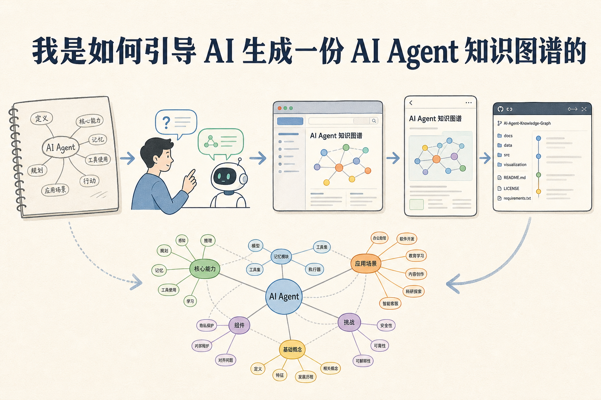
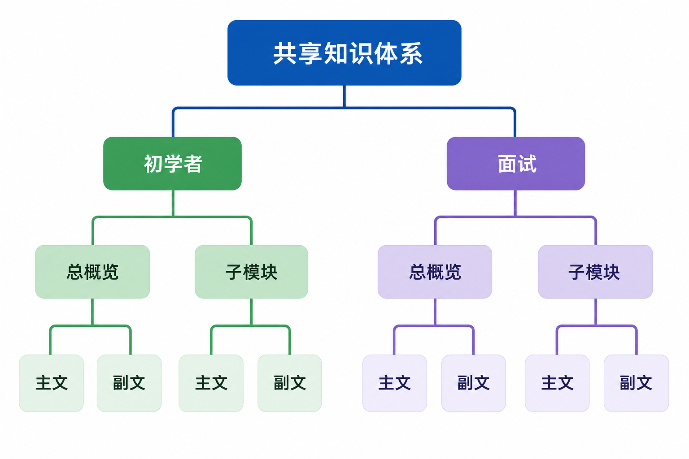
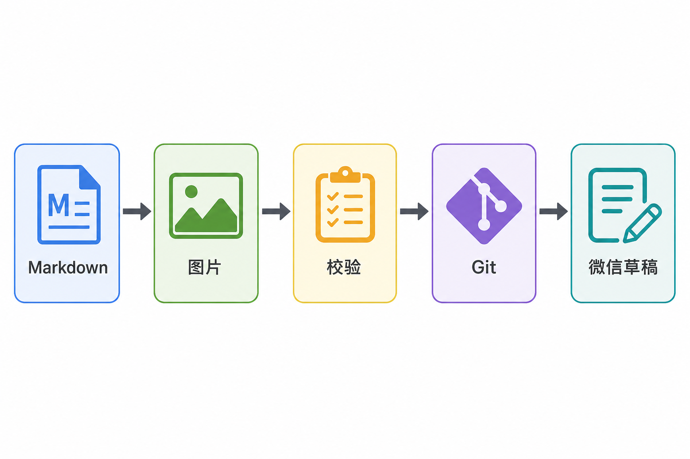

# 我是如何引导 AI 生成一份 AI Agent 知识图谱的

这件事最初没有宏大的计划。

我只是想弄清楚：现在常说的 AI Agent，到底由哪些部分组成？知识库、MCP、Skill、工具调用、工作流、多智能体、安全和评测，它们之间是什么关系？于是我让 AI 先画一张简单的知识图谱。

如果任务停在这里，几分钟就能结束。真正花时间的部分，是把“看起来完整的一张图”变成一套能学习、能面试、能持续扩展、还能直接做公众号内容的知识项目。

## 第一阶段：先让 AI 把范围铺开

最开始，我给出的要求很宽：“画一份 AI Agent 知识图谱，包括知识库、MCP、Skill，但不限于这些。”AI 很快列出了基础模型、Agent 核心、知识与上下文、能力扩展、多智能体、运行基础设施、安全治理、评测运营和应用形态。

这一版的价值不是精确，而是把讨论对象放到桌面上。我可以看到哪些模块缺了，哪些模块挤在一起，哪些名词只是英文缩写。相比从空白文档开始，一张粗略的全景图更适合用来挑错。

我没有急着逐字修改，而是先问：“和最初的图相比，缺少什么关键模块？”这一步让项目从一次生成变成了差异检查。后面补上的上下文工程、模型网关、沙箱、A2A、权限治理和可观测性，很多都来自这种对照。

## 第二阶段：交付格式不对，再好的内容也没用

最早我让 AI 输出 XMind。文件生成出来了，却打不开。于是我改成 HTML，希望不依赖特定软件，打开浏览器就能看。

这次经历让我意识到，内容项目有两个问题必须分开：写什么，以及用什么方式交付。XMind 适合个人编辑，HTML 更适合阅读、跳转、搜索和发布。后面项目迁移到 Git 仓库，HTML 也更容易部署成静态网站。

格式调整后又出现新问题：入口页面和知识图谱页面几乎一样，读者不知道两个文件有什么区别；“大话”页面与初学者页面视觉割裂，进入后也没有返回入口。于是我让 AI 删除冗余入口，统一顶栏，增加右侧子模块导航和右上角搜索。

页面变漂亮只是表面。更重要的是，每个页面开始有明确职责：首页看全景，初学者总览给阅读顺序，概念下钻讲结构和“大话”，面试图谱看主题，题目下钻练回答。

## 第三阶段：从做页面，转成做内容体系

一开始，“大话大语言模型”只是一个单独页面。它很容易懂，却和其他同级子模块不对称。我指出：既然大语言模型有“大话”，多模态、向量嵌入、重排序、模型适配也应该有。

接着又发现，“大话”和普通图解只是换了几句话，内容雷同。于是我重新定义两者：图解负责结构和关系，“大话”必须换一个生活场景，把机制讲活；“机制加餐”再补工程细节、取舍和边界。三层内容不允许互相复述。

后来我又要求初学者版和面试版一一对应。初学者回答“是什么、怎么协作”，面试版回答“为什么这样取舍、上线怎样验证”。每个一级模块至少三道面试题，必须包含原理、答题点、记忆点、追问和失分点。

这一步很关键。知识图谱不再是一棵名词树，而是同一套主题的两种阅读方式。学完概念，可以立即跳到对应面试题；面试题里遇到陌生术语，也能回到概念页。

## 第四阶段：不断指出“不是这个意思”

整个过程中，我说过很多次“不是这个意思”。这不是沟通失败，而是把模糊想法变成规则的必经过程。

比如我说文件名用中文，指的是 Finder 里的文件名，不是页面上显示中文标题；我说导航放到右侧，指的是子模块导航，不是把顶栏搬过去；我说删除泛化文字，指的是去掉“例子仅用于说明”这类没有知识增量的句子，而不是删掉必要的机制解释。

每次纠偏，我都会尽量指出具体对象：哪一个页面、哪一段话、哪种关系、哪张图。AI 根据反馈修改后，我再看结果。反复几轮后，临时意见被写进项目规范，后面的内容便不必重复提醒。

我逐渐发现，和 AI 协作最有效的方式不是一开始写一份几十页需求，而是先给方向，让它交付可见结果，再围绕真实结果校正。前提是反馈要具体，不能只说“不好看”“不够专业”。

具体反馈最好同时包含“看到什么、为什么不对、希望改成什么”。例如，不只说“大话内容重复”，而是指出“大话仍在复述图解里的职责定义，希望换成报销、后厨或门禁等具体场景，并补充机制取舍”。这样 AI 不必猜“不满意”背后的标准。

有时我也会要求它只重做一个模块后停下，让我先审阅。这比一次重写十个模块更稳。小范围修改容易看出方向是否正确，也能避免错误风格被批量复制。确认样板之后，再让它按同一规则扩展。

## 第五阶段：把一次作品变成可维护项目

页面和内容逐渐稳定后，我把项目迁移到个人工作目录，重构成常见的静态站点结构，并创建同名 GitHub 仓库。此后每完成一个可验证阶段，就提交并推送。

项目规范开始记录页面职责、目录、命名、主题映射、导航、搜索、内容组织、图片风格、校验命令和 Git 规则。它不是写给读者看的说明，而是下一轮生成内容时约束 AI 的工作合同。

这时，“不要偷懒”“不要写泛化说明”“中文术语要准确”“两个版本必须对应”不再只是聊天里的提醒，而是仓库中的持久规则。即使换一个任务继续工作，也能从文件里恢复上下文。

Git 在这里不只是备份。每个阶段只做一件事：重构目录、补文章、生成图片、增加微信校验，各自单独提交。效果不好时，可以准确看到是哪次修改引入问题，不用把整段对话重新演一遍。

规则文件还记录版本、阶段、Git 状态和修改时间。内容项目经常跨很多天，今天认为“已经完成”的部分，明天可能因为层级重新定义而需要调整。保留阶段信息，能避免把旧结论误当成当前事实。

## 第六阶段：知识站点继续长成公众号系列

我希望 HTML 保留全景和下钻，同时把每个模块转成每天可发布的两篇公众号文章：主文面向初学者，副文用于面试训练。文章要求 3000–5000 字、至少 5 张图，主文还要有封面。

最初拿“工具、技能与协议”做试点。AI 先生成提示词，再用图像模型制作中文信息图。图片经历了模型不可用、插件依赖不兼容、登录凭据和中文校对等问题，最后才得到可用成片。

文章原稿最终确定为 Markdown 加 YAML Front Matter。标题、作者、摘要、封面和评论设置都能被程序读取；本地图片先上传微信，再把 URL 写进 HTML；转换后检查标题、摘要、正文字符、体积和 JavaScript 限制。

后来我又发现层级理解错了。一个一级模块不是只有“主文 + 面试题”两篇，而是“1 个总概览 + n 个子模块”，共 n+1 组，每组两篇。工具、技能与协议有 6 个子模块，因此最后变成 7 组、14 篇文章。

这次调整不是简单多写十二篇。总概览已经讲过不少具体机制，若直接生成子模块，面试题会重复。于是先重写总览：只保留跨模块分层、端到端链路、总体选型和共同治理；Schema、沙箱、MCP 对象、限流等细题全部交回对应子模块。

每个子模块再建立独立目录，包含主文、面试副文、提示词和图片。模块根目录保存总概览，`submodules/` 保存下钻内容。层级一旦在文件结构中表达清楚，文章路径、阅读顺序和校验规则也更容易统一。

## 第七阶段：让规则替代反复提醒

批量生成 14 篇文章时，最浪费的环节是先写短稿，再根据校验补到 3000 字；以及每次检查都打印全部文章明细。于是我又加了三条规则。

第一，写作前在模块清单中为每篇文章固定 8–10 个段落，首稿直接瞄准 3200–3500 个中文字符。第二，校验器默认只输出失败项和总数，逐篇明细只在排障时打开。第三，用 `series.json` 统一记录文章路径、内容边界、提纲、题目范围和配图，不再反复解析大型页面。

到这一步，AI 不只是内容生成器，也在帮助我维护一个小型内容生产系统。Markdown 是内容源，图片有提示词和清单，脚本负责校验，Git 记录阶段，微信接口只创建草稿，不自动发布。

## 第八阶段：让资料来源和自动化都有边界

知识图谱涉及大量术语，不能只靠模型记忆。MCP 查官方协议文档，Function Calling 查 OpenAI 官方说明，微信公众号限制查微信官方接口文档。面试题可以联网补充，但技术结论尽量回到一手资料。

参考链接被写进每篇文章末尾，校验器确认 HTML 中仍然保留可点击链接。这样读者可以继续核对，文章更新时也知道应该重新查看哪些来源。引用不是装饰，它是内容可维护性的一部分。

自动化也有边界。脚本能检查字数、图片、链接和文件是否存在，却不能判断一段比喻是否生动，也不能完全判断两道面试题是否只是换了说法。机器检查守住硬规则，人工审阅负责语气、层级和真实信息增量。

图片更需要人工确认。生成模型能画出漂亮构图，却可能写错中文、重复标签或画反箭头。最终流程是：提示词清单约束文字，模型生成，人工逐张查看，不合格就重画。自动化负责规模，人负责最后的可信度。

## 我学会的，不是怎样写一个“万能提示词”

这次经历没有产出一条神奇 Prompt。真正有用的是一套节奏：先铺全景，再确定层级；先看可见结果，再具体纠偏；把重复意见写成规则；把规则变成自动校验；每个阶段留下可回滚的提交。

AI 会很快给出一个“像答案的东西”。我的工作不是不停催它生成，而是判断这个结果是否符合真实用途：读者是谁，页面职责是什么，层级有没有错，文章是否重复，图片能否阅读，文件能否打开，最终能不能持续维护。

我也重新划分了人和 AI 的分工。AI 擅长快速铺开结构、改写内容、生成草图、执行机械校验和维护大量文件；我负责决定读者、判断层级、挑出重复、确认术语、审阅图像和定义什么时候算完成。把判断全部交给 AI，项目会很快但容易跑偏；所有机械工作都自己做，又浪费了工具价值。

好的引导并不是把每一步都写死，而是把不可妥协的边界写清，把可以探索的部分留给 AI。例如标题和微信限制是硬约束，文章里的场景和比喻可以尝试；模块关系必须一致，页面表现可以迭代。边界越清楚，创造空间反而越安全。

知识图谱最后长成了网站、文章、图片、规则、脚本和 Git 历史。回头看，真正被构建的不只是一份 AI Agent 知识图谱，还有一套人与 AI 共同做复杂内容项目的方法。

## 参考资料

- [项目仓库：AI Agent Knowledge Map](https://github.com/Jennifer123www/ai-agent-knowledge-map)
- [OpenAI 官方文档：Tools](https://developers.openai.com/api/docs/guides/tools)
- [Model Context Protocol 官方文档](https://modelcontextprotocol.io/docs/learn/architecture)
- [微信公众号官方文档：新增草稿](https://developers.weixin.qq.com/doc/service/api/draftbox/draftmanage/api_draft_add)
