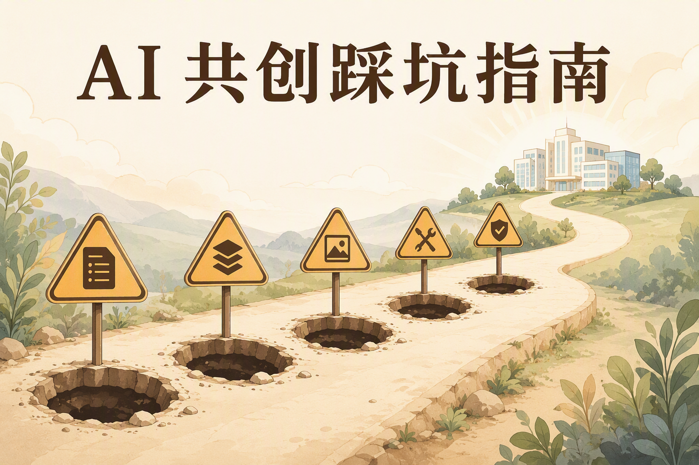
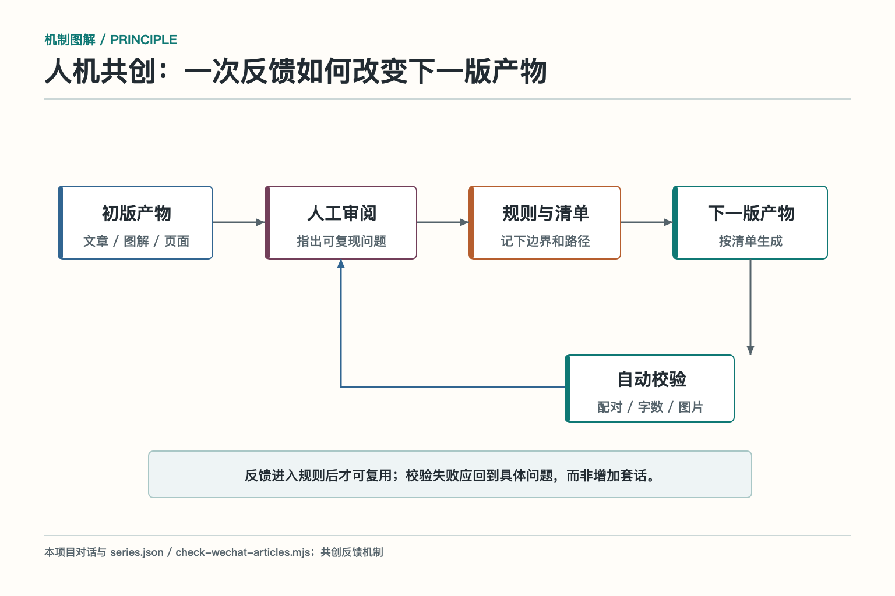
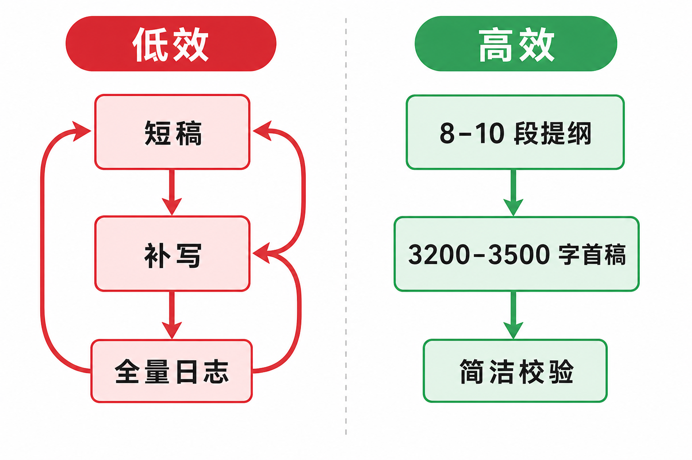

# 踩坑指南：让 AI 做知识项目，别只会催它继续

用 AI 做一个复杂内容项目，很容易得到一种错觉：第一版已经生成，后面只需要不断说“继续”。真正做下去才会发现，最难的不是生成速度，而是需求层级、内容边界、交付格式、质量标准和完成定义。

下面这份指南来自一次真实的 AI Agent 知识图谱项目。它不讨论怎样写一句更华丽的提示词，只讲哪些地方最容易返工，以及怎样把返工变成规则。

成品入口在 [AI Agent 知识图谱项目仓库](https://github.com/Jennifer123www/ai-agent-knowledge-map)：有网站总览、初学者内容、面试题和公众号文章原稿。这里记录的是它们背后的返工，不是 AI Agent 技术面试题汇编。

## 坑一：只给名词，没有说明最终用途

“帮我画 AI Agent 知识图谱，包含知识库、MCP、Skill。”这句话足以生成一张脑图，却不足以生成一个可用项目。

AI 不知道读者是初学者、面试者还是架构师；不知道要一张静态图，还是能搜索和跳转的网站；不知道模块只需要定义，还是要机制、案例、面试题和参考资料。它只能根据常见模式补全，结果通常完整但不贴身。

规避办法是补齐四项：读者、用途、交付物和完成标准。比如“初学者版负责概念和关系，面试版负责原理与取舍；输出静态 HTML；每个子模块都能下钻；两个版本一一对应”。这比堆更多技术名词有效。

还要写清哪些事情暂时不做。若当前只做静态知识站，就不要让 AI 顺手加入登录、数据库和后台管理；若文章只创建草稿，就不要默认发布或群发。边界不写，AI 往往会把“完整产品”当成目标，增加无关复杂度。

## 坑二：先生成文件，再验证能不能用

项目最初生成了 XMind 文件，但打开失败。即使文件能打开，它也不一定适合后续搜索、导航、部署和 Git 管理。

复杂项目开始前，先验证最小交付链：目标格式能否打开，用户是否有对应软件，文件是否方便版本管理，后续是否要转换到网页或公众号。先用一个小样本走通，再批量生成。

本地源文件也要选对。公众号文章最终要 HTML 和 JSON，但长期原稿更适合 Markdown；图片用本地 PNG/JPG，发布时再上传微信。把 API 产物当原稿，会让后续修改和跨平台复用都很痛苦。

目录结构同样应在批量生成前确定。总览放哪里，子模块放哪里，图片和提示词是否跟随文章，发布产物是否进入 Git，这些问题越晚决定，移动文件和修链接的成本越高。

## 坑三：总览、子模块和文章层级没先定

这是本次返工最大的一类。最初把一个一级模块理解成两篇文章：一篇初学者主文，一篇面试副文。后来才确认，一级模块还有 6 个子模块，因此应该是 1 个总概览加 6 个下钻，共 7 组、14 篇。

层级不清会产生连锁问题：总览把子模块讲完，子模块只能重复；总览面试题占用了细节题，下钻文章只好换标题复用答案；配图也无法判断应该画全景还是机制。

规避办法是先做模块清单。每个一级模块列出子模块 ID、阅读顺序、总览职责、子模块职责、文章路径、题目包含和排除范围。若有 n 个子模块，直接计算 n+1 组，不靠聊天记忆。

面试题还要单独维护边界。只检查标题不够，两道题可能换了标题却共用同一答题骨架。生成前应比较核心知识点、答题点和追问；总览负责跨层分工、端到端选型和共性治理，子模块负责计算机制、故障与专项评测。必须承接的知识点在总览里点到即可，不完整展开。

写“基础模型与推理”总览时，这个问题再次出现：模型分工与大语言模型内部机制被写到一处。后来改成先定子模块的题目边界，再重写总览。“知识检索与检索增强生成”也照此办理：总览回答整条链怎样接起来，切片、检索和 RAG 各自回答局部机制。**同一案例可以复用，回答的问题不能复用。**

## 坑四：文章看似完整，其实都是泛化句

AI 很擅长写“正确但没信息量”的句子，例如“该模块承接上游输入，并把结果交给后续环节”“实际项目应结合具体情况选择”。这些句子放在哪里都成立，也因此放在哪里都没用。

另一个问题是“大话”和普通图解雷同。图解说一遍结构，大话只是把同样内容换成口语，读者没有得到新的理解。

规避办法是给每层内容明确任务：网站图解说明组成和关系；“大话”用短比喻帮读者理解，但讲完回到主案例；网站的“机制加餐”独立解释输入输出、失败和取舍，不是公众号文章必设的栏目；面试题训练定义、方案和生产治理。删掉与知识无关的免责声明和万能过渡句。

语气也要检查。少写“本文将带你”“总的来说”“关键不是 A 而是 B”这类高频模板，多用短句、具体对象和真实判断。轻微幽默可以有，但不能让段子替代机制。

后来我把大语言模型主文和面试文并排改过一轮。旧稿看似字数合格，仍会把“模型读懂文字”“采样改变语气”写成省事但不准确的说法。新稿先说可观察现象，再讲原因和边界；把易混的概念并排解释，关键结论加粗，参数名用行内代码。确认有效后，直接替换正式文章，让 Git 历史保存旧稿，避免两套近似文章长期分叉。

## 坑五：图片很漂亮，文字却错了

生成式图片特别容易在中文文字上翻车：错别字、漏字、标签重复、箭头指错方向。画面越复杂，小字越多，出错概率越高。

规避办法是先写提示词清单，再生成图片。每张图只保留少量大标签，逐字放进 `Text (verbatim)`；同一系列统一背景、配色和构图；生成后逐张目视检查。发现错误就重渲染，不要因为“整体还挺好看”勉强使用。

但原理图还有更深一层的坑：**字全对，机制仍可能画错。**画 Transformer 不能把原论文的编码器—解码器结构与今天常见的仅解码器模型混成一张；画 RNN 与 Transformer 不能把训练并行误写成生成并行；画 RAG 也不能把普通“检索后拼进提示词”的流程直接标成原论文的完整模型。原理图先查论文的图号或章节，再核对节点、箭头、掩码、训练与推理阶段。框架图和业务流程图才适合直接沿用分层方框。

图片还要考虑发布限制。公众号正文图片需先上传并替换 URL，单张大小受限；封面和正文图用途不同。原图可以保留高质量版本，导入时再压缩，不要破坏源文件。

生成图不要一上来堆满文字。标签越多、字号越小，模型越容易写错，手机端也越难读。先确定这张图只表达一个关系，再保留三到六个关键词。复杂解释留给正文，不要把文章硬塞进图片。

最近一次配图返工还说明：辅助图也要复查，不能只盯“每篇至少一张原理图”。凡是带因果箭头、指标名称或术语对照的图，都可能让人误读。能用确定性绘图脚本准确排版的，就不必反复抽卡；修图时同步改正文图注和提示词记录，避免三处说法不一致。

## 坑六：工具已经装了，不代表马上能用

图像插件安装后，调用仍然失败。最后发现插件代码依赖 MCP 1.x，本地却安装了 2.x；修好依赖后，又遇到登录凭据问题。

这类阻塞很常见：插件进程没有重载、运行时依赖不兼容、环境变量缺失、账号权限不足、远程网关故障。不断重试只会重复同一个错误。

规避办法是分层排查：工具入口是否存在，进程能否启动，依赖版本是否匹配，凭据是否可读取，网络请求是否成功，最终文件是否落盘。每一层都要拿到证据，再进入下一层。修插件缓存或依赖属于环境变更，也应记录清楚。

用户说“已经登录”后，也要验证当前工具实际读取的是哪套凭据。不同宿主可能读取不同配置文件，登录一个客户端不代表另一个客户端自动获得令牌。看 HTTP 状态和明确错误，比继续猜测有效。

## 坑七：阶段完成被误当成任务完成

生成 10 张图片后，AI 停了下来，认为“配图阶段”已经完成。但真正任务还包括两篇正文。后面又出现一次类似问题：总览文章完成了，却还缺 6 个子模块组。

这类错误不是能力不足，而是完成定义被悄悄缩小。长任务拆阶段是必要的，但阶段终点不能替代总目标。

规避办法是维护可核验的交付清单。比如“工具、技能与协议”是 7 组、14 篇 Markdown；每篇 3000–5000 个中文字符、至少 5 张图、参考链接、Front Matter、相关草稿 dry-run 和阶段提交，都有各自的检查项。每次报告完成前，对照本阶段目标逐项核查，而不是看当前阶段有没有绿色日志。

状态更新也要区分“已完成”“正在等待”和“被阻塞”。图片请求仍在运行时应等待同一个任务，而不是重新发起；一个阶段完成时应说明剩余范围，而不是给出整个项目已经结束的口吻。

## 坑八：先写短稿再补字，token 会被慢慢吃掉

批量文章最初多次只有 1500–2200 字。校验失败后，又读取全文、分析缺口、补几个章节、重新跑全量检查。单篇看不多，十几篇叠加后成本很高。

另一个浪费是校验器每次都输出 14 篇详细统计。日志重新进入上下文，AI 又要读一遍。图片生成也有类似问题：提示词不先统一，逐张试错会重复消耗。

规避办法是写作前固定 8–10 个段落，给每段分配目标，首稿直接写到 3200–3500 个中文字符。校验默认只输出失败项和总数，逐篇统计只在排障时打开。阶段内只查当前组，模块交付前再跑全量。

还要避免反复读取大型 HTML 来恢复模块结构。把子模块、文章路径、提纲、题目边界和图片名称写入一个结构化清单，生成和校验都读清单。结构化数据比在几千行页面脚本里搜索关键词更省上下文，也更不容易漏项。

## 坑九：规则写在聊天里，下一轮还会重犯

“两个版本要对应”“不要泛化文案”“参考资料必须有链接”“图片文字要中文”“阶段完成就提交”，如果只存在聊天记录里，新的任务很容易丢失。

规避办法是把稳定要求写进仓库规则，再尽量变成自动检查。`series.json` 记录模块结构、文章提纲、题目边界和图片；脚本检查标题、作者、摘要、字数、图片、参考链接、HTML 体积、文章配对和题目重复；Git 记录每个阶段。

规则文件解决“应该怎样做”，校验脚本解决“有没有做到”，版本历史解决“哪次改坏了”。三者结合，比在聊天里反复强调靠谱得多。

自动校验也不能无限膨胀。每条检查都应对应真实踩坑：字数检查来自短稿返工，层级配对来自 n+1 误解，参考链接检查来自文章可核验要求，简洁输出来自 token 浪费。没有实际风险的检查只会增加维护噪声。

检查命令也要按改动范围运行。每次提交前跑 `npm run check` 和 `git diff --check`；改公众号文章，就对相关文章逐篇做草稿 dry-run；改服务端接入，再加 `npm test`；改页面，启动预览看实际交互。把所有命令一股脑塞进每次修改，既慢，也容易让人误以为“脚本全绿”已经完成了人工审图。

## 坑十：联网资料多，不等于研究质量高

AI 可以很快列出大量文章，但二手博客、搜索摘要和过时文档容易把错误带进知识图谱。尤其是 API 字段、协议版本和产品限制，几年内就可能变化。

规避办法是优先官方文档、规范和论文，先打开原文再写结论。无法从官方来源确认的内容，要说明不确定性。参考资料要与正文判断对应，而不是在文末堆一排看起来专业的链接。

资料还要分层使用：官方文档确认当前接口，论文解释原理，工程文章补实践经验。三类来源不能互相冒充。论文里的原始架构、后来的工程变体和作者自己的教学简化，也要在图注和正文里分清；一张来源不明的漂亮示意图，不能替代论文。一个供应商的示例代码，同样不能自动变成行业通用结论。

## 坑十一：长对话会积累“旧需求幽灵”

项目跨很多轮后，早期要求可能已经被后续要求替代。例如最初按一级模块写两篇文章，后来改成 n+1 组；若 AI 继续沿用旧目标，就会生成错误数量的内容。

规避办法是把当前结构写进仓库清单，并在关键转折后重新声明目标。开始新阶段前读取当前文件和 Git 状态，以工作区为准，不只依赖对话记忆。中途被打断后，也先检查哪些文件已经落盘，再继续下一步。

对人也一样。不要期待自己记住几十轮细节。让目录、元数据、清单、提交和测试替你保存事实，聊天只负责提出新判断。还有一个容易漏的状态：本地提交不等于远程已更新。动笔复盘时，三个技术主题的公众号稿已有本地提交，网站仍是十主题，公众号还未覆盖十主题；不能拿仓库链接证明最新本地稿已公开。

## 一套更省事的共创流程

第一步，用小样本确认交付格式。第二步，列出内容层级和模块清单，先划子模块边界再写总览。第三步，为每篇文章写 8–10 段提纲、主案例和题目边界。第四步，首稿直接达到目标字数。第五步，原理图先查论文，其他图片先写提示词，再生成并逐张校对。第六步，对当前改动运行适用的检查。第七步，阶段通过后提交 Git。整个模块交付时，再按清单做全量审计和逐篇 dry-run。

这套流程不会让 AI 永远不犯错。它能做的是让错误尽早暴露、影响范围更小、修复后不再重复。人与 AI 共创的质量，最终不取决于谁一次就猜对，而取决于能否把偏差变成下一轮可执行的规则。

如果想照着这条路径试做，先去 [AI Agent 知识图谱项目仓库](https://github.com/Jennifer123www/ai-agent-knowledge-map) 看总览、初学者内容和面试题；再挑一个子模块做完整样稿。仓库与本地尚未同步的修改可能存在时间差，阅读时以实际提交为准。

## 参考资料

- [项目仓库：AI Agent Knowledge Map](https://github.com/Jennifer123www/ai-agent-knowledge-map)
- [OpenAI 官方文档：Tools](https://developers.openai.com/api/docs/guides/tools)
- [Model Context Protocol 官方文档](https://modelcontextprotocol.io/docs/learn/architecture)
- [微信公众号官方文档：新增草稿](https://developers.weixin.qq.com/doc/service/api/draftbox/draftmanage/api_draft_add)
- [Attention Is All You Need：原始 Transformer 论文](https://arxiv.org/abs/1706.03762)
- [Retrieval-Augmented Generation for Knowledge-Intensive NLP Tasks：原始 RAG 论文](https://arxiv.org/abs/2005.11401)
