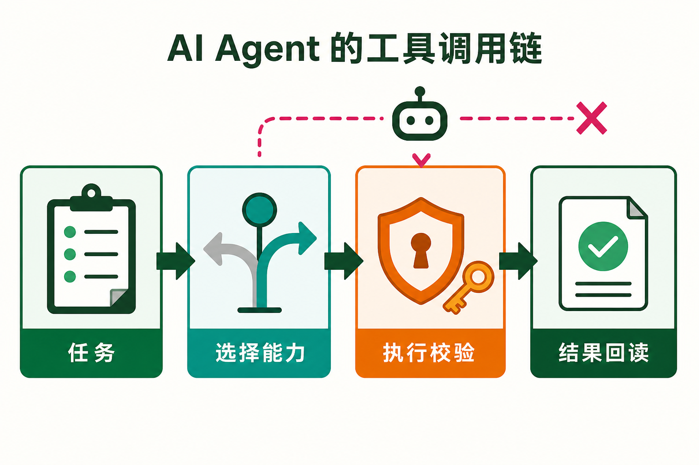
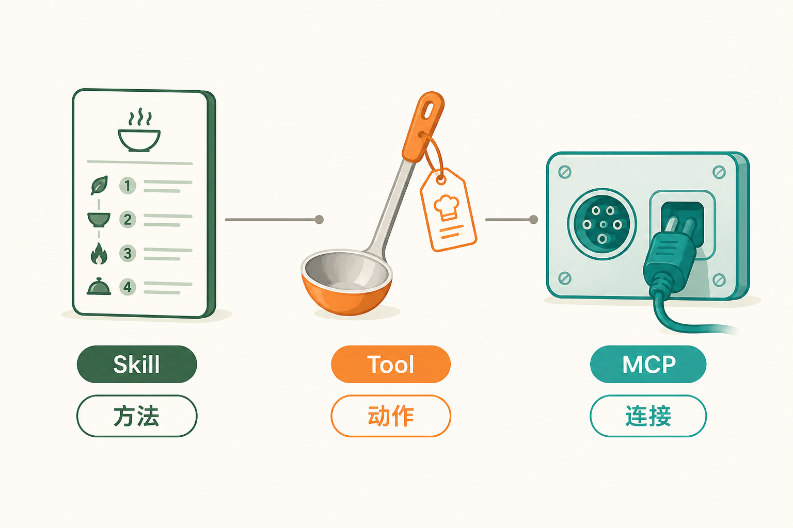
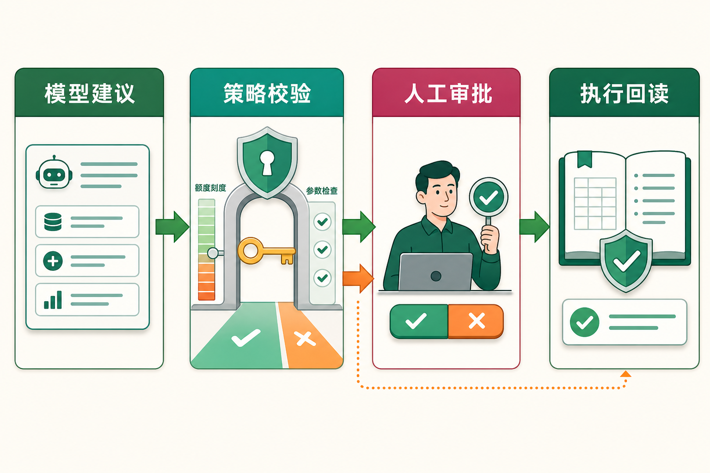

# 从会回答到能办事：工具、技能与 MCP

大语言模型很会说。

你问它“怎么订一张周五去上海的高铁票”，它能把车次选择、出发时间、换乘风险讲得头头是道。可你再追问一句：“那你帮我订吧。”事情立刻变了。回答问题只需要生成文字，真正订票却要查询余票、读取乘车人、选择座位、提交订单，最后还可能涉及付款确认。

这就是普通聊天模型与 AI Agent 之间最直观的一道分界线：前者主要给出内容，后者还要在规则允许的范围内采取行动。

要让 Agent 真正动起来，绕不开三个词：工具（Tool）、技能（Skill）和 MCP（Model Context Protocol，模型上下文协议）。它们经常一起出现，很多介绍索性都叫“插件”。入门时这么记没问题，做系统时就得分开：工具负责一次动作，技能负责一套方法，MCP 负责不同系统之间的连接和能力交换。

先不看框架名单。把一句话变成一次能检查、能追踪、出了问题也能收拾的动作，三者的区别自然就出来了。

## 一、模型不是伸出了一只隐形的手

假设用户说：“把本周销售数据整理成图表，发给项目群。”

模型可以理解目标，也可以判断需要读取数据、计算汇总、生成图片和发送消息。但模型生成“调用发送消息工具，参数如下”，并不等于消息已经发出。它只是提出了一个结构化的动作建议。真正碰数据库、运行代码、调用消息接口的，是模型之外的执行程序。

一条完整的执行链至少有四步：

1. **任务**：理解用户要什么，也理解不能做什么。用户说“发给项目群”，系统仍要确定是哪个群、发送什么版本、是否包含敏感数据。
2. **选择能力**：模型从可用能力中选择合适的工具，生成工具名和参数。这里可能选数据库查询、代码执行、制图和发消息四类工具。
3. **执行校验**：执行层检查工具是否存在、参数是否符合结构、当前身份是否有权限、动作是否超出额度，必要时要求人工确认。
4. **结果回读**：外部系统返回结果后，系统再读取权威状态。消息接口返回“请求已受理”，不等于群里一定出现了消息；订单接口返回“处理中”，也不能被描述成“购买成功”。

OpenAI 官方把 Function Calling（函数调用，也常被称为 Tool Calling）描述成多轮交互：应用先告诉模型有哪些工具，模型返回调用请求，应用执行代码，再把结果交回模型。模型接着回答，或者继续调用下一个工具。记住这条边界就够了：**模型负责提议，应用负责执行。**

边界一松，危险马上出现：模型说“删除完成”，页面也跟着显示“删除完成”，数据库里却没人核对；金额多了一个零，执行器还照样提交。模型可以帮忙判断，不能同时当申请人、审批人、出纳和审计员。

## 二、Tool、Skill、MCP 各自在管什么

把 Agent 想成一家后厨，会比较好懂。

菜谱告诉厨师先做什么、后做什么，这是方法；炒锅和烤箱完成具体动作，这是工具；水电接口、插头规格和设备连接标准，让各种设备可以接入，这是协议。菜谱不能替代炒锅，插座也不会自己炒菜。

### 1. Tool：把一个动作定义清楚

Tool 是 Agent 可以调用的一项具体能力。它通常有清楚的名称、输入参数、返回结果和副作用。例如：

- `get_order`：根据订单号读取订单信息；
- `create_refund`：提交退款申请；
- `run_report`：执行一段受限的数据分析；
- `send_message`：向指定会话发送内容。

一个好工具不是“万能办事箱”。它应当让人只看名称、说明和参数，就大致知道什么时候能用、会改变什么。参数最好使用明确类型、枚举和必填项，减少“城市填成手机号”这种荒诞但并非不可能的场面。

工具也不等于 API。API 是系统提供的程序接口，Tool 是暴露给 Agent 的能力契约。一个 Tool 可以在内部调用一个 API，也可以组合多个 API；可以运行受限代码，还可以驱动浏览器完成没有开放接口的页面操作。反过来，也没有必要把后台的每个 API 原封不动地塞给模型。数据库有两百个接口，不代表模型应该在两百个按钮前现场抽签。

### 2. Skill：把“怎样做好一类事”整理出来

Skill 可以翻成“技能”。在 Agent 系统里，它通常不是一次动作，而是一套可复用的做事方法，可能包含领域知识、标准流程、提示模板、脚本、示例和配套资源。

例如“月度账单核对”这个 Skill，可以规定：先收集账单，再统一币种和时间范围，然后检查重复项、环比波动和异常单价，最后生成报告。流程中会调用读取文件、运行计算、查询价格和写入文档等多个 Tool。

放在一起看：

- Tool 回答“这一步具体怎么做”；
- Skill 回答“这类任务通常应该按什么顺序做，做到什么标准”。

Skill 的价值在于把经验沉淀下来，让 Agent 不必每次都临场发明流程。但它不能凭空获得权限。技能文档写着“删除旧数据”，不代表当前用户就有删除权；脚本放在技能目录里，也不代表它可以绕过沙箱。方法可以指导行动，权限仍由运行环境决定。

### 3. MCP：让能力可以被发现和连接

MCP 的全称是 Model Context Protocol，中文通常译为“模型上下文协议”。它采用客户端—服务器结构，让 AI 应用以一致方式连接外部能力。

准确地说，一个 MCP Host 是承载 Agent 的 AI 应用；Host 会为连接的 MCP Server 创建相应的 MCP Client。Server 可以运行在本机，也可以是远程服务。协议负责连接、能力发现、请求与响应等共同规则，但不规定你的 Agent 应该怎样推理，也不会替业务系统自动完成授权。

MCP Server 最常见地暴露三类对象：

- **工具（Tools）**：可执行的动作，例如查询数据库、创建工单、写入文件；
- **资源（Resources）**：可读取的上下文，例如文件内容、数据库记录、接口返回；
- **提示模板（Prompts）**：可复用的交互模板，例如代码审查模板或故障排查提纲。

这三个对象不要混用。读取一份制度文件，更像获取 Resource；提交一次请假申请，更像调用 Tool；提供一份固定的周报写作结构，更像使用 Prompt。Server 可以同时提供三者，Client 先发现它们，再根据需要读取或调用。

MCP 主要解决重复接线的问题。以前每个 AI 应用都要为文件系统、数据库、代码仓库各写一套适配；有了共同的对象模型，提供方和使用方可以按同一套规则协作。它只规定“怎么对话”，不决定“谁能做什么”。门禁插头统一了，也不代表任意一张卡都能进机房。

## 三、三者怎样一起工作

现在做一个“报销助手”。用户上传发票并说：“帮我检查一下，没问题就提交。”

把这个例子拆开看：

- **Skill** 提供报销检查流程：识别发票、核对金额、检查重复报销、匹配制度、生成摘要、提交前确认；
- **Tool** 完成具体动作：读取发票、查询历史记录、计算金额、创建报销单；
- **MCP** 让 Agent 用统一方式连接文件系统、财务系统和企业知识库，并发现其中的工具与资源。

运行时，Agent 先按 Skill 判断需要哪些信息；通过 MCP Resource 读取报销制度；调用 OCR Tool 识别发票；查询历史报销；发现餐费超过个人额度后，不再继续提交，而是向用户说明原因。若全部通过，则展示收款人、金额和费用归属，等待用户确认，再调用创建报销单的 Tool。

放在一起，三者刚好分成三层：方法层组织任务，动作层执行步骤，连接层让能力以共同方式出现。没有工具，流程只能停在纸面；没有技能，Agent 做事容易东一棒槌西一棒槌；没有统一连接方式，每接一个系统都得重新布线。

## 四、机制加餐：工具多了，为什么反而可能更笨

给 Agent 增加工具，看起来像给新员工多配设备，但工具不是越多越好。每个工具的名称、描述和参数都会占用上下文，也会增加选择难度。两个工具都叫“搜索”，一个搜客户，一个搜工单，如果说明含糊，模型选错并不奇怪。

落到工具设计上，我会看四件事：

1. 名称表达动作和对象，例如 `search_tickets` 比 `search` 更明确；
2. 描述说明何时使用、何时不要使用，以及返回值代表什么；
3. 参数尽量消除非法状态，能用枚举就不要让模型自由发挥；
4. 只在当前任务中加载需要的工具，大型能力集合可先检索再加载。

工具调用质量要拆开看：工具选对了吗，参数对吗，接口成功了吗，用户的事办成了吗？只盯着 `200` 状态码，可能得到一种假象：接口很健康，用户的问题还在原地。

## 五、真正危险的不是“答错”，而是“做错”

回答错一句话，通常还能撤回或纠正；发错邮件、重复扣款、删除数据，代价就不同了。只要动作会改变外部世界，就要让校验发生在模型之外。

落地时，至少要有这些安全闸门：

- **最小权限**：只给完成当前任务所需的权限，并区分读取与写入；
- **参数校验**：在执行器中检查类型、范围、业务规则和资源归属；
- **分级审批**：查天气可以直接做，付款、删除、群发等动作应展示影响并确认；
- **幂等控制**：为有副作用的请求设置幂等键，避免超时重试造成重复扣款或重复创建；
- **执行回读**：用任务编号查询权威状态，不把“请求已提交”包装成“业务已完成”；
- **审计追踪**：记录是谁提出、模型建议了什么、校验如何判断、最终执行了什么。

超时是最容易误判的地方。调用方没收到结果，不代表对方没执行。先拿任务编号查状态：已经完成就记录结果，确认没执行再带着幂等键重试；遇到部分成功或状态冲突，就做补偿或转人工。直接重试很省事，也可能把钱扣两遍。

## 六、初学者可以怎样继续学

练手时别先背框架类名。做一个小项目，按下面的顺序走一遍：

1. 定义一个只读工具，例如查询天气或读取本地文档；
2. 观察完整调用记录：模型选择了什么、参数是什么、结果怎样回到模型；
3. 增加一个写工具，并在执行前加入权限、参数校验和人工确认；
4. 把一组步骤整理成 Skill，比较“有流程”和“临场发挥”的稳定性；
5. 再用 MCP 接入一个外部 Server，观察能力发现、对象列表和调用过程；
6. 最后故意制造超时、错误参数和权限不足，验证系统能否停止、解释和恢复。

最后用三句话自测：

**Tool 是动作，Skill 是方法，MCP 是连接规则。模型提出行动，执行器守住边界，外部系统给出真实结果。**

当这几层各自站稳，Agent 才算从“很会聊天”迈到“能把事情办完”。这一步不靠给模型戴一顶更大的魔法帽，而靠把每一次行动设计得清楚、受控、可验证。

## 参考资料

- [OpenAI 官方文档：Function calling](https://developers.openai.com/api/docs/guides/function-calling)
- [Model Context Protocol 官方文档：Architecture overview](https://modelcontextprotocol.io/docs/learn/architecture)
- [Anthropic：Building Effective AI Agents](https://www.anthropic.com/engineering/building-effective-agents)
