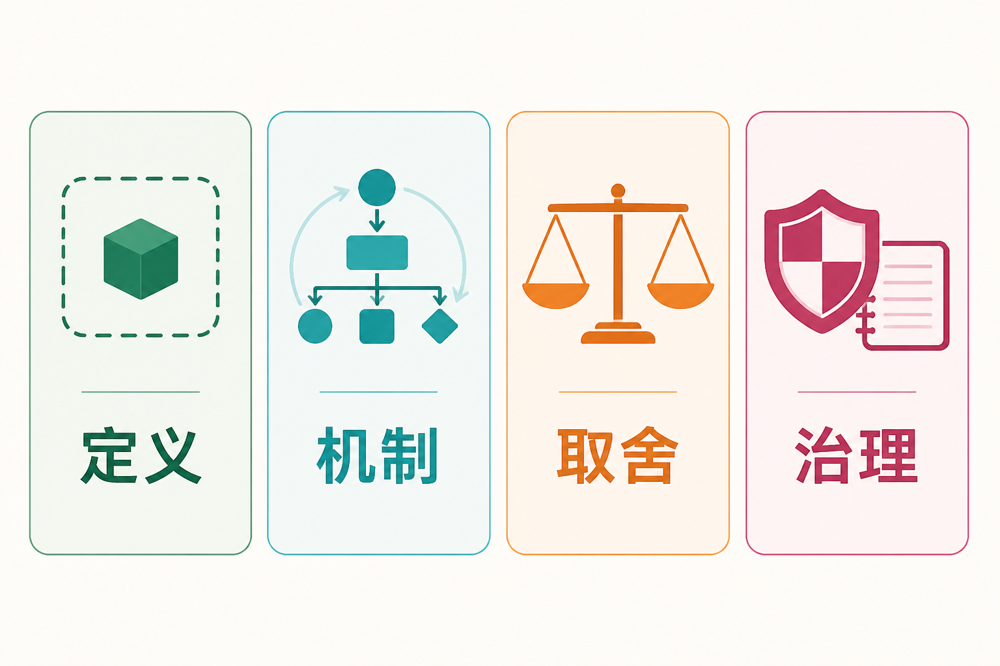

# 面试官问工具调用与 MCP：别只会说插件

AI Agent 面试里，工具调用和 MCP 经常被问到。很多回答停在一句“让模型调用插件”，面试官再追问两句，边界、机制和工程细节就露怯了。数据库不能只解释成“存数据”，工具也不能只解释成“插件”。

下面挑几组工程里常见的问题来讲。每题都分成原理、答题点、记忆点、追问和失分点。面试时不用照着背，能把前因后果讲清楚更重要。

## 一、先掌握一个通用回答骨架

遇到工具、协议和系统设计题，可以用四段式回答：

1. **定义**：先说它解决什么问题，再指出与相邻概念的边界；
2. **机制**：按输入、决策、执行、结果回流讲主链路；
3. **取舍**：说明什么场景适合，什么场景不适合；
4. **治理**：补上权限、审批、幂等、审计、评测和失败恢复。

这样答，内容不容易飘在名词上。只讲定义像查百科，只讲代码像背教程，只讲安全又像系统从没真正跑过。四段都交代，才接近上线设计。

## 二、Tool Calling 的高频题

### 问题 1：什么是 Tool Calling？模型真的执行了函数吗？

**原理**

Tool Calling 是模型与应用之间的结构化协作机制。应用向模型提供工具名称、说明和参数结构；模型根据任务生成调用建议；应用解析并校验参数，在自己的运行环境中执行函数或外部请求；然后把结果作为工具输出交回模型。模型据此生成最终回答，也可能继续调用其他工具。

**答题点**

- 模型输出的是“调用哪个工具、使用什么参数”，不是直接在业务系统中执行代码；
- 工具一般以结构化契约描述，函数工具常用 JSON Schema 约束参数；
- 执行发生在应用侧或受控运行环境，权限和参数必须由执行层检查；
- 工具结果要回到模型，形成多轮闭环，零次、一次或多次调用都可能发生。

**记忆点**

> 模型提议，系统执行，结果回流。

**常见追问**

Function Calling 和 Tool Calling 有什么差别？答法是：工程里两者经常混用；Function Calling 多指按函数结构生成名称和参数，Tool Calling 范围更宽，还可以包含搜索、代码执行、计算机操作或自定义工具。面试中不用纠结名词，说明白执行权仍在应用侧就够了。

**失分点**

说“模型直接调用 API”，却讲不出谁保管凭据、谁做授权、工具结果如何返回。模型若真直接握着生产密钥，面试官大概会先替安全团队吸一口气。

### 问题 2：怎样设计一个高质量工具定义？

**原理**

工具定义既是接口契约，也是模型选择工具时看到的说明。名称和描述含糊，会导致工具选择错误；参数结构松散，会导致参数错误；返回值语义不清，会让模型把“已受理”误解为“已完成”。

**答题点**

- 名称同时表达动作与对象，例如 `search_tickets`、`create_refund`，避免只叫 `search`、`process`；
- 描述写清适用条件、禁用条件、参数格式和返回结果的含义；
- 用类型、枚举、必填字段和禁止额外字段减少非法状态，支持时启用严格结构约束；
- 工具保持内聚：始终连续执行的底层步骤可以封装，风险不同的动作则不要硬塞进一个“万能工具”。

**记忆点**

> 名称可选择，参数可校验，结果可解释，副作用可识别。

**常见追问**

工具是不是越细越好？不是。太粗会权限过大、难以校验；太细会增加规划轮次和选择难度。应围绕稳定的业务动作切分，并用端到端评测验证粒度。

**失分点**

只谈提示词，不谈 schema、返回值和副作用；或把后台所有 API 原样暴露给模型，让模型面对几百个相似工具现场做阅读理解。

### 问题 3：工具很多时，怎样提高选择准确率并控制上下文成本？

**原理**

工具名称、说明和参数定义都会进入模型上下文。工具越多，相似选项越多，占用的输入也越大。准确率问题与成本问题往往同时出现。

**答题点**

- 按领域划分命名空间，减少名称冲突，例如订单、客户、工单分别组织；
- 根据当前任务、用户权限和流程阶段，只加载候选工具子集；
- 对大量低频工具采用工具检索或延迟加载，先找能力，再加载完整定义；
- 建立工具选择评测集，分别统计工具名准确率、参数准确率、无须调用时的克制率和最终任务成功率。

**记忆点**

> 先缩小候选集，再让模型选择；不是把整间仓库一次倒在桌上。

**常见追问**

为什么只看工具调用成功率不够？因为接口成功不代表选对了工具，也不代表用户任务完成。比如顺利查到了错误客户的订单，HTTP 状态码很开心，用户并不会开心。

**失分点**

把“换更大模型”当作唯一方案，没有提工具组织、按需加载、权限裁剪和评测。

## 三、Skill、Tool 与 MCP 的边界题

### 问题 4：Skill、Tool、MCP 有什么区别，它们怎样协作？

**原理**

Skill 是可复用的方法与流程，Tool 是一次具体动作的能力契约，MCP 是 AI 应用与外部能力之间的连接协议。三者分别位于方法层、动作层和连接层。

**答题点**

- Skill 可包含领域知识、标准流程、提示模板、脚本和资源，负责指导一类任务怎样完成；
- Tool 定义名称、输入、输出和副作用，负责把某一步落到系统中；
- MCP 统一 Host、Client、Server 之间的能力发现和交互方式，可暴露工具、资源与提示模板；
- Skill 可以编排多个 Tool，Tool 可以通过 MCP Server 被发现和调用，但 Skill 与 MCP 都不能替代业务授权。

**记忆点**

> Skill 管方法，Tool 管动作，MCP 管连接。

**常见追问**

一个脚本算 Skill 还是 Tool？要看它在系统中的角色。脚本作为可调用的原子能力时更像 Tool；脚本连同知识、步骤、示例和验收标准组成完整做事方案时，才更接近 Skill。

**失分点**

把三者都叫插件，或者声称“接入 MCP 后就自动拥有企业系统权限”。协议能把门铃装得统一，不能替你签发门禁卡。

### 问题 5：请说明 MCP 的架构和核心对象。

**原理**

MCP 采用客户端—服务器架构。MCP Host 是承载 Agent 的 AI 应用；Host 通常为每个 Server 创建对应 Client，由 Client 维护连接；Server 对外提供上下文和能力。官方架构还分数据层和传输层：数据层规定基于 JSON-RPC 的对象和语义，传输层处理本地标准输入输出或远程 HTTP 等通信方式。

**答题点**

- Host 负责整体协调，Client 负责与一个 Server 建立和维护连接，Server 负责提供能力；
- Server 的三类核心对象是 Tools、Resources、Prompts，分别对应动作、上下文数据和交互模板；
- Client 通过列表与读取或调用方法发现能力，能力清单可以动态变化；
- MCP 规定交互方式，但认证、授权、数据隔离和审计仍需结合传输方式与业务系统完成。

**记忆点**

> Host 统筹，Client 连接，Server 提供；Tool 做事，Resource 给资料，Prompt 给模板。

**常见追问**

MCP 与普通 REST API 有什么区别？REST API 定义某个服务的业务接口；MCP 在其上层为 AI 应用提供统一的能力发现和对象模型。MCP Server 内部完全可以调用 REST API，两者不是互相替代。

**失分点**

只说“它是统一插件协议”，没讲 Host、Client、Server 和三类对象；或者把 Resource 当成向量数据库，把 Prompt 当成系统提示词的唯一来源。

## 四、执行通道与生产取舍题

### 问题 6：API、隔离代码执行、浏览器自动化应该怎样选？

**原理**

选执行通道，不能只问“能不能做”，还要看稳定性、版本管理、权限边界、可观测性和维护成本。稳定业务优先走 API；计算、文件处理和临时分析放进隔离代码环境；没有合适 API，或必须依赖真实页面状态，再用浏览器自动化。

**答题点**

- API 输入输出明确，易做版本管理、权限控制、幂等和审计，适合稳定业务动作；
- 代码执行适合数据转换、分析和制图，但必须限制网络、文件、CPU、内存和运行时间；
- 浏览器自动化能覆盖没有接口的系统，却容易受页面改版、弹窗、登录状态和加载时序影响；
- 三种通道都要统一接入执行策略、日志、超时处理和结果回读，不能让模型绕开治理层。

**记忆点**

> 稳定业务走 API，计算转换进沙箱，无接口再进浏览器。

**常见追问**

浏览器自动化何时反而更合适？当任务必须依赖用户可见页面、需要现有登录会话，或者目标系统没有可用接口时可以采用，但高风险提交前应保留确认点，并用页面可见状态验证结果。

**失分点**

回答“都可以，看情况”，却没有给出判断维度；或者认为浏览器能点通一次，就等于生产上稳定可维护。

### 问题 7：怎样防止 Agent 越权或执行高风险操作？

**原理**

提示词不是安全边界。模型会误解意图，也可能受到间接提示注入影响。权限控制要放在模型外面，由身份、策略和执行系统强制执行。

**答题点**

- 使用用户身份或委托身份访问下游系统，落实最小权限和租户隔离；
- 根据读写类型、金额、影响范围和不可逆性对工具分级；
- 执行前做参数、资源归属、额度和业务规则校验，高风险动作要求人工确认；
- 记录任务、模型建议、工具参数、审批和真实执行结果，支持追踪与审计。

**记忆点**

> 提示词负责提醒，执行层负责拒绝。

**常见追问**

人工确认应该放在哪里？放在已生成明确动作、但尚未产生副作用的位置。确认界面要展示对象、金额、接收方和影响，不能只问一句含糊的“是否继续”。

**失分点**

把“在系统提示词中写禁止删除”当成主要防护；没有提身份传递、策略校验和审计。

## 五、可靠性与故障恢复题

### 问题 8：有副作用的工具调用超时后，为什么不能直接重试？

**原理**

超时表示调用方没有及时收到结果，并不证明服务端没有执行。如果第一次请求已经创建订单、扣款或发送消息，直接重试可能造成重复副作用。

**答题点**

- 为写操作生成任务 ID 或幂等键，并在调用链路中持续传递；
- 超时后优先查询权威状态：已完成则记录结果，明确未执行才允许重试；
- 对部分成功设计补偿操作，对状态冲突、高风险或无法确认的情况转人工；
- Trace 中记录每次尝试、幂等键、外部请求号、结果和补偿动作。

**记忆点**

> 先查询，后重试；能幂等，才自动重试。

**常见追问**

幂等与补偿有什么区别？幂等用于避免同一个请求重复产生效果；补偿用于撤销或修正已经发生的部分效果。分布式业务中不一定能做数据库式回滚，所以常用补偿流程恢复一致性。

**失分点**

一上来就说指数退避重试。退避解决的是请求频率，不解决第一次是否已经执行；慢一点重复扣款，仍然是重复扣款。

### 问题 9：怎样评测一个 Agent 的工具使用能力？

**原理**

工具使用不是单一指标。应把从“是否需要调用”到“业务是否完成”的链路拆开评测，并保留端到端任务指标。

**答题点**

- 决策层：该调用时是否调用、不该调用时是否克制、工具选择是否正确；
- 参数层：字段完整性、类型正确性、实体绑定和约束满足率；
- 执行层：成功率、超时率、重试次数、权限拒绝率和副作用重复率；
- 任务层：端到端成功率、人工接管率、用户修正次数、延迟与成本，并结合 Trace 定位失败环节。

**记忆点**

> 选得对、填得准、跑得稳、事情成。

**常见追问**

离线评测和线上评测怎样配合？离线用固定任务集回归工具选择、参数和安全策略；线上监控真实分布、异常率和人工反馈。重大工具或策略变更应先离线回归，再灰度观察。

**失分点**

只报一个“工具调用成功率”，不解释分母是什么，也不区分接口成功与任务成功。

## 六、把答案说得像做过，而不是看过

面试里真正拉开差距的，往往不是定义背得多长，而是能不能把边界和失败路径补出来。说 Tool Calling，要说清“模型不执行”；说 MCP，要说清“协议不替代授权”；说重试，要说清“超时不代表未执行”；说浏览器自动化，要说清“能点通不等于稳定”。归根结底：**模型负责理解和建议，系统负责约束和执行。**

最后可以用这段 30 秒版本收尾：

> Tool Calling 是模型与应用之间的结构化执行闭环，模型产生工具与参数，应用侧校验和执行，再把结果返回模型。Skill 沉淀一类任务的知识与流程，Tool 提供具体动作，MCP 统一 AI 应用连接外部工具、资源和提示模板的方式。生产环境还要补齐最小权限、人工审批、幂等、状态回读、审计和分层评测，否则系统只是“会调用”，还谈不上“可靠办事”。

这段话不长，但定义、机制、边界和治理都在。面试官继续问工具设计、MCP 架构或故障恢复时，顺着这四条往下展开就行，不用把希望寄托在“插件”两个字上。

## 参考资料

- [OpenAI 官方文档：Function calling](https://developers.openai.com/api/docs/guides/function-calling)
- [Model Context Protocol 官方文档：Architecture overview](https://modelcontextprotocol.io/docs/learn/architecture)
- [Anthropic：Building Effective AI Agents](https://www.anthropic.com/engineering/building-effective-agents)
