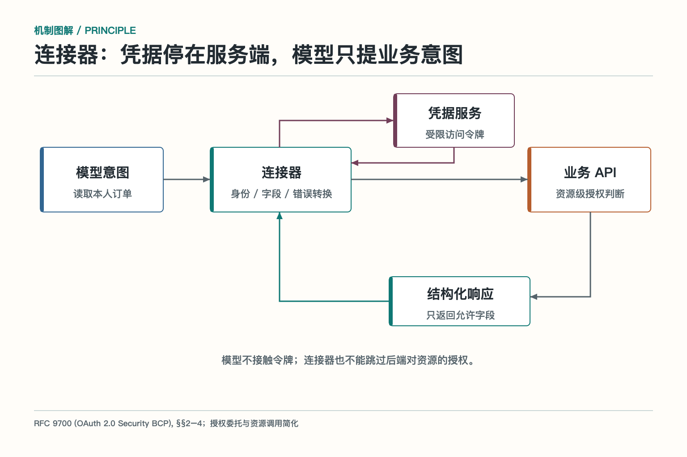

# 连接器与插件：把外部系统翻译成 Agent 能用的能力

Agent 想查客户资料，CRM 说字段叫 `contact_owner_id`；工单系统把负责人叫 `assignee`；另一个系统又用中文字段“处理人”。认证方式、分页方式、错误码和限流规则也各不相同。

如果把这些细节直接暴露给模型，模型每做一件事都要重新理解供应商手册。连接器的工作，就是把具体系统的语言翻译成稳定、清楚、可治理的能力。

插件是更宽泛的产品概念。它可能包含连接器、界面、配置、脚本和业务功能。连接器则强调系统适配：认证怎么做，对象怎样映射，错误怎样归一，能力怎样向上暴露。

## 连接器不是薄薄的一层转发

最简单的连接器似乎只做一件事：收到参数，调用外部 API，再把结果原样返回。这样的代码能跑，但上层很快会被供应商细节淹没。

好的连接器会把外部对象翻译成业务领域能力。上层调用“查客户”“创建工单”“更新联系人”，不需要知道供应商分页游标、内部枚举和临时字段。连接器保留原始 ID 和来源，方便回到源系统核对。

字段映射要处理空值、时区、金额单位、状态枚举和嵌套结构。供应商把 `closed` 拆成 `resolved` 与 `archived` 后，连接器要明确怎样映射，而不是让模型自己猜。无法无损映射时，返回原始状态和兼容说明。

连接器也不负责决定业务流程。“什么时候更新客户”“退款是否需要审批”属于 Skill、Workflow 或业务策略；连接器负责把动作可靠地落到目标系统。若连接器开始内置大量业务决策，它会变成难以复用的巨型流程。

## 认证和凭据留在连接器里

模型不需要看到 API Key、Cookie、数据库密码和刷新令牌。连接器使用受控身份从凭据服务获取短期令牌，调用目标系统后，只把业务结果返回上层。

*依据 RFC 9700 的 OAuth 2.0 安全建议改绘，省略了授权流程的具体报文。*

调用身份要说清。服务账号适合后台任务，但权限不应大到覆盖整个组织；代表用户执行时，要保留用户委托和资源范围；多租户系统要防止一个租户的令牌、缓存和结果被另一个租户复用。

OAuth 之类的授权流程需要校验令牌受众、作用域、有效期和回调来源。长期刷新令牌单独保存，运行时只注入短期访问令牌。日志、错误和模型上下文中都不应出现完整凭据。

权限不能只在连接器入口查一次。外部系统的权限可能变化，资源归属也可能在请求前发生改变。连接器发起写操作时，仍要使用当前身份访问后端，让后端成为最终授权边界。

## 分页、限流和批量部分成功

Agent 问“列出全部未关闭工单”，连接器不能只返回第一页，也不能无限拉取。它要处理分页游标、最大数量、时间范围和排序，并把是否还有下一页告诉上层。

供应商限流时，连接器统一读取重试时间，做有限退避和并发控制。多个 Agent 共用同一个账号，要在连接器层协调额度，不能让每个 Agent 各自重试，最后一起把服务打挂。

批量写入可能部分成功。十个联系人更新成功八个，连接器应逐项返回对象 ID、状态和错误。已成功的不能整批重试；失败项根据错误类型决定修参数、等待、补偿或人工处理。

写操作超时尤其要谨慎。第一次请求可能已经落地，连接器先用外部请求 ID 或业务键查询，再决定是否重试。能使用幂等键的系统，应把幂等键传到供应商；不支持时，连接器要建立自己的请求映射。

## 错误要从供应商语言翻成任务语言

不同系统会返回不同错误码。有的用 HTTP 状态，有的永远返回 200 再在正文里写错误，有的把权限不足和资源不存在混在一起。连接器要把它们归一成稳定分类。

上层关心的是：参数能否修正，权限是否不足，资源是否不存在，是否被限流，状态是否冲突，是否可以安全重试。详细供应商错误保留在受控日志，返回模型的内容做脱敏，并带追踪 ID。

错误分类不能为了统一而丢信息。连接器可以提供标准类别，同时保留供应商代码、请求 ID 和原始状态。排障人员需要原始证据，上层流程需要稳定语义，两者都要照顾。

当供应商故障时，连接器还要决定熔断和降级。只读查询可以在允许时返回带时间戳缓存；写操作不能用缓存伪装成功；关键服务持续失败时停止请求并告警，避免把故障放大。

## 事件和 Webhook 也需要适配

外部系统不只接受请求，也会主动推送事件。订单完成、工单更新、日程取消，可能通过 Webhook 发送给连接器。供应商的事件名称、签名方式、重试策略和字段结构同样需要翻译。

连接器先验证签名和时间戳，防止伪造和重放；再用事件 ID 去重，避免供应商重试造成重复任务；最后把供应商事件转换成内部稳定事件，例如 `ticket.updated`，并保留源系统和原始事件 ID。

事件只描述已经发生的事实，不应夹带模糊命令。“工单状态已变更”比“请处理工单”更适合事件。上层工作流收到事实后，再决定是否创建任务、通知用户或调用其他工具。

事件处理失败要有重放和死信队列。连接器不能先返回成功再把事件悄悄丢掉，也不能因为一条坏数据堵住全部事件。修复映射后，可以用同一个事件 ID 重放，确保副作用幂等。

## 缓存和一致性要说清楚

为了降低限流和延迟，连接器常缓存客户资料、目录和配置。缓存必须带来源、版本、更新时间和身份范围。用户权限不同，缓存不能混用；供应商数据更新后，缓存也要按事件或有效期失效。

读取缓存时要告诉上层数据是否实时。库存、余额、权限和审批状态通常不能用过期数据做高风险决策。展示型资料可以接受短时缓存，但要显示更新时间。缓存是性能手段，不是新的权威数据源。

写入后也要处理读写一致性。供应商接口返回成功，但查询接口可能稍后才更新。连接器可以返回“已提交”与任务 ID，之后轮询或等待事件确认；不能立即读到旧值就重复写入，也不能把旧缓存当成失败证据。

## 一个连接器应该覆盖多大范围

把一个供应商全部接口做成一个连接器，部署方便，但权限面和故障范围会变大。按每个 API 建连接器，又会产生大量重复认证和限流代码。

更实用的拆分依据是安全域、对象模型和生命周期。CRM 客户与销售机会共享身份和字段，可以在同一连接器；支付和普通订单风险差异大，往往值得拆开；由不同团队发布和维护的能力，也应有独立版本和回滚边界。

连接器对上可以暴露多个 Tool 和 Resource，但认证、限流、错误和观测由同一适配层复用。拆分不是复制代码，而是明确责任和影响范围。

## 连接器怎样测试

单元测试检查字段映射、枚举、时间和错误转换；契约测试对照供应商沙盒，确认请求和返回仍符合预期；集成测试覆盖认证、分页、限流、批量部分成功、超时和事件重放；端到端测试再验证上层 Agent 是否完成任务。

测试数据要覆盖空页、重复记录、跨时区、权限变化、未知枚举、供应商返回 200 但业务失败等真实边界。只拿一条正常客户记录跑通，几乎测不出连接器的价值。

上线时先灰度到低风险租户和只读动作，观察错误、限流、数据差异和人工反馈。写操作扩大流量前，必须验证幂等、状态查询和回滚路径。连接器越靠近外部系统，越要把“对方不按预期返回”当成常态。

## 供应商接口会变，连接器要挡住变化

字段改名、枚举新增、权限收紧、限额调整、旧版本下线，都会影响 Agent。连接器对上层提供版本化契约，把供应商变化控制在适配层。

升级前先做影响分析：哪些工具、技能和数据映射依赖旧接口。兼容期可以同时支持新旧字段，用功能开关控制流量；通过沙盒和真实边界样本回归后再灰度。出现问题时，能够切回旧连接器版本。

连接器的能力目录也要同步更新。供应商撤销某个字段后，工具说明不能继续声称支持；新增高风险动作时，权限和确认策略要先到位。目录、实现和文档必须一起发布。

## 插件的安装和治理

插件可能把一组连接器、界面和技能打包在一起。安装前要看来源、签名、版本、权限和网络范围。一个“日历插件”若要求读取全部文件和执行任意命令，权限显然不匹配。

组织内部也要有插件清单：谁安装、谁批准、服务哪些用户、当前版本和所需权限。插件停用时撤销令牌、删除缓存、停止后台任务，并告知依赖它的技能。

更新插件不能只点“升级”。新版本可能新增权限、改变对象语义或切换服务地址。先看变更和权限差异，再做兼容测试和小范围试用。第三方内容和返回结果始终按不可信数据处理。

插件市场还要有废弃机制。长期无人维护、依赖漏洞严重或接口已经下线的插件，应标记弃用、阻止新安装，并给现有用户迁移时间。无限堆积旧插件，只会扩大攻击面和排障成本。

## “大话”连接器：专业翻译，不是传声筒

连接器像一个懂业务的翻译。它不只把中文翻成英文，还要知道不同公司的职位、币种、日期和错误习惯。对方说“请求接受”，它会提醒你这不等于业务完成；对方说“临时错误”，它知道能否重试。

传声筒只会原样转发，专业翻译会保留含义、指出差异、避免误解。Agent 接入外部系统也是如此。连接器越可靠，上层技能越能用稳定语言办事；连接器越薄弱，供应商的每次变化都会一路震到用户面前。

## 参考资料

- [OAuth 2.0 Security Best Current Practice](https://www.rfc-editor.org/rfc/rfc9700)
- [OpenAI 官方文档：MCP servers and connectors](https://developers.openai.com/api/docs/guides/tools-connectors-mcp)
- [OpenTelemetry：Traces](https://opentelemetry.io/docs/concepts/signals/traces/)
