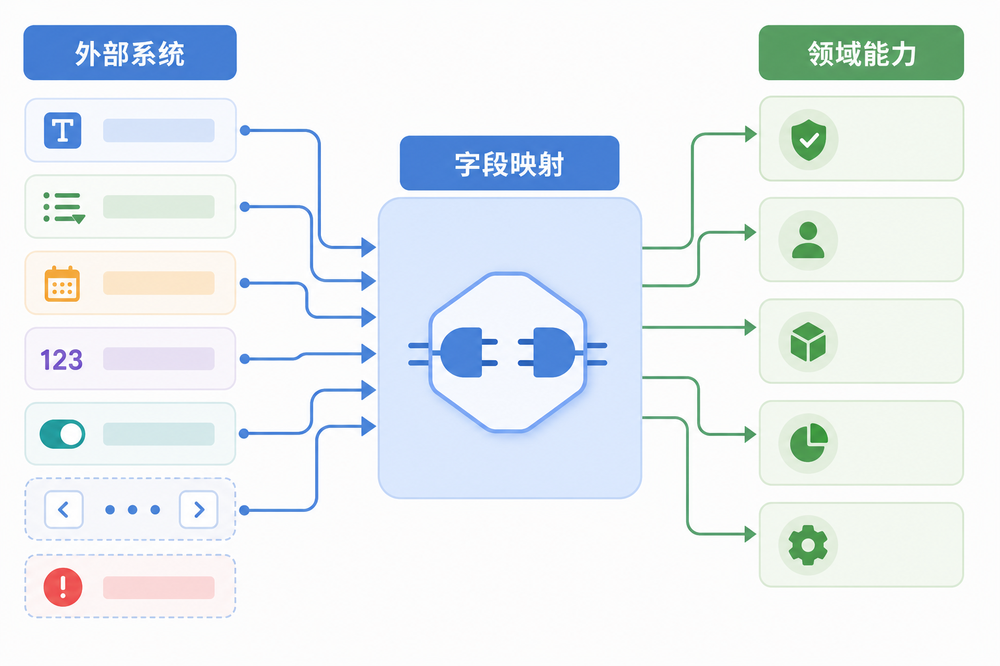
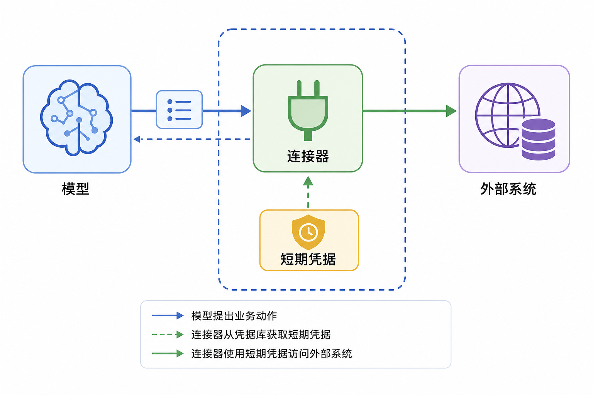
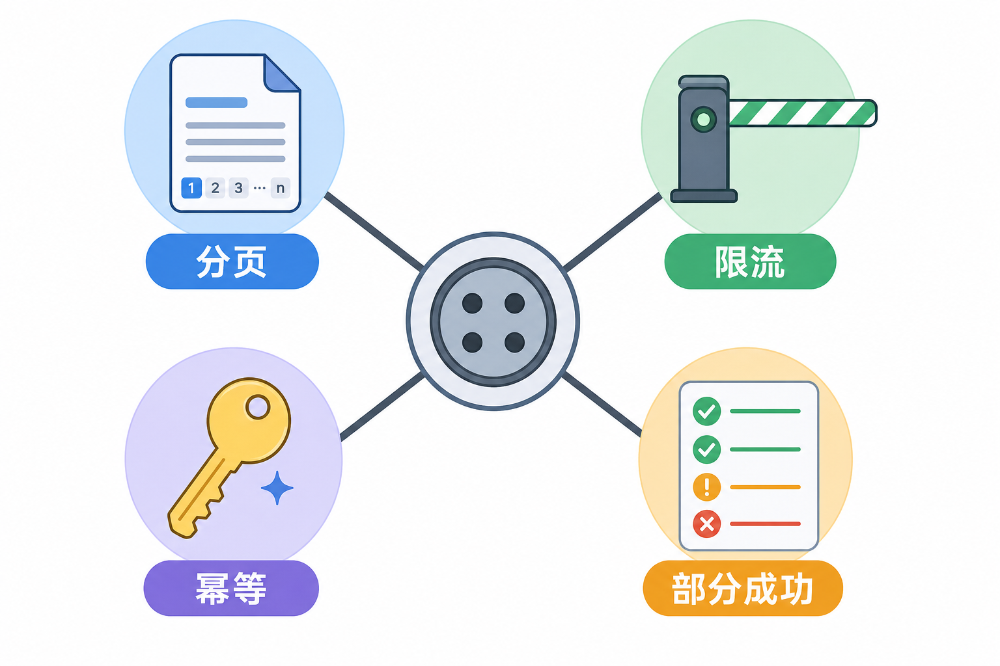
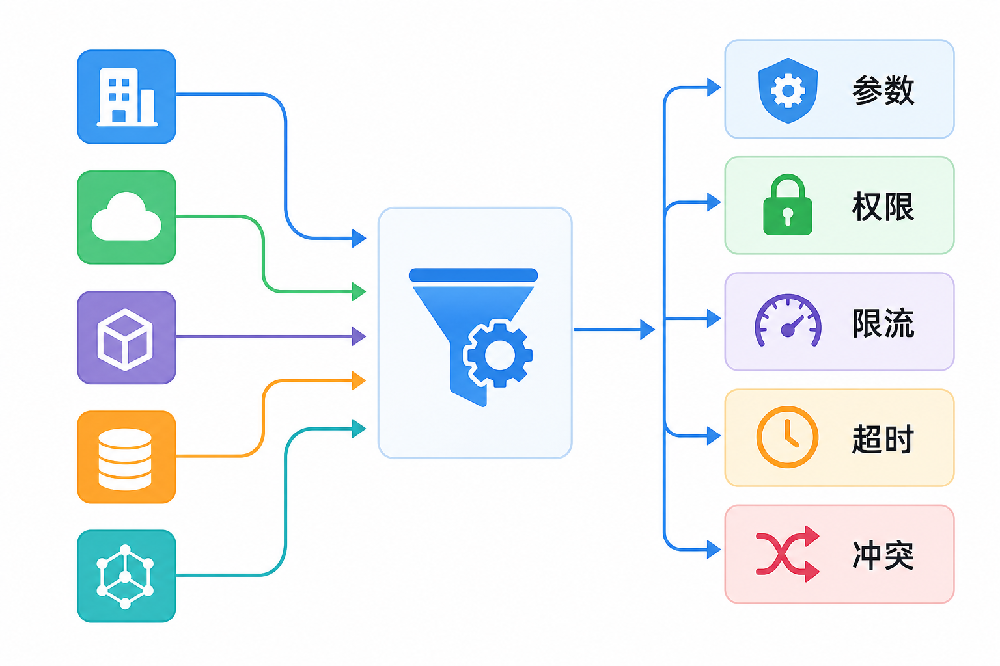
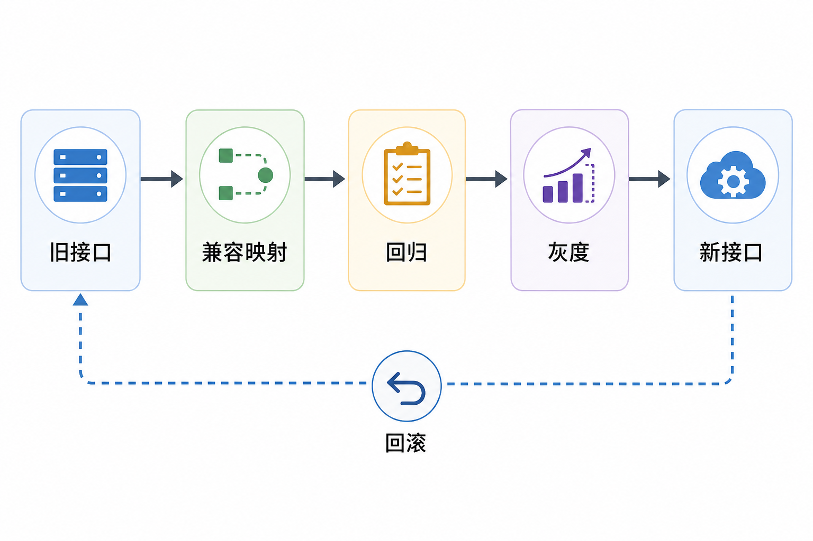
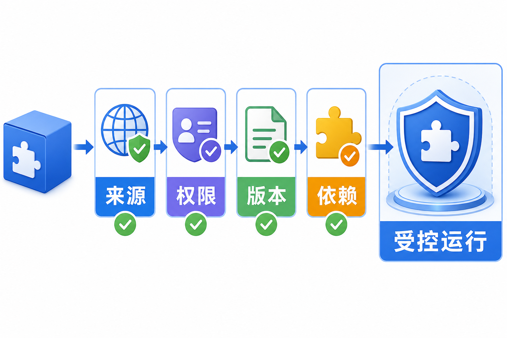

# 面试题：连接器怎样扛住认证、限流和接口变化

这组题关注具体系统适配。不要把连接器答成“封装一下 API”。真正的工程内容是对象映射、身份凭据、分页限流、部分成功、错误归一、可观测性和供应商接口演进。

## 问题 1：连接器与业务流程的边界在哪里？

### 原理

连接器把供应商认证、对象、字段、分页和错误转换成稳定领域能力；业务流程决定何时使用能力、怎样审批和怎样验收。连接器负责可靠接入，不负责包办上层业务决策。

### 答题点

1. 对上暴露“查客户、建工单”等领域动作，不泄漏供应商细节；
2. 保留原始对象 ID 和来源，结果能回到源系统；
3. 字段、枚举、时区、币种和空值在适配层转换；
4. 审批、任务顺序和完成标准留给 Skill、Workflow 或业务策略。

### 记忆点

> 连接器翻译系统语言，不替业务决定什么时候办事。

### 追问

为什么不让连接器内置完整流程？会降低复用，混合权限和生命周期，供应商变化还会牵动业务规则。稳定的供应商适配和可变的业务流程应分开演进。

### 失分点

把连接器理解成 HTTP 客户端，或反过来把全部业务规则塞进连接器。

## 问题 2：连接器怎样管理身份和凭据？

### 原理

凭据由服务端受控组件持有，模型只提出业务动作。连接器根据服务账号或用户委托获取短期令牌，限制作用域、受众、租户和有效期。

### 答题点

1. 长期密钥和刷新令牌放入密钥管理系统，不进提示词和日志；
2. 运行时申请短期、细粒度访问令牌，用完过期或撤销；
3. 用户委托保留用户身份和资源范围，多租户缓存按身份隔离；
4. 后端仍做最终授权，连接器入口校验不能代替资源级权限。

### 记忆点

> 模型知道动作，不知道密钥；连接器拿短期凭据办当前事。

### 追问

服务账号是否更简单？运维简单，但权限容易过宽，审计也难还原具体用户。高风险动作应使用用户委托或细粒度代理身份。

### 失分点

把 API Key 放进工具描述或环境日志，或者多个租户共享同一缓存和令牌。

## 问题 3：分页、限流和批量部分成功怎样统一处理？

### 原理

连接器屏蔽供应商各异的游标、页码、限流头和批量返回格式，向上提供稳定查询与逐项结果。重试必须结合副作用和幂等。

### 答题点

1. 查询接口暴露最大数量、游标和是否还有下一页，防止只取第一页；
2. 统一限流、并发、退避和配额，多个 Agent 共享额度时集中协调；
3. 批量写入逐项返回对象、状态和错误，只重试失败且可幂等的项；
4. 写操作超时先按外部请求号查询，不整批盲目重放。

### 记忆点

> 分页不能漏，限流不能撞，批量结果要逐项说。

### 追问

连接器是否应自动拉完所有分页？按任务和预算决定。大量数据应设置上限、时间范围或流式处理，避免一次请求拖垮上下文和供应商额度。

### 失分点

只在遇到 429 时 sleep，没讲共享配额、抖动、最大重试和写操作副作用。

## 问题 4：供应商错误怎样归一又不丢证据？

### 原理

连接器提供稳定错误类别供上层决策，同时保留供应商错误码、请求 ID 和原始状态供排障。模型只获得脱敏、足够判断下一步的信息。

### 答题点

1. 分类参数、认证、授权、资源不存在、冲突、限流、超时和下游故障；
2. 返回稳定错误码、是否可重试、用户可读说明和追踪 ID；
3. 原始响应进入受控日志，敏感字段和内部地址不回传模型；
4. 未知写入状态先查询，永久错误停止，临时错误有限重试。

### 记忆点

> 上层要稳定语义，排障要原始证据，两份都保留。

### 追问

供应商永远返回 HTTP 200 怎么办？连接器解析业务状态，转换成标准错误；HTTP 状态只作为传输信号，不能代替业务判断。

### 失分点

所有错误统一成“调用失败”，或者把完整堆栈和客户数据直接交给模型。

## 问题 5：供应商 API 演进怎样不影响上层 Agent？

### 原理

连接器提供版本化领域契约，把字段、枚举、权限和限额变化隔离在适配层。升级前评估依赖，兼容期双写或双读，回归后灰度。

### 答题点

1. 上层依赖稳定领域对象，不绑定供应商临时字段；
2. 变更时识别受影响的 Tool、Skill、缓存和评测；
3. 使用版本、功能开关和兼容映射逐步迁移；
4. 沙盒、边界样本和小流量回归，保留旧版本回滚。

### 记忆点

> 供应商可以变，连接器对上的承诺要可控地变。

### 追问

新增枚举值算破坏性变化吗？可能。若上层使用穷举分支，新值会进入未知路径，需要默认处理和回归；不能只按字段是否删除判断兼容性。

### 失分点

只更新代码，不更新能力目录、工具描述、权限和测试。

## 问题 6：连接器怎样做可观测性？

### 原理

连接器处在 Agent 与外部系统之间，需要把模型任务、工具调用、连接器版本和供应商请求串成一条 Trace，同时监控速率、延迟、错误和部分成功。

### 答题点

1. 关联任务 ID、工具调用 ID、外部请求 ID 和业务对象 ID；
2. 记录连接器版本、端点、重试、限流和错误分类；
3. 按租户、动作和供应商聚合成功率、延迟、额度和熔断；
4. 日志做脱敏和保留期控制，异常样本回流评测。

### 记忆点

> 一次动作要能从 Agent 追到供应商，再从供应商追回业务结果。

### 追问

只看平均延迟够吗？不够。要看长尾、限流、特定端点、特定租户和部分成功；平均值会掩盖少量严重故障。

### 失分点

只记录 HTTP 状态和耗时，无法关联用户任务、连接器版本和外部业务对象。

## 问题 7：插件安装和升级怎样治理？

### 原理

插件可能包含连接器、脚本、界面和技能，安装等于引入代码、网络访问和权限。治理需要来源验证、权限声明、版本历史、隔离和撤销。

### 答题点

1. 校验发布者、签名、包来源、依赖和变更记录；
2. 安装前展示文件、网络、工具和业务权限，按最小权限授权；
3. 更新时比较新增权限和契约变化，先测试再灰度；
4. 支持停用、撤销令牌、清理缓存和定位受影响任务。

### 记忆点

> 安装插件就是引入一段有权限的运行代码，不是收藏一个图标。

### 追问

内部插件是否可以跳过签名和审查？不应。内部包同样会误配、被替换或过期，至少要有来源、版本、审查和回滚记录。

### 失分点

只看功能列表，没有检查网络范围、凭据、自动更新和卸载后的残留任务。

## 问题 8：Webhook 事件怎样做到不丢、不重、不乱？

### 原理

供应商通常至少一次投递事件，可能重复、延迟或乱序。连接器需要验证来源、按事件 ID 去重、保存接收状态，并把事件转换成内部稳定语义。

### 答题点

1. 校验签名、时间戳和来源，防止伪造与重放；
2. 用供应商事件 ID 或业务键去重，消费者保持幂等；
3. 先持久化再确认，失败进入重试或死信队列；
4. 记录事件时间和版本，处理乱序并支持修复后的重放。

### 记忆点

> 先验来源，再存事件；重复能去重，失败能重放。

### 追问

收到“订单已完成”后是否直接通知用户？还要核对对象和权限，必要时读取权威状态；事件触发后续流程，但不能让不可信载荷直接产生高风险副作用。

### 失分点

Webhook 到达即处理且先返回成功，没有持久化、去重、乱序和死信机制。

## 问题 9：连接器缓存怎样避免权限串用和过期决策？

### 原理

缓存必须绑定资源、版本、用户或租户权限，并明确时效。高风险决策使用权威实时状态，展示型数据才能按策略接受过期缓存。

### 答题点

1. 缓存键包含租户、身份、资源和关键查询条件；
2. 内容带来源、版本和更新时间，返回时标明是否缓存；
3. 权限撤销和供应商事件触发失效，避免旧授权继续生效；
4. 库存、余额、审批等关键状态执行前重新查询。

### 记忆点

> 缓存能省请求，不能替权威系统做决定。

### 追问

写入成功后立刻查询仍是旧值怎么办？返回处理中或已提交状态，使用任务 ID、重试读取或等待事件，不要重复写入，也不要提前报告完成。

### 失分点

只设置固定 TTL，没有身份隔离、事件失效和高风险实时查询。

## 问题 10：连接器应该按供应商、对象还是能力拆分？

### 原理

拆分边界要综合安全域、对象模型、团队所有权、发布周期和故障范围。按供应商全部合并可能权限过宽，按接口逐个拆分又会重复基础设施。

### 答题点

1. 共享认证、限流和对象模型的能力可以在同一连接器复用；
2. 风险级别、凭据或数据域明显不同的能力应拆开；
3. 不同团队和发布节奏建立独立版本与回滚边界；
4. 对上可暴露多个内聚 Tool/Resource，底层复用公共适配组件。

### 记忆点

> 按责任和安全域拆，不按接口数量机械拆。

### 追问

支付和订单是否放一起？若共享对象但支付权限和合规要求更高，通常拆分支付能力或至少使用独立凭据、审批和故障边界。

### 失分点

认为一个供应商只能有一个连接器，或每个 API 都单独部署导致认证、限流和观测重复。

## 问题 11：怎样建立连接器测试矩阵？

### 原理

连接器测试应从纯映射一直覆盖到真实任务。正常样本只能证明基本连通，边界、错误和供应商变化才能检验适配价值。

### 答题点

1. 单元测试字段、枚举、时区、空值和错误转换；
2. 契约测试对照沙盒或录制响应，检查接口兼容；
3. 集成测试认证、分页、限流、部分成功、超时和事件重放；
4. 端到端评测 Agent 是否选择正确能力、完成任务并留下证据。

### 记忆点

> 从字段翻译测到业务交付，正常和异常都要有样本。

### 追问

供应商没有稳定沙盒怎么办？使用录制响应和可控模拟服务覆盖主要契约，少量低风险真实调用做验证，并监控线上未知变化。

### 失分点

只有一个“能调用成功”的冒烟测试，没有异常、版本和业务结果验证。

## 收束答法

连接器把具体系统的认证、对象、分页、限流和错误翻译成稳定能力。它不替代业务流程，但要对上提供清楚契约，对下处理供应商差异。生产上最容易出问题的是凭据过宽、批量部分成功、写入超时和接口演进，所以需要短期身份、逐项结果、幂等查询、版本兼容和端到端追踪。插件则在连接器之外增加安装与权限治理。

## 参考资料

- [OAuth 2.0 Security Best Current Practice](https://www.rfc-editor.org/rfc/rfc9700)
- [OpenAI 官方文档：MCP servers and connectors](https://developers.openai.com/api/docs/guides/tools-connectors-mcp)
- [OpenTelemetry：Traces](https://opentelemetry.io/docs/concepts/signals/traces/)
