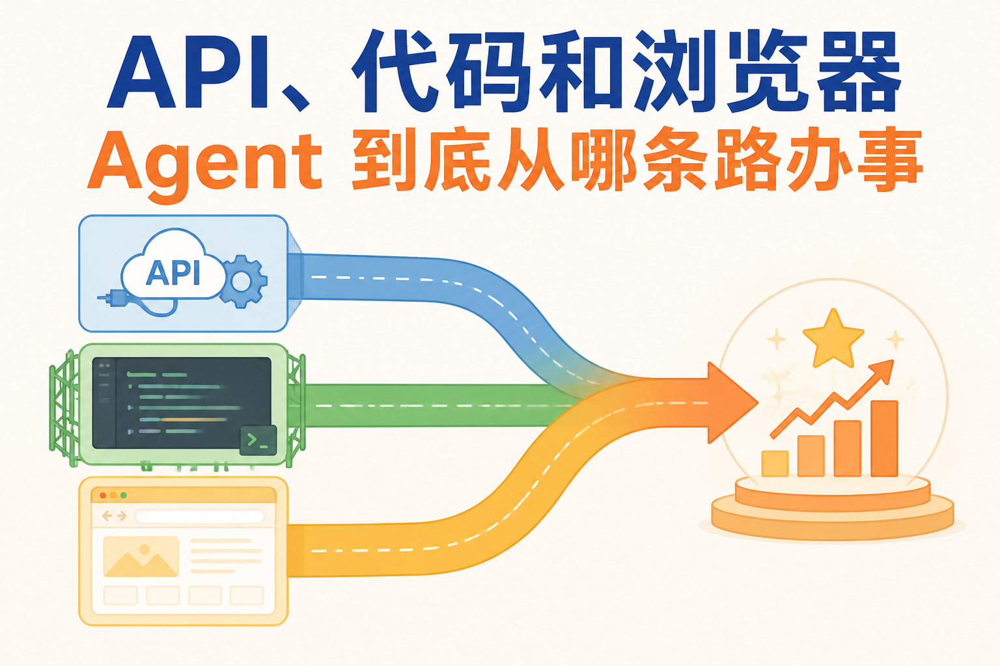
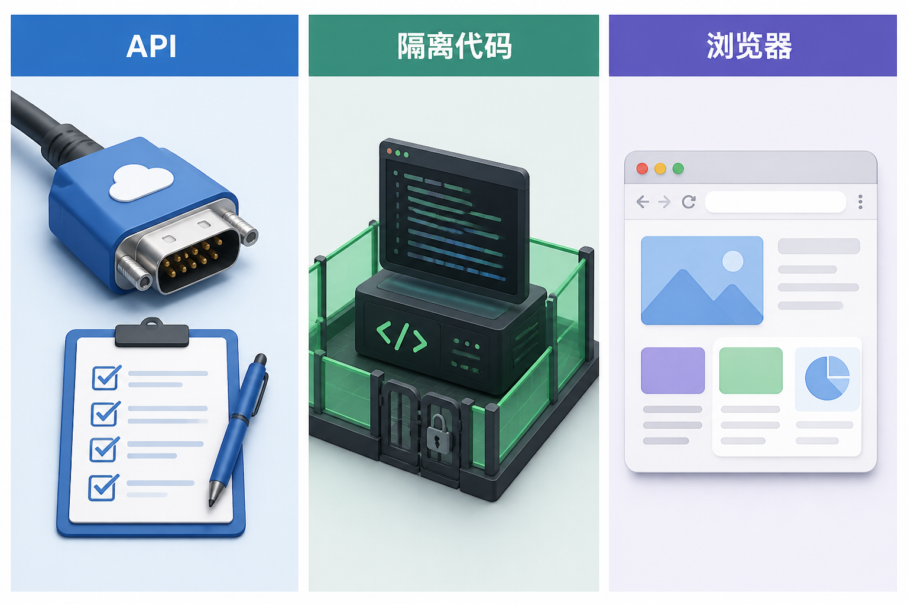
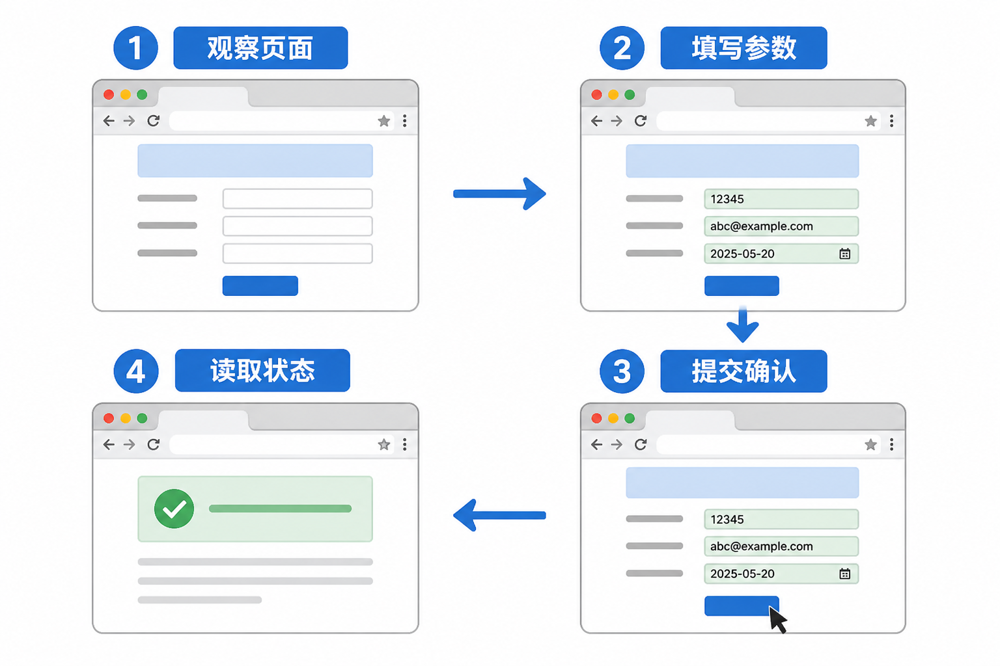
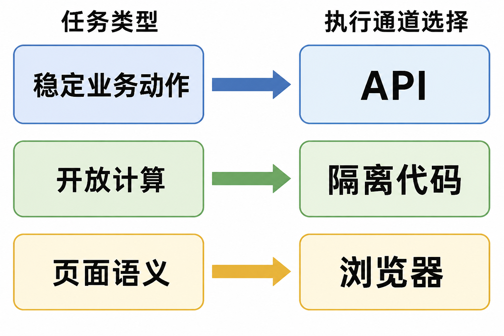

# API、代码和浏览器：Agent 到底从哪条路办事

“帮我把昨天的销售数据整理一下。”

这句话可能需要查数据库、跑一段统计代码、生成图表，最后把文件放进某个系统。另一个任务是“帮我在后台提交退款”，它可能有稳定 API，也可能只能模拟用户点击网页。对 Agent 来说，执行通道怎么选，直接决定了系统能不能维护。

常见通道有三种：API、隔离代码执行和浏览器自动化。它们都能把模型的意图变成动作，但可靠性、权限方式、成本和失败形态完全不同。

## API：业务动作的首选道路

API 是系统为程序提供的接口。它通常有明确的请求字段、返回结构、错误码和版本。查订单、更新工单、创建报销单、发送通知，若目标系统有稳定 API，优先从这里走。

API 的好处是可预测。字段能做 Schema 校验，权限可以绑定用户或服务账号，调用能记录请求 ID，写操作可以设计幂等键。供应商升级时，接口版本和兼容测试也比页面改版更容易管理。

但 API 不是“调了就完事”。调用前仍要检查身份、资源范围、额度和业务状态。返回“请求已受理”时，可能还需要用任务 ID 查询最终状态。API 的稳定性来自契约和治理，不是来自 URL 看起来很正式。

API 还要考虑分页、限流和版本。Agent 查询客户列表，不能只取第一页；批量更新遇到部分失败，要逐项返回结果；供应商限流时，要按规则退避而不是把请求打得更快。对于高风险动作，API 调用前要保留人工确认。

API 版本变化不能悄悄影响 Agent。字段改名、枚举新增、默认值调整，都可能让原来的工具契约失效。连接器应把供应商字段转换成稳定的领域字段，升级前跑兼容测试；必要时同时支持新旧版本，给上层技能留迁移时间。

批量动作尤其要看部分成功。十条更新里九条成功、一条失败，不能只返回一个整体“失败”，也不能把成功的九条再执行一遍。结果需要逐项列出对象 ID、状态和错误原因，再由上层决定补做、跳过或转人工。

## 代码执行：给计算一间隔离工作室

很多数据任务不值得为每一种算法单独做工具。让 Agent 在隔离环境里运行受限代码，更适合数据清洗、统计、文件转换、画图和测试。

代码执行的灵活性很高，也因此更需要边界。沙箱要限制网络访问、文件目录、进程权限、CPU、内存和运行时间。输入文件应放到明确的工作目录，输出文件经过类型和敏感信息检查后才能交付。

不要把宿主机路径、长期 API 密钥或完整生产网络交给生成代码。模型生成的代码可能有语法错误，也可能主动或无意地读取不该读的文件。执行器要捕获 stdout、stderr、退出码和产物路径，不能只把“程序结束”当作成功。

代码结果也需要业务验证。统计脚本跑完不代表指标口径正确，图片生成不代表图表数据没有错，文件转换成功不代表敏感字段已经脱敏。沙箱解决的是运行风险，不替代领域验收。

依赖安装也要受控。允许代码随意从互联网下载包，会带来供应链风险和不可复现问题。可以提供经过审核的基础环境，限定可安装来源并记录版本。任务需要新依赖时，先进入审批或隔离构建流程，不要让一次数据分析顺手把未知程序装进长期环境。

产物交付前要做检查：文件是否存在，格式是否正确，大小是否合理，是否包含宏、可执行内容或敏感数据。若用户要的是 Excel，不能只返回一段“已生成”的文字；若用户要图表，还要检查图片不是空白，标题和轴是否可读。

## 浏览器自动化：最后才走进页面

有些系统没有 API，或者任务必须依赖现有登录会话和用户看到的页面。这时可以使用浏览器自动化：打开页面、查找元素、填写表单、点击按钮，再读取页面状态。

*依据 Computer Use 的“观察—动作—再观察”机制改绘，并补入执行层确认。*

浏览器自动化的弱点也很明显。页面元素会改名，弹窗会变化，加载时序会抖动，登录状态会过期，按钮显示“已提交”也不代表后台业务完成。一个今天能点通的流程，明天可能因为前端改版就失效。

浏览器动作应尽量小步执行，每一步都观察结果。高风险提交前展示对象、金额、接收方和影响，等用户确认后再点击。提交后回读页面和业务系统的权威状态，必要时保存截图、任务号或下载文件作为证据。

浏览器不应成为绕过权限的后门。自动化使用的是某个受控会话，操作范围由账号权限决定；页面上能看见某个按钮，也不代表 Agent 被授权替用户作决定。

浏览器凭据要和模型隔离。登录令牌、Cookie 和密码由浏览器会话或凭据服务保管，模型只获得当前可执行的页面动作。遇到验证码、二次确认和新的权限提示时，应该停下来交给用户，而不是尝试绕过。

文件上传和下载也是外部动作。上传前确认文件、目标和数据范围；下载后检查来源、类型和敏感内容。页面弹出的“下载成功”只说明浏览器收到了文件，任务还需要确认文件是否完整、能否打开、是否放在预期位置。

## 三种通道怎样选

可以从四个问题开始：目标系统有没有稳定 API？任务是固定业务动作还是开放计算？是否需要页面语义或现有登录状态？动作失败后能否查询和恢复？

固定业务动作优先 API。需要计算和文件转换，放进隔离代码环境。没有接口、必须操作真实页面，才选浏览器自动化。若同时满足多个条件，优先选择权限更细、结果更可验证、版本更稳定的通道。

不要把三种通道理解成互相排斥。一个数据 Agent 可以用 API 取数据，用沙箱做计算，再用 API 写回报告；一个客服 Agent 可以用浏览器读取旧系统，再用稳定 API 提交新系统的工单。关键是每一步都明确谁执行、谁校验、谁确认结果。

跨通道编排时，数据交接要有明确格式。API 返回结构化记录，沙箱接收的是经过权限过滤的文件或数据集，浏览器只使用完成当前页面任务所需的信息。不要把整段聊天、完整数据库导出和长期凭据一起塞进下一个执行环境。

每次切换通道都要记录来源和版本。报告里的一个数字，应该能追到 API 请求、输入文件、代码版本和计算产物；浏览器提交的一个表单，也应能追到用户确认和页面状态。只有这样，出了问题才能定位，不必在三条路之间互相甩锅。

## “大话”执行通道：修路还是翻窗

API 像正式公路，有车道、路牌和收费站；代码沙箱像一间带门锁的工作室，能自由摆弄工具，但不能随便出门；浏览器自动化像拿着钥匙进入一栋旧楼，确实能办事，却要盯着每个门牌和楼梯变化。

如果有公路，就别为了省一段接线去翻窗。翻窗偶尔能解决急事，长期当主路就很累。工程选型也是这样：越稳定的通道越适合承载核心业务，越灵活的通道越需要隔离、观测和人工兜底。

## 失败与恢复

API 超时先查任务状态；代码超时保存日志和临时产物，清理运行环境；浏览器卡在提交页面，先确认后台状态再决定是否继续。三种通道都不能把失败隐藏成成功。

每次执行要有追踪 ID，记录通道、版本、权限、输入摘要、输出位置和真实状态。对有副作用的动作使用幂等键，对无法确认的高风险动作转人工。自动化的价值是减少重复劳动，不是把不确定性藏到用户看不见的地方。

评测时也要按通道拆开。API 看参数正确、状态确认和部分成功处理；代码看运行成功、产物正确、资源消耗和隔离违规；浏览器看页面识别、动作完成、确认点和改版后的恢复能力。最后再看端到端任务是否完成、用户是否需要返工。

通道选得好，Agent 会显得安静：该查接口时查接口，该算数据时进沙箱，实在没路才打开浏览器。通道选得差，系统会像一个拿着鼠标到处点、出了错还找不到记录的新手。两者的差别不在模型说话多漂亮，而在执行边界是否清楚。

## 人工确认应该放在哪一步

确认太早，用户不知道系统准备做什么；确认太晚，副作用已经发生。合适的位置是在系统已经生成明确动作、完成参数和权限检查，但还没有真正提交之前。

确认页面要展示具体信息。退款要显示订单、金额和原因；发消息要显示接收方和正文；上传文件要显示文件名、目标和数据范围。只问一句“是否继续”，用户很难判断风险，也很容易机械点击。

API 通道可以在发送写请求前暂停；代码执行可以在运行带网络或文件写入的脚本前暂停；浏览器可以在最终提交按钮前暂停。确认之后若参数或页面发生变化，应重新确认，不能拿旧授权执行新动作。

人工确认不是所有步骤都加一个弹窗。只读、低风险、可撤销的动作可以按策略自动执行；金额、外部沟通、权限变更、删除和不可逆操作才需要更厚的关口。确认太多会让用户疲劳，最后每次都不看内容直接点通过。

## 从临时方案走向稳定能力

不少团队先用浏览器自动化验证业务价值，这很正常。问题在于原型跑通后仍长期依赖页面点击，却没有把稳定动作迁移到 API，也没有把重复计算沉淀成受控工具。

可以定期查看失败轨迹：哪些浏览器步骤总因页面改版失败，哪些代码片段重复出现，哪些 API 调用缺少批量能力。高频且稳定的动作逐步封装为 API Tool，重复计算做成受控脚本或专用服务，浏览器只保留真正依赖页面的部分。

这种演进不会一夜完成，但方向很清楚：把脆弱的路径缩小，把稳定的契约扩大，把高风险动作留在可审计的系统边界内。Agent 仍然灵活，维护人员也不用每天追着网页按钮跑。

## 参考资料

- [OpenAI 官方文档：Tools](https://developers.openai.com/api/docs/guides/tools)
- [OpenAI 官方文档：Code interpreter](https://developers.openai.com/api/docs/guides/tools-code-interpreter)
- [OpenAI 官方文档：Computer use](https://developers.openai.com/api/docs/guides/tools-computer-use)
