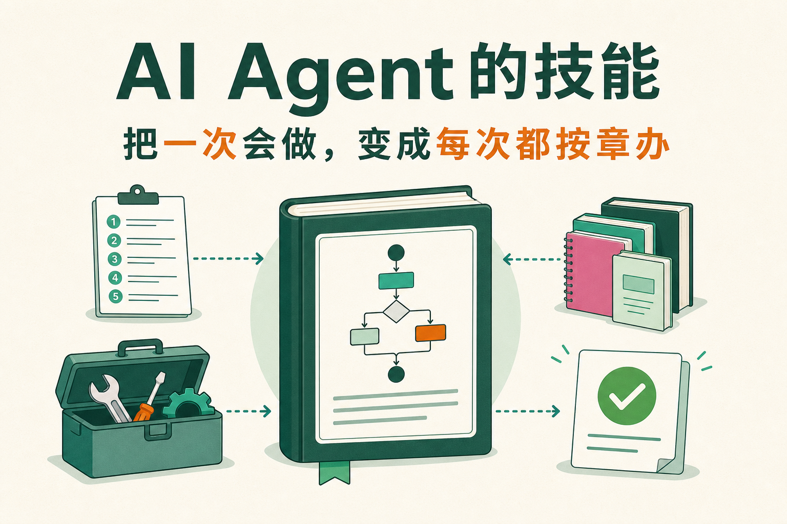
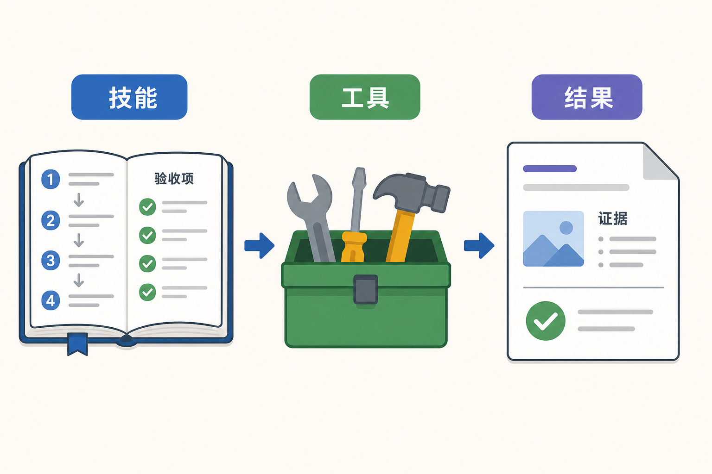
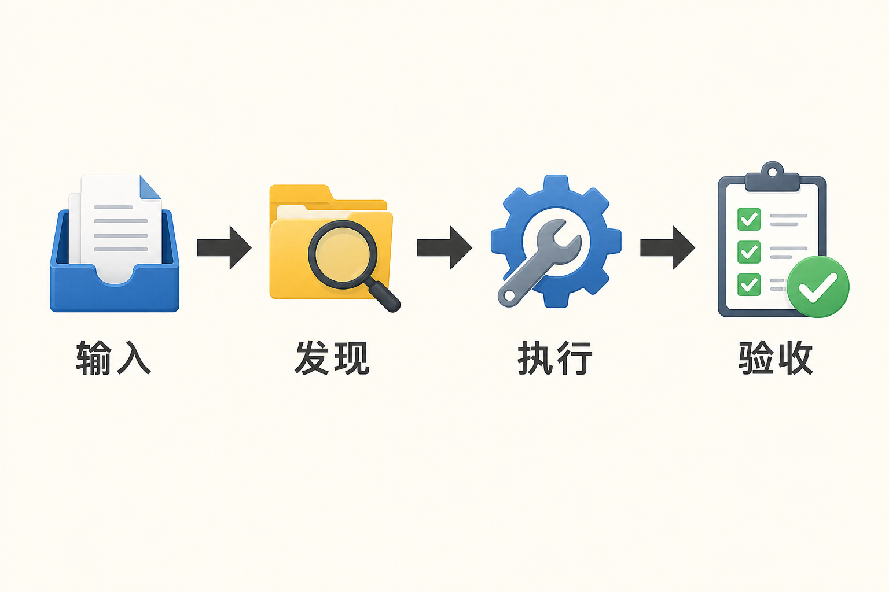
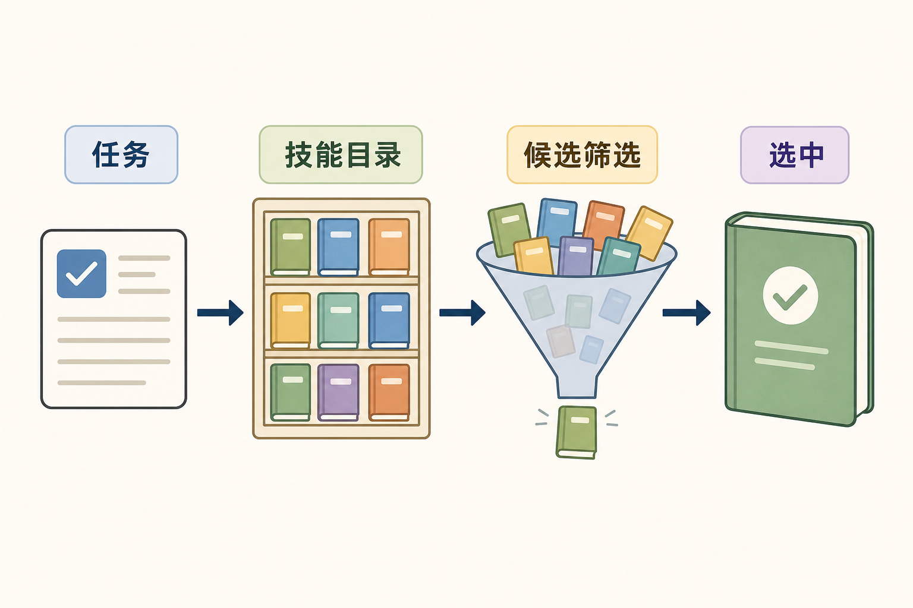
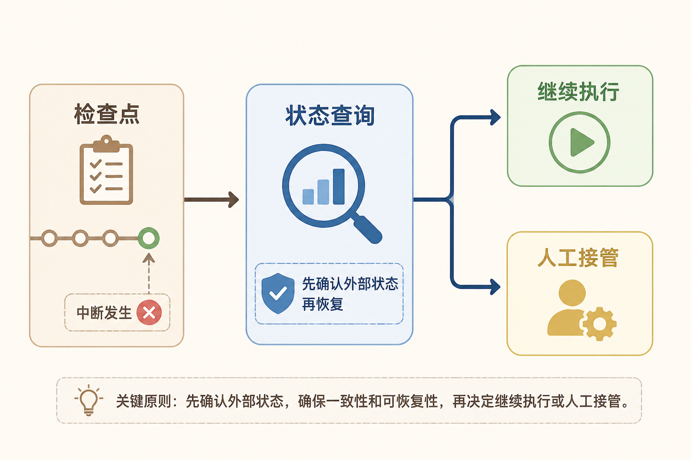
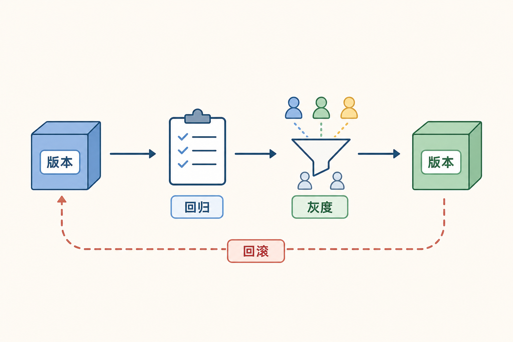

# AI Agent 的技能：把一次会做，变成每次都按章办

有些事情，做一次不难，难的是每次都做得差不多。

比如月度账单核对。第一次做的人可能记得先下载账单，再去重、统一日期、比较单价、解释异常，最后写一份报告。过两个月，换个人接手，步骤顺序变了，漏掉的凭证也变多了。让模型临场发挥，结果往往更像“聪明地乱做”。

Skill，就是把这类事情整理成一套可复用的方法。中文可以叫“技能”，但它和人的技能证书不完全一样，更接近一份能被 Agent 读取的标准作业包：适用条件、输入要求、步骤、可调用工具、参考资料、验收标准，以及遇到异常时怎么停下来。

## 技能和工具不是一回事

工具负责一个动作，技能负责一段工作方法。

查订单是工具，算退款金额是工具，发一封邮件也是工具。它们回答的是“这一步怎么落到系统里”。“处理售后退款”则可能是一项技能：先读取订单，再确认退货状态，检查退款规则，计算金额，展示给用户确认，最后才提交退款。

技能里可以调用多个工具，也可以包含不需要调用工具的判断。例如“会议纪要整理”可能包括读取转写文本、识别行动项、按模板输出、检查负责人和截止时间。真正写入任务系统之前，还要确认用户是否允许创建任务。

因此，技能不是把一堆 API 重新起了个名字。它有自己的输入、过程和验收标准：

- 输入是什么，缺什么信息时必须追问；
- 哪些步骤有先后关系，哪些步骤可以并行；
- 哪些工具只读，哪些工具会改变外部状态；
- 中间产物如何检查，什么情况算失败；
- 最终结果交给谁，什么时候需要人工接手。

## 一项技能应该写些什么

先看“月度账单核对”这项技能。它不应该只写一句“请核对账单”，而应该把关键边界写出来。

### 适用条件

它处理的是已经下载好的云账单，覆盖服务器、对象存储和网络等费用。若文件缺少账期、币种或账号信息，就先补齐，不要让模型自己猜。

### 预期输入

输入包括账单文件、上月基线、计价规则和允许查看的账号范围。每一项都应有格式和来源。一个 Excel 文件不能因为“看起来像账单”就直接进生产计算。

### 执行步骤

第一步读取文件并识别表头；第二步统一时间、币种和资源标识；第三步去掉重复行；第四步计算环比和单价变化；第五步把异常分为新增、涨价、用量变化和数据问题；第六步生成带证据的报告；第七步交给负责人确认。

每一步都应产生可检查的产物。清洗后的数据要保留行数变化，异常结论要带原始行号，报告里的金额要能回到输入文件。这样出了问题，不用重新听模型讲一遍“我当时是这么想的”。

### 工具和资源

技能可以声明需要哪些工具，也可以声明要读取哪些资料。比如读取账单、运行计算、查询官方价格是工具；计价规则、字段字典和报告模板是资源。技能把它们编排起来，但不替它们持有权限。

### 验收标准

验收标准要写得像检查清单：所有账单行是否处理，金额是否能复算，异常是否有证据，报告是否包含结论和待确认项。没有验收标准，技能就只剩一份漂亮的步骤说明。

## 技能怎样被 Agent 找到

技能多起来以后，不能把所有说明一次性塞进上下文。系统通常先维护一个技能目录，每项技能有名称、简介、适用任务、禁用条件和输入要求。Agent 先根据用户任务匹配候选技能，再读取完整说明。

技能目录的描述要能区分相近任务。“处理数据”“分析文件”太宽泛，模型很难判断。好的描述会写清对象、动作和产物，例如“比较两个月云账单并输出异常明细”，比“账单助手”更容易被准确选中。

发现技能不等于获得权限。用户可以看见“退款处理”技能，但当前账号可能只有查询权限。技能匹配之后，还要由执行层检查身份、资源范围和动作风险。

当几个技能都能处理同一个请求时，系统可以按任务类型、组织、风险、版本和成本筛选。不要让模型在几十本名字相似的手册里自由抽签。候选越少，说明越清楚，后续的评测才有意义。

## 技能怎样执行和恢复

一个技能运行到一半，可能遇到文件格式错误、接口超时、权限不足或人工迟迟没有确认。技能需要定义这些情况怎么处理。

普通数据读取失败，可以有限重试；发现账单账号不在授权范围，应直接停止并提示；付款、删除、发送等动作超时，先查询真实状态，不要立刻再做一遍；审批等待超过时限，就把任务标成待处理，而不是让循环继续消耗模型调用。

长流程最好保存检查点。完成文件解析后记录解析版本，完成异常计算后记录输入摘要，提交外部动作前记录审批结果。任务中断后，从最近一个已经验收的检查点恢复。恢复时重新检查会变化的事实，例如库存、权限和账单状态。

技能的每一步还应留下轨迹：用了哪个版本，调用了什么工具，输入来自哪里，产物是什么，为什么停下。轨迹不是为了给日志增加重量，而是为了回答“这次结果为什么和上次不一样”。

## 技能也需要版本管理

技能会变。规则改了，工具参数改了，报告格式改了，原来的步骤就可能失效。每次更新都要有版本号、变更说明和回归任务。

更新技能至少检查三类问题：

1. 结果有没有变差，例如异常漏报或引用缺失；
2. 成本有没有变高，例如多了不必要的模型调用和工具步骤；
3. 权限和安全有没有变宽，例如原本只读的流程偷偷增加了写入动作。

可以先在沙盒和少量任务上试用，再逐步放量。保留上一版本，出现问题时能回退。技能版本还应记录依赖的工具版本、模板版本和数据来源，避免只回滚了一半。

## 技能、提示词和工作流，别混成一个词

这三个概念常被放在同一个文件夹里，职责却不同。

提示词主要告诉模型当前应该怎样理解任务和组织输出。它适合表达目标、语气、格式和一些判断原则，但不擅长保存长期状态，也不能强制外部系统按规则执行。把付款上限写在提示词里，只能提醒模型，挡不住绕过提示词的调用。

工作流强调状态和路径。它会规定节点、分支、重试、等待和停止条件，适合可预测、可观察的业务过程。技能可以由一个固定工作流实现，也可以只给出方法，让 Agent 根据任务选择步骤。是否需要工作流，取决于流程是否要持久化、是否有长时间等待、是否包含高风险动作。

技能则把任务方法包起来。它可以引用提示词，可以调用工作流，也可以直接运行脚本或工具。判断一段内容是不是技能，不看它放在哪个目录，而看它有没有明确的适用条件、执行方法和交付标准。

举个例子，“整理客户回访记录”可以用一段提示词规定摘要格式；“回访后更新 CRM、生成待办、三天后提醒”需要工作流保存状态；把资料读取、摘要规则、CRM 工具、待办模板和验收要求组合起来，才是一项完整技能。

## 复合任务不要硬塞进一本巨型手册

有些任务会横跨多项技能。比如“准备季度业务复盘”可能包含数据分析、客户反馈归纳、图表制作和汇报材料生成。最省事的写法，是把所有步骤塞进一个大技能；最难维护的写法，通常也是这个。

更稳妥的做法是保留几个职责清楚的技能，再由上层计划或工作流组织它们。数据分析技能只负责指标和异常，客户反馈技能只负责主题和证据，汇报材料技能负责版式和叙事。每项技能有自己的输入输出，交接时使用结构化产物，而不是把前一项技能的整段对话原样扔给下一项。

拆分也不能过头。若两个步骤永远一起出现、独立使用没有意义，硬拆只会增加上下文和失败点。可以用三个问题判断：这部分是否有独立产物，是否能单独验收，是否会被其他任务复用。三个答案大多为“是”，才值得成为独立技能。

复合技能还要处理冲突。两个技能可能都想修改同一份文件，或者使用不同版本的数据。上层编排需要指定权威状态、写入顺序和冲突策略。否则每个技能单独看都成功，合在一起却把结果相互覆盖。

## 技能资源也要当作不可信输入

技能目录里常有模板、脚本、示例和参考文档。这些内容会影响 Agent 行为，不能因为放在“内部目录”就默认可信。脚本可能访问不该访问的路径，旧模板可能包含过期规则，外部文档还可能带有诱导模型执行额外动作的文字。

运行技能前，应校验来源和版本；执行脚本时限制文件、网络和资源；读取外部资料时，把其中的指令当作数据，不允许覆盖系统策略；生成结果后，再做敏感信息和权限检查。真正的边界仍在运行时和工具层，不能靠技能作者写一句“请安全执行”。

企业内部还需要技能发布流程。谁可以新增技能，谁审核脚本，哪些团队能看到，停用后怎样撤销，都要有记录。技能市场如果只有“安装”按钮，没有签名、来源、权限说明和版本历史，很快会变成另一个难以治理的插件仓库。

## “大话”技能：像给新同事一份靠谱的交接单

很多团队的流程都藏在老员工脑子里。新人问“这个表先看哪一列”，老员工说“你先看看就知道了”。这句话对新人没有帮助，对 Agent 更没有帮助。Agent 不知道“你先看看”意味着检查账期、账号和币种，也不知道发现异常后要不要停。

一份好的技能说明，就像一份靠谱的交接单：先说这件事适用于什么情况，再说需要什么材料，然后列出动作顺序，最后写验收和交接。它不替新人做决定，但能让新人少走很多弯路。

这也是 Skill 的实际价值。模型能力再强，也不应该每次都从零猜流程。把稳定经验写成技能，模型负责理解和调整，程序负责权限和执行，人才负责关键判断。三者各做擅长的事，流程才不会因为换了一个模型或换了一个同事就完全变样。

## 参考资料

- [OpenAI 官方文档：Tools 与 Skills](https://developers.openai.com/api/docs/guides/tools-skills)
- [Anthropic：Building Effective AI Agents](https://www.anthropic.com/engineering/building-effective-agents)
- [OpenAI 官方文档：Agents SDK](https://openai.github.io/openai-agents-js/)
