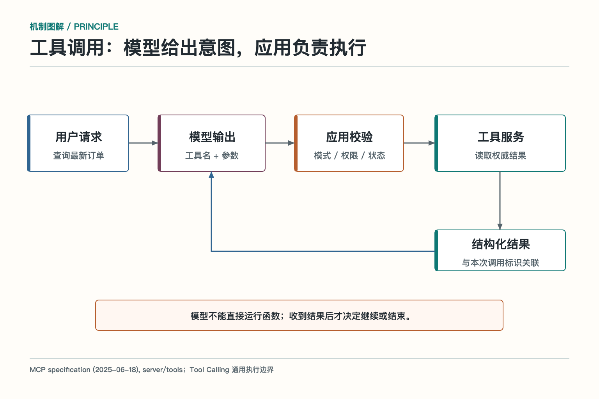

# 工具调用：模型怎样把想法交给程序执行

用户说：“帮我查一下北京明天的天气，如果下雨提醒我带伞。”

模型可以读懂这句话，也可以判断需要天气查询。但它并没有一只手伸进天气服务。它要做的是生成一份结构化请求：调用哪个工具，传什么参数。真正发起网络请求、处理返回值、判断是否需要提醒的，是应用程序。

这就是 Tool Calling，中文常叫“工具调用”。Function Calling 是其中一种常见叫法，通常强调模型按函数名称和参数格式提出调用。无论叫哪个名字，都要守住一个边界：模型提出动作，程序执行动作。

## 一次调用到底经过哪些步骤

*依据 MCP Tools 规范描述的调用责任改绘；该边界同样适用于常见 Function Calling。*

第一步，应用把可用工具的说明交给模型。工具说明包括名称、用途、参数类型、必填字段和返回值含义。第二步，模型根据用户任务决定是否调用，以及调用哪一个。第三步，应用收到调用请求，解析参数并做校验。第四步，执行器调用真实 API、数据库或内部函数。第五步，应用把工具结果回传给模型，模型再生成回答，或者继续调用另一个工具。

天气例子里，模型可能提出：工具名是 `get_weather`，城市是“北京”，日期是“明天”。应用不能因为参数看起来像样就直接放行，还要检查城市是否在允许范围，日期是否能解析，调用者是否有权限，以及请求是否超预算。

工具返回“北京明天有雨，降水概率 70%”后，模型才有依据告诉用户带伞。若工具超时，模型不应该凭空补一个天气结果；若城市不存在，也不该把错误包装成晴天。

## 工具定义就是给模型看的接口说明

工具名称要能表达动作和对象。`search_tickets` 比 `search` 更清楚，`create_refund` 比 `process` 更清楚。描述要写明什么时候使用、什么时候不要使用，参数的格式和返回结果代表什么。

参数结构尽量让错误变得困难。日期用明确格式，单位用枚举，互相排斥的选项不要同时出现，不能让模型填写的内部字段就不要暴露给模型。比如订单号已经由前一步确定，就不必再次让模型从长文本里抄一遍。

一个工具还要说明副作用。查询库存是只读，创建采购单会写入系统，发送邮件会影响外部用户。动作越不可逆，执行前越要有人工确认、额度限制和幂等键。

返回值同样是契约的一部分。不要只返回一大段自然语言。最好返回状态、业务对象 ID、可展示结果、错误码和是否可以重试。模型需要知道“已提交但尚未完成”和“已完成”不是一回事。

## 严格模式不是安全系统

有些 API 支持严格结构输出，让模型生成的参数更符合 JSON Schema。这能减少字段遗漏、类型错误和额外字段，但它只解决格式问题。

参数是合法 JSON，不等于业务上可以执行。金额字段可以是数字，但 999999 元是否超过额度，要由业务规则判断；用户 ID 格式正确，也不代表当前操作人能查看这个用户；删除对象的 ID 存在，也不代表用户真的授权删除。

因此执行层至少有两道门：第一道是结构校验，检查名称、类型、必填字段和枚举；第二道是业务校验，检查身份、资源归属、额度、风险和审批。模型看不到密钥，密钥由连接器或执行服务保管。

## 一轮里可能有多个调用

当用户同时问北京和上海的天气，模型可能一次提出两个独立调用。应用可以并行执行，提高速度；也可以关闭并行，让每次只执行一个。是否并行，取决于动作是否相互独立。

查询两个城市通常可以并行。两个写操作就要谨慎，尤其是一个动作的结果会影响另一个动作时，必须按顺序执行。并行也不能绕过统一的权限和额度检查，每个调用都要有自己的追踪 ID。

工具很多时，先让模型看到所有工具也不一定更好。名称、描述和参数都会占用上下文，近似工具越多，选错概率越高。可以按领域划分命名空间，或先检索候选工具，再加载完整定义。

## 谁来决定“要不要调用”

多数工具调用接口都会提供几种选择策略。自动模式让模型决定不调用、调用一个或调用多个；必选模式要求模型至少调用一个；强制模式指定必须调用某个工具；允许列表则把模型限制在当前任务可用的一小组工具里。

自动模式适合开放问答。用户问“今天适合跑步吗”，模型可能先查天气，也可能在已有实时天气上下文时直接回答。必选模式适合明确需要外部事实的步骤，例如“必须从库存系统取数，不能凭模型记忆回答”。强制模式适合流程已经确定，只让模型负责填写参数。允许列表适合按用户权限和任务阶段缩小能力面。

选择策略不应该只写在提示词里。应用需要根据当前身份、页面状态和流程节点动态决定。例如用户还没确认收款人时，根本不把转账工具放进允许列表；审批通过后，也只开放指定订单和金额范围内的动作。

工具越多，目录管理越重要。可以按 `crm`、`billing`、`shipping` 等业务域组织，名称中保留动作和对象。低频工具延迟加载，先搜索再展开完整参数。这样既节省上下文，也减少模型把“查客户”和“查工单”弄混。

## 调用 ID 为什么不能省

每次工具调用都要有唯一标识。它把模型提出的请求、执行器日志、外部系统任务和返回结果串在一起。没有调用 ID，多个并行请求一回来，应用可能把上海天气结果接到北京问题上；发生重试时，也分不清哪一次真正落地。

写操作还需要业务幂等键。调用 ID 追踪一次尝试，幂等键标识同一个业务意图。网络超时后重新提交退款，请求 ID 可以变化，幂等键应保持不变，让服务端识别这是同一笔退款，而不是第二笔。

幂等键不能只存在日志里，必须传到真正产生副作用的服务。若下游系统不支持幂等，连接器要保存请求与结果映射，或在重试前查询权威状态。否则“我们在 Agent 层做了幂等”只是安慰自己。

## 工具错误要说人话，也要说机器话

工具失败后，返回“发生错误”几乎没有用。执行器至少要区分参数不合法、权限不足、资源不存在、状态冲突、限流、超时和下游故障。机器需要错误码，模型需要简短解释，用户需要知道下一步能做什么。

参数错误可以让模型修正一次；权限不足不能靠重试解决，应说明需要谁授权；限流可以等待或换批次；写操作超时先查状态；资源不存在时要核对标识，而不是凭空新建一个。

错误消息也要防止泄露。数据库堆栈、内部地址、密钥片段和完整用户数据不该原样回到模型。保留追踪 ID，详细信息进入受控日志，模型拿到足够判断下一步的分类信息即可。

## 观测一次调用，不只看耗时

生产系统要能还原一条完整链路：用户任务、模型版本、候选工具、最终选择、参数、权限判断、执行时间、外部请求 ID、结果状态和后续回答。敏感字段需要脱敏，但关键因果不能丢。

常见指标包括：工具选择准确率、参数一次通过率、权限拒绝率、超时率、重试次数、重复副作用、结果回读成功率和端到端任务完成率。延迟和成本也要关联任务结果，否则为了省一次模型调用，可能把人工接管率翻倍。

上线前可以用录制的任务做回归：同一句话是否选对工具，歧义输入是否追问，权限不足是否停止，工具不可用是否降级，高风险参数是否需要确认。上线后再从真实失败轨迹里补样本，让评测集跟着系统一起长。

日志中还要记录“当时有哪些工具可选”。同一个请求今天选对、明天选错，原因可能不是模型变化，而是工具目录、权限或描述更新了。只有把候选集合和版本一起保存，才能复现选择过程，也才能判断问题出在模型、工具定义还是运行环境。

## 结果回传后，模型还能做什么

工具结果回传给模型，不只是为了让模型“复述”。它可以根据结果决定下一步：天气查询后生成提醒；查到库存不足后推荐替代品；代码执行失败后读取错误并修正；审批被拒绝后向用户说明原因。

结果中应该区分成功、失败、部分成功和处理中。对于可重试错误，可以告诉模型“稍后可重试”；对于权限错误，应明确停止；对于处理中，应返回任务 ID，让后续查询沿着同一任务继续。

最容易犯的错误是把接口返回等同于业务完成。支付接口返回“受理成功”，只说明请求进入处理流程；真正完成要查询订单状态。发送消息接口返回消息 ID，也应在需要时检查最终投递状态。

## “大话”工具调用：像前台把单子递给后厨

餐厅前台不能自己炒菜，但她可以把订单写清楚递给后厨。后厨收到单子后，还要检查库存、桌号和特殊要求；菜做好了，前台再把结果交给顾客。

模型像前台，工具执行服务像后厨，用户看到的是最终上桌的结果。前台写错桌号，后厨不能因为字迹漂亮就照做；后厨没菜，也不能让前台假装已经上菜。工具调用的工程价值，就在于把“提出要求”和“产生结果”分开，让每一步都能检查。

## 工具调用的实践清单

设计工具时，可以逐项问：名称能不能让人一眼看懂，参数能不能限制非法状态，返回值能不能说明真实状态，副作用有没有单独标记，权限是否在模型之外校验，超时后能不能查询，重复执行会不会造成损失，日志能不能还原一次调用。

这份清单比“接入一个函数调用 SDK”更重要。SDK 负责传递请求，可靠性来自契约、执行层和业务状态。

## 参考资料

- [Model Context Protocol：Tools 规范](https://modelcontextprotocol.io/specification/2025-06-18/server/tools)
- [OpenAI 官方文档：Function calling](https://developers.openai.com/api/docs/guides/function-calling)
- [OpenAI 官方文档：Tools](https://developers.openai.com/api/docs/guides/tools)
- [Anthropic：Building Effective AI Agents](https://www.anthropic.com/engineering/building-effective-agents)
