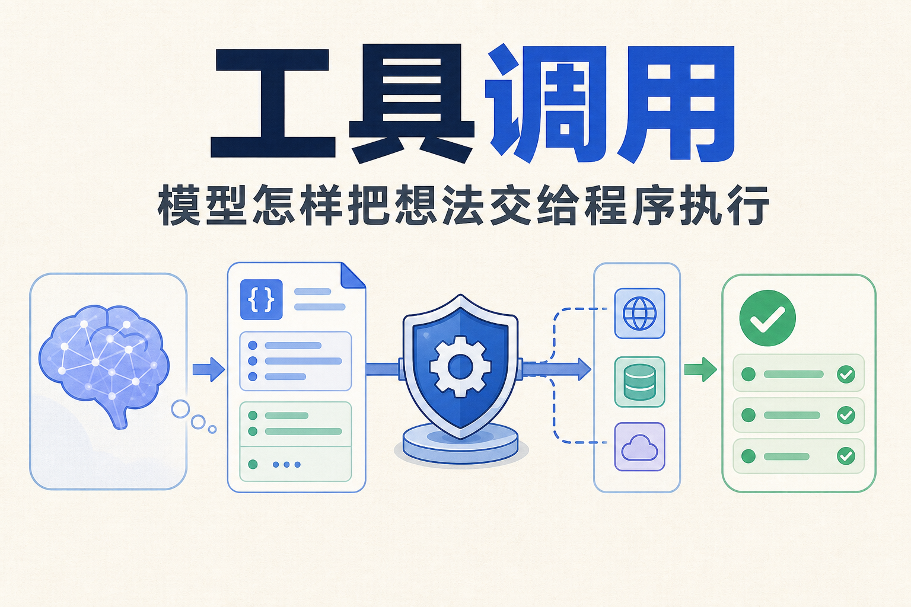
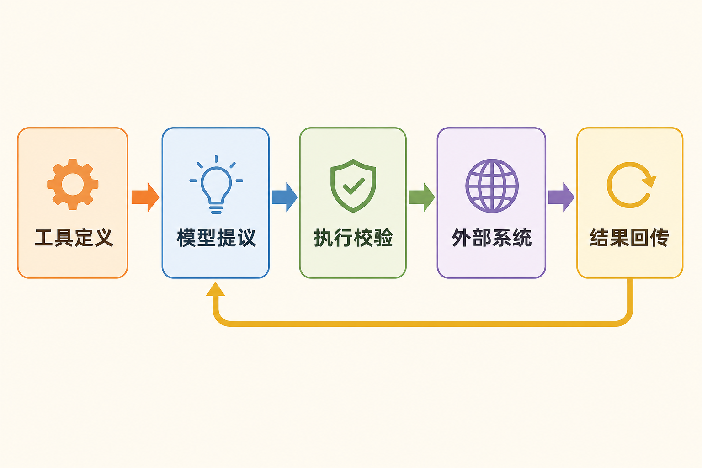
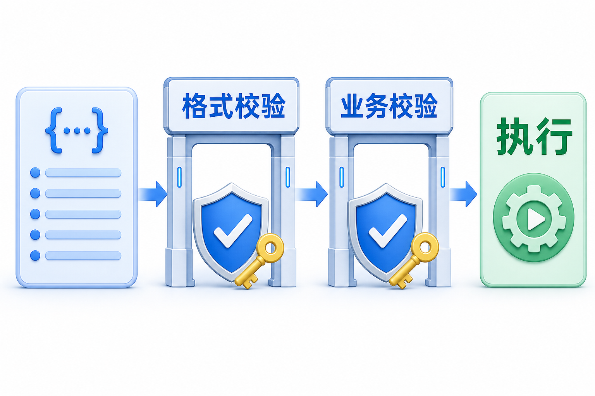
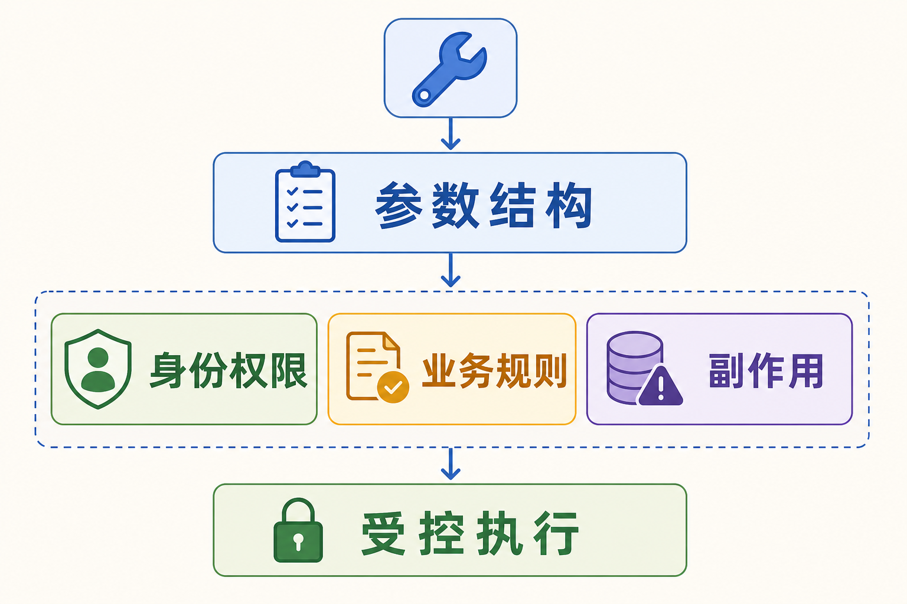
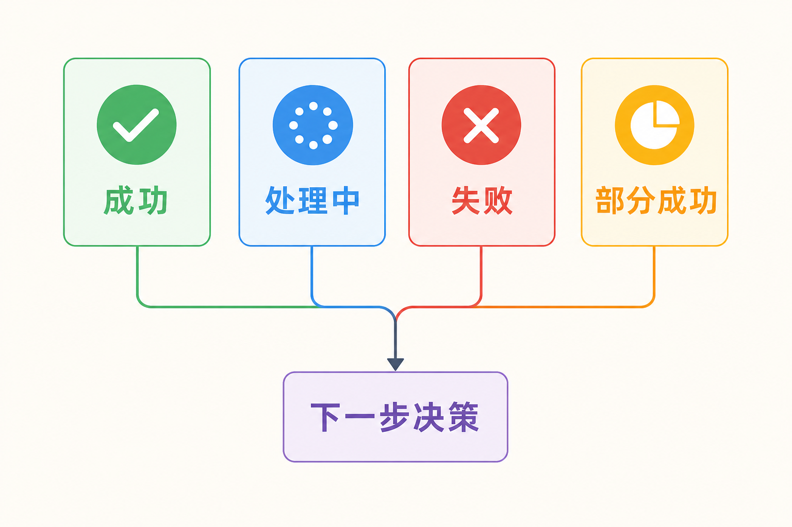

# 面试题：Tool Calling 如何做到可控可验收

总概览已经回答了“模型提议、程序执行”。这一篇往下追四层：工具契约怎么写，格式约束和业务校验怎么分，多个调用怎么处理，结果怎样回到任务闭环。回答时要落到请求和执行，不要只报 SDK 名称。

## 问题 1：一个工具定义怎样设计才容易被模型正确选择？

### 原理

工具定义同时服务模型和执行器。名称与描述影响选择，参数模式影响生成，返回值说明影响后续判断。定义模糊，模型可能选错；定义过宽，执行层很难做权限和风险控制。

### 答题点

1. 名称表达动作和对象，避免 `search`、`process` 这类泛名；
2. 描述写清适用、禁用、输入格式、结果语义和副作用；
3. 用枚举、必填项、范围和 `additionalProperties: false` 限制非法状态；
4. 把应用已知的信息留在代码侧，不让模型重复填写可推断的内部字段。

### 记忆点

> 名称帮助选择，Schema 约束参数，返回值说明事实。

### 追问

工具描述应该多长？不是越长越好。保留影响选择和执行的边界，复杂操作拆成清晰的小工具或用命名空间组织；用评测集比较描述变化对选择和参数准确率的影响。

### 失分点

只强调模型能力，不谈工具契约；或者把所有后台 API 原样暴露，让模型在大量相似函数中自行辨认。

## 问题 2：严格结构输出能解决哪些问题，解决不了哪些问题？

### 原理

严格结构约束可以让工具参数更稳定地符合预先声明的模式，减少缺字段、错类型和额外字段。它属于语法层约束，不等同于身份授权、业务规则或安全审批。

### 答题点

1. 结构层检查类型、必填、枚举、对象嵌套和字段集合；
2. 业务层检查资源归属、权限、额度、状态、风险和审批；
3. 凭据留在执行层，模型只看到工具和业务参数；
4. 对结构错误快速拒绝，对业务错误返回清晰错误码和可恢复建议。

### 记忆点

> JSON 合法，不代表动作获准。

### 追问

严格模式打开后还需要服务端校验吗？必须需要。客户端可能被绕过，调用方可能被伪造，数据状态也会在请求前变化。执行服务要把模型输出当作不可信请求重新检查。

### 失分点

把 Schema 当成权限系统，或者认为参数符合格式就可以直接写生产数据库。

## 问题 3：并行工具调用怎样保证正确性？

### 原理

多个调用是否并行，取决于它们是否相互独立。并行可以降低等待时间，但会带来竞态、限流、部分成功和结果合并问题。

### 答题点

1. 先判断调用之间是否有数据依赖和写入冲突；
2. 独立读操作可并行，有副作用或共享资源写入应串行或加锁；
3. 每个调用独立记录 ID、权限判断、超时和结果，不能只记一条总状态；
4. 合并结果时标明部分失败，不能因为其中一个成功就报告整体成功。

### 记忆点

> 能并行的是独立性，不是工具数量。

### 追问

两个写操作都返回成功，但最终状态不一致怎么办？需要业务侧的幂等键、版本号或事务/补偿策略；工具调用层只能传递并记录，不能凭空提供跨系统一致性。

### 失分点

只谈并行带来的性能收益，不谈竞态、限流、部分成功和结果合并。

## 问题 4：工具结果怎样回传，才能让 Agent 继续做对？

### 原理

工具结果是下一步决策的输入，不应只有一段面向人的自然语言。结果至少要区分状态、业务标识、可展示数据、错误分类和是否可重试。

### 答题点

1. 保留工具调用 ID 和外部任务 ID，关联完整 Trace；
2. 明确成功、失败、处理中和部分成功，避免状态含糊；
3. 错误区分参数、权限、业务冲突、限流、超时和供应商故障；
4. 让模型根据结果回答、继续查询、有限重试、补偿或升级，而不是自行编造完成状态。

### 记忆点

> 工具返回的是事实，模型负责解释下一步。

### 追问

为什么“接口返回 200”不能直接显示成功？HTTP 成功只代表请求在协议层被接受，业务可能仍在处理中，甚至异步失败。需要根据业务任务 ID 查询权威状态。

### 失分点

只返回字符串“成功/失败”，没有任务 ID、错误分类、来源和状态查询路径。

## 问题 5：怎样评测 Tool Calling，而不是只测模型答案？

### 原理

工具调用是一个链路：是否该调用、选了哪个工具、参数是否正确、执行是否成功、结果是否被正确使用。单测最终文本会漏掉中间风险。

### 答题点

1. 测无须调用时能否克制，以及需要调用时能否选对；
2. 测参数完整性、类型、实体绑定、权限和边界值；
3. 测工具执行成功率、超时、重复副作用和错误处理；
4. 测端到端任务成功、成本、时延、人工接管和安全事件。

### 记忆点

> 选得对、填得准、执行稳、任务成。

### 追问

怎样构造评测集？覆盖常见任务、边界输入、歧义请求、权限不足、工具不可用、超时和部分成功；每条样本记录期望工具、关键参数、允许的替代路径和不可接受的副作用。

### 失分点

只看最终回答是否流畅，或只报接口成功率，不知道失败发生在选择、参数、执行还是验证。

## 问题 6：Tool Calling 与直接让模型生成代码有什么取舍？

### 原理

工具调用把动作能力按契约暴露给模型，适合稳定、可审计的业务操作；代码生成更灵活，适合分析、转换和临时计算，但需要强隔离和资源限制。

### 答题点

1. 稳定业务动作优先封装 Tool，输入输出和权限更清楚；
2. 数据分析、文件转换可用代码执行，但限制网络、文件、依赖和资源；
3. 不能让生成代码直接接触长期密钥、宿主机和未授权数据；
4. 两者都要记录执行环境、输入、产物和失败原因，必要时人工接管。

### 记忆点

> 固定动作用契约，开放计算进沙箱。

### 追问

如果工具太多，是否全部改成代码执行？不是。代码执行扩大了能力面和风险面，难以做细粒度授权；应先缩小稳定工具面，只有确需动态计算的部分进入沙箱。

### 失分点

把灵活性当成可靠性，忽略代码执行的网络、文件、依赖、资源和数据外泄风险。

## 问题 7：tool choice 应该怎样配置？

### 原理

工具选择策略控制模型是否可以不调用、是否必须调用、是否只能调用某个工具或某个允许集合。它既影响任务行为，也影响权限面和可预测性。

### 答题点

1. 开放问答使用自动选择，允许模型不调用或调用多个；
2. 必须依赖外部事实的节点使用必选，避免模型凭记忆作答；
3. 流程已经确定时强制具体工具，只让模型补参数；
4. 按身份和阶段动态设置允许工具列表，不向模型暴露当前无权使用的能力。

### 记忆点

> 工具选择不是模型的自由菜单，而是应用给出的当前权限菜单。

### 追问

为什么不把全部工具一直传给模型？工具定义占上下文，相似工具会增加选择错误，还会暴露不必要的能力信息。大工具集应按领域筛选或先做工具搜索。

### 失分点

只说默认用自动模式，没有按任务、身份、风险和流程节点缩小工具面。

## 问题 8：调用 ID 与幂等键有什么区别？

### 原理

调用 ID 标识一次具体尝试，用来关联模型请求、执行日志和结果；幂等键标识一个业务意图，用来防止同一写操作因为超时或重试产生重复副作用。

### 答题点

1. 每个模型工具调用都有独立调用 ID，结果必须按 ID 回填；
2. 同一业务动作的多次尝试可以有不同调用 ID，但共享幂等键；
3. 幂等键要传到真正写入的下游服务，不能只记在 Agent 日志；
4. 下游不支持幂等时，重试前查询状态，并由连接器保存请求与结果映射。

### 记忆点

> 调用 ID 追踪一次尝试，幂等键守住一次业务动作。

### 追问

只读工具需要幂等键吗？通常不需要防重复副作用，但仍需要调用 ID、超时和缓存策略。某些“查询”会计费或触发审计，也要按实际副作用治理。

### 失分点

把幂等键等同于随机请求 ID，导致每次重试都换一个键，实际上无法去重。

## 问题 9：工具错误应该怎样设计？

### 原理

错误既要便于程序分类，也要让模型知道下一步能否修正、重试或升级。统一返回“失败”会让模型盲目重试，原样返回堆栈又可能泄露内部信息。

### 答题点

1. 区分参数、权限、资源不存在、状态冲突、限流、超时和下游故障；
2. 返回稳定错误码、简短说明、是否可重试和追踪 ID；
3. 敏感堆栈和内部地址留在受控日志，结果面做脱敏；
4. 对写操作的未知状态先查询，对永久错误停止，对临时错误有限重试。

### 记忆点

> 错误要告诉系统“发生了什么”和“下一步允许做什么”。

### 追问

模型能否根据错误自动修参数？可以给一次或有限次数的修正机会，但权限、业务冲突和高风险动作不能靠模型自行绕过；重复失败应停止或转人工。

### 失分点

把所有异常都设置成可重试，或把完整供应商错误和用户数据直接送回模型。

## 问题 10：怎样排查“模型选错工具”？

### 原理

选错工具不一定只是模型问题。候选集合过大、描述相似、权限过滤错误、上下文缺少关键实体，都会把模型推向错误选择。排查时要还原当时的完整候选面。

### 答题点

1. 记录当时可见的工具名称、版本、描述和权限过滤结果；
2. 检查任务上下文是否包含区分工具所需的对象、动作和约束；
3. 用固定样本比较描述、命名空间和候选裁剪前后的准确率；
4. 对高风险工具设置更严格的允许列表，不把选择压力全部交给模型。

### 记忆点

> 查选错工具，要同时查模型、目录、上下文和权限。

### 追问

能否只用更强模型解决？可能改善，但不能代替清楚的工具设计和候选裁剪。模型升级还会带来成本、延迟和行为变化，仍需回归评测。

### 失分点

看到选错就修改一段提示词，没有保存候选工具版本，也没有可复现样本。

## 收束答法

Tool Calling 的核心不是“模型会调用函数”，而是把模型的意图变成一个可校验、可执行、可回读的请求。工具定义负责描述契约，执行层负责身份、参数、业务规则和副作用，结果层负责告诉模型真实状态。生产评测还要拆开工具选择、参数、执行、验证和最终任务成功，不能只看一段漂亮的最终回答。

## 参考资料

- [OpenAI 官方文档：Function calling](https://developers.openai.com/api/docs/guides/function-calling)
- [OpenAI 官方文档：Tools](https://developers.openai.com/api/docs/guides/tools)
- [OpenAI 官方文档：Code interpreter](https://developers.openai.com/api/docs/guides/tools-code-interpreter)
