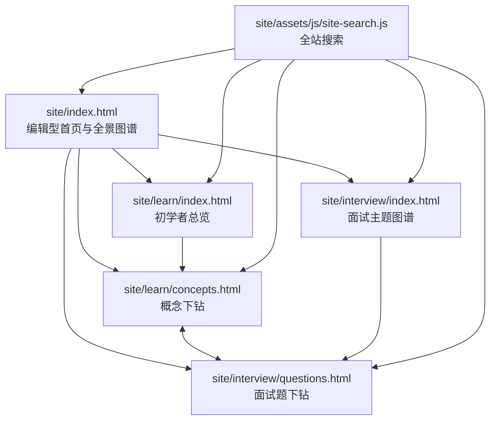

# AI Agent 知识图谱项目规范

## 文档元数据

| 项目 | 值 |
| --- | --- |
| 规范版本 | `1.10.0` |
| 适用项目版本 | `0.5.0` |
| 阶段 | “基础模型与推理”6 组、12 篇公众号推文及 30 张配图已完成 |
| Git 状态 | `cebcec4`（`main`；本次更新时 dirty） |
| 修改时间 | `2026-09-23 19:59 CST` |

## 1. 目标与边界

本项目以无需构建步骤的中文静态学习站为主体，并提供独立的微信公众号服务端接入和草稿生成工具。站点用同一套 AI Agent 知识体系服务两个阅读目标：

- **面向初学者**：建立全景认知，解释概念、结构、术语和模块关系。
- **面向面试**：将同一主题转为原理、答题要点、记忆点、图解与追问练习。

站点不承担运行 Agent、存储用户数据或调用模型的职责。HTML、内联 CSS 和原生 JavaScript 是站点唯一的运行时依赖；`site/` 是静态发布根目录。公众号接入代码位于 `api/`、`lib/wechat/`、`server/` 和 `scripts/`，仅在服务端运行，不得把公众号密钥打包进 `site/`。

## 2. 总体组织



### 2.1 页面职责

| 页面 | 唯一职责 | 不应承担的职责 |
| --- | --- | --- |
| `site/index.html` | 提供项目定位、HTML 全景知识图谱、四个入口与主题索引 | 重复写入所有模块的细节内容 |
| `site/learn/index.html` | 提供初学者阅读顺序、体系关系和十个主题的总览 | 代替子模块讲解页 |
| `site/learn/concepts.html` | 按主题与子模块展示结构图解、名词解释、“大话”说明和机制加餐 | 面试题答案的完整展开 |
| `site/interview/index.html` | 汇总高频主题、答题结构和题目入口 | 重复逐题答案 |
| `site/interview/questions.html` | 逐题提供原理、答题点、记忆点、图解、追问与误区 | 初学者概念的全量叙述 |

### 2.2 统一主题与双版本对应

十个一级主题必须在初学者和面试版本中保持一一对应。初学者页使用下列 `topic`，面试页使用对应的 `interviewTopic`；新增、删除或改名时必须同步更新两端和搜索索引。

| 序号 | 初学者 `topic` | 主题 | 面试 `topic` |
| --- | --- | --- | --- |
| 01 | `foundation` | 基础模型与推理 | `foundation` |
| 02 | `context` | 知识检索与检索增强生成 | `rag` |
| 03 | `improvement` | 记忆与上下文工程 | `memory` |
| 04 | `core` | 智能体与工作流 | `agent` |
| 05 | `capabilities` | 工具、技能与协议 | `tools` |
| 06 | `orchestration` | 多智能体协作 | `multiagent` |
| 07 | `evaluation` | 评测、可观测性与持续优化 | `evaluation` |
| 08 | `governance` | 安全、权限与治理 | `safety` |
| 09 | `runtime` | 系统设计、运行时与成本 | `system` |
| 10 | `applications` | 应用落地与项目实践 | `project` |

## 3. 目录与命名

```text
ai-agent-knowledge-map/
├── README.md
├── package.json
├── docs/
│   ├── project-specification.md
│   └── wechat-integration.md
├── api/
│   ├── health.mjs
│   └── wechat/callback.mjs
├── lib/wechat/
│   ├── callback.mjs
│   ├── client.mjs
│   ├── config.mjs
│   ├── image.mjs
│   ├── markdown.mjs
│   └── signature.mjs
├── content/
│   └── wechat/                    # 面向公众号的模块化文章资产
│       └── <topic>/
│           ├── series.json       # 模块、文章、题目边界、提纲与配图清单
│           ├── beginner-main.md   # 一级模块总概览主文
│           ├── interview-side.md  # 一级模块总概览面试副文
│           ├── prompts.md         # 总概览配图提示词与渲染记录
│           ├── assets/            # 总概览 PNG/JPG 配图
│           └── submodules/
│               └── <child>/
│                   ├── beginner-main.md   # 子模块主文
│                   ├── interview-side.md  # 子模块面试副文
│                   ├── prompts.md         # 子模块配图提示词
│                   └── assets/            # 子模块 PNG/JPG 配图
├── scripts/
│   ├── check-site.mjs
│   ├── check-wechat-articles.mjs
│   ├── check-wechat-config.mjs
│   └── create-wechat-draft.mjs
├── server/
│   └── wechat-server.mjs
├── test/
│   └── wechat.test.mjs
└── site/                         # 唯一可发布目录
    ├── index.html                # 根首页
    ├── assets/
    │   └── js/
    │       └── site-search.js    # 共享行为
    ├── learn/
    │   ├── index.html
    │   └── concepts.html
    └── interview/
        ├── index.html
        └── questions.html
```

规则：

1. 路径、目录和技术文件名使用小写英文，必要时用连字符，例如 `site-search.js`；不要恢复旧的 `outputs/` 发布结构。
2. 面向读者的标题、正文、图解标签和术语解释使用准确中文；英文专有名词首次出现应在上下文中说明含义。
3. 新页面应放入明确的栏目目录，不要在 `site/` 根目录堆叠专题页。
4. 公共行为放入 `site/assets/js/`；仅被一个页面使用、且数据量不大的交互逻辑可留在该页面的内联脚本中。
5. 新增媒体资源应放在 `site/assets/` 的按类型子目录中，并提供有意义的英文小写文件名和 `alt` 文本。
6. 公众号文章属于 `content/wechat/` 内容资产，不直接混入 `site/` 发布目录；每个主题保持 `beginner-main.md` 与 `interview-side.md` 一一对应。
7. 公众号凭证只保存在被 Git 忽略的 `.env` 或部署平台的服务端环境变量中；禁止写入 `site/`、文档、测试夹具和日志。

## 4. 路由、导航与搜索

### 4.1 路由规则

- 总览页使用目录默认页：`/`、`/learn/`、`/interview/`。
- 下钻页使用稳定文件名：`learn/concepts.html`、`interview/questions.html`。
- 初学者子模块参数：`concepts.html?topic=<topic>&child=<child>`。
- 面试问题参数：`questions.html?topic=<interviewTopic>&question=<questionId>`。
- 参数值是内容标识符，不是展示文案；不要随中文标题调整而随意改动。
- 页面内切换问题或子模块时，应使用 `history.replaceState` 保留可分享、可刷新恢复的 URL。

### 4.2 顶栏规则

所有五个 HTML 页面都必须保留同一组全局入口：

1. 首页。
2. 初学者总览。
3. 概念下钻。
4. 面试图谱。
5. 题目下钻。

当前页面使用 `aria-current="page"`。顶栏右侧必须保留 `<div data-site-search></div>`，由共享搜索脚本挂载输入框与结果面板。

### 4.3 搜索规则

`site/assets/js/site-search.js` 是唯一的跨页搜索来源。它根据当前页面位于根目录、`learn/` 或 `interview/` 生成相对链接。

- 新增一级主题时，更新 `modules`、`interviewTopic` 和对应内容页的数据源。
- 新增初学者子模块时，更新 `children`，并补齐搜索关键词。
- 搜索结果必须指向存在的本地 HTML 文件，且保留必要的 `topic`、`child` 或 `question` 参数。
- 保持键盘行为：方向键选择、Enter 跳转、Escape 关闭。

## 5. 内容编排规范

### 5.1 初学者内容

每个一级主题应回答“它解决什么问题、由什么组成、与相邻主题如何配合”。每个子模块应具备：

- 准确的中文名称与必要的英文名词解释。
- 图解式结构说明，而不是只罗列定义。
- 独立的“大话”解释，使用具体场景和类比帮助理解，但不复述图解正文。
- “机制加餐”用于补充关键机制、取舍或实现边界。
- 指向对应面试主题的入口。

避免填充性文案、脱离知识点的泛化说明、重复的职责边界模板，以及没有信息密度的免责声明。

### 5.2 面试内容

每个面试主题至少三道题，覆盖：

1. 原理或定义题。
2. 方案取舍题。
3. 生产实践、可靠性或治理题。

每道题必须含有原理、四个可展开的答题点、短记忆点、因果链图解、追问和常见失分点。答案要求能落到输入、决策、执行、验证或升级，不能仅堆叠框架名称。

### 5.3 公众号文章资产

公众号内容必须按“一级模块总概览 + 子模块下钻”两层生成。本文所称一组推文，是同一天配套发布的两篇文章：一篇初学者主文和一篇面试副文。

若一个一级模块有 `n` 个子模块，该模块必须生成 `n+1` 组推文：

1. `1` 组一级模块总概览；
2. `n` 组子模块下钻，每个子模块各一组；
3. 每组含 `beginner-main.md` 与 `interview-side.md` 两篇文章，因此总计 `2 × (n+1)` 个 Markdown 文件。

“工具、技能与协议”包含技能、工具调用、API/代码/浏览器执行、模型上下文协议、MCP Client/Server 与三类能力、连接器与插件共 6 个子模块，因此应有 7 组推文、14 篇 Markdown。当前主题已按该结构完成：根目录两篇为总概览，`submodules/` 下包含 6 组、12 篇子模块文章。

“基础模型与推理”包含大语言模型、多模态模型、向量嵌入、重排序、模型适配共 5 个子模块，因此生成 6 组推文、12 篇 Markdown。当前主题位于 `content/wechat/foundation-models-and-inference/`，共配套 30 张经视觉检查的中文信息图。

#### 5.3.1 文件与元数据

- `beginner-main.md` 面向初学者，组合对应主题的基础说明与“大话”内容，可引申机制和工程边界；
- `interview-side.md` 面向面试，按原理、答题点、记忆点、追问和失分点组织，至少三道题；
- Markdown 使用 UTF-8 编码，是文章的唯一内容源；不要把生成后的 HTML 或 API JSON 当作手工维护的原稿；
- 每个一级模块必须维护一个 `series.json` 模块清单，作为公众号系列结构的唯一来源。清单统一记录模块标识、总概览与子模块、文章路径、阅读顺序、主文重点、面试题边界、写作提纲、提示词文件和配图文件名；生成和校验过程不得再通过解析大型站点 HTML 推断这些信息；
- 新增、删除、改名或调整子模块时，先更新 `series.json`，再生成文章与图片；文章 Front Matter、目录结构和配图引用必须与清单一致；
- 每篇 Markdown 必须以 YAML Front Matter 声明 `title`、`author`、`digest`、`cover`、评论开关和文章顺序；标题不超过 32 个字符，作者不超过 16 个字符，摘要不超过 120 个字符；
- Front Matter 还应声明 `topic`、`content_level`、`submodule` 和 `series_order`：总概览使用 `content_level: overview`、空 `submodule`、`series_order: 0`；子模块使用 `content_level: submodule`、稳定的英文子模块标识以及对应阅读顺序；
- `title` 必须与正文 H1 一致；`cover` 必须指向本地封面图片；`article_type` 当前使用 `news`；评论开关只使用 `0` 或 `1`；
- 正文控制在 3000-5000 个中文字符，Front Matter 不计入正文长度；面试稿也必须留出参考资料和格式转换的体积余量；

#### 5.3.2 内容结构

- 写正文前必须先在 `series.json` 为每篇文章固定 8-10 个内容段落或一级内容块，并写明每一段解决的问题；没有提纲不得直接生成长文；
- 首稿目标为 3200-3500 个中文字符。写作时按提纲为各段分配字数，首稿直接进入目标区间，避免先写 1500-2000 字短稿再多轮补写；最终发布硬限制仍为 3000-5000 个中文字符；
- 若首稿超出目标，不通过删除必要机制、边界或证据强行压缩；若低于目标，只补与当前子模块直接相关的机制、场景、取舍和失败路径，不使用泛化段落凑字数；
- 主文建议按“具体场景引入 → 概念拆分 → 结构与协作 → 机制加餐 → 工程边界 → 小结”组织；封面之后尽快进入真实问题，不用长篇项目宣言；
- 面试文每道题至少包含“原理、答题点、记忆点、常见追问、失分点”，并覆盖定义、方案取舍、可靠性或治理；
- 总概览主文负责解释一级模块在 Agent 体系中的位置、全部子模块的分工、连接关系和共同边界；对子模块机制只做导览，不在总览中抢先完整展开；
- 子模块主文只聚焦一个子模块，讲清工作机制、输入输出、工程实现、典型场景、取舍和失败边界，不再重复总概览的大段定义；
- 总概览面试题聚焦一级模块边界、子模块之间的关系、端到端链路、总体选型和共性治理；子模块面试题聚焦该子模块的具体机制、实现细节、故障处理、评测和实践取舍；
- 总概览与子模块的面试题不得重复。不能只改标题或措辞后复用同一答案；若知识点必须承接，总概览只简要点到并链接子模块，完整问题与答案仅保留在子模块文章；
- 同一一级模块内维护题目清单，生成新副文前比对问题标题、核心知识点、答题骨架和追问，四项中有明显重合时必须改题或合并；
- 将已有 Demo 归类为总概览时，Demo 不是不可修改的定稿。开始生成子模块文章前，必须把其中过深的单点问题移到对应子模块，改写总览问题，确保后续没有内容争抢；
- 图解解释关系，正文解释原因和取舍；“大话”内容要使用新的生活场景或比喻，不重复图解中的句子；
- 技术事实优先引用官方文档、规范或一手工程文章；涉及当前 API、协议字段或限制时，先核对来源再写入正文。

以“工具、技能与协议”为例，题目边界如下：

| 推文组 | 主文重点 | 面试副文重点 |
| --- | --- | --- |
| 总概览 | 六个子模块在能力扩展层中的位置、协作链路和共同治理 | 分层边界、端到端设计、总体选型和跨模块治理 |
| 技能 | 技能发现、步骤执行、资源组织和版本化 | Skill 与 Tool 边界、技能匹配、版本评测和失败恢复 |
| 工具调用 | 工具契约、结构化参数、执行闭环 | Schema、严格模式、多工具调用、参数校验和结果回传 |
| API、代码与浏览器执行 | 三种执行通道的能力、成本和风险 | 通道选型、沙箱、页面脆弱性、权限和结果验证 |
| 模型上下文协议 | MCP 的作用范围、数据层、传输层和能力发现 | 协议握手、传输取舍、认证边界和兼容演进 |
| MCP Client、Server 与三类能力 | Host/Client/Server 关系及 Tools、Resources、Prompts | 对象语义、能力发现、调用责任和授权隔离 |
| 连接器与插件 | 具体系统适配、认证、字段与错误翻译 | 限流、幂等、供应商变化、契约版本和可观测性 |

#### 5.3.3 语言风格

- 使用平实、准确、面向读者的中文，句子尽量短，少用空泛的抽象名词；英文专有名词首次出现时给出中文解释；
- 以问题、场景和判断为主，适当加入轻微幽默，但不写营销口号、鸡汤或夸张承诺；
- 避免机械化开场和收束，例如“本文将带你……”“通过本文你将……”“总的来说”“关键不是……而是……”反复套用；
- 删除与知识无关的泛化说明、免责声明、职责边界模板和“看起来完整但没有新信息”的过渡句；
- 不为了显得专业堆砌框架名称。每个术语都要回答“解决什么问题、怎样工作、有什么边界”。

#### 5.3.4 图片与提示词

- 每篇至少引用 5 张本地 PNG/JPG，主文第一张为封面；图片放在该主题的 `assets/` 目录；
- 先在 `prompts.md` 中写清用途、构图、文字、风格和禁止项，再调用图像模型生成；提示词与最终图片保持一一对应；
- 信息图中的文字优先使用准确中文，英文只保留必要专有名词；文字要少、字号要大、关系线要清楚；
- 生成后逐张检查错别字、漏字、箭头方向、图例含义、尺寸和水印；不合格图片必须重渲染，不能用未经检查的草图交付；
- 公众号文章使用不可编辑的 PNG/JPG 成片；SVG 可以作为构图草稿，但不作为最终文章配图。

#### 5.3.5 参考资料与导入限制

- 每篇文章末尾必须有“参考资料”小节，至少提供一个可点击的 HTTP(S) 文档链接，优先使用官方文档；
- 参考链接必须保留在转换后的 HTML 中，不能只写在项目说明或 Front Matter 里；
- 转换后的正文 HTML 必须少于 20000 个字符且小于 1 MB，不含 JavaScript；正文图片只能引用本地 JPG/PNG，并在创建草稿时先上传微信再替换为微信 URL；
- 微信导入流程只能创建草稿，不得默认调用发布或群发接口；真实凭证只从服务端环境变量读取；
- 文章检查必须通过 `npm run wechat:articles:check`，导入前还要通过 `npm run wechat:draft -- --dry-run`。
- `scripts/check-wechat-articles.mjs` 必须校验一级模块预期的总概览与全部子模块组是否齐全、每组两篇文章是否配对、`series_order` 是否一致，以及同一模块的面试题标题是否重复。

#### 5.3.6 校验输出与上下文控制

- `npm run wechat:articles:check` 默认使用简洁模式。失败时只输出失败文件与原因；全部通过时只输出系列数、推文组数和文章数，不打印逐篇统计；
- 只有人工排查字数、图片数、参考链接和 HTML 体积时，才运行 `npm run wechat:articles:check:verbose`；不要在每次常规检查中重复输出全部文章明细；
- 校验器从各模块的 `series.json` 读取预期文章、题目边界和图片清单，不扫描或解析 `site/learn/concepts.html` 等大型页面来重建模块结构；
- 阶段开发先检查当前推文组，模块交付前再运行一次全系列检查和全部文章 dry-run，避免每次小改动都重复加载 14 篇以上内容。

### 5.4 双版本内容关系

初学者版解释“是什么、怎么协作”；面试版训练“如何清楚地说、为什么这样取舍、上线如何验证”。两者共享主题边界，但正文、图解和语言组织必须不同，不能简单复制。

## 6. 视觉与交互规范

1. 采用克制的研究型/编辑型视觉：暖白背景、深色正文、绿、青、橙、梅红、蓝作为主题色。
2. 页面是信息导览而非营销落地页：不用大幅渐变、装饰光球、悬浮卡片套卡片或夸张口号。
3. 首页全景图谱必须用可访问的 HTML/SVG 承载中文标签、关键子项和可点击链接；生成式图片只可作为无文字辅助视觉，不能承载中文信息。
4. 图解使用稳定尺寸、清楚的关系线和文字层级；每个点击目标有 `aria-label` 或可读文本。
5. 在窄屏下，绝对定位图谱必须切换为普通网格或纵向流，不能依靠横向滚动阅读主体内容。
6. 按钮、链接与键盘焦点必须可见；搜索结果和切换控件应保持键盘可操作。
7. 使用 `font-size` 的固定或容器适配值，不以视口宽度直接缩放字号；避免负字距。

## 7. 新增或修改内容的同步清单

### 新增一级主题

1. 在 `learn/concepts.html` 中新增初学者主题及子模块数据。
2. 在 `interview/questions.html` 中新增对应面试主题和至少三道题。
3. 更新两页之间的映射：`interviewTopicMap` 与 `beginnerTopicMap`。
4. 更新 `site/assets/js/site-search.js` 的 `modules`、`interviewTopic` 和关键词。
5. 更新 `site/index.html` 的全景图谱与主题索引。
6. 更新 `learn/index.html` 与 `interview/index.html` 的总览卡片或主题地图。
7. 为新链接运行站点校验，并手工检查桌面与移动端布局。

### 修改现有主题或子模块

1. 保持既有 `topic`、`child`、`question` 标识符稳定；需要迁移时保留兼容映射或同步修复所有链接。
2. 同时检查首页图谱、初学者总览、概念下钻、面试图谱、题目下钻与搜索结果是否一致。
3. 修改名词时核对中文准确性和英文缩写的第一次解释。
4. 修改页面顶部或页脚元数据时，更新版本、Git 基线/状态和修改时间；不要写入会被下一次提交立即推翻的“当前 SHA”。

## 8. 校验、预览与发布

```sh
npm run check
npm test
npm run wechat:articles:check
npm run wechat:articles:check:verbose  # 仅排障时使用
npm run wechat:draft -- --dry-run
npm run serve
```

- `npm run check` 必须通过。它检查五个预期页面、共享搜索脚本、本地 HTML 链接和内联脚本语法。
- 本地预览地址为 `http://127.0.0.1:4173/`。
- 涉及交互、导航、搜索或响应式样式时，至少手工检查：首页、两类总览、两类下钻；搜索命中；桌面和移动端无水平溢出。
- 发布时将 `site/` 作为 GitHub Pages、Netlify、Vercel 或其他静态托管平台的发布目录；不要将仓库根目录误作为站点根目录。
- 公众号回调必须部署到公网 HTTPS 服务；本地回调仅用于测试。接入流程、环境变量和草稿命令见 `docs/wechat-integration.md`。
- 草稿脚本只能创建草稿，不得在未获得明确发布指令时增加或调用发布、群发接口。

## 9. Git 与文档维护

- 主分支为 `main`，远程为 `origin`：`git@github.com:Jennifer123www/ai-agent-knowledge-map.git`。
- 提交前执行 `npm run check` 和 `git diff --check`。
- 每个提交保持单一目的；内容、布局、搜索与重构尽量分开提交。
- 功能达到一个可验证的阶段性完成点时，立即创建提交；不必等待整个站点或大功能全部完成。提交应包含实现、必要文档和已验证的相关改动。
- 本项目是个人项目：阶段性提交通过校验后，可直接推送到 `origin/main`。如使用功能分支，完成后可以合并到 `main` 并同步远程；不要求额外审批流程。
- 推送前确认工作区不含无关改动，提交后确认 `main` 跟踪 `origin/main`；禁止把未通过校验的改动推送到远程。
- 不提交 `.DS_Store`、本地服务器日志、`node_modules/` 或构建产物。
- 更新本规范、README 或其他设计/分析文档时，保留规范/文档版本、阶段、Git 状态或基线提交、修改时间四项元数据。

## 10. 完成标准

一次站点改动在以下条件同时满足时才算完成：

- 页面职责没有重叠或退化为重复内容。
- 初学者与面试主题仍一一对应。
- 导航、搜索、跨版本跳转和 URL 参数正确。
- 中文术语准确，英文专有名词在需要处得到解释。
- 桌面与移动端文字不重叠、不溢出，图解可读且可点击。
- `npm run check` 与 `git diff --check` 通过。
- 涉及公众号接入时，`npm test`、草稿 dry-run 和回调验签测试通过；真实凭证与公网回调另行完成联调。
