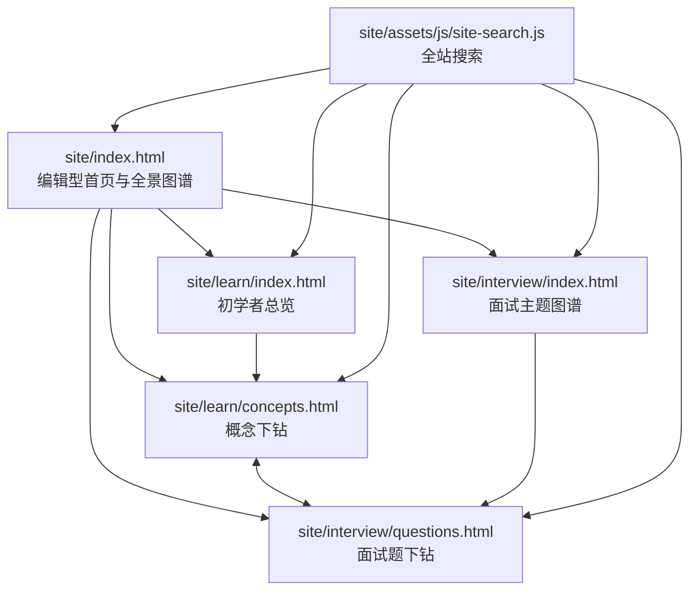

# AI Agent 知识图谱项目规范

## 文档元数据

| 项目 | 值 |
| --- | --- |
| 规范版本 | `1.4.0` |
| 适用项目版本 | `0.3.1` |
| 阶段 | 静态站点、微信公众号文章资产、Front Matter 校验及公众号 API 接入持续维护 |
| Git 状态 | `59ec185`（`main`；更新时 dirty，含本轮文章格式与校验改动） |
| 修改时间 | `2026-09-20 17:06 CST` |

## 1. 目标与边界

本项目以无需构建步骤的中文静态学习站为主体，并提供独立的微信公众号服务端接入和草稿生成工具。站点用同一套 AI Agent 知识体系服务两个阅读目标：

- **面向初学者**：建立全景认知，解释概念、结构、术语和模块关系。
- **面向面试**：将同一主题转为原理、答题要点、记忆点、图解与追问练习。

站点不承担运行 Agent、存储用户数据或调用模型的职责。HTML、内联 CSS 和原生 JavaScript 是站点唯一的运行时依赖；`site/` 是静态发布根目录。公众号接入代码位于 `api/`、`lib/wechat/`、`server/` 和 `scripts/`，仅在服务端运行，不得把公众号密钥打包进 `site/`。

## 2. 总体组织



### 2.1 页面职责

| 页面 | 唯一职责 | 不应承担的职责 |
| --- | --- | --- |
| `site/index.html` | 提供项目定位、HTML 全景知识图谱、四个入口与主题索引 | 重复写入所有模块的细节内容 |
| `site/learn/index.html` | 提供初学者阅读顺序、体系关系和十个主题的总览 | 代替子模块讲解页 |
| `site/learn/concepts.html` | 按主题与子模块展示结构图解、名词解释、“大话”说明和机制加餐 | 面试题答案的完整展开 |
| `site/interview/index.html` | 汇总高频主题、答题结构和题目入口 | 重复逐题答案 |
| `site/interview/questions.html` | 逐题提供原理、答题点、记忆点、图解、追问与误区 | 初学者概念的全量叙述 |

### 2.2 统一主题与双版本对应

十个一级主题必须在初学者和面试版本中保持一一对应。初学者页使用下列 `topic`，面试页使用对应的 `interviewTopic`；新增、删除或改名时必须同步更新两端和搜索索引。

| 序号 | 初学者 `topic` | 主题 | 面试 `topic` |
| --- | --- | --- | --- |
| 01 | `foundation` | 基础模型与推理 | `foundation` |
| 02 | `context` | 知识检索与检索增强生成 | `rag` |
| 03 | `improvement` | 记忆与上下文工程 | `memory` |
| 04 | `core` | 智能体与工作流 | `agent` |
| 05 | `capabilities` | 工具、技能与协议 | `tools` |
| 06 | `orchestration` | 多智能体协作 | `multiagent` |
| 07 | `evaluation` | 评测、可观测性与持续优化 | `evaluation` |
| 08 | `governance` | 安全、权限与治理 | `safety` |
| 09 | `runtime` | 系统设计、运行时与成本 | `system` |
| 10 | `applications` | 应用落地与项目实践 | `project` |

## 3. 目录与命名

```text
ai-agent-knowledge-map/
├── README.md
├── package.json
├── docs/
│   ├── project-specification.md
│   └── wechat-integration.md
├── api/
│   ├── health.mjs
│   └── wechat/callback.mjs
├── lib/wechat/
│   ├── callback.mjs
│   ├── client.mjs
│   ├── config.mjs
│   ├── image.mjs
│   ├── markdown.mjs
│   └── signature.mjs
├── content/
│   └── wechat/                    # 面向公众号的模块化文章资产
│       └── <topic>/
│           ├── beginner-main.md   # 初学者说明与“大话”结合的主文
│           ├── interview-side.md  # 对应模块的面试题副文
│           ├── prompts.md         # 配图提示词与渲染记录
│           └── assets/            # PNG 配图
├── scripts/
│   ├── check-site.mjs
│   ├── check-wechat-articles.mjs
│   ├── check-wechat-config.mjs
│   └── create-wechat-draft.mjs
├── server/
│   └── wechat-server.mjs
├── test/
│   └── wechat.test.mjs
└── site/                         # 唯一可发布目录
    ├── index.html                # 根首页
    ├── assets/
    │   └── js/
    │       └── site-search.js    # 共享行为
    ├── learn/
    │   ├── index.html
    │   └── concepts.html
    └── interview/
        ├── index.html
        └── questions.html
```

规则：

1. 路径、目录和技术文件名使用小写英文，必要时用连字符，例如 `site-search.js`；不要恢复旧的 `outputs/` 发布结构。
2. 面向读者的标题、正文、图解标签和术语解释使用准确中文；英文专有名词首次出现应在上下文中说明含义。
3. 新页面应放入明确的栏目目录，不要在 `site/` 根目录堆叠专题页。
4. 公共行为放入 `site/assets/js/`；仅被一个页面使用、且数据量不大的交互逻辑可留在该页面的内联脚本中。
5. 新增媒体资源应放在 `site/assets/` 的按类型子目录中，并提供有意义的英文小写文件名和 `alt` 文本。
6. 公众号文章属于 `content/wechat/` 内容资产，不直接混入 `site/` 发布目录；每个主题保持 `beginner-main.md` 与 `interview-side.md` 一一对应。
7. 公众号凭证只保存在被 Git 忽略的 `.env` 或部署平台的服务端环境变量中；禁止写入 `site/`、文档、测试夹具和日志。

## 4. 路由、导航与搜索

### 4.1 路由规则

- 总览页使用目录默认页：`/`、`/learn/`、`/interview/`。
- 下钻页使用稳定文件名：`learn/concepts.html`、`interview/questions.html`。
- 初学者子模块参数：`concepts.html?topic=<topic>&child=<child>`。
- 面试问题参数：`questions.html?topic=<interviewTopic>&question=<questionId>`。
- 参数值是内容标识符，不是展示文案；不要随中文标题调整而随意改动。
- 页面内切换问题或子模块时，应使用 `history.replaceState` 保留可分享、可刷新恢复的 URL。

### 4.2 顶栏规则

所有五个 HTML 页面都必须保留同一组全局入口：

1. 首页。
2. 初学者总览。
3. 概念下钻。
4. 面试图谱。
5. 题目下钻。

当前页面使用 `aria-current="page"`。顶栏右侧必须保留 `<div data-site-search></div>`，由共享搜索脚本挂载输入框与结果面板。

### 4.3 搜索规则

`site/assets/js/site-search.js` 是唯一的跨页搜索来源。它根据当前页面位于根目录、`learn/` 或 `interview/` 生成相对链接。

- 新增一级主题时，更新 `modules`、`interviewTopic` 和对应内容页的数据源。
- 新增初学者子模块时，更新 `children`，并补齐搜索关键词。
- 搜索结果必须指向存在的本地 HTML 文件，且保留必要的 `topic`、`child` 或 `question` 参数。
- 保持键盘行为：方向键选择、Enter 跳转、Escape 关闭。

## 5. 内容编排规范

### 5.1 初学者内容

每个一级主题应回答“它解决什么问题、由什么组成、与相邻主题如何配合”。每个子模块应具备：

- 准确的中文名称与必要的英文名词解释。
- 图解式结构说明，而不是只罗列定义。
- 独立的“大话”解释，使用具体场景和类比帮助理解，但不复述图解正文。
- “机制加餐”用于补充关键机制、取舍或实现边界。
- 指向对应面试主题的入口。

避免填充性文案、脱离知识点的泛化说明、重复的职责边界模板，以及没有信息密度的免责声明。

### 5.2 面试内容

每个面试主题至少三道题，覆盖：

1. 原理或定义题。
2. 方案取舍题。
3. 生产实践、可靠性或治理题。

每道题必须含有原理、四个可展开的答题点、短记忆点、因果链图解、追问和常见失分点。答案要求能落到输入、决策、执行、验证或升级，不能仅堆叠框架名称。

### 5.3 公众号文章资产

每个已落地主题可生成一组公众号文章：

- `beginner-main.md` 面向初学者，组合对应主题的基础说明与“大话”内容，可引申机制和工程边界；
- `interview-side.md` 面向面试，按原理、答题点、记忆点、追问和失分点组织，至少三道题；
- 两篇文章都控制在 3000-5000 个中文字符，主文首图为封面，每篇至少引用五张本地 PNG；
- 每篇 Markdown 必须以 YAML Front Matter 声明 `title`、`author`、`digest`、`cover`、评论开关和文章顺序；标题不超过 32 个字符，作者不超过 16 个字符，摘要不超过 120 个字符；
- 转换后的正文 HTML 必须少于 20000 个字符且小于 1 MB，不含 JavaScript；正文图片只能引用本地 JPG/PNG，并在创建草稿时先上传微信再替换为微信 URL；
- 配图提示词集中在 `prompts.md`，图中文字必须逐张目视校对；
- 文章正文与站点页面共享主题边界，但不直接复制页面文案，并在文末保留可核验的参考资料链接。

### 5.4 双版本内容关系

初学者版解释“是什么、怎么协作”；面试版训练“如何清楚地说、为什么这样取舍、上线如何验证”。两者共享主题边界，但正文、图解和语言组织必须不同，不能简单复制。

## 6. 视觉与交互规范

1. 采用克制的研究型/编辑型视觉：暖白背景、深色正文、绿、青、橙、梅红、蓝作为主题色。
2. 页面是信息导览而非营销落地页：不用大幅渐变、装饰光球、悬浮卡片套卡片或夸张口号。
3. 首页全景图谱必须用可访问的 HTML/SVG 承载中文标签、关键子项和可点击链接；生成式图片只可作为无文字辅助视觉，不能承载中文信息。
4. 图解使用稳定尺寸、清楚的关系线和文字层级；每个点击目标有 `aria-label` 或可读文本。
5. 在窄屏下，绝对定位图谱必须切换为普通网格或纵向流，不能依靠横向滚动阅读主体内容。
6. 按钮、链接与键盘焦点必须可见；搜索结果和切换控件应保持键盘可操作。
7. 使用 `font-size` 的固定或容器适配值，不以视口宽度直接缩放字号；避免负字距。

## 7. 新增或修改内容的同步清单

### 新增一级主题

1. 在 `learn/concepts.html` 中新增初学者主题及子模块数据。
2. 在 `interview/questions.html` 中新增对应面试主题和至少三道题。
3. 更新两页之间的映射：`interviewTopicMap` 与 `beginnerTopicMap`。
4. 更新 `site/assets/js/site-search.js` 的 `modules`、`interviewTopic` 和关键词。
5. 更新 `site/index.html` 的全景图谱与主题索引。
6. 更新 `learn/index.html` 与 `interview/index.html` 的总览卡片或主题地图。
7. 为新链接运行站点校验，并手工检查桌面与移动端布局。

### 修改现有主题或子模块

1. 保持既有 `topic`、`child`、`question` 标识符稳定；需要迁移时保留兼容映射或同步修复所有链接。
2. 同时检查首页图谱、初学者总览、概念下钻、面试图谱、题目下钻与搜索结果是否一致。
3. 修改名词时核对中文准确性和英文缩写的第一次解释。
4. 修改页面顶部或页脚元数据时，更新版本、Git 基线/状态和修改时间；不要写入会被下一次提交立即推翻的“当前 SHA”。

## 8. 校验、预览与发布

```sh
npm run check
npm test
npm run wechat:articles:check
npm run wechat:draft -- --dry-run
npm run serve
```

- `npm run check` 必须通过。它检查五个预期页面、共享搜索脚本、本地 HTML 链接和内联脚本语法。
- 本地预览地址为 `http://127.0.0.1:4173/`。
- 涉及交互、导航、搜索或响应式样式时，至少手工检查：首页、两类总览、两类下钻；搜索命中；桌面和移动端无水平溢出。
- 发布时将 `site/` 作为 GitHub Pages、Netlify、Vercel 或其他静态托管平台的发布目录；不要将仓库根目录误作为站点根目录。
- 公众号回调必须部署到公网 HTTPS 服务；本地回调仅用于测试。接入流程、环境变量和草稿命令见 `docs/wechat-integration.md`。
- 草稿脚本只能创建草稿，不得在未获得明确发布指令时增加或调用发布、群发接口。

## 9. Git 与文档维护

- 主分支为 `main`，远程为 `origin`：`git@github.com:Jennifer123www/ai-agent-knowledge-map.git`。
- 提交前执行 `npm run check` 和 `git diff --check`。
- 每个提交保持单一目的；内容、布局、搜索与重构尽量分开提交。
- 功能达到一个可验证的阶段性完成点时，立即创建提交；不必等待整个站点或大功能全部完成。提交应包含实现、必要文档和已验证的相关改动。
- 本项目是个人项目：阶段性提交通过校验后，可直接推送到 `origin/main`。如使用功能分支，完成后可以合并到 `main` 并同步远程；不要求额外审批流程。
- 推送前确认工作区不含无关改动，提交后确认 `main` 跟踪 `origin/main`；禁止把未通过校验的改动推送到远程。
- 不提交 `.DS_Store`、本地服务器日志、`node_modules/` 或构建产物。
- 更新本规范、README 或其他设计/分析文档时，保留规范/文档版本、阶段、Git 状态或基线提交、修改时间四项元数据。

## 10. 完成标准

一次站点改动在以下条件同时满足时才算完成：

- 页面职责没有重叠或退化为重复内容。
- 初学者与面试主题仍一一对应。
- 导航、搜索、跨版本跳转和 URL 参数正确。
- 中文术语准确，英文专有名词在需要处得到解释。
- 桌面与移动端文字不重叠、不溢出，图解可读且可点击。
- `npm run check` 与 `git diff --check` 通过。
- 涉及公众号接入时，`npm test`、草稿 dry-run 和回调验签测试通过；真实凭证与公网回调另行完成联调。
