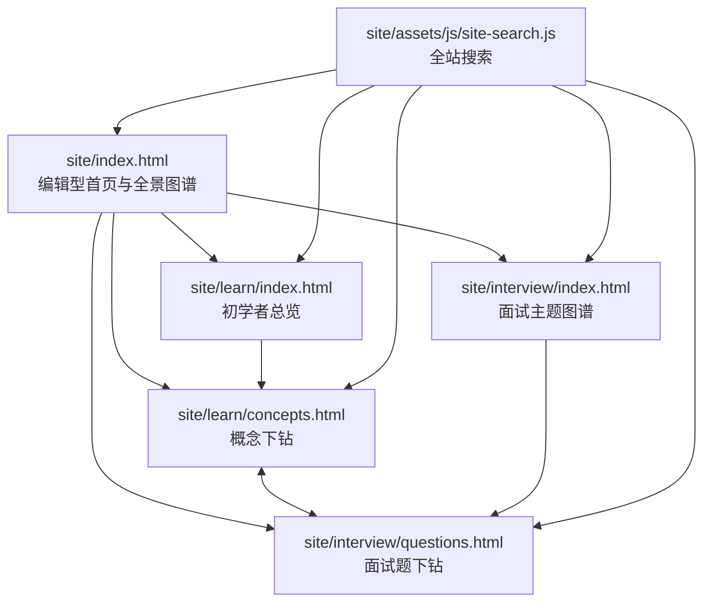

# AI Agent 知识图谱项目规范

## 文档元数据

| 项目 | 值 |
| --- | --- |
| 规范版本 | `1.17.0` |
| 适用项目版本 | `0.5.0` |
| 阶段 | 沉淀公众号对照稿的贯穿案例与分层写作规则 |
| 文档基线 | `a13c18f`（`main`；修改前工作区 clean） |
| 修改时间 | `2026-09-28 11:55 CST` |

## 1. 目标与边界

本项目以无需构建步骤的中文静态学习站为主体，并提供独立的微信公众号服务端接入和草稿生成工具。站点用同一套 AI Agent 知识体系服务两个阅读目标：

- **面向初学者**：建立全景认知，解释概念、结构、术语和模块关系。
- **面向面试**：将同一主题转为原理、答题要点、记忆点、图解与追问练习。

站点不承担运行 Agent、存储用户数据或调用模型的职责。HTML、内联 CSS 和原生 JavaScript 是站点唯一的运行时依赖；`site/` 是静态发布根目录。公众号接入代码位于 `api/`、`lib/wechat/`、`server/` 和 `scripts/`，仅在服务端运行。

## 2. 总体组织



### 2.1 页面职责

| 页面 | 唯一职责 | 不应承担的职责 |
| --- | --- | --- |
| `site/index.html` | 提供项目定位、HTML 全景知识图谱、四个入口与主题索引 | 重复写入所有模块的细节内容 |
| `site/learn/index.html` | 提供初学者阅读顺序、体系关系和十个主题的总览 | 代替子模块讲解页 |
| `site/learn/concepts.html` | 按主题与子模块展示结构图解、名词解释、“大话”说明和机制加餐 | 面试题答案的完整展开 |
| `site/interview/index.html` | 汇总高频主题、答题结构和题目入口 | 重复逐题答案 |
| `site/interview/questions.html` | 逐题提供原理、答题点、记忆点、图解、追问与误区 | 初学者概念的全量叙述 |

### 2.2 统一主题与双版本对应

十个一级主题必须在初学者和面试版本中保持一一对应。初学者页使用下列 `topic`，面试页使用对应的 `interviewTopic`；新增、删除或改名时必须同步更新两端和搜索索引。

| 序号 | 初学者 `topic` | 主题 | 面试 `topic` |
| --- | --- | --- | --- |
| 01 | `foundation` | 基础模型与推理 | `foundation` |
| 02 | `context` | 知识检索与检索增强生成 | `rag` |
| 03 | `improvement` | 记忆与上下文工程 | `memory` |
| 04 | `core` | 智能体与工作流 | `agent` |
| 05 | `capabilities` | 工具、技能与协议 | `tools` |
| 06 | `orchestration` | 多智能体协作 | `multiagent` |
| 07 | `evaluation` | 评测、可观测性与持续优化 | `evaluation` |
| 08 | `governance` | 安全、权限与治理 | `safety` |
| 09 | `runtime` | 系统设计、运行时与成本 | `system` |
| 10 | `applications` | 应用落地与项目实践 | `project` |

## 3. 目录与命名

```text
ai-agent-knowledge-map/
├── README.md
├── package.json
├── docs/
│   ├── project-specification.md
│   └── wechat-integration.md
├── api/
│   ├── health.mjs
│   └── wechat/callback.mjs
├── lib/wechat/
│   ├── callback.mjs
│   ├── client.mjs
│   ├── config.mjs
│   ├── image.mjs
│   ├── markdown.mjs
│   └── signature.mjs
├── content/
│   └── wechat/                    # 面向公众号的模块化文章资产
│       └── <topic>/
│           ├── series.json       # 模块、文章、题目边界、提纲与配图清单
│           ├── beginner-main.md   # 一级模块总概览主文
│           ├── interview-side.md  # 一级模块总概览面试副文
│           ├── prompts.md         # 总概览配图提示词与渲染记录
│           ├── assets/            # 总概览 PNG/JPG 配图
│           └── submodules/
│               └── <child>/
│                   ├── beginner-main.md   # 子模块主文
│                   ├── interview-side.md  # 子模块面试副文
│                   ├── prompts.md         # 子模块配图提示词
│                   └── assets/            # 子模块 PNG/JPG 配图
├── scripts/
│   ├── check-site.mjs
│   ├── check-wechat-articles.mjs
│   ├── check-wechat-config.mjs
│   └── create-wechat-draft.mjs
├── server/
│   └── wechat-server.mjs
├── test/
│   └── wechat.test.mjs
└── site/                         # 唯一可发布目录
    ├── index.html                # 根首页
    ├── assets/
    │   └── js/
    │       └── site-search.js    # 共享行为
    ├── learn/
    │   ├── index.html
    │   └── concepts.html
    └── interview/
        ├── index.html
        └── questions.html
```

规则：

1. 路径、目录和技术文件名使用小写英文，必要时用连字符，例如 `site-search.js`；不要恢复旧的 `outputs/` 发布结构。
2. 新页面应放入明确的栏目目录，不要在 `site/` 根目录堆叠专题页。
3. 公共行为放入 `site/assets/js/`；仅被一个页面使用、且数据量不大的交互逻辑可留在该页面的内联脚本中。
4. 新增媒体资源应放在 `site/assets/` 的按类型子目录中，并提供有意义的英文小写文件名和 `alt` 文本。
5. 公众号文章属于 `content/wechat/` 内容资产，不直接混入 `site/` 发布目录。
6. 公众号凭证只保存在被 Git 忽略的 `.env` 或部署平台的服务端环境变量中；禁止写入 `site/`、文档、测试夹具和日志。

## 4. 路由、导航与搜索

### 4.1 路由规则

- 总览页使用目录默认页：`/`、`/learn/`、`/interview/`。
- 下钻页使用稳定文件名：`learn/concepts.html`、`interview/questions.html`。
- 初学者子模块参数：`concepts.html?topic=<topic>&child=<child>`。
- 面试问题参数：`questions.html?topic=<interviewTopic>&question=<questionId>`。
- 参数值是内容标识符，不是展示文案；不要随中文标题调整而随意改动。
- 页面内切换问题或子模块时，应使用 `history.replaceState` 保留可分享、可刷新恢复的 URL。

### 4.2 顶栏规则

所有五个 HTML 页面都必须保留同一组全局入口：

1. 首页。
2. 初学者总览。
3. 概念下钻。
4. 面试图谱。
5. 题目下钻。

当前页面使用 `aria-current="page"`。顶栏右侧必须保留 `<div data-site-search></div>`，由共享搜索脚本挂载输入框与结果面板。

### 4.3 搜索规则

`site/assets/js/site-search.js` 是唯一的跨页搜索来源。它根据当前页面位于根目录、`learn/` 或 `interview/` 生成相对链接。

- 新增一级主题时，更新 `modules`、`interviewTopic` 和对应内容页的数据源。
- 新增初学者子模块时，更新 `children`，并补齐搜索关键词。
- 搜索结果必须指向存在的本地 HTML 文件，且保留必要的 `topic`、`child` 或 `question` 参数。
- 保持键盘行为：方向键选择、Enter 跳转、Escape 关闭。

## 5. 内容编排规范

本节适用于网站和公众号的所有面向读者内容：标题、正文、图解标签和术语解释使用准确中文，英文专有名词首次出现时说明含义，后文保持同一写法。模型处理文本的小单位统一写作 `token`，首次出现时解释其含义；不要用“词元”替代，也不要把一个 token 等同于一个汉字或英文单词。删除脱离知识点的泛化说明、职责边界模板、空免责声明和没有新信息的过渡句。

### 5.1 初学者内容

网站初学者页的每个一级主题应回答“它解决什么问题、由什么组成、与相邻主题如何配合”。每个子模块应具备：

- 清晰的名称与关键名词解释。
- 图解式结构说明，而不是只罗列定义。
- 独立的“大话”解释，使用具体场景和类比帮助理解，但不复述图解正文。
- “机制加餐”用于补充关键机制、取舍或实现边界。
- 指向对应面试主题的入口。

### 5.2 面试内容

网站面试页的每个主题至少三道题，覆盖：

1. 原理或定义题。
2. 方案取舍题。
3. 生产实践、可靠性或治理题。

每道题必须含有原理、四个可展开的答题点、短记忆点、因果链图解、追问和常见失分点。答案要求能落到输入、决策、执行、验证或升级，不能仅堆叠框架名称。

### 5.3 公众号文章资产

公众号内容必须按“一级模块总概览 + 子模块下钻”两层生成。本文所称一组推文，是同一天配套发布的两篇文章：一篇初学者主文和一篇面试副文。

本次新增的案例写作规则用于后续新稿和精修；既有文章不因新增条款自动视为已完成精修，也不要求为了套同一案例而改写所有模块。

若一个一级模块有 `n` 个子模块，该模块必须生成 `n+1` 组推文：

1. `1` 组一级模块总概览；
2. `n` 组子模块下钻，每个子模块各一组；
3. 每组含 `beginner-main.md` 与 `interview-side.md` 两篇文章，因此总计 `2 × (n+1)` 个 Markdown 文件。

#### 5.3.1 文件与元数据

- `beginner-main.md` 面向初学者，组合对应主题的基础说明与“大话”内容，可引申机制和工程边界；
- 试写或比较新写法时，使用独立、可辨认的对照稿文件名，保留现行主文和面试副文；审阅通过后再决定是否替换 `series.json` 登记的正式文章，不把对照稿额外算作一组推文；
- Markdown 使用 UTF-8 编码，是文章的唯一内容源；不要把生成后的 HTML 或 API JSON 当作手工维护的原稿；
- 每个一级模块必须维护一个 `series.json` 模块清单，作为公众号系列结构的唯一来源。清单统一记录模块标识、总概览与子模块、文章路径、阅读顺序、主文重点、面试题边界、写作提纲、提示词文件和配图文件名；生成和校验过程不得再通过解析大型站点 HTML 推断这些信息；
- 新增、删除、改名或调整子模块时，先更新 `series.json`，再生成文章与图片；文章 Front Matter、目录结构和配图引用必须与清单一致；
- 每篇 Markdown 必须以 YAML Front Matter 声明 `title`、`author`、`digest`、`cover`、评论开关、`topic`、`content_level`、`submodule` 和 `series_order`；标题不超过 32 个字符，作者不超过 16 个字符，摘要不超过 120 个字符；
- 总概览使用 `content_level: overview`、空 `submodule`、`series_order: 0`；子模块使用 `content_level: submodule`、稳定的英文子模块标识以及对应阅读顺序；
- `title` 必须与正文 H1 一致；`cover` 必须指向本地封面图片；`article_type` 当前使用 `news`；评论开关只使用 `0` 或 `1`；
- 正文控制在 3000-5000 个中文字符，Front Matter 不计入正文长度；面试稿也必须留出参考资料和格式转换的体积余量；

#### 5.3.2 内容结构

- 写正文前必须先在 `series.json` 为每篇文章固定 8-10 个内容段落或一级内容块，并写明每一段解决的问题；没有提纲不得直接生成长文；
- 首稿目标为 3200-3500 个中文字符。写作时按提纲为各段分配字数，首稿直接进入目标区间，避免先写 1500-2000 字短稿再多轮补写；最终发布硬限制仍为 3000-5000 个中文字符；
- 若首稿超出目标，不通过删除必要机制、边界或证据强行压缩；若低于目标，只补与当前子模块直接相关的机制、场景、取舍和失败路径，不使用泛化段落凑字数；
- 主文建议按“具体场景引入 → 概念拆分 → 结构与协作 → 机制加餐 → 工程边界 → 小结”组织；封面之后尽快进入真实问题，不用长篇项目宣言；
- 主文的小标题围绕读者要弄懂的具体问题，按“输入如何处理 → 机制如何运行 → 能力何时失效 → 工程怎样验证”递进；同级标题尽量保持相近句式。与主线直接相关的机制说明放在相应环节，不在系统层面的收束之后另开“机制加餐”，造成阅读顺序倒退；
- 一组主文与面试副文优先共用一个具体、可核对的贯穿案例：开头交代原始输入、后来发生的变化、尚缺的信息和读者真正要得到的结果；后续机制、错误示例与验证都回到同一案例。案例是讲解线索，不要求每段机械复述，也不固定使用某一种业务场景；
- 两篇文章共用案例事实，不共用成段答案。主文按“看到了什么现象 → 为什么会发生 → 哪些情况下会失败 → 怎样核对”推进；面试副文围绕同一案例组织问题、答题点、追问和判错标准，训练读者说清机制与证据，而不是把主文改写成问答格式；
- 每篇面试副文至少三道题；每道题包含“原理、答题点、记忆点、常见追问、失分点”，题目覆盖定义、方案取舍、可靠性或治理；
- 总概览主文负责解释一级模块在 Agent 体系中的位置、全部子模块的分工、连接关系和共同边界；对子模块机制只做导览，不在总览中抢先完整展开；
- 子模块主文只聚焦一个子模块，讲清工作机制、输入输出、工程实现、典型场景、取舍和失败边界，不再重复总概览的大段定义；
- 总概览面试题聚焦一级模块边界、子模块之间的关系、端到端链路、总体选型和共性治理；子模块面试题聚焦该子模块的具体机制、实现细节、故障处理、评测和实践取舍；
- 同一个例子可以在总览和子模块中出现，但回答的问题必须不同：总览解释跨子模块分工、选择和整体验证；子模块追踪本机制的输入、计算、输出及专项评测。子模块可用一句话说明与工具、权限或发布流程的交接，不展开这些系统级流程；若某段删去子模块名称后仍适用于整个 Agent，应移回总览或改写为本模块特有的问题；
- 同一一级模块内维护题目清单；生成面试副文前，比对题目标题、核心知识点、答题骨架和追问。明显重合的题目应改写或合并，不能只换标题复用答案。知识点需要承接时，总概览简要点到并链接子模块，完整问题与答案只保留在子模块文章；
- 写完后还要把总览与子模块的同名主题并排检查：若两道题都按“查变更 → 拆链路 → 重放 → 回滚”等相同骨架回答，就重写其中一道；不能只把“全系统”换成某个模型名称，却保留同一套答案；
- 将已有 Demo 归类为总概览时，Demo 不是不可修改的定稿。开始生成子模块文章前，必须把其中过深的单点问题移到对应子模块，改写总览问题，确保后续没有内容争抢；
- 图解解释关系，正文解释原因和取舍；“大话”内容要使用新的生活场景或比喻，不重复图解中的句子；
- 易混淆的概念应在同一处成对比较，明确各自控制的对象、能解决的问题和不能推出的结论；按阅读媒介选择并列图、短列表或简短代码，不堆多列表格。公众号当前 Markdown 转换器会跳过管道表格行，因此正式推文中的对照内容不能只放在 `| ... |` 表格里；
- 失败示例要按成因拆开，例如旧证据误用、缺失信息被编造、格式不合格、无依据的完成声明；每类写出可观察的错误、核对方法和对应修正，不把不同问题一概归为“幻觉”或“提示词不好”；
- 数字、结构化片段和测试结果用于说明可核对的判断：示意数值明确标为示例，实测结论写清样本、分母与条件；评测至少覆盖普通输入、冲突、缺值和新增信息等与本模块有关的变化，并分开统计不同错误，不用一条漂亮输出或一个总分代替验证；
- 按内容选择一手资料：研究机制查原始或经典论文，协议和标准查正式规范，产品能力与 API 限制查官方文档，工程实现可查源码或一手工程资料。涉及可能变化的字段、限制和版本时，写作前重新核对。

#### 5.3.3 语言风格

- 句子尽量短，用具体对象和动词解释因果关系，少用空泛的抽象名词及“实现……能力”“完成……构建”“进行……处理”等名词化表达；
- 中文先行，英文术语服务于理解：先说明读者能观察到的现象、问题或影响，再引入英文专有名词；不要把英文论文或产品文档逐句直译成中文；
- 标题必须准确说出机制控制的对象和产生的影响。不要为了口语化把技术含义缩窄或改写，例如 temperature、Top-k、Top-p 影响的是候选概率分布、候选范围以及输出的稳定性和多样性，不应笼统写成“改变语气”；
- 机制段落优先采用“现象 → 原因 → 工程影响 → 处理办法”的顺序。解释 token、上下文、注意力等概念时，避免先堆定义，再补一个脱离上下文的比喻；比喻必须紧接真实机制，并说明它不能覆盖哪些情况；
- 减少模板化和拟人化表达。避免“模型不能读懂”“模型决定关注重点”“这不是……而是……”等绝对化或反复出现的句式，改为描述输入如何被处理、结果为何出现、边界在哪里；
- 正文使用 Markdown 建立阅读层级：核心结论、关键边界和容易误解的判断使用 `**加粗**`；参数名、协议对象、字段、数据格式、命令及代码式英文术语使用行内代码，例如 `token`、`Top-p`、`JSON`、`KV Cache`。不要把“加粗”称为“加黑”；
- 加粗和行内代码必须克制。一个自然段通常只突出一个核心判断，不连续加粗整句群，也不把普通英文名词全部包成代码；样式用于帮助扫读，不能替代标题、段落和清楚表达；
- 以问题、场景和判断为主，适当加入轻微幽默，但不写营销口号、鸡汤或夸张承诺；
- 避免机械化开场和收束，例如“本文将带你……”“通过本文你将……”“总的来说”“关键不是……而是……”反复套用；
- 不为了显得专业堆砌框架名称。每个术语都要回答“解决什么问题、怎样工作、有什么边界”。

#### 5.3.4 图片与提示词

- 每篇至少引用 5 张本地 PNG/JPG，主文第一张为封面；图片放在对应推文组所在目录的 `assets/` 下（总概览放一级模块目录，子模块放各自的子模块目录）；
- **每一篇 `beginner-main.md` 至少包含一张原理示意图**，包括一级模块总览主文。原理图必须展示真实机制的关键部件及其依赖、信息流或计算过程；仅有职责分工、业务流程、发布闭环或抽象图标的图片不能充数。总览主文可展示一个横跨子模块的代表性机制，避免重复下钻正文；面试副文可复用已核实的原理图，不强制另画一张；
- 配图先分类：框架图、业务流程图和系统协作图可延续现有的分层、节点、箭头设计；**原理图**先阅读该机制的经典或原始论文及必要的后续资料，找到有代表性的架构图、计算图或对比图，再决定画面结构。不要把任何原理都套进四格流程，也不要只凭生成模型的联想画电路、脑袋或抽象网络；
- 在对应 `prompts.md` 中为每张原理图记录论文名称、可访问链接、具体图号/章节、要解释的机制、必须保留的节点和箭头、简化或改动之处，以及预期图注。优先按论文核对并重新绘制教学图，不直接搬运论文截图或带水印的二手图；需保留原图时先核查授权与署名。正文图注写清“依据/改绘自”的来源，文章末尾附原论文链接；
- 例如 [Attention Is All You Need](https://arxiv.org/abs/1706.03762) 的 Figure 1 是原始 Transformer 的编码器—解码器结构，Figure 2 展示缩放点积注意力与多头注意力。画原始结构应分清编码器的双向自注意力、解码器的因果掩码自注意力、跨注意力和逐步生成；讲今天常见的仅解码器语言模型时，不得把原论文的跨注意力当作其必有部件；
- 对比 RNN 与 Transformer 时，以同一输入序列、同一计算阶段并排展示：RNN 的相邻隐藏状态依次依赖，自注意力层的各输入位置可在训练时并行建立关联。不得笼统写“RNN 完全无法并行”或“Transformer 生成所有输出时同时完成”；自回归解码仍逐步产生下一个 token。对比依据可参考上述论文第 4 节及 [Sequence to Sequence Learning with Neural Networks](https://arxiv.org/abs/1409.3215)；
- 先在 `prompts.md` 中写清用途、构图、文字、风格和禁止项，再调用图像模型生成；提示词与最终图片保持一一对应；
- 信息图中的文字优先使用准确中文，英文只保留必要专有名词；文字要少、字号要大、关系线要清楚；
- 生成后逐张检查错别字、漏字、箭头方向、图例含义、尺寸和水印；原理图还要逐项对照论文核查机制、掩码方向、训练/推理阶段和架构版本。图片若反复生成仍有错误，可先用确定性的结构图工具绘制并导出 PNG/JPG，不为凑图片数量使用错误示意图；
- 公众号文章使用不可编辑的 PNG/JPG 成片；SVG 可以作为构图草稿，但不作为最终文章配图。

#### 5.3.5 参考资料与导入限制

- 每篇文章末尾必须有“参考资料”小节，至少提供一个可点击的 HTTP(S) 链接；来源类型按 5.3.2 的资料选择规则确定；
- 公众号推文开头与正文收束处各放一次简短的项目入口，链接到 [AI Agent 知识图谱仓库](https://github.com/Jennifer123www/ai-agent-knowledge-map)，说明读者可在其中查看总览、初学者内容与面试题；末尾入口置于“参考资料”之前，避免项目宣传打断案例讲解。对公众发布前须确认目标读者能访问仓库；若仓库仍不可公开访问，先解决访问问题，不发布只有作者能打开的链接；
- 参考链接必须保留在转换后的 HTML 中，不能只写在项目说明或 Front Matter 里；
- 转换后的正文 HTML 必须少于 20000 个字符且小于 1 MB，不含 JavaScript；正文图片只能引用本地 JPG/PNG，并在创建草稿时先上传微信再替换为微信 URL；
- 精修稿应为新增链接、图注和排版保留 HTML 字符余量，建议转换后不超过 19500 个字符；若接近上限，先精简重复句与过密的行内代码标记，不靠删除必要图片或一手参考资料凑余量；
- 微信导入流程只能创建草稿，不得默认调用发布或群发接口。

#### 5.3.6 校验输出与上下文控制

- `npm run wechat:articles:check` 默认使用简洁模式。失败时只输出失败文件与原因；全部通过时只输出系列数、推文组数和文章数，不打印逐篇统计；
- 只有人工排查字数、图片数、参考链接和 HTML 体积时，才运行 `npm run wechat:articles:check:verbose`；不要在每次常规检查中重复输出全部文章明细；
- 校验器从各模块的 `series.json` 读取预期文章、题目边界和图片清单，检查总概览与子模块组是否齐全、每组两篇文章是否配对、`series_order` 是否一致，以及同一模块的面试题标题是否重复；不得解析 `site/learn/concepts.html` 等大型页面来重建模块结构；
- 阶段开发先对当前文章运行草稿 dry-run。模块交付前运行一次全系列检查，再读取该模块 `series.json` 的 `groups[].articles.beginner.path` 和 `groups[].articles.interview.path`，以模块目录为基准拼接文章路径，逐篇执行 `npm run wechat:draft -- --dry-run --file <文章路径>`。当前草稿脚本一次只检查一篇；不带 `--file` 时只检查默认文章，不能代替整组校验。

### 5.4 双版本内容关系

初学者版解释“是什么、怎么协作”；面试版训练“如何清楚地说、为什么这样取舍、上线如何验证”。两者共享主题边界，但正文、图解和语言组织必须不同，不能简单复制。

## 6. 视觉与交互规范

1. 采用克制的研究型/编辑型视觉：暖白背景、深色正文、绿、青、橙、梅红、蓝作为主题色。
2. 页面是信息导览而非营销落地页：不用大幅渐变、装饰光球、悬浮卡片套卡片或夸张口号。
3. 首页全景图谱必须用可访问的 HTML/SVG 承载中文标签、关键子项和可点击链接；生成式图片只可作为无文字辅助视觉，不能承载中文信息。
4. 图解使用稳定尺寸、清楚的关系线和文字层级；每个点击目标有 `aria-label` 或可读文本。
5. 在窄屏下，绝对定位图谱必须切换为普通网格或纵向流，不能依靠横向滚动阅读主体内容。
6. 按钮、链接与键盘焦点必须可见；搜索结果和切换控件应保持键盘可操作。
7. 使用 `font-size` 的固定或容器适配值，不以视口宽度直接缩放字号；避免负字距。

## 7. 新增或修改内容的同步清单

### 新增一级主题

1. 在 `learn/concepts.html` 中新增初学者主题及子模块数据。
2. 在 `interview/questions.html` 中新增对应面试主题和符合 5.2 节要求的题目。
3. 更新两页之间的映射：`interviewTopicMap` 与 `beginnerTopicMap`。
4. 更新 `site/assets/js/site-search.js` 的 `modules`、`interviewTopic` 和关键词。
5. 更新 `site/index.html` 的全景图谱与主题索引。
6. 更新 `learn/index.html` 与 `interview/index.html` 的总览卡片或主题地图。
7. 为新链接运行站点校验，并手工检查桌面与移动端布局。

### 修改现有主题或子模块

1. 保持既有 `topic`、`child`、`question` 标识符稳定；需要迁移时保留兼容映射或同步修复所有链接。
2. 同时检查首页图谱、初学者总览、概念下钻、面试图谱、题目下钻与搜索结果是否一致。
3. 修改术语时检查两版本与搜索索引的写法一致。
4. 修改页面顶部或页脚元数据时，更新版本、Git 基线/状态和修改时间；不要写入会被下一次提交立即推翻的“当前 SHA”。

## 8. 校验、预览与发布

```sh
npm run check
npm test
npm run wechat:draft -- --dry-run --file content/wechat/foundation-models-and-inference/submodules/llm/beginner-main.md
npm run serve
```

- `npm run check` 必须通过。它检查五个预期页面、共享搜索脚本、本地 HTML 链接、内联脚本语法，以及公众号文章与系列清单。
- 本地预览地址为 `http://127.0.0.1:4173/`。
- 涉及交互、导航、搜索或响应式样式时，至少手工检查：首页、两类总览、两类下钻；搜索命中；桌面和移动端无水平溢出。
- 发布时将 `site/` 作为 GitHub Pages、Netlify、Vercel 或其他静态托管平台的发布目录；不要将仓库根目录误作为站点根目录。
- 公众号回调必须部署到公网 HTTPS 服务；本地回调仅用于测试。接入流程、环境变量和草稿命令见 `docs/wechat-integration.md`。

## 9. Git 与文档维护

- 主分支为 `main`，远程为 `origin`：`git@github.com:Jennifer123www/ai-agent-knowledge-map.git`。
- 提交前执行 `npm run check` 和 `git diff --check`。
- 每个提交保持单一目的；内容、布局、搜索与重构尽量分开提交。
- 功能达到一个可验证的阶段性完成点时，立即创建提交；不必等待整个站点或大功能全部完成。提交应包含实现、必要文档和已验证的相关改动。
- 本项目是个人项目：阶段性提交通过校验后，可直接推送到 `origin/main`。如使用功能分支，完成后可以合并到 `main` 并同步远程；不要求额外审批流程。
- 推送前确认工作区不含无关改动，提交后确认 `main` 跟踪 `origin/main`；禁止把未通过校验的改动推送到远程。
- 不提交 `.DS_Store`、本地服务器日志、`node_modules/` 或构建产物。
- 更新本规范、README 或其他设计/分析文档时，保留规范/文档版本、阶段、Git 状态或基线提交、修改时间四项元数据。

## 10. 完成标准

一次阶段性改动须满足适用范围内的完成标准：

- **共同要求**：完成第 9 节的提交前校验；面向读者的内容符合第 5 节的通用写作规则。
- **站点页面改动**：页面职责清晰，主题映射符合 2.2 节；导航、搜索、跨版本跳转和 URL 参数正确；桌面与移动端文字不重叠、不溢出，图解可读且可点击。
- **公众号文章改动**：文章与 `series.json` 的路径、顺序和配图一致，正文、图片及参考链接满足 5.3 节要求；交付整组或整个模块时，按 5.3.6 节对相应文章逐篇运行草稿 dry-run。
- **公众号服务端接入改动**：`npm test`、相关草稿 dry-run 和回调验签测试通过；真实凭证与公网回调另行完成联调。
